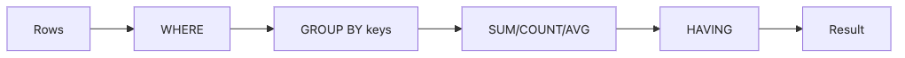

# GROUP BY와 집계 함수

분석 SQL에서 숫자를 만드는 순간부터 `GROUP BY`와 집계 함수가 등장합니다. 사용자 수, 국가별 매출, 일별 주문 수처럼 대시보드에 보이는 거의 모든 숫자는 여러 행을 묶고 압축한 결과입니다. 그래서 이 주제는 단순한 문법보다, 어떤 행을 하나의 그룹으로 볼지 결정하는 사고방식이 더 중요합니다.

이 글은 SQL 101 시리즈의 다섯 번째 글입니다. 여기서는 `GROUP BY`와 집계 함수를 통해 행을 줄여 의미를 만드는 방식을 설명합니다.

## 이 글에서 다룰 문제

- `GROUP BY`는 언제 실행되고 무엇을 기준으로 묶을까요?
- `SUM`, `COUNT`, `AVG` 같은 집계 함수는 어떤 차이를 가질까요?
- `WHERE`와 `HAVING`은 어떻게 역할이 나뉠까요?
- 여러 컬럼으로 그룹화하면 무엇이 달라질까요?
- `NULL`이 포함된 그룹은 어떻게 해석해야 할까요?

> 집계는 행을 줄이는 작업이 아니라, 많은 행에서 의미 있는 숫자를 꺼내는 작업입니다.

## 왜 중요한가

대부분의 보고서는 결국 집계입니다. 일별 활성 사용자, 국가별 평균 구매액, 사용자당 주문 수 같은 숫자는 데이터가 많아질수록 더 자주 요구됩니다. 이때 그룹 기준을 잘못 잡거나 조인 후 카디널리티를 놓치면, 겉보기에는 멀쩡한 숫자가 나와도 실제로는 틀린 결과가 될 수 있습니다.

또 집계는 행을 압축하는 작업이기 때문에, 무엇이 사라지고 무엇이 남는지 항상 의식해야 합니다. 개별 주문 행은 사라지지만, 국가별 총액은 남습니다. 이 감각이 있어야 집계 결과를 읽고 검증할 수 있습니다.

## 집계 흐름


`WHERE`는 집계 전에 행을 걸러 내고, `GROUP BY`는 남은 행을 묶고, 집계 함수는 그룹마다 숫자를 계산합니다. 그 뒤 `HAVING`은 계산된 그룹 결과를 다시 걸러 냅니다. 이 순서를 머리에 넣어 두면 `WHERE COUNT(*) > 1` 같은 오류가 왜 생기는지 바로 이해됩니다.

## 핵심 개념 정리

### 그룹 키는 행을 어떤 관점으로 묶을지 정한다

`GROUP BY country`라면 국가별로 묶는 것이고, `GROUP BY country, day`라면 국가와 날짜 조합별로 묶는 것입니다. 같은 데이터라도 어떤 열을 그룹 키로 선택하느냐에 따라 완전히 다른 보고서가 됩니다.

### 집계 함수마다 NULL 처리 방식이 다르다

`COUNT(*)`는 행 자체를 세고, `COUNT(col)`은 해당 컬럼이 `NULL`이 아닌 행만 셉니다. `AVG`도 `NULL` 값을 0으로 보지 않고 제외합니다. 이 차이를 모르고 읽으면 숫자 해석이 어긋납니다.

### HAVING은 집계된 결과를 위한 조건이다

집계 전에 걸러야 하는 조건은 `WHERE`, 집계 결과에 대한 조건은 `HAVING`입니다. 사용자 수가 100명 이상인 국가만 보고 싶다면 먼저 국가별 집계를 만든 뒤 `HAVING COUNT(*) > 100`으로 걸러야 합니다.

## 다섯 가지 집계 패턴

### 1단계 — 전체 행 수 세기

```sql
SELECT COUNT(*) AS total_users FROM users;
```

가장 단순한 집계입니다. 전체 사용자 수처럼 하나의 숫자만 필요할 때 자주 등장합니다.

### 2단계 — 범주별 개수 세기

```sql
SELECT country, COUNT(*) AS users
FROM users
GROUP BY country;
```

**Expected output:**

| country | users |
| --- | --- |
| KR | 2 |
| US | 1 |

국가마다 몇 명이 있는지처럼 그룹별 숫자를 만들 때 가장 기본이 되는 형태입니다.

### 3단계 — 여러 기준으로 묶기

```sql
SELECT country, signup_at::date AS day, COUNT(*) AS users
FROM users
GROUP BY country, day;
```

국가별이면서 동시에 날짜별인 숫자를 만들 때 씁니다. 그룹 키가 늘어날수록 결과는 더 세분화됩니다.

### 4단계 — 집계 결과에 조건 걸기

```sql
SELECT country, COUNT(*) AS users
FROM users
GROUP BY country
HAVING COUNT(*) > 100;
```

먼저 국가별 사용자 수를 계산한 뒤, 100명을 넘는 국가만 남깁니다.

### 5단계 — 중복 제거 후 세기

```sql
SELECT country, COUNT(DISTINCT user_id) AS active_users
FROM events
GROUP BY country;
```

이벤트 테이블처럼 한 사용자가 여러 행을 가질 때는 `COUNT(DISTINCT ...)`가 자주 필요합니다. 다만 비용이 큰 연산일 수 있다는 점을 함께 기억해야 합니다.

## 이 코드에서 먼저 봐야 할 점

- `WHERE`는 집계 전, `HAVING`은 집계 후에 동작합니다.
- `COUNT(*)`와 `COUNT(col)`은 같은 것이 아닙니다.
- `COUNT(DISTINCT ...)`는 큰 테이블에서 비용이 커질 수 있습니다.

## 실무에서 자주 헷갈리는 지점

### 왜 그룹에 없는 컬럼은 SELECT에 못 적을까

집계 결과는 그룹마다 한 행으로 줄어듭니다. 그런데 그룹 키도 아니고 집계 함수도 아닌 컬럼을 함께 고르면, 그 그룹 안의 어떤 값을 대표로 보여 줘야 하는지 결정할 수 없습니다. 그래서 대부분의 데이터베이스는 오류를 냅니다.

### 조인 뒤 집계가 왜 쉽게 틀릴까

주문과 주문 항목을 조인한 뒤 주문 금액을 합산하면, 한 주문이 여러 항목으로 반복될 수 있습니다. 이런 경우에는 작은 쪽을 먼저 집계하거나, 조인 전후 행 수를 반드시 비교해야 합니다.

### 너무 많은 컬럼으로 그룹화하면 어떤 문제가 생길까

그룹 키를 지나치게 많이 넣으면 사실상 원본 행을 거의 그대로 유지하는 결과가 됩니다. 숫자는 나오지만 해석 가능한 집계가 되지 않습니다. 그룹 키는 보고 싶은 관점을 드러내는 최소 단위여야 합니다.

## 체크리스트

- [ ] `WHERE`와 `HAVING`의 차이를 설명할 수 있다.
- [ ] `COUNT(*)`와 `COUNT(col)`의 차이를 알고 있다.
- [ ] 여러 컬럼으로 그룹화할 수 있다.
- [ ] 조인 뒤 집계할 때 카디널리티를 먼저 확인한다.
- [ ] `NULL`이 별도 그룹으로 보일 수 있다는 점을 이해하고 있다.

## 정리

`GROUP BY`와 집계 함수는 많은 행을 숫자로 바꾸는 핵심 도구입니다. 어떤 기준으로 묶는지, 집계 함수가 `NULL`을 어떻게 다루는지, 조건을 집계 전과 후 중 어디에 둬야 하는지를 이해하면 보고서의 기본 구조를 훨씬 안정적으로 만들 수 있습니다.

다음 글에서는 복잡한 질문을 여러 단계로 나누는 방법인 서브쿼리와 CTE를 다루겠습니다.

<!-- toc:begin -->
## 시리즈 목차

- [SQL이란 무엇인가?](./01-what-is-sql.md)
- [SELECT 기본](./02-select-basics.md)
- [WHERE와 조건](./03-where-and-conditions.md)
- [JOIN 이해하기](./04-join.md)
- **GROUP BY와 집계 함수 (현재 글)**
- 서브쿼리와 CTE (예정)
- 윈도 함수 (예정)
- 데이터를 바꾸는 SQL — INSERT, UPDATE, DELETE (예정)
- 인덱스와 쿼리 계획 (예정)
- 실전 분석 SQL (예정)

<!-- toc:end -->

## 참고 자료

- [PostgreSQL — GROUP BY](https://www.postgresql.org/docs/current/tutorial-agg.html)
- [PostgreSQL — Aggregate Functions](https://www.postgresql.org/docs/current/functions-aggregate.html)
- [Mode — GROUP BY](https://mode.com/sql-tutorial/sql-group-by/)
- [SQLBolt — Aggregates](https://sqlbolt.com/lesson/select_queries_with_aggregates)

Tags: SQL, Database, Postgres, Analytics
