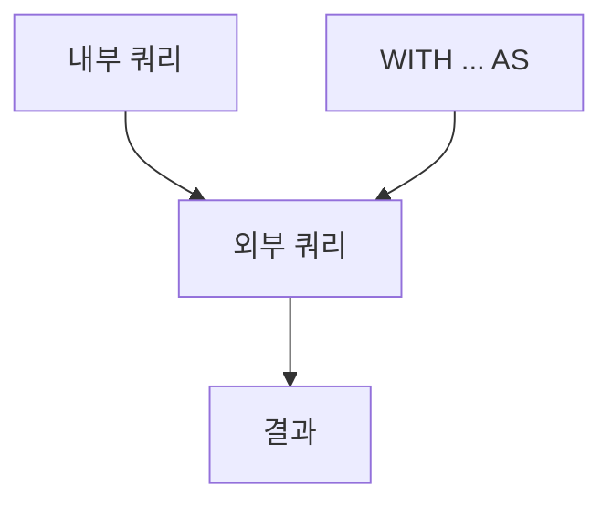

# Subquery

> SQL 101 시리즈 (6/10)


## 이 글에서 다룰 문제

복잡한 분석은 *층(layer)* 을 이루기 마련입니다. 한 줄에 모두 욱여넣은 쿼리는 *읽기 불가능* 하고 *수정 불가능* 합니다. *CTE* 와 *서브쿼리* 는 *단계를 분리* 해 *팀이 같이 읽을 수 있는* SQL 을 만듭니다.

> *읽히는 쿼리는 *고치기 쉬운 쿼리* 다.*

## 전체 흐름


## Before/After

**Before**: 200줄짜리 *한 덩어리* SQL — 어디부터 읽을지 모른다.

**After**: 4개의 *CTE* 로 *단계를 명명* — 누구나 *읽고 수정* 가능.

## Subquery 5단계

### 1단계 — 스칼라

```sql
SELECT name,
    (SELECT COUNT(*) FROM orders o WHERE o.user_id = u.id) AS order_count
FROM users u;
```

### 2단계 — IN

```sql
SELECT * FROM users
WHERE id IN (SELECT user_id FROM orders WHERE total > 1000);
```

### 3단계 — EXISTS

```sql
SELECT * FROM users u
WHERE EXISTS (
    SELECT 1 FROM orders o WHERE o.user_id = u.id
);
```

### 4단계 — 인라인 뷰

```sql
SELECT t.country, t.users
FROM (
    SELECT country, COUNT(*) AS users
    FROM users GROUP BY country
) AS t
WHERE t.users > 100;
```

### 5단계 — CTE

```sql
WITH big_orders AS (
    SELECT user_id, SUM(total) AS spend
    FROM orders GROUP BY user_id
    HAVING SUM(total) > 1000
)
SELECT u.name, b.spend
FROM big_orders b
JOIN users u ON u.id = b.user_id;
```

## 이 코드에서 주목할 점

- *EXISTS* 는 `IN` 보다 *NULL 안전* 하고 *조기 종료* 가 가능.
- *인라인 뷰* 와 *CTE* 는 의미가 같지만 *CTE* 가 *읽기 좋다*.
- *상관 subquery* 는 *행마다 실행* 될 수 있어 *비싸다*.

## 자주 하는 실수 5가지

1. **`NOT IN (subquery)`** 인데 서브쿼리에 *NULL* 이 섞임. 결과가 *비어버린다*.
2. **상관 서브쿼리로 *N+1*.** *조인 + 집계* 로 바꾸자.
3. **CTE 가 *너무 깊음*.** 5단계 넘으면 *분리* 한다.
4. **인라인 뷰에 *별칭 누락*.** 일부 DB 는 *오류*.
5. **EXISTS 안에 `SELECT *`.** 의도가 *오해* 됨. `SELECT 1` 로.

## 실무에서는 이렇게 쓰입니다

ETL 의 *대부분의 단계* 는 CTE 로 *명명된 변환* 입니다. *cohort 분석*, *funnel*, *retention* 모두 *CTE 3~5개* 로 깔끔히 풀립니다.

## 체크리스트

- [ ] 스칼라/인라인/CTE 의 차이를 안다.
- [ ] EXISTS 와 IN 의 차이를 안다.
- [ ] 상관 서브쿼리의 비용을 안다.
- [ ] CTE 로 단계를 나눌 수 있다.

## 정리 및 다음 단계

서브쿼리는 *질문을 쪼개는* 도구입니다. 다음 글은 *Window Function* 입니다.

<!-- toc:begin -->
- [SQL이란 무엇인가?](./01-what-is-sql.md)
- [SELECT 기본](./02-select-basics.md)
- [WHERE와 조건](./03-where-and-conditions.md)
- [JOIN](./04-join.md)
- [GROUP BY와 aggregate](./05-group-by-and-aggregate.md)
- **Subquery (현재 글)**
- Window Function (예정)
- INSERT, UPDATE, DELETE (예정)
- Index와 Query Plan (예정)
- 실전 분석 SQL (예정)
<!-- toc:end -->

## 참고 자료

- [PostgreSQL — Subqueries](https://www.postgresql.org/docs/current/functions-subquery.html)
- [PostgreSQL — WITH Queries (CTE)](https://www.postgresql.org/docs/current/queries-with.html)
- [Mode — Subqueries](https://mode.com/sql-tutorial/sql-sub-queries/)
- [Use The Index, Luke — IN vs EXISTS](https://use-the-index-luke.com/sql/where-clause/null/not-in)

Tags: SQL, Subquery, CTE, Database, Query
