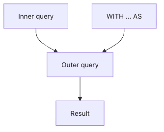

# 서브쿼리와 CTE

실전 SQL은 한 줄로 끝나지 않는 경우가 많습니다. 사용자별 주문 합계를 먼저 만들고, 그중 큰 금액만 골라 다시 사용자 정보와 붙이는 식으로 질문이 겹겹이 쌓입니다. 이때 한 문장 안에 모든 로직을 밀어 넣으면 읽는 사람도, 나중에 고치는 사람도 곧 길을 잃습니다.

이 글은 SQL 101 시리즈의 여섯 번째 글입니다. 여기서는 서브쿼리와 CTE를 사용해 복잡한 질문을 단계로 나누고, 읽을 수 있는 SQL로 바꾸는 방법을 설명합니다.

## 이 글에서 다룰 문제

- 서브쿼리는 언제 쓰고, CTE는 언제 더 나을까요?
- 스칼라 서브쿼리와 인라인 뷰는 무엇이 다를까요?
- `IN`과 `EXISTS`는 어떤 상황에서 차이가 날까요?
- 상관 서브쿼리는 왜 비용 문제가 되기 쉬울까요?
- 긴 SQL을 여러 층으로 나눌 때 이름은 어떻게 붙이는 편이 좋을까요?

> 서브쿼리는 질문 안에 들어 있는 작은 질문입니다. 작은 질문이 읽히지 않으면 큰 질문도 틀리기 쉽습니다.

## 왜 중요한가

분석과 리포트는 대개 단계적입니다. 전체 이벤트에서 코호트 기준일을 만들고, 활동 로그를 붙이고, 다시 집계해 유지율을 구하는 식입니다. 이 과정을 한 덩어리 쿼리로 쓰면 문법은 맞더라도 팀이 함께 검토하기 어려워집니다.

반대로 의미 있는 단계 이름을 붙여 CTE로 나누면, 쿼리를 위에서 아래로 읽으며 각 중간 결과를 검증할 수 있습니다. 실무에서 좋은 SQL은 짧은 SQL이 아니라, 중간 의도를 설명할 수 있는 SQL인 경우가 많습니다.

## 서브쿼리 분해 흐름


내부 쿼리는 바깥 쿼리에 재료를 제공합니다. 이 재료를 이름 붙여 꺼내 놓은 형태가 CTE입니다. 의미는 비슷하지만, 사람이 읽는 경험은 꽤 달라집니다.

## 핵심 개념 정리

### 스칼라 서브쿼리는 값 하나를 돌려준다

스칼라 서브쿼리는 바깥 행마다 하나의 값이 필요할 때 사용합니다. 예를 들어 각 사용자 옆에 주문 수 한 개를 붙이고 싶을 때 어울립니다.

### 인라인 뷰는 FROM 절 안의 임시 테이블이다

`FROM (SELECT ...) AS t` 형태는 중간 결과를 임시 테이블처럼 다루는 방식입니다. 그룹화 결과를 다시 필터링할 때 자주 보입니다.

### CTE는 이름 붙은 중간 단계다

`WITH name AS (...)`는 문법 이상의 의미가 있습니다. 중간 단계가 무엇을 의미하는지 이름으로 드러낼 수 있기 때문입니다. 그래서 팀 협업에서는 인라인 뷰보다 CTE가 더 자주 선택됩니다.

### EXISTS는 존재 여부만 빠르게 확인한다

행이 실제로 존재하는지만 알고 싶다면 `EXISTS`가 의도를 잘 드러냅니다. 값 목록을 비교하는 `IN`과는 느낌이 다릅니다.

## 다섯 가지 패턴으로 보기

### 1단계 — 스칼라 서브쿼리

```sql
SELECT name,
    (SELECT COUNT(*) FROM orders o WHERE o.user_id = u.id) AS order_count
FROM users u;
```

각 사용자 행 옆에 주문 수 하나를 붙입니다. 바깥 행마다 내부 쿼리가 의미를 가지므로 구조를 천천히 읽어야 합니다.

### 2단계 — `IN` 사용하기

```sql
SELECT * FROM users
WHERE id IN (SELECT user_id FROM orders WHERE total > 1000);
```

큰 금액 주문을 가진 사용자만 고르는 예시입니다. 서브쿼리가 사용자 ID 목록을 만들고, 바깥 쿼리가 그 목록에 포함되는 행만 남깁니다.

### 3단계 — `EXISTS` 사용하기

```sql
SELECT * FROM users u
WHERE EXISTS (
    SELECT 1 FROM orders o WHERE o.user_id = u.id
);
```

주문이 하나라도 있는 사용자를 찾습니다. 존재 여부가 핵심일 때는 `SELECT 1`처럼 의도를 단순하게 드러내는 편이 읽기 좋습니다.

### 4단계 — 인라인 뷰

```sql
SELECT t.country, t.users
FROM (
    SELECT country, COUNT(*) AS users
    FROM users GROUP BY country
) AS t
WHERE t.users > 100;
```

먼저 국가별 사용자 수를 만들고, 그 결과를 다시 바깥에서 필터링합니다. 집계 후 조건을 적용하는 구조가 잘 보입니다.

### 5단계 — CTE로 단계 이름 붙이기

```sql
WITH big_orders AS (
    SELECT user_id, SUM(total) AS spend
    FROM orders GROUP BY user_id
    HAVING SUM(total) > 1000
)
SELECT u.name, b.spend
FROM big_orders b
JOIN users u ON u.id = b.user_id;
```

**Expected output:**

| name | spend |
| --- | --- |
| Ada | 1450 |
| Grace | 2100 |

의미 있는 중간 결과에 `big_orders`라는 이름을 붙였습니다. 쿼리를 읽는 사람은 먼저 이 단계의 의미를 이해한 뒤, 다음 조인 단계로 내려오면 됩니다.

## 이 코드에서 먼저 봐야 할 점

- `EXISTS`는 존재 여부만 확인할 때 의도가 분명하고 `NULL` 처리도 비교적 안전합니다.
- 인라인 뷰와 CTE는 유사한 일을 하지만, CTE 쪽이 단계 이름을 드러내기 쉽습니다.
- 상관 서브쿼리는 바깥 행마다 반복 평가될 수 있어 비용이 커질 수 있습니다.

## 실무에서 자주 헷갈리는 지점

### `NOT IN`은 왜 조심해야 할까

서브쿼리 결과 안에 `NULL`이 섞이면 `NOT IN`은 예상과 다른 결과를 만들 수 있습니다. 그래서 부정 조건에서는 `NOT EXISTS`가 더 안전한 경우가 많습니다.

### 상관 서브쿼리는 왜 N+1처럼 느려질 수 있을까

바깥 쿼리의 각 행마다 내부 쿼리가 다시 의미를 가지면, 데이터량이 커질수록 반복 비용이 커집니다. 같은 결과를 조인과 집계 조합으로 바꿀 수 있다면 더 단순하고 빠른 형태가 되는 경우가 많습니다.

### CTE를 너무 깊게 쌓으면 오히려 읽기 어려울 수 있다

CTE는 쪼개기 도구이지만, 무조건 많이 쪼갠다고 좋아지지는 않습니다. 각 단계가 명확한 의미를 가지는지, 이름만 보고도 역할이 떠오르는지가 더 중요합니다.

## 체크리스트

- [ ] 스칼라 서브쿼리, 인라인 뷰, CTE의 차이를 설명할 수 있다.
- [ ] 존재 여부 확인에는 `EXISTS`를 우선 떠올릴 수 있다.
- [ ] `NOT IN`과 `NULL` 조합이 왜 위험한지 알고 있다.
- [ ] 상관 서브쿼리의 비용 문제를 이해하고 있다.
- [ ] 긴 쿼리를 의미 있는 단계 이름으로 나눌 수 있다.

## 정리

서브쿼리와 CTE의 핵심은 복잡한 질문을 읽을 수 있는 층으로 나누는 데 있습니다. 어떤 값 하나를 붙일지, 어떤 목록에 포함되는지, 어떤 중간 결과를 이름 붙여 관리할지를 구분할 수 있으면 큰 SQL도 훨씬 덜 복잡해집니다.

다음 글에서는 집계 결과를 각 행 옆에 다시 붙이는 윈도 함수를 다루겠습니다.

<!-- toc:begin -->
## 시리즈 목차

- [SQL이란 무엇인가?](./01-what-is-sql.md)
- [SELECT 기본](./02-select-basics.md)
- [WHERE와 조건](./03-where-and-conditions.md)
- [JOIN 이해하기](./04-join.md)
- [GROUP BY와 집계 함수](./05-group-by-and-aggregate.md)
- **서브쿼리와 CTE (현재 글)**
- 윈도 함수 (예정)
- 데이터를 바꾸는 SQL — INSERT, UPDATE, DELETE (예정)
- 인덱스와 쿼리 계획 (예정)
- 실전 분석 SQL (예정)

<!-- toc:end -->

## 참고 자료

- [PostgreSQL — Subqueries](https://www.postgresql.org/docs/current/functions-subquery.html)
- [PostgreSQL — WITH Queries (CTE)](https://www.postgresql.org/docs/current/queries-with.html)
- [Mode — Subqueries](https://mode.com/sql-tutorial/sql-sub-queries/)
- [Use The Index, Luke — IN vs EXISTS](https://use-the-index-luke.com/sql/where-clause/null/not-in)

Tags: SQL, Database, Postgres, Analytics
