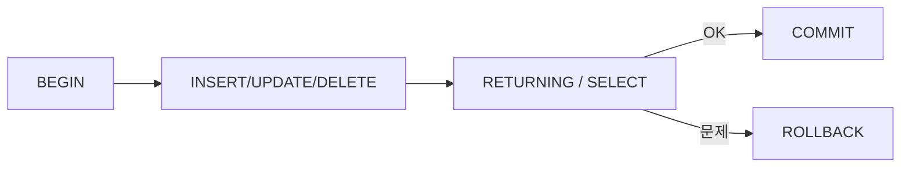

# INSERT, UPDATE, DELETE

> SQL 101 시리즈 (8/10)


## 이 글에서 다룰 문제

운영 DB 에서 *WHERE 한 줄* 을 빼먹으면 *전체 테이블* 이 사라집니다. 트랜잭션과 *명시적 WHERE*, *RETURNING* 은 *팀의 안전망* 입니다. 이 습관이 *사고를 줄입니다*.

> *DML 은 *되돌릴 수 없는 작업* 이 *되돌릴 수 있는 작업으로* 바뀐 결과다.*

## 전체 흐름


## Before/After

**Before**: `DELETE FROM users;` 를 실수로 실행 — *복구 불가*.

**After**: `BEGIN; DELETE FROM users WHERE id = 42 RETURNING *;` 후 결과 *확인 후* `COMMIT`.

## 5단계 안전한 DML

### 1단계 — INSERT

```sql
INSERT INTO users (id, name, signup_at)
VALUES (4, 'Margaret', '2026-04-10');
```

### 2단계 — UPDATE (WHERE 필수)

```sql
UPDATE users SET name = 'Margaret Hamilton' WHERE id = 4;
```

### 3단계 — DELETE (트랜잭션 안에서)

```sql
BEGIN;
DELETE FROM users WHERE id = 4 RETURNING *;
-- 결과 확인 후
COMMIT;
```

### 4단계 — UPSERT

```sql
INSERT INTO users (id, name, signup_at)
VALUES (4, 'Margaret', '2026-04-10')
ON CONFLICT (id)
DO UPDATE SET name = EXCLUDED.name;
```

### 5단계 — Bulk INSERT

```sql
INSERT INTO users (id, name, signup_at) VALUES
    (5, 'Edsger', '2026-04-11'),
    (6, 'Donald', '2026-04-12'),
    (7, 'Barbara', '2026-04-13');
```

## 이 코드에서 주목할 점

- *모든 UPDATE/DELETE 에 WHERE* — 예외 없음.
- 트랜잭션으로 묶고 *RETURNING* 으로 검증.
- UPSERT 의 `EXCLUDED` 는 *INSERT 시도하던 새 값* 을 가리킨다.

## 자주 하는 실수 5가지

1. **WHERE 없는 UPDATE / DELETE.** *전체 테이블* 변경.
2. **트랜잭션 없이 멀티 스텝.** 중간 실패 시 *반쪽 상태*.
3. **`SELECT` 없이 추정으로 변경.** *RETURNING* 으로 반드시 확인.
4. **UPSERT 의 *unique 제약* 누락.** ON CONFLICT 가 *동작하지 않음*.
5. **Bulk INSERT 를 *한 행씩 N번*.** *느리고 비용 큼*.

## 실무에서는 이렇게 쓰입니다

운영 DB 변경은 *PR 리뷰* 와 *마이그레이션 도구* 를 통합니다. 즉석 변경은 *항상 트랜잭션* 안에서, *RETURNING* 으로 결과를 확인합니다. *백업과 PITR (Point-in-Time Recovery)* 가 *최후의 안전망*.

## 체크리스트

- [ ] 모든 DML 에 WHERE 가 있는지 확인하는 습관이 있다.
- [ ] BEGIN/COMMIT/ROLLBACK 을 쓸 수 있다.
- [ ] UPSERT 를 쓸 수 있다.
- [ ] RETURNING 을 안다.

## 정리 및 다음 단계

DML 은 *되돌릴 수 없는 일을 안전하게* 만드는 일입니다. 다음 글은 *Index 와 Query Plan*.

<!-- toc:begin -->
- [SQL이란 무엇인가?](./01-what-is-sql.md)
- [SELECT 기본](./02-select-basics.md)
- [WHERE와 조건](./03-where-and-conditions.md)
- [JOIN](./04-join.md)
- [GROUP BY와 aggregate](./05-group-by-and-aggregate.md)
- [Subquery](./06-subquery.md)
- [Window Function](./07-window-function.md)
- **INSERT, UPDATE, DELETE (현재 글)**
- Index와 Query Plan (예정)
- 실전 분석 SQL (예정)
<!-- toc:end -->

## 참고 자료

- [PostgreSQL — INSERT](https://www.postgresql.org/docs/current/sql-insert.html)
- [PostgreSQL — UPDATE](https://www.postgresql.org/docs/current/sql-update.html)
- [PostgreSQL — DELETE](https://www.postgresql.org/docs/current/sql-delete.html)
- [PostgreSQL — Transactions](https://www.postgresql.org/docs/current/tutorial-transactions.html)

Tags: SQL, DML, Transaction, Database, Postgres
