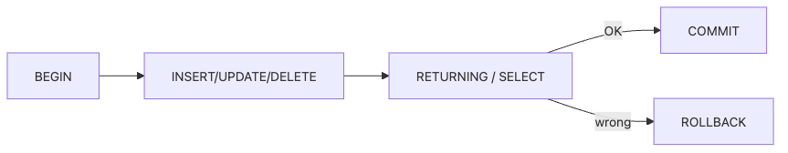

# 데이터를 바꾸는 SQL — INSERT, UPDATE, DELETE

지금까지는 주로 데이터를 읽는 SQL을 다뤘습니다. 하지만 운영 환경에서 더 긴장되는 순간은 데이터를 바꿀 때입니다. 한 줄의 `UPDATE`나 `DELETE`가 서비스 데이터 전체에 영향을 줄 수 있기 때문입니다. 그래서 데이터를 바꾸는 SQL은 읽는 SQL보다 훨씬 더 보수적으로 다뤄야 합니다.

이 글은 SQL 101 시리즈의 여덟 번째 글입니다. 여기서는 `INSERT`, `UPDATE`, `DELETE`를 단순한 문법이 아니라, 트랜잭션과 검증 절차 안에서 안전하게 실행하는 작업으로 설명합니다.

## 이 글에서 다룰 문제

- `INSERT`, `UPDATE`, `DELETE`의 기본 형태는 무엇일까요?
- 트랜잭션은 왜 데이터 변경 작업의 기본 안전망일까요?
- `RETURNING`은 왜 실무에서 특히 유용할까요?
- `UPSERT`는 어떤 제약 조건 위에서 동작할까요?
- 데이터를 바꾸는 쿼리에서 가장 위험한 습관은 무엇일까요?

> 데이터를 바꾸는 SQL은 문법보다 안전 절차가 더 중요합니다.

## 왜 중요한가

운영 데이터는 한 번 잘못 바꾸면 되돌리기 어렵습니다. 특히 `WHERE`가 빠진 `UPDATE`나 `DELETE`는 사고로 바로 이어집니다. 그래서 실무에서는 문장을 작성하는 능력만큼, 실행 전에 검증하고 되돌릴 수 있게 준비하는 습관이 중요합니다.

트랜잭션과 `RETURNING`은 이런 안전 장치를 만드는 기본 도구입니다. 데이터를 바꾸기 전후를 확인하고, 결과가 이상하면 롤백할 수 있어야 합니다. 이 감각은 입문 단계부터 몸에 익혀 두는 편이 좋습니다.

## 안전한 변경 흐름


안전한 데이터 변경 작업은 대개 이런 흐름을 따릅니다. 트랜잭션을 시작하고, 변경을 실행하고, 영향을 받은 행을 확인한 뒤, 맞으면 커밋하고 아니면 롤백합니다.

## 핵심 개념 정리

### DML은 데이터 조작 문장이다

`INSERT`, `UPDATE`, `DELETE`는 DML에 속합니다. 읽기 전용 쿼리와 달리 상태를 바꾸므로, 항상 영향 범위를 의식해야 합니다.

### 트랜잭션은 여러 변경을 하나의 작업으로 묶는다

트랜잭션 안에서 실행한 작업은 전부 성공하거나 전부 실패하도록 다룰 수 있습니다. 중간에 하나라도 문제가 생기면 롤백해 이전 상태로 되돌릴 수 있습니다.

### `RETURNING`은 결과 검증의 기본 도구다

PostgreSQL에서는 변경된 행을 바로 돌려받을 수 있습니다. 이 기능이 있으면 변경 대상이 정말 의도한 행이 맞는지 즉시 확인할 수 있습니다.

### UPSERT는 제약 조건과 함께 동작한다

`ON CONFLICT`는 충돌을 감지할 고유 제약 조건이 있어야 의미가 있습니다. 고유 키나 기본 키 없이 UPSERT를 기대하면 원하는 동작이 나오지 않습니다.

## 다섯 가지 안전한 패턴

### 1단계 — 새 행 추가하기

```sql
INSERT INTO users (id, name, signup_at)
VALUES (4, 'Margaret', '2026-04-10');
```

새 데이터를 넣는 가장 기본 형태입니다. 가능하면 어떤 컬럼에 어떤 값을 넣는지 명시적으로 적는 편이 안전합니다.

### 2단계 — 조건을 붙여 수정하기

```sql
UPDATE users SET name = 'Margaret Hamilton' WHERE id = 4;
```

`UPDATE`에서 가장 중요한 부분은 `WHERE`입니다. 어떤 행을 바꿀지 정확히 제한하지 않으면 전체 행이 영향을 받을 수 있습니다.

### 3단계 — 트랜잭션 안에서 삭제하기

```sql
BEGIN;
DELETE FROM users WHERE id = 4 RETURNING *;
-- 결과를 검토한 뒤
COMMIT;
```

**Expected output:**

| id | name | signup_at |
| --- | --- | --- |
| 4 | Margaret Hamilton | 2026-04-10 |

삭제는 특히 되돌리기 어렵기 때문에, 트랜잭션과 `RETURNING`을 함께 쓰는 습관이 중요합니다.

### 4단계 — 충돌 시 수정으로 전환하기

```sql
INSERT INTO users (id, name, signup_at)
VALUES (4, 'Margaret', '2026-04-10')
ON CONFLICT (id)
DO UPDATE SET name = EXCLUDED.name;
```

동일한 `id`가 이미 있으면 새로 넣는 대신 이름을 갱신합니다. `EXCLUDED`는 삽입을 시도했던 새 값을 가리킵니다.

### 5단계 — 여러 행 한 번에 넣기

```sql
INSERT INTO users (id, name, signup_at) VALUES
    (5, 'Edsger', '2026-04-11'),
    (6, 'Donald', '2026-04-12'),
    (7, 'Barbara', '2026-04-13');
```

대량 입력을 한 행씩 여러 번 보내기보다 한 문장으로 묶는 편이 보통 더 효율적입니다.

## 이 코드에서 먼저 봐야 할 점

- `UPDATE`와 `DELETE`에는 항상 `WHERE`가 있는지 먼저 확인합니다.
- 변경 작업은 트랜잭션 안에서 검증하는 편이 안전합니다.
- `RETURNING`은 실제로 어떤 행이 바뀌었는지 확인하는 가장 직접적인 수단입니다.

## 실무에서 자주 헷갈리는 지점

### 변경 전에 SELECT를 먼저 보는 습관이 왜 중요할까

예상으로 대상 행을 짚지 말고, 먼저 같은 조건으로 `SELECT`를 실행해 보는 편이 좋습니다. 어떤 행이 바뀔지 눈으로 확인한 뒤 변경 문장을 실행하면 사고 확률이 크게 줄어듭니다.

### 여러 문장을 따로 실행하면 어떤 문제가 생길까

중간 단계에서 실패했을 때 앞선 변경만 남고 뒤쪽 변경은 사라질 수 있습니다. 예를 들어 잔액 차감은 됐는데 이력 기록은 실패한 상태가 생길 수 있습니다. 이런 반쪽 상태를 막는 기본 장치가 트랜잭션입니다.

### UPSERT는 왜 고유 제약 없이 안심할 수 없을까

충돌을 감지할 기준이 없으면 `ON CONFLICT`는 기대한 대로 동작하지 않습니다. UPSERT를 설계할 때는 먼저 어떤 컬럼 조합이 고유성을 보장하는지부터 정해야 합니다.

## 체크리스트

- [ ] `UPDATE`와 `DELETE`를 실행하기 전에 `WHERE`를 먼저 점검한다.
- [ ] 변경 전 `SELECT`, 변경 후 `RETURNING`을 활용할 수 있다.
- [ ] `BEGIN`, `COMMIT`, `ROLLBACK` 흐름을 설명할 수 있다.
- [ ] UPSERT가 제약 조건 위에서 동작한다는 점을 알고 있다.
- [ ] 여러 행 입력은 한 번에 묶는 편이 효율적이라는 점을 이해하고 있다.

## 정리

데이터를 바꾸는 SQL의 핵심은 문법보다 안전한 실행 절차입니다. `WHERE`를 명시하고, 트랜잭션으로 묶고, `RETURNING`으로 검증하는 습관이 있어야 변경 작업을 통제할 수 있습니다. 읽는 SQL보다 쓰는 SQL을 더 천천히 다뤄야 한다는 감각을 여기서 꼭 가져가면 좋습니다.

다음 글에서는 읽기 성능을 좌우하는 인덱스와 쿼리 계획을 다루겠습니다.

<!-- toc:begin -->
## 시리즈 목차

- [SQL이란 무엇인가?](./01-what-is-sql.md)
- [SELECT 기본](./02-select-basics.md)
- [WHERE와 조건](./03-where-and-conditions.md)
- [JOIN 이해하기](./04-join.md)
- [GROUP BY와 집계 함수](./05-group-by-and-aggregate.md)
- [서브쿼리와 CTE](./06-subquery.md)
- [윈도 함수](./07-window-function.md)
- **데이터를 바꾸는 SQL — INSERT, UPDATE, DELETE (현재 글)**
- 인덱스와 쿼리 계획 (예정)
- 실전 분석 SQL (예정)

<!-- toc:end -->

## 참고 자료

- [PostgreSQL — INSERT](https://www.postgresql.org/docs/current/sql-insert.html)
- [PostgreSQL — UPDATE](https://www.postgresql.org/docs/current/sql-update.html)
- [PostgreSQL — DELETE](https://www.postgresql.org/docs/current/sql-delete.html)
- [PostgreSQL — Transactions](https://www.postgresql.org/docs/current/tutorial-transactions.html)

Tags: SQL, Database, Postgres, Analytics
