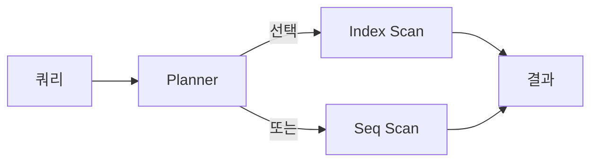

# Index와 Query Plan

> SQL 101 시리즈 (9/10)


## 이 글에서 다룰 문제

데이터가 늘어날수록 *튜닝의 가치* 가 폭발적으로 커집니다. *플랜 한 번 읽기* 가 *서버 한 대* 를 줄일 수 있습니다. 인덱스는 *공짜가 아닙니다*. *어디에 두고 어디에 안 두는지* 가 *설계 능력* 입니다.

> *읽기는 빨라지지만, *쓰기는 느려진다*. 인덱스는 *거래* 다.*

## 개념 한눈에 보기



## Before/After

**Before**: `WHERE LOWER(email) = 'x'` 가 *Seq scan*.

**After**: `WHERE email = 'x'` 또는 *함수 인덱스* `CREATE INDEX ... ON users (LOWER(email))`.

## 실습: 5단계 튜닝 흐름

### 1단계 — EXPLAIN

```sql
EXPLAIN
SELECT * FROM users WHERE email = 'a@b.com';
```

### 2단계 — EXPLAIN ANALYZE

```sql
EXPLAIN ANALYZE
SELECT * FROM users WHERE email = 'a@b.com';
```

### 3단계 — 인덱스 추가

```sql
CREATE INDEX idx_users_email ON users (email);
```

### 4단계 — 합성 인덱스

```sql
CREATE INDEX idx_orders_user_date
ON orders (user_id, created_at DESC);
```

### 5단계 — 부분 인덱스

```sql
CREATE INDEX idx_users_active
ON users (id) WHERE deleted_at IS NULL;
```

## 이 코드에서 주목할 점

- 합성 인덱스의 *컬럼 순서* 는 *왼쪽부터* 만 효과.
- *부분 인덱스* 는 *조건이 명확* 할 때 *작고 빠르다*.
- *EXPLAIN ANALYZE* 는 *실제 실행* 한다 — 운영에선 *주의*.

## 자주 하는 실수 5가지

1. **컬럼에 *함수* 적용 → 인덱스 *못 탐*.**
2. **타입 *암시적 변환* → 인덱스 *무력*.**
3. **`LIKE '%x'` *후방 일치* → 인덱스 *불가*.**
4. ***OR* 가 너무 많음 → planner 가 *Seq scan* 선택.**
5. **인덱스 *남발* → 쓰기 비용 *폭증*.**

## 실무에서는 이렇게 쓰입니다

대부분의 성능 작업은 *느린 쿼리 로그 → EXPLAIN → 인덱스 또는 쿼리 수정* 의 반복입니다. 합성 인덱스 설계는 *조건 + 정렬* 을 모두 고려합니다. *부분 인덱스* 는 *soft delete* 와 잘 어울립니다.

## 체크리스트

- [ ] EXPLAIN 결과의 Seq vs Index scan 을 구분한다.
- [ ] 합성 인덱스 컬럼 순서의 의미를 안다.
- [ ] 부분 인덱스를 쓸 수 있다.
- [ ] 함수 인덱스의 필요성을 안다.

## 정리 및 다음 단계

튜닝의 시작은 *플랜 읽기* 입니다. 다음 글은 *실전 분석 SQL*.

<!-- toc:begin -->
- [SQL이란 무엇인가?](./01-what-is-sql.md)
- [SELECT 기본](./02-select-basics.md)
- [WHERE와 조건](./03-where-and-conditions.md)
- [JOIN](./04-join.md)
- [GROUP BY와 aggregate](./05-group-by-and-aggregate.md)
- [Subquery](./06-subquery.md)
- [Window Function](./07-window-function.md)
- [INSERT, UPDATE, DELETE](./08-insert-update-delete.md)
- **Index와 Query Plan (현재 글)**
- 실전 분석 SQL (예정)
<!-- toc:end -->

## 참고 자료

- [PostgreSQL — Indexes](https://www.postgresql.org/docs/current/indexes.html)
- [PostgreSQL — EXPLAIN](https://www.postgresql.org/docs/current/sql-explain.html)
- [Use The Index, Luke](https://use-the-index-luke.com/)
- [PostgreSQL — Partial Indexes](https://www.postgresql.org/docs/current/indexes-partial.html)

Tags: SQL, Index, QueryPlan, Performance, Postgres
