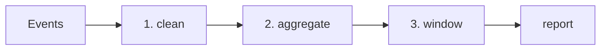

# 실전 분석 SQL

시리즈 앞부분에서 배운 `SELECT`, `WHERE`, `JOIN`, `GROUP BY`, 서브쿼리, 윈도 함수는 각각 따로 존재하는 기능이 아닙니다. 실제 분석 업무에서는 이 도구들이 한 쿼리 안에서 층층이 결합됩니다. 그래서 시리즈 마지막에서는 문법별 설명보다, 자주 반복되는 분석 패턴을 한 번에 보는 편이 더 도움이 됩니다.

이 글은 SQL 101 시리즈의 마지막 글입니다. 여기서는 일별 활성 사용자, 코호트 유지율, 퍼널, 그룹별 Top-N처럼 실무에서 자주 만나는 분석 SQL의 기본 구조를 정리합니다.

## 이 글에서 다룰 문제

- DAU, WAU, MAU 같은 활성 사용자 지표는 어떤 모양으로 작성할까요?
- 코호트와 유지율은 어떤 단계로 계산할까요?
- 퍼널 분석은 어떻게 한 쿼리 안에 정리할 수 있을까요?
- 그룹별 Top-N은 왜 윈도 함수가 잘 맞을까요?
- 실전 분석 SQL에서 가장 자주 놓치는 실수는 무엇일까요?

> 분석 SQL은 새로운 마법이 아니라, 익숙한 도구를 여러 층으로 쌓아 올린 결과입니다.

## 왜 중요한가

현업에서 받는 분석 요청의 상당수는 완전히 새로운 문제가 아닙니다. 활성 사용자, 유지율, 전환율, 상위 매출 상품처럼 이미 자주 등장한 패턴의 변형인 경우가 많습니다. 이 패턴을 알고 있으면 요청이 들어왔을 때 처음부터 빈 화면에서 시작하지 않아도 됩니다.

또 좋은 분석 SQL은 개인의 임시 스크립트로 끝나지 않고 팀의 자산이 됩니다. 정의가 명확하고 재사용 가능한 쿼리는 이후 대시보드, 모델링, 리뷰 문화의 기반이 됩니다.

## 한눈에 보는 흐름



대부분의 분석 SQL은 원본 이벤트를 정리하고, 집계하고, 필요하면 윈도 함수로 후처리한 뒤 최종 보고서 형태로 만듭니다. 중요한 점은 각 단계를 명확히 구분하는 것입니다.

## 핵심 개념 정리

### 활성 사용자 지표는 정의부터 맞춰야 한다

DAU, WAU, MAU는 단순히 `COUNT(DISTINCT user_id)`만 쓰면 끝나는 문제가 아닙니다. 어떤 이벤트를 활동으로 볼지, 어느 시간대를 기준으로 날짜를 자를지 먼저 합의해야 합니다.

### 코호트는 같은 출발점을 가진 사용자 묶음이다

같은 가입일, 같은 첫 결제일처럼 공통 기준으로 사용자를 묶고, 이후 날짜별로 얼마나 다시 활동했는지를 계산하면 유지율이 나옵니다. 정의가 불명확하면 숫자는 쉽게 엇갈립니다.

### 퍼널은 단계별 전환을 보는 구조다

조회, 장바구니, 결제처럼 단계가 분명한 흐름에서는 각 단계별 사용자 수와 전환율을 계산합니다. 이때 시간 순서를 보장할지 여부가 분석 품질에 큰 영향을 줍니다.

### 그룹별 Top-N은 윈도 함수가 가장 직관적이다

상품별 상위 3건, 국가별 상위 5명처럼 그룹 안에서 순위를 매겨야 하는 문제는 `ROW_NUMBER`나 `RANK`가 잘 맞습니다.

## 다섯 가지 실전 패턴

### 1단계 — 일별 활성 사용자

```sql
SELECT event_at::date AS day, COUNT(DISTINCT user_id) AS dau
FROM events
GROUP BY day
ORDER BY day;
```

가장 기본적인 분석 쿼리입니다. 특정 날짜에 활동한 고유 사용자 수를 계산합니다.

### 2단계 — 코호트 유지율의 뼈대

```sql
WITH cohort AS (
    SELECT user_id, MIN(event_at)::date AS cohort_day FROM events GROUP BY user_id
),
activity AS (
    SELECT e.user_id, c.cohort_day,
        (e.event_at::date - c.cohort_day) AS day_n
    FROM events e JOIN cohort c USING (user_id)
)
SELECT cohort_day, day_n, COUNT(DISTINCT user_id) AS users
FROM activity
GROUP BY cohort_day, day_n
ORDER BY cohort_day, day_n;
```

먼저 각 사용자의 출발일을 만들고, 이후 활동일까지의 차이를 계산한 뒤 코호트 날짜와 경과 일수별로 집계합니다.

### 3단계 — 퍼널 수치 한 번에 보기

```sql
SELECT
    COUNT(DISTINCT user_id) FILTER (WHERE step = 'view')   AS s1_view,
    COUNT(DISTINCT user_id) FILTER (WHERE step = 'cart')   AS s2_cart,
    COUNT(DISTINCT user_id) FILTER (WHERE step = 'pay')    AS s3_pay
FROM events;
```

한 쿼리 안에서 단계별 사용자 수를 나란히 놓는 기본 패턴입니다. 이후 이 값을 바탕으로 전환율을 계산할 수 있습니다.

### 4단계 — 그룹별 상위 N건 찾기

```sql
WITH ranked AS (
    SELECT product_id, total,
        ROW_NUMBER() OVER (PARTITION BY product_id ORDER BY total DESC) AS rk
    FROM orders
)
SELECT * FROM ranked WHERE rk <= 3;
```

상품별로 주문 금액 상위 3건만 남기는 예시입니다. 윈도 함수를 실전에서 자주 쓰는 대표 패턴입니다.

### 5단계 — 전월 대비 성장률 계산하기

```sql
WITH monthly AS (
    SELECT DATE_TRUNC('month', day) AS month, SUM(revenue) AS rev
    FROM daily_revenue GROUP BY month
)
SELECT month, rev,
    rev - LAG(rev) OVER (ORDER BY month) AS diff,
    (rev - LAG(rev) OVER (ORDER BY month)) * 100.0
        / NULLIF(LAG(rev) OVER (ORDER BY month), 0) AS mom_pct
FROM monthly;
```

월별 매출을 먼저 만들고, 직전 월과의 차이와 성장률을 계산합니다. `NULLIF`를 써서 0으로 나누는 문제를 피하는 점도 중요합니다.

## 이 코드에서 먼저 봐야 할 점

- 활성 사용자 지표는 대개 `COUNT(DISTINCT user_id)`에서 시작합니다.
- 퍼널은 `FILTER (WHERE ...)`를 쓰면 한 줄에 구조가 잘 드러납니다.
- 성장률 계산에서는 `NULLIF`로 0 나눗셈을 막는 습관이 필요합니다.

## 실무에서 자주 헷갈리는 지점

### 활성 사용자의 정의가 팀마다 다를 수 있다

로그인만 활동으로 볼지, 조회 이벤트도 포함할지에 따라 숫자가 달라집니다. 쿼리보다 먼저 정의를 문서화해야 합니다.

### 시간대 처리를 빼먹으면 날짜가 어긋난다

UTC 기준 로그를 로컬 시간대 기준 대시보드에 바로 쓰면 날짜 경계가 밀릴 수 있습니다. 일별 지표일수록 시간대 기준을 분명히 해야 합니다.

### 퍼널은 개수만 세면 끝나지 않는다

단계별 수를 세는 것과, 실제로 사용자가 그 단계를 시간 순서대로 밟았는지 확인하는 것은 다른 문제입니다. 단순 퍼널에서 끝낼지, 시간 순서를 포함한 엄격한 퍼널로 갈지 목적을 먼저 정해야 합니다.

### 코호트 기준이 모호하면 유지율이 흔들린다

가입일 기준인지, 첫 결제일 기준인지, 첫 핵심 행동 기준인지에 따라 완전히 다른 보고서가 됩니다. 숫자보다 정의가 먼저입니다.

## 체크리스트

- [ ] DAU를 기본 형태로 작성할 수 있다.
- [ ] 코호트와 활동 단계를 CTE로 나눌 수 있다.
- [ ] 퍼널 단계별 사용자 수를 `FILTER`로 집계할 수 있다.
- [ ] 그룹별 Top-N을 윈도 함수로 구할 수 있다.
- [ ] 시간대와 지표 정의를 먼저 맞춰야 한다는 점을 이해하고 있다.

## 정리

실전 분석 SQL은 새로운 문법의 집합이 아니라, 이미 배운 도구를 여러 층으로 결합한 결과입니다. 이벤트를 정리하고, 집계하고, 윈도 함수로 비교하고, 중간 단계를 CTE로 이름 붙이는 흐름이 핵심입니다. 이 구조를 익혀 두면 새로운 분석 요청이 들어와도 훨씬 빠르게 첫 초안을 만들 수 있습니다.

이 글로 SQL 101 시리즈를 마칩니다. 다음 단계에서는 더 깊은 쿼리 계획 읽기, 실제 PostgreSQL 운영, 데이터 웨어하우스 모델링으로 자연스럽게 이어질 수 있습니다.

<!-- toc:begin -->
- [SQL이란 무엇인가?](./01-what-is-sql.md)
- [SELECT 기본](./02-select-basics.md)
- [WHERE와 조건](./03-where-and-conditions.md)
- [JOIN 이해하기](./04-join.md)
- [GROUP BY와 집계 함수](./05-group-by-and-aggregate.md)
- [서브쿼리와 CTE](./06-subquery.md)
- [윈도 함수](./07-window-function.md)
- [데이터를 바꾸는 SQL — INSERT, UPDATE, DELETE](./08-insert-update-delete.md)
- [인덱스와 쿼리 계획](./09-index-and-query-plan.md)
- **실전 분석 SQL (현재 글)**
<!-- toc:end -->

## 참고 자료

- [Mode — Advanced SQL](https://mode.com/sql-tutorial/)
- [PostgreSQL — Window Functions](https://www.postgresql.org/docs/current/tutorial-window.html)
- [dbt — Analytics Engineering](https://docs.getdbt.com/)
- [Looker — Block Library](https://cloud.google.com/looker/docs)

Tags: SQL, Analytics, Cohort, Funnel, Retention
