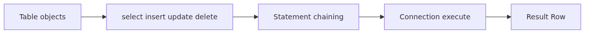
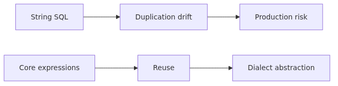
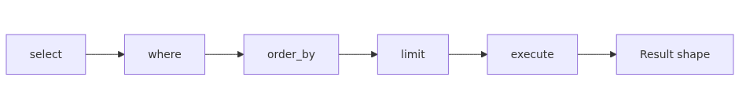
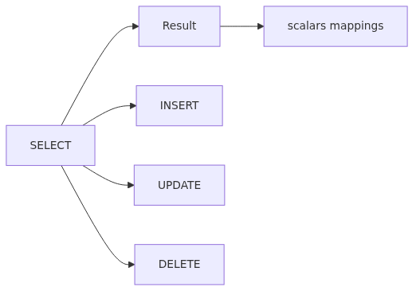
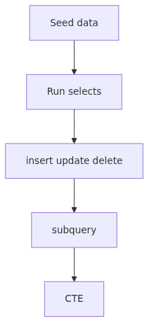

# SQLAlchemy Core - select, insert, update, delete in 2.x Style

> SQLAlchemy 101 series (3/10)

---

In post 2 we modeled our schema as Python objects with `MetaData` and `Table`. Now we're ready to build SQL using those objects. You can already execute SQL with raw `text()`, but the real value of Core SQL expressions is composing SQL out of Python while catching typos and type errors at compile time, and not getting tripped up by dialect differences.

This post walks through SQLAlchemy 2.x style `select()`, `insert()`, `update()`, `delete()`, and the `Result`/`Row` objects you use to read the results. The Engine from post 1 and the schema from post 2 finally come together as a small but complete working manual.



*SQLAlchemy core - select, insert, update, delete in 2.x style*
## What you will learn

- The unified 2.x `select()` shape: `select(...)`, `where()`, `order_by()`, `limit()`, `offset()`, `group_by()`, `having()`
- The `Result` object and the meaning of `.all()`, `.first()`, `.one()`, `.one_or_none()`, `.scalars()`, `.mappings()`
- `insert(table).values(...)` and the `executemany`-style list-of-dicts form
- Receiving new PKs via `inserted_primary_key` and composing INSERT-SELECT with `Insert.from_select()`
- `update(table).where(...).values(...)` and using RETURNING (SQLite 3.35+)
- Safe patterns for `delete(table).where(...)` and the danger of "delete everything"
- Two ways to express JOIN: `select.join()` and `select(...).select_from(a.join(b))`
- Subqueries, CTEs (`select.cte()`), and basic use of `func.*` aggregate functions

## Questions this post answers

- How does 1.x `select([users])` differ from 2.x `select(users)`?
- Does `Result.all()` return `list[Row]` or `list[tuple]`?
- Where does the new ID go after an INSERT?
- What's the SQLite-friendly way to UPDATE with a LIMIT?
- What happens if I leave the WHERE off a DELETE?
- What's the most concise 2.x way to write a JOIN?

## Why this matters



*Why this matters*
Working with raw SQL strings adds three kinds of cost over time. First, every column rename forces a project-wide grep. Second, the same SQL gets copied with subtle differences in many places, leading to subtle behavioral drift. Third, you handle dialect differences yourself.

Core SQL expressions reduce the first two costs to almost zero. A column rename in the schema affects every expression at import time. You can wrap a `select` in a function and reuse it. Dialect differences are handled by SQLAlchemy's compiler.

Core SQL expressions also don't go away once the ORM enters from post 4. The ORM's `select()` is the same object as Core's `select()`, and complex queries always come back down to Core. This post lays the groundwork.

## Mental Model



*Mental model*
In 2.x style, building SQL means stacking clauses through method chaining. You start with `select(...)`, call `where`, `order_by`, `limit`, etc., each call returning a new statement object. Finally, a Connection executes it and gives you a `Result`.

> A 2.x `select` is an immutable statement object. Each method call returns a new statement; the original doesn't mutate. A `Result` is a one-shot stream; the shape you pull out of it (`Row`, scalar, or mapping) is decided at the Result level.

```
select(users.c.id, users.c.name)        # statement 1
   .where(users.c.email == "a@x.com")   # statement 2
   .order_by(users.c.id)                 # statement 3
   .limit(10)                            # statement 4
                  │
                  ▼
       conn.execute(stmt) → Result
                  │
       ┌──────────┼─────────────┐
       ▼          ▼             ▼
   .all()    .scalars()    .mappings()
   list[Row] ScalarResult  MappingResult
              .all() →     .all() →
              list[T]      list[dict]
```

Once this mental model clicks, INSERT/UPDATE/DELETE follow the same shape. Only the starting function changes: `insert/update/delete`.

## Core concepts



*Core concepts*
### select basics

```python
from sqlalchemy import select
from schema import users

stmt = (
    select(users.c.id, users.c.name)
    .where(users.c.email == "alice@example.com")
    .order_by(users.c.id.desc())
    .limit(5)
)

with engine.connect() as conn:
    rows = conn.execute(stmt).all()
    for row in rows:
        print(row.id, row.name)
```

`select(*cols_or_tables)` takes columns or whole tables to SELECT. Passing a table like `select(users)` selects every column. WHERE clauses use Python comparisons (`==`, `!=`, `<`, `<=`, `>`, `>=`, `.in_(...)`, `.like(...)`, `.is_(None)`) directly. Multiple conditions combine via comma (AND) or with `or_()`/`and_()`.

```python
from sqlalchemy import or_, and_

stmt = select(users).where(
    or_(users.c.name == "Alice", users.c.name == "Bob"),
    users.c.email.like("%@example.com"),
)
```

### Working with Result

`conn.execute(stmt)` returns a `Result` object, and you pull data out of it in several shapes.

| Method | Returns |
| --- | --- |
| `.all()` | `list[Row]` |
| `.first()` | `Row | None` |
| `.one()` | `Row` (raises if zero or more than one) |
| `.one_or_none()` | `Row | None` (raises if more than one) |
| `.scalar()` | A single column from a single row |
| `.scalar_one()` | Same as `.scalar()`, raises if zero or many |
| `.scalars().all()` | The first column collected into a `list` |
| `.mappings().all()` | A `list[dict]`-like result |

`Row` behaves like a named tuple. You can do `row.name`, `row[1]`, or `row._mapping["name"]`. The same interface is used in both Core and ORM.

`.scalars()` is most often paired with selects that return a single object (like `select(users)`). It's everywhere in the ORM but it's just as valid in Core.

### insert

```python
from sqlalchemy import insert

with engine.begin() as conn:
    result = conn.execute(
        insert(users).values(name="Alice", email="alice@example.com")
    )
    print(result.inserted_primary_key)   # (1,)
```

To insert many rows in one call, pass a list of dicts as the second argument.

```python
with engine.begin() as conn:
    conn.execute(
        insert(users),
        [
            {"name": "Alice", "email": "alice@example.com"},
            {"name": "Bob",   "email": "bob@example.com"},
        ],
    )
```

This form maps to `executemany` on the dialect and is usually the fastest bulk insert path.

#### INSERT-SELECT

When you want to copy data from one table into another:

```python
from sqlalchemy import insert, select

stmt = insert(archive_users).from_select(
    ["id", "name", "email"],
    select(users.c.id, users.c.name, users.c.email).where(users.c.active.is_(False)),
)
with engine.begin() as conn:
    conn.execute(stmt)
```

#### RETURNING (SQLite 3.35+)

SQLite 3.35 and newer support RETURNING on INSERT/UPDATE/DELETE.

```python
from sqlalchemy import insert

stmt = insert(users).values(name="Alice", email="a@x.com").returning(users.c.id, users.c.created_at)
with engine.begin() as conn:
    new_id, created_at = conn.execute(stmt).one()
```

Older SQLite (<= 3.34) won't run this; check your environment.

### update

```python
from sqlalchemy import update

stmt = (
    update(users)
    .where(users.c.email == "alice@example.com")
    .values(name="Alice Liddell")
)
with engine.begin() as conn:
    result = conn.execute(stmt)
    print(result.rowcount)   # number of affected rows
```

Update also supports RETURNING (SQLite 3.35+):

```python
stmt = update(users).where(users.c.id == 1).values(name="Alice").returning(users.c.id, users.c.name)
```

#### A note on UPDATE-LIMIT

SQLite by default does not support `UPDATE ... LIMIT` (depends on build options). The portable approach is to pick target PKs in a subquery.

```python
sub = select(users.c.id).where(users.c.active.is_(False)).limit(100).scalar_subquery()
stmt = update(users).where(users.c.id.in_(sub)).values(active=True)
```

### delete

```python
from sqlalchemy import delete

stmt = delete(users).where(users.c.id == 42)
with engine.begin() as conn:
    conn.execute(stmt)
```

A bare `delete(users)` deletes the entire table. To prevent accidents, it's safer to wrap deletes in a helper that explicitly forbids missing WHERE.

```python
def safe_delete(conn, table, condition):
    if condition is None:
        raise ValueError("WHERE-less delete is forbidden")
    return conn.execute(delete(table).where(condition))
```

### JOIN

There are two ways to write a JOIN:

```python
# A: select(...).join(...)
stmt = (
    select(users.c.name, posts.c.title)
    .join(posts, posts.c.user_id == users.c.id)
    .order_by(posts.c.created_at.desc())
)

# B: select(...).select_from(a.join(b, ...))
joined = users.join(posts, posts.c.user_id == users.c.id)
stmt = select(users.c.name, posts.c.title).select_from(joined)
```

Form A is shorter and most common. Form B is clearer when several tables join in complex ways. When a foreign key already declares the relationship, you can omit the ON clause: `select(...).join(posts)` is enough.

LEFT OUTER JOIN uses `outerjoin()`:

```python
stmt = select(users.c.name, posts.c.title).outerjoin(posts, posts.c.user_id == users.c.id)
```

### Subquery and CTE

```python
sub = select(posts.c.user_id).where(posts.c.title.like("%news%")).subquery()
stmt = select(users).join(sub, sub.c.user_id == users.c.id)
```

CTEs use `select.cte("name")`:

```python
recent = (
    select(posts.c.user_id, posts.c.title)
    .where(posts.c.created_at > "2026-01-01")
    .cte("recent")
)
stmt = select(recent.c.user_id, recent.c.title)
```

### Aggregate functions

Use the `func` namespace to call SQL functions.

```python
from sqlalchemy import func

stmt = select(users.c.id, func.count(posts.c.id).label("post_count")).join(posts).group_by(users.c.id)
```

`label()` creates an alias so you can read it as `row.post_count`.

## Before-After

### Before: text-based dynamic queries

```python
def find_users(active=None, email_like=None, limit=10):
    sql = "SELECT id, name, email FROM users WHERE 1=1"
    params = {}
    if active is not None:
        sql += " AND active = :active"; params["active"] = active
    if email_like:
        sql += " AND email LIKE :email"; params["email"] = email_like
    sql += f" LIMIT {limit}"   # risky: no int cast
    with engine.connect() as conn:
        return conn.execute(text(sql), params).all()
```

Problems: string assembly is fragile, and unbindable parts like `LIMIT` open the door to type errors and SQL injection.

### After: select-based dynamic queries

```python
from sqlalchemy import select
from schema import users

def find_users(active=None, email_like=None, limit=10):
    stmt = select(users.c.id, users.c.name, users.c.email)
    if active is not None:
        stmt = stmt.where(users.c.active.is_(active))
    if email_like:
        stmt = stmt.where(users.c.email.like(email_like))
    stmt = stmt.limit(int(limit))
    with engine.connect() as conn:
        return conn.execute(stmt).all()
```

Now column-name typos are caught at the schema layer, and `LIMIT` values are handled safely by the compiler. Because `stmt` is immutable, accumulating `where`/`limit` calls produces fresh statements with no race conditions.

## Step-by-step practice



*Step-by-step practice*
### Step 1: Seed data

```python
from sqlalchemy import create_engine, insert
from schema import metadata, users, posts

engine = create_engine("sqlite:///app.db")
metadata.create_all(engine)

with engine.begin() as conn:
    conn.execute(insert(users), [
        {"name": "Alice", "email": "alice@example.com"},
        {"name": "Bob",   "email": "bob@example.com"},
    ])
    conn.execute(insert(posts), [
        {"user_id": 1, "title": "hello",      "body": "first post"},
        {"user_id": 1, "title": "news today", "body": "second post"},
        {"user_id": 2, "title": "intro",      "body": "bob's first"},
    ])
```

### Step 2: Variations on select

```python
from sqlalchemy import select, func
from schema import users, posts

with engine.connect() as conn:
    # 1) plain select
    rows = conn.execute(select(users)).all()

    # 2) where + order_by
    rows = conn.execute(
        select(users.c.id, users.c.name)
        .where(users.c.email.like("%@example.com"))
        .order_by(users.c.id.desc())
    ).all()

    # 3) JOIN + aggregate
    rows = conn.execute(
        select(users.c.name, func.count(posts.c.id).label("post_count"))
        .join(posts, posts.c.user_id == users.c.id)
        .group_by(users.c.name)
    ).all()
    for row in rows:
        print(row.name, row.post_count)

    # 4) scalar
    n = conn.execute(select(func.count()).select_from(users)).scalar_one()
    print(f"users={n}")
```

### Step 3: insert / update / delete inside a transaction

```python
from sqlalchemy import insert, update, delete

with engine.begin() as conn:
    # insert + RETURNING
    result = conn.execute(
        insert(users).values(name="Carol", email="carol@example.com").returning(users.c.id)
    )
    cid = result.scalar_one()

    # update
    conn.execute(update(users).where(users.c.id == cid).values(name="Carol C"))

    # delete (safe pattern)
    conn.execute(delete(posts).where(posts.c.user_id == cid))
```

### Step 4: subquery and CTE

```python
from sqlalchemy import select

sub = select(posts.c.user_id).where(posts.c.title.like("%news%")).subquery()
stmt = select(users).join(sub, sub.c.user_id == users.c.id)
print(conn.execute(stmt).all())

cte = select(posts.c.user_id, func.count().label("n")).group_by(posts.c.user_id).cte("c")
stmt = select(users.c.name, cte.c.n).join(cte, cte.c.user_id == users.c.id)
```

## Common mistakes

**1. Sticking to 1.x style.** `select([users])` (passing a list), `engine.execute(stmt)` (executing without a Connection), and `stmt.execute()` (executing on the statement) are all gone in 2.x.

**2. Iterating a `Result` twice.** A `Result` is single-use. Materialize once with `.all()` and reuse the resulting list.

**3. Reaching for `.one()` blindly.** It raises if there's zero or more than one row. Use `.one_or_none()` when zero is possible, `.first()` when many are possible.

**4. Forgetting WHERE on update/delete.** The whole table is affected. Forbid it via a helper or catch it at code review.

**5. Producing accidental cross joins.** `select(users, posts)` produces a cross join. Always specify a join condition: `.join(posts, posts.c.user_id == users.c.id)`.

**6. Trusting f-string interpolation in `text()`.** Core expressions auto-bind, but `text(f"SELECT * FROM users WHERE name = '{name}'")` is still injectable. To benefit from binding, use `:name` placeholders inside `text(...)` and pass a dict.

## Real-world application

In real code, selects are usually wrapped in functions for reuse.

```python
# repos/user_repo.py
from sqlalchemy import select, insert, update
from schema import users

def get_user_by_email(conn, email: str):
    return conn.execute(select(users).where(users.c.email == email)).first()

def create_user(conn, name: str, email: str) -> int:
    return conn.execute(
        insert(users).values(name=name, email=email).returning(users.c.id)
    ).scalar_one()

def deactivate_user(conn, user_id: int) -> int:
    return conn.execute(
        update(users).where(users.c.id == user_id).values(active=False)
    ).rowcount
```

The key is that each function takes a `Connection` as a parameter. Transaction boundaries belong to the caller, so the same function can run inside a transaction with other functions. ORM Sessions follow the same principle (covered in post 5).

When read functions return a list, `.scalars().all()` or `.mappings().all()` is often more convenient than raw `.all()`. For JSON serialization, `.mappings().all()` is the most natural fit.

```python
def list_users_as_dict(conn) -> list[dict]:
    return [dict(m) for m in conn.execute(select(users)).mappings().all()]
```

For performance, avoid loading enormous result sets into memory at once by using streaming iteration.

```python
with engine.connect().execution_options(stream_results=True) as conn:
    for row in conn.execute(select(users)):
        process(row)
```

## Checklist

- [ ] You can write `select`, `insert`, `update`, `delete` in 2.x style
- [ ] You understand the difference between `Row`, `.scalar()`, `.scalars()`, `.mappings()`
- [ ] You choose `.first()`, `.one()`, `.one_or_none()` based on cardinality
- [ ] WHERE-less update/delete is blocked at the application layer
- [ ] JOINs always specify an ON condition (no accidental cross joins)
- [ ] You know the SQLite RETURNING version requirement (3.35+)
- [ ] You can build subqueries and CTEs
- [ ] Domain logic is wrapped in functions that take a `Connection` as input

## Exercises

1. Given `users(id, name, email, active)` and `posts(id, user_id, title, created_at)`, write a Core expression that returns "active users who wrote at least 5 posts in the last 30 days." The result should have two columns: `name` and `post_count`.
2. Write a function that creates a new user using RETURNING and reads back both the PK and `created_at`. Add a fallback path for SQLite 3.34 or older that uses `inserted_primary_key`.
3. Write SQLite-compatible code that activates 100 inactive users at once, using the subquery approach because `UPDATE ... LIMIT` isn't supported.
4. Build a function that returns select results as a `list[dict]` via `.mappings()`, then create a second version that uses `stream_results=True` to handle large result sets in streaming fashion. Compare them.

## Wrap-up and next post

In this post we treated SQLAlchemy Core's SQL expressions as a small working manual. `select`/`insert`/`update`/`delete` are immutable statement objects, and `Result` lets you extract `Row`, scalars, or mappings freely. JOIN, subquery, CTE, and aggregate functions all combine schema objects with the `func` namespace. Dialect-specific features like RETURNING and streaming are exposed through SQLAlchemy's unified interface.

The ORM enters in the next post. Post 4 covers `DeclarativeBase` and `mapped_column`, mapping Python classes to database rows. The `users.c.name` from this post becomes `User.name` in ORM, and `select(users)` becomes `select(User)`. Understanding Core first lets you debug the ORM's "magic" when something goes sideways.

<!-- toc:begin -->
## In this series

- [Getting Started with SQLAlchemy 2.x - Engine and Connection Demystified](./01-sqlalchemy-2x-engine-connection.md)
- [SQLAlchemy Core - Modeling Schema as Python Objects with MetaData, Table, and Column](./02-core-metadata-table-types.md)
- **SQLAlchemy Core - select, insert, update, delete in 2.x Style (current)**
- ORM Basics: Defining Models with DeclarativeBase and mapped_column (upcoming)
- Session in Depth: How Unit of Work and Identity Map Actually Work (upcoming)
- ORM Relationships: Connecting Both Sides Safely with relationship and back_populates (upcoming)
- Loading Strategies and the N+1 Problem: When to Pick lazy, joined, or selectin (upcoming)
- Events, hybrid_property, and custom types (upcoming)
- Async SQLAlchemy with aiosqlite and AsyncSession (upcoming)
- Production patterns: pools, observability, migrations, and deploys (upcoming)

<!-- toc:end -->

## References

- [SQLAlchemy 2.x - Using SELECT Statements](https://docs.sqlalchemy.org/en/20/tutorial/data_select.html)
- [SQLAlchemy 2.x - Inserting Rows with Core](https://docs.sqlalchemy.org/en/20/tutorial/data_insert.html)
- [SQLAlchemy 2.x - Updating and Deleting Rows](https://docs.sqlalchemy.org/en/20/tutorial/data_update.html)
- [SQLAlchemy 2.x - Result Set API](https://docs.sqlalchemy.org/en/20/core/connections.html#sqlalchemy.engine.Result)
- [SQLite RETURNING clause](https://www.sqlite.org/lang_returning.html)

Tags: Python, SQLAlchemy, ORM, Database
