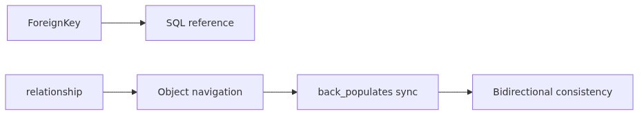
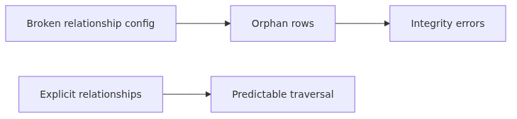
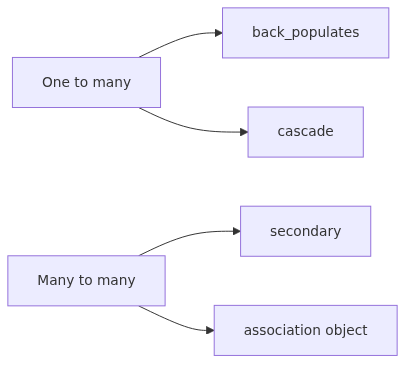
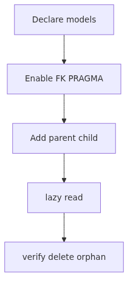

# ORM Relationships: Connecting Both Sides Safely with relationship and back_populates

One of the most common database tasks is "fetch the related rows together": a user's orders, a post's comments, a post tagged with several labels. SQL handles this with JOINs, but in the ORM you express it as attribute access (`user.orders`). The bridge that makes that work is `relationship()`, and `back_populates` is the device that keeps both sides of a bidirectional link consistent. This article walks through one-to-many, many-to-one, and many-to-many in turn, and lays down the patterns that keep both sides synchronized.



*ORM Relationships: connecting both sides safely with relationship and back_populates*
## Questions this post answers

- What does `relationship()` actually do, and how does it relate to `ForeignKey`?
- What is the difference between `back_populates` and `backref`, and why is `back_populates` preferred?
- What happens when you append a new object to `User.orders`?
- How do you define a many-to-many relationship? How does the association table show up in the ORM?
- When is `cascade="all, delete-orphan"` the safe choice?
- When does walking a relationship trigger an extra SELECT?

## Why it matters



*Why it matters*
Misconfigured relationships create a familiar set of bugs:

- "I added an object on one side but the other side's collection doesn't see it." A missing `back_populates` or mismatched names.
- "Deleting the parent left orphan children behind." No cascade policy declared.
- "I assumed a `ForeignKey` was enough, but `user.orders` doesn't work." Foreign keys live at the SQL layer; `relationship` lives at the object layer. You need both.
- "I started with a plain association table for many-to-many, then we needed an extra column and everything got tangled." Reach for the association object pattern earlier.

Relationships are the skeleton of your domain model. Setting them up cleanly the first time pays off in SELECT optimization (Ep7), migrations, and test fixtures.

## Mental Model


*Mental model*
> `ForeignKey` is the SQL-level reference; `relationship()` is the object-level navigation channel. `back_populates` ties both ends of that channel together so a change made on one side is immediately reflected on the other.

```text
User (parent)                           Order (child)
─────────────────                       ─────────────────
id (PK)                                 id (PK)
                                        user_id (FK → users.id)
orders: list[Order]   ←──┐         ┌─→  user: User
                          └─────────┘
                       relationship(back_populates=...)
```

`user.orders.append(order)` (object level) and `order.user_id = user.id` (SQL level) are two ways of stating the same fact at different times. The ORM keeps the two views consistent automatically - but only if both `relationship` declarations are paired with `back_populates`.

## Core concepts



*Core concepts*
### 1) ForeignKey and relationship are a pair

You first need the SQL-level foreign key. Only then does the object-level relationship make sense.

```python
from sqlalchemy import ForeignKey, String
from sqlalchemy.orm import DeclarativeBase, Mapped, mapped_column, relationship

class Base(DeclarativeBase):
    pass

class User(Base):
    __tablename__ = "users"
    id: Mapped[int] = mapped_column(primary_key=True)
    email: Mapped[str] = mapped_column(String(255), unique=True)

    orders: Mapped[list["Order"]] = relationship(back_populates="user")

class Order(Base):
    __tablename__ = "orders"
    id: Mapped[int] = mapped_column(primary_key=True)
    user_id: Mapped[int] = mapped_column(ForeignKey("users.id"))
    amount: Mapped[int] = mapped_column()

    user: Mapped[User] = relationship(back_populates="orders")
```

Two things happen at once:

- `Order.user_id` carries `ForeignKey("users.id")`, which becomes a SQL-level reference (`Base.metadata.create_all` emits a `FOREIGN KEY` clause).
- `User.orders` and `Order.user` are paired via `back_populates`, so a change on either side propagates.

### 2) back_populates vs backref

`backref` lets you declare `relationship` on one side only, and the ORM creates the reverse attribute for you.

```python
class User(Base):
    orders = relationship("Order", backref="user")   # creates Order.user automatically
```

It's terse, but it has two downsides:

- The reverse attribute is implicit, so code-graph tools (mypy, IDEs) struggle to track it.
- When both sides need options (`order_by`, `cascade`, `lazy=...`), you end up wrapping `backref(...)` to split them anyway.

`back_populates` requires an explicit declaration on each side, but the intent is clear and type inference works. New code should prefer `back_populates`.

### 3) Collection mutations and when SQL fires

```python
with Session(engine) as session:
    user = session.get(User, 1)
    new_order = Order(amount=100)
    user.orders.append(new_order)
    session.commit()
```

`user.orders.append(new_order)` does not emit SQL by itself. The ORM marks the change as dirty and emits the INSERT/UPDATE in the right order at `commit()`. Thanks to `back_populates`, `new_order.user` is also wired to point at user automatically.

### 4) Many-to-many: association table or association object

Tag-style many-to-many relationships come in two flavors. The simplest is an association table:

```python
from sqlalchemy import Column, Table

post_tags = Table(
    "post_tags", Base.metadata,
    Column("post_id", ForeignKey("posts.id"), primary_key=True),
    Column("tag_id", ForeignKey("tags.id"), primary_key=True),
)

class Post(Base):
    __tablename__ = "posts"
    id: Mapped[int] = mapped_column(primary_key=True)
    tags: Mapped[list["Tag"]] = relationship(secondary=post_tags, back_populates="posts")

class Tag(Base):
    __tablename__ = "tags"
    id: Mapped[int] = mapped_column(primary_key=True)
    name: Mapped[str] = mapped_column(String(50), unique=True)
    posts: Mapped[list[Post]] = relationship(secondary=post_tags, back_populates="tags")
```

Pointing `secondary=...` at the join table tells the ORM how to JOIN automatically.

When you need extra metadata (when was the tag attached, by whom?), the association object pattern fits better:

```python
class PostTag(Base):
    __tablename__ = "post_tags"
    post_id: Mapped[int] = mapped_column(ForeignKey("posts.id"), primary_key=True)
    tag_id: Mapped[int] = mapped_column(ForeignKey("tags.id"), primary_key=True)
    created_at: Mapped[str] = mapped_column()

    post: Mapped["Post"] = relationship(back_populates="post_tags")
    tag: Mapped["Tag"] = relationship(back_populates="post_tags")
```

Now you handle a list of `PostTag` objects directly, and additional columns live where they belong.

### 5) Cascade policy

```python
class User(Base):
    orders: Mapped[list["Order"]] = relationship(
        back_populates="user",
        cascade="all, delete-orphan",
    )
```

`cascade="all, delete-orphan"` means two things:

- `all`: every operation on User (add/delete/expire/etc.) propagates to the connected Order rows.
- `delete-orphan`: an Order detached from a User (`user.orders.remove(o)`) is automatically deleted.

The most common mistake is forgetting to set cascade on parent-child models. You delete the parent, the child rows survive, and a foreign-key constraint blows up the next SQL. On SQLite, remember that you also need to enable `PRAGMA foreign_keys=ON` for the constraint to fire at all (see Ep2).

## Before-After

### Before: only ForeignKey, walking the graph by hand

```python
def get_user_orders(session, user_id):
    return session.scalars(
        select(Order).where(Order.user_id == user_id)
    ).all()
```

You have to write a fresh SELECT every time, and the parent-child relationship doesn't show up in the code.

### After: relationship expresses the object graph

```python
def get_user_orders(session, user_id):
    user = session.get(User, user_id)
    return user.orders if user else []
```

`user.orders` fires a SELECT the first time you touch it (lazy loading), and within the same Session subsequent reads use the cached collection. The next post (Ep7) walks through how that lazy loading turns into the N+1 problem and how joined/selectin loading prefetches the related rows.

## Step-by-step walkthrough



*Step-by-step walkthrough*
```python
from sqlalchemy import ForeignKey, String, create_engine, event
from sqlalchemy.orm import DeclarativeBase, Mapped, Session, mapped_column, relationship

engine = create_engine("sqlite:///rel_demo.db", echo=True, future=True)

@event.listens_for(engine, "connect")
def _fk_on(dbapi_conn, _):
    cursor = dbapi_conn.cursor()
    cursor.execute("PRAGMA foreign_keys=ON")
    cursor.close()

class Base(DeclarativeBase):
    pass

class User(Base):
    __tablename__ = "users"
    id: Mapped[int] = mapped_column(primary_key=True)
    email: Mapped[str] = mapped_column(String(255), unique=True)
    orders: Mapped[list["Order"]] = relationship(
        back_populates="user", cascade="all, delete-orphan"
    )

class Order(Base):
    __tablename__ = "orders"
    id: Mapped[int] = mapped_column(primary_key=True)
    user_id: Mapped[int] = mapped_column(ForeignKey("users.id"))
    amount: Mapped[int] = mapped_column()
    user: Mapped[User] = relationship(back_populates="orders")

def main() -> None:
    Base.metadata.drop_all(engine)
    Base.metadata.create_all(engine)

    with Session(engine) as session:
        alice = User(email="alice@example.com")
        alice.orders.append(Order(amount=100))
        alice.orders.append(Order(amount=200))
        session.add(alice)
        session.commit()           # User INSERT and two Order INSERTs - order is automatic

    with Session(engine) as session:
        alice = session.scalar(
            select(User).where(User.email == "alice@example.com")
        )
        for o in alice.orders:     # one SELECT on first access (lazy)
            print(o.amount)

        alice.orders.remove(alice.orders[0])
        session.commit()           # delete-orphan removes the first Order

if __name__ == "__main__":
    main()
```

With `echo=True`, you can see exactly which order INSERT/UPDATE/DELETEs are emitted at commit time, and which line triggers the lazy SELECT.

## Common mistakes

### 1) Declaring relationship on only one side

If you define `User.orders` but not `Order.user`, you cannot navigate from order back to user. The same goes the other direction. For bidirectional access, both sides need a `relationship` paired by `back_populates`.

### 2) Mismatched back_populates names

```python
class User(Base):
    orders = relationship(back_populates="customer")   # wrong name

class Order(Base):
    user = relationship(back_populates="orders")
```

The ORM raises an error the first time it builds the mapping. Both `back_populates` values must match the attribute name on the other side exactly.

### 3) Missing ForeignKey

Declaring `relationship` without a `ForeignKey` leaves the ORM with no way to know which column to JOIN on. With multiple foreign keys, you must specify `relationship(..., foreign_keys=[Order.user_id])` explicitly.

### 4) Orphan rows from missing cascade

Deleting a `User` while leaving `Order` rows behind hits a foreign-key error if constraints are on, or leaves dangling rows if they're off. Make `cascade="all, delete-orphan"` your default for parent-child models. Be careful when a child is shared between parents - `delete-orphan` becomes unsafe in that case.

### 5) Sticking with an association table when you need extra columns

A plain association table only fits clean many-to-many mappings. The moment you need columns like "when was the tag attached," migrate to the association object pattern. Starting with the association object up front lowers the cost of change.

## In production

- **Bidirectional sync**: as long as `back_populates` is in place, a change to one collection is reflected on the other side immediately. Trust the automatic sync.
- **Composite-key relationships**: with two-column foreign keys, put a `ForeignKeyConstraint` in `__table_args__` and specify `primaryjoin=...` on the `relationship`.
- **Self-referential**: comment-style parent-child uses `relationship("Comment", remote_side=[Comment.id])` to identify the parent side.
- **Frozen collections for response building**: an explicit `list(user.orders)` before leaving the Session lets you serialize safely after detach.
- **Test fixtures**: get used to the pattern of building only the parent and letting the children be created together. ORM cascades work in fixtures the same way.

## Checklist

- [ ] Both sides declare `relationship` with matching `back_populates`.
- [ ] The child column carries an explicit `ForeignKey`.
- [ ] You considered `cascade="all, delete-orphan"` for parent-child relationships.
- [ ] On SQLite, `PRAGMA foreign_keys=ON` is enabled (Ep2).
- [ ] Many-to-many relationships that may grow extra columns use the association object.
- [ ] Collections used during response building are explicitly converted to lists.

## Exercises

1. Without `cascade="all, delete-orphan"` on `User.orders`, delete a user and observe what happens. How does the result differ when `PRAGMA foreign_keys=ON` is on or off?
2. Define a `Post`-`Tag` many-to-many with an association table, then introduce a "tagged_at" column. Migrate to the association object pattern. How big is the diff?
3. Add `order_by=Order.amount.desc()` to `User.orders`. With `echo=True`, confirm that the SELECT now carries an ORDER BY clause.

<!-- toc:begin -->
## In this series

- [Getting Started with SQLAlchemy 2.x - Engine and Connection Demystified](./01-sqlalchemy-2x-engine-connection.md)
- [SQLAlchemy Core - Modeling Schema as Python Objects with MetaData, Table, and Column](./02-core-metadata-table-types.md)
- [SQLAlchemy Core - select, insert, update, delete in 2.x Style](./03-core-select-insert-update-delete.md)
- [ORM Basics: Defining Models with DeclarativeBase and mapped_column](./04-orm-declarative-mapped-column.md)
- [Session in Depth: How Unit of Work and Identity Map Actually Work](./05-session-unit-of-work-identity-map.md)
- **ORM Relationships: Connecting Both Sides Safely with relationship and back_populates (current)**
- Loading Strategies and the N+1 Problem: When to Pick lazy, joined, or selectin (upcoming)
- Events, hybrid_property, and custom types (upcoming)
- Async SQLAlchemy with aiosqlite and AsyncSession (upcoming)
- Production patterns: pools, observability, migrations, and deploys (upcoming)

<!-- toc:end -->

## References

- [SQLAlchemy 2.x Relationship Configuration](https://docs.sqlalchemy.org/en/20/orm/relationship_api.html)
- [`back_populates` vs `backref`](https://docs.sqlalchemy.org/en/20/orm/backref.html)
- [Many-to-many with association object](https://docs.sqlalchemy.org/en/20/orm/basic_relationships.html#association-object)
- [Cascade options](https://docs.sqlalchemy.org/en/20/orm/cascades.html)

## Summary and what's next

`relationship()` handles object-level navigation and pairs with `ForeignKey` at the SQL level. `back_populates` is the recommended way to wire both ends of a bidirectional link explicitly. One-to-many is the most common shape; many-to-many uses an association table for simple cases and an association object when you need extra columns. Cascade is the safety net for parent-child models, and on SQLite you need the foreign-key PRAGMA in lockstep. Next we examine when relationships, by being lazy, create the N+1 problem - and how joined or selectin loading prefetches related rows efficiently.

Tags: Python, SQLAlchemy, ORM, Database
