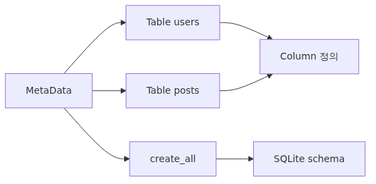
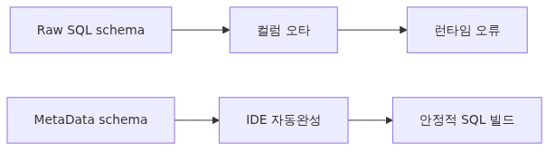
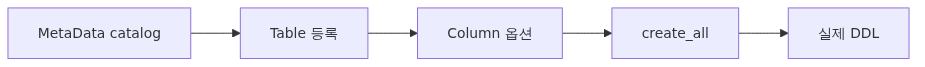
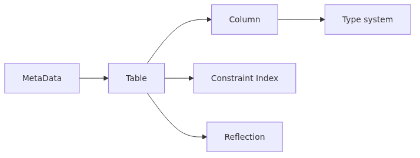
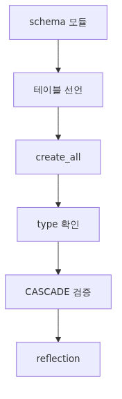

# SQLAlchemy Core - MetaData, Table, Column으로 schema를 Python 객체로 만들기

> SQLAlchemy 101 시리즈 (2/10)

---

1편에서 우리는 Engine과 Connection이 무엇인지, 그리고 raw SQL을 `text()`로 어떻게 실행하는지 보았습니다. 그런데 raw SQL만 쓸 거라면 SQLAlchemy를 쓰는 의미가 절반쯤 사라집니다. SQLAlchemy의 진짜 매력은 schema 자체를 Python 객체로 표현하고, 그 객체로 SQL을 빌드하고, 동일한 schema 정의로 여러 데이터베이스를 지원하는 데 있습니다.

이 글은 SQLAlchemy Core의 핵심인 `MetaData`, `Table`, `Column`, 그리고 type system을 다룹니다. 여기서 만들어 둔 schema 객체는 3편의 select/insert/update/delete의 재료가 되고, 4편 이후 ORM의 `mapped_column`으로 자연스럽게 이어집니다. ORM만 쓸 사람이라도 이 layer를 이해해야 migration이나 reflection 같은 도구를 다룰 수 있습니다.


## 이 글에서 배울 것

- `MetaData` 객체가 무엇이고 왜 schema의 단일 출처(single source of truth)가 되는지
- `Table`을 Python으로 선언하는 방법과 `Column`의 핵심 옵션(primary_key, nullable, unique, index, default, server_default)
- SQLAlchemy의 generic type(`Integer`, `String`, `Text`, `Boolean`, `DateTime`, `Numeric`, `JSON`)이 SQLite에서 어떤 affinity로 매핑되는지
- `metadata.create_all(engine)` / `drop_all(engine)`로 schema를 만들고 지우는 방법
- `ForeignKey`와 `ForeignKeyConstraint`, 그리고 SQLite에서 ON DELETE CASCADE를 동작시키는 조건
- Composite key, named constraint, `Index`를 Python으로 선언하는 방법
- 기존 데이터베이스의 schema를 가져오는 reflection (`Table(..., autoload_with=engine)`)

## 이 글에서 답할 질문

- ORM 없이 Core만 써도 schema 정의가 의미가 있나?
- `MetaData`는 application마다 하나만 있어야 하나, 여러 개도 가능한가?
- `String`과 `Text`는 SQLite에서 어떻게 다른가?
- `default`와 `server_default`의 차이는?
- SQLite에서 `ON DELETE CASCADE`가 안 먹히는 이유는?
- 이미 있는 테이블의 schema를 SQLAlchemy로 읽어들이려면?

## 왜 중요한가


raw SQL로 schema를 관리하면 한 가지 큰 문제가 생깁니다. application code 안의 INSERT/SELECT 문에 적힌 컬럼 이름이 실제 schema와 어긋나도 컴파일 시점에 알 수 없습니다. 운영 중에 갑자기 `no such column` 같은 오류가 발생하고, IDE는 컬럼 이름 자동완성도 해주지 못합니다.

SQLAlchemy Core는 schema를 Python 객체로 들고 있기 때문에 그 객체를 통해 SQL을 빌드할 수 있습니다. 컬럼 이름이 typo라면 import 시점에 `AttributeError`로 잡히고, IDE는 `users.c.name`을 자동완성합니다. 같은 정의가 Alembic의 autogenerate, Pandas의 `read_sql`, FastAPI의 SQL 빌딩에 그대로 재사용됩니다.

또한 SQLite를 비롯한 여러 dialect 사이에서 type을 일관되게 다루려면 generic type system이 필요합니다. `String(255)`라고 적으면 PostgreSQL에서는 `VARCHAR(255)`, SQLite에서는 `VARCHAR(255)`(실은 affinity TEXT)로 풀립니다. 같은 코드가 dev에서는 SQLite, prod에서는 PostgreSQL로 동작할 수 있게 해주는 것이 이 layer의 핵심 가치입니다.

마지막으로 `MetaData`는 Alembic의 `target_metadata`로 그대로 들어가서 migration 자동 생성의 기준이 됩니다. 이 글의 schema 정의가 alembic-101 시리즈의 출발점이 됩니다.

## Mental Model


`MetaData`는 schema의 **카탈로그**입니다. application이 알고 있는 모든 `Table` 정의를 담아 두는 컨테이너이고, 그 컨테이너를 통째로 Engine에 던지면 schema가 만들어지거나 비교됩니다.

> MetaData는 application의 schema 명세서다. Table은 그 명세서의 한 페이지이고, Column은 페이지 안의 한 줄이다. Engine이 없으면 MetaData는 그저 in-memory 명세서일 뿐이고, MetaData가 없으면 Engine은 무엇을 만들어야 할지 알지 못한다.

```
                    MetaData (in-memory catalog)
                         │
        ┌────────────────┼────────────────┐
        ▼                ▼                ▼
    Table("users")  Table("posts")  Table("tags")
        │
   ┌────┼────┐
   ▼    ▼    ▼
  Col  Col  Col
 (id, name, email)
        │
        ▼
  metadata.create_all(engine)
        │
        ▼
   SQLite 파일에 CREATE TABLE 발사
```

Core 단계에서는 다음 흐름이 핵심입니다.

1. `metadata = MetaData()`로 카탈로그를 만든다.
2. `users = Table("users", metadata, Column(...), ...)`로 page를 등록한다(생성 시점에 자동으로 metadata에 붙는다).
3. `metadata.create_all(engine)`로 SQLite 파일에 실제 테이블을 만든다.
4. 이후 코드에서는 `users.c.name`, `users.insert()`, `select(users)` 식으로 Table 객체를 참조해 SQL을 빌드한다.

## 핵심 개념


### MetaData

```python
from sqlalchemy import MetaData

metadata = MetaData()
```

`MetaData()`는 빈 카탈로그를 만듭니다. application 전체에 하나만 두는 것이 일반적이며, 보통 `db.py` 같은 모듈에 module-level 변수로 둡니다. 여러 개를 만드는 것은 schema namespace를 명시적으로 분리하고 싶을 때(예: 다중 schema, plugin 시스템) 유용합니다.

`naming_convention` 인자를 넘기면 자동으로 생성되는 제약조건의 이름 규칙을 통제할 수 있습니다.

```python
metadata = MetaData(
    naming_convention={
        "ix": "ix_%(table_name)s_%(column_0_name)s",
        "uq": "uq_%(table_name)s_%(column_0_name)s",
        "fk": "fk_%(table_name)s_%(column_0_name)s_%(referred_table_name)s",
        "pk": "pk_%(table_name)s",
        "ck": "ck_%(table_name)s_%(constraint_name)s",
    }
)
```

이름 규칙은 Alembic이 ALTER TABLE을 자동 생성할 때 결정적으로 중요합니다. 일관된 이름이 없으면 `DROP CONSTRAINT`이 작동하지 않을 수 있습니다.

### Table과 Column

```python
from sqlalchemy import Table, Column, Integer, String, DateTime
from datetime import datetime, timezone

users = Table(
    "users",
    metadata,
    Column("id", Integer, primary_key=True, autoincrement=True),
    Column("name", String(100), nullable=False),
    Column("email", String(255), nullable=False, unique=True),
    Column("created_at", DateTime, nullable=False, default=lambda: datetime.now(timezone.utc)),
)
```

`Table` 생성자는 첫 번째 인자가 테이블 이름, 두 번째가 `MetaData`, 그 다음부터 가변 길이로 `Column`과 제약조건이 옵니다. `Column`의 핵심 옵션은 다음과 같습니다.

| 옵션 | 의미 |
| --- | --- |
| `primary_key=True` | PK 멤버 |
| `nullable=False` | NOT NULL |
| `unique=True` | UNIQUE 제약 자동 생성 |
| `index=True` | 단일 컬럼 INDEX 자동 생성 |
| `default=value_or_callable` | Python 측 기본값 |
| `server_default=text("...")` | DB 측 DEFAULT 절 |
| `onupdate=value_or_callable` | UPDATE 시 자동 적용 |

`default`와 `server_default`의 차이는 자주 헷갈리니 기억해 둡니다. `default`는 Python이 INSERT를 보낼 때 SQLAlchemy가 채워주는 값이고, `server_default`는 데이터베이스의 `DEFAULT` 절로 들어가서 raw SQL로 INSERT해도 동작합니다. 두 값이 모두 필요한 경우는 거의 없으므로 한 쪽만 정합니다.

### Type system과 SQLite affinity

SQLAlchemy는 generic type을 dialect-specific 타입으로 풀어줍니다. 자주 쓰는 매핑은 다음과 같습니다.

| Generic | SQLite로 풀린 결과 | 비고 |
| --- | --- | --- |
| `Integer` | `INTEGER` | 64-bit |
| `String(n)` | `VARCHAR(n)` (affinity TEXT) | SQLite는 길이를 강제하지 않음 |
| `Text` | `TEXT` | 길이 제한 없음을 명시 |
| `Boolean` | `BOOLEAN` (affinity NUMERIC) | 0/1로 저장 |
| `DateTime` | `DATETIME` (affinity TEXT) | ISO-8601 문자열 |
| `Numeric(precision, scale)` | `NUMERIC` | 부동소수점 회피 |
| `JSON` | `JSON` (1.x 이후 native) | `json_extract()` 사용 가능 |
| `LargeBinary` | `BLOB` | bytes |

SQLite는 type affinity 모델을 쓰기 때문에 컬럼 type이 "강한 약속"이 아니라 "선호도" 정도임을 기억해야 합니다. 그래서 `String(100)`이라고 적어도 길이 100을 초과하는 문자열이 그냥 들어갑니다. 길이를 강제하고 싶다면 application 측에서 검증해야 합니다.

`DateTime`은 SQLite에서 ISO-8601 문자열로 저장되며, timezone-aware datetime을 다루려면 항상 `datetime.now(timezone.utc)`처럼 timezone을 붙여 저장하는 습관이 안전합니다.

### create_all과 drop_all

```python
metadata.create_all(engine)   # 모든 테이블을 CREATE TABLE IF NOT EXISTS로 만든다
metadata.drop_all(engine)     # 의존 순서를 고려해 DROP TABLE
```

`create_all`은 idempotent합니다(`IF NOT EXISTS` 덕분). 하지만 schema가 바뀐 경우 `create_all`은 ALTER TABLE을 만들어주지 않습니다. ALTER가 필요한 변경은 alembic-101 시리즈에서 다룰 migration의 영역입니다.

테스트 환경에서 자주 쓰는 패턴은 다음과 같습니다.

```python
@pytest.fixture
def engine():
    eng = create_engine("sqlite:///:memory:")
    metadata.create_all(eng)
    yield eng
    eng.dispose()
```

### ForeignKey와 SQLite의 함정

```python
from sqlalchemy import ForeignKey

posts = Table(
    "posts",
    metadata,
    Column("id", Integer, primary_key=True),
    Column("user_id", Integer, ForeignKey("users.id", ondelete="CASCADE"), nullable=False),
    Column("title", String(200), nullable=False),
)
```

여기서 함정 하나가 있습니다. SQLite는 기본적으로 foreign key 제약을 강제하지 않으므로, `ondelete="CASCADE"`를 적어도 1편에서 본 `PRAGMA foreign_keys = ON`을 켜지 않으면 동작하지 않습니다. 이 PRAGMA는 connection-scoped이므로 connect event로 매번 적용해야 합니다.

```python
from sqlalchemy import event

@event.listens_for(engine, "connect")
def _enable_fk(dbapi_conn, _):
    cur = dbapi_conn.cursor()
    cur.execute("PRAGMA foreign_keys = ON")
    cur.close()
```

### 복합 제약과 Index

여러 컬럼을 묶는 제약은 `PrimaryKeyConstraint`, `UniqueConstraint`, `ForeignKeyConstraint`, `Index`로 명시적으로 선언합니다.

```python
from sqlalchemy import UniqueConstraint, Index

memberships = Table(
    "memberships",
    metadata,
    Column("user_id", Integer, ForeignKey("users.id"), nullable=False),
    Column("group_id", Integer, ForeignKey("groups.id"), nullable=False),
    Column("role", String(20), nullable=False),
    UniqueConstraint("user_id", "group_id", name="uq_membership_user_group"),
    Index("ix_membership_role", "role"),
)
```

복합 PK가 필요하면 두 컬럼에 모두 `primary_key=True`를 줍니다.

### Reflection

기존 SQLite 파일에 이미 테이블이 있고 그 schema를 가져오고 싶다면 reflection을 씁니다.

```python
from sqlalchemy import Table, MetaData, create_engine

engine = create_engine("sqlite:///legacy.db")
metadata = MetaData()
users = Table("users", metadata, autoload_with=engine)
print([c.name for c in users.columns])
```

전체 schema를 한 번에 reflect하려면 `metadata.reflect(bind=engine)`을 씁니다. legacy 데이터베이스를 점진적으로 SQLAlchemy로 옮길 때 유용합니다.

## Before-After

### Before: 문자열 SQL로 schema 관리

```python
DDL = """
CREATE TABLE IF NOT EXISTS users(
    id INTEGER PRIMARY KEY AUTOINCREMENT,
    name TEXT NOT NULL,
    email TEXT NOT NULL UNIQUE,
    created_at TEXT NOT NULL
);
"""

with engine.begin() as conn:
    conn.execute(text(DDL))

# 다른 곳에서 INSERT
conn.execute(text("INSERT INTO users(name, emai, created_at) VALUES (:n, :e, :c)"),
             {"n": "Alice", "e": "alice@example.com", "c": "..."})
# typo (emai)는 런타임에 OperationalError로 발견된다.
```

### After: MetaData + Table

```python
from sqlalchemy import MetaData, Table, Column, Integer, String, DateTime, insert
from datetime import datetime, timezone

metadata = MetaData()

users = Table(
    "users",
    metadata,
    Column("id", Integer, primary_key=True, autoincrement=True),
    Column("name", String(100), nullable=False),
    Column("email", String(255), nullable=False, unique=True),
    Column("created_at", DateTime, nullable=False,
           default=lambda: datetime.now(timezone.utc)),
)

metadata.create_all(engine)

with engine.begin() as conn:
    conn.execute(insert(users).values(name="Alice", email="alice@example.com"))
    # users.c.emai → AttributeError를 IDE/런타임 양쪽에서 즉시 알려준다
```

이제 컬럼 이름 typo는 schema 정의 시점이나 IDE 자동완성에서 잡힙니다. `users.c.name`을 통해 컬럼을 참조할 수 있고, 같은 schema 객체를 select/insert/update에 모두 재사용합니다.

## 단계별 실습


### 1단계: schema 모듈 만들기

`schema.py`:

```python
from sqlalchemy import (
    MetaData, Table, Column, Integer, String, Text, DateTime, ForeignKey,
    UniqueConstraint, Index,
)
from datetime import datetime, timezone

metadata = MetaData(
    naming_convention={
        "ix": "ix_%(table_name)s_%(column_0_name)s",
        "uq": "uq_%(table_name)s_%(column_0_name)s",
        "fk": "fk_%(table_name)s_%(column_0_name)s_%(referred_table_name)s",
        "pk": "pk_%(table_name)s",
    }
)

users = Table(
    "users", metadata,
    Column("id", Integer, primary_key=True, autoincrement=True),
    Column("name", String(100), nullable=False),
    Column("email", String(255), nullable=False, unique=True),
    Column("created_at", DateTime, nullable=False,
           default=lambda: datetime.now(timezone.utc)),
)

posts = Table(
    "posts", metadata,
    Column("id", Integer, primary_key=True, autoincrement=True),
    Column("user_id", Integer,
           ForeignKey("users.id", ondelete="CASCADE"), nullable=False),
    Column("title", String(200), nullable=False),
    Column("body", Text, nullable=False),
    Column("created_at", DateTime, nullable=False,
           default=lambda: datetime.now(timezone.utc)),
    Index("ix_posts_user_id_created", "user_id", "created_at"),
)
```

### 2단계: schema 적용

```python
from sqlalchemy import create_engine, event
from schema import metadata

engine = create_engine("sqlite:///app.db", echo=True)

@event.listens_for(engine, "connect")
def _enable_fk(dbapi_conn, _):
    cur = dbapi_conn.cursor(); cur.execute("PRAGMA foreign_keys = ON"); cur.close()

metadata.create_all(engine)
```

`echo=True` 덕분에 실제로 발사되는 CREATE TABLE/CREATE INDEX 문을 확인할 수 있습니다.

### 3단계: SQLite의 type affinity 관찰

```python
with engine.connect() as conn:
    rows = conn.execute(text("SELECT name, type FROM pragma_table_info('users')")).all()
    for r in rows:
        print(r.name, r.type)
```

`String(100)`이 `VARCHAR(100)`으로, `DateTime`이 `DATETIME`으로 출력됩니다. 그러나 SQLite는 affinity 모델이라 `VARCHAR(100)`은 길이 제한을 강제하지 않습니다.

### 4단계: ON DELETE CASCADE 검증

```python
from sqlalchemy import insert, delete, select

with engine.begin() as conn:
    uid = conn.execute(insert(users).values(name="Alice", email="a@example.com")).inserted_primary_key[0]
    conn.execute(insert(posts).values(user_id=uid, title="hi", body="hello"))
    conn.execute(delete(users).where(users.c.id == uid))
    remaining = conn.execute(select(posts)).all()
    assert remaining == []
```

`PRAGMA foreign_keys = ON`을 적용하지 않은 Engine으로 같은 코드를 돌리면 마지막 `assert`가 실패합니다. 이 한 줄 차이가 SQLite의 함정을 설명해줍니다.

### 5단계: Reflection

```python
from sqlalchemy import MetaData, Table

reflected = MetaData()
users_r = Table("users", reflected, autoload_with=engine)
print([c.name for c in users_r.columns])
print([(c.name, c.type) for c in users_r.columns])
```

기존 schema를 그대로 가져와 SQL 빌딩에 활용할 수 있습니다.

## 자주 하는 실수

**1. `MetaData`를 함수 안에서 매번 만들기.** Engine과 마찬가지로 module-level 단일 instance여야 합니다. 매번 만들면 같은 테이블 정의가 여러 카탈로그에 흩어져서 reflection·migration 도구가 혼란스러워집니다.

**2. `naming_convention` 없이 시작하기.** Alembic을 도입할 때 큰 고통이 됩니다. SQLAlchemy 도입 첫날부터 naming_convention을 정해두는 것이 정석입니다.

**3. SQLite에서 ON DELETE CASCADE를 적었지만 PRAGMA를 켜지 않기.** 동작하지 않는 silent bug가 됩니다. 1편의 connect event 패턴을 항상 함께 적용합니다.

**4. `default`와 `server_default`를 둘 다 거는 실수.** 두 곳에서 값을 채우면 어디서 채워졌는지 추적하기 어렵고, SQLAlchemy가 INSERT에 보내는 값과 DB가 채워주는 값이 다를 수 있습니다. 한 쪽만 씁니다.

**5. `String(n)`만 적고 SQLite의 affinity를 신뢰하기.** SQLite는 길이를 강제하지 않습니다. 길이 검증은 application 또는 `CHECK` 제약으로 명시해야 합니다.

**6. 모든 `Column`을 `nullable=True`로 두기.** SQLAlchemy의 기본값은 `nullable=True`입니다. 의도적으로 NULL 허용이 아니라면 `nullable=False`를 명시합니다.

## 실무 적용

실무 application에서는 `MetaData`를 단일 모듈에 두고, `Table` 정의를 도메인별로 분리해서 import합니다.

```
app/
  db/
    __init__.py        # metadata, engine, get_conn
    users.py           # users Table 정의
    posts.py           # posts Table 정의
    schema.py          # 위 두 모듈을 import하여 metadata에 자동 등록
```

`schema.py`에서 `from . import users, posts`만 해두면 `Table` 객체가 import 시점에 `metadata`에 자동으로 추가됩니다. 이후 어디서든 `from app.db.schema import metadata`만 하면 전체 schema에 접근할 수 있습니다.

또 하나 자주 쓰는 패턴은 ORM과 Core를 동시에 쓰는 코드베이스에서 동일한 `metadata`를 공유하는 것입니다. ORM declarative base의 `metadata` 속성을 Core `Table`과 같은 객체로 두면, `metadata.create_all(engine)` 한 번으로 두 layer의 모든 테이블이 함께 생성됩니다. 이 패턴은 5편 이후의 ORM 시리즈에서 본격적으로 다룹니다.

Production에서는 `metadata.create_all`을 직접 부르지 않고 Alembic migration으로 schema를 관리하는 편이 안전합니다. 그러나 test fixture, 로컬 dev DB 초기화, demo 환경 등에서는 `create_all`이 여전히 가장 빠른 부트스트랩 방법입니다.

## 체크리스트

- [ ] `MetaData`를 module-level 단일 instance로 두었다
- [ ] `naming_convention`을 첫 단계부터 적용했다
- [ ] 모든 `Column`에 `nullable` 의도를 명시했다
- [ ] `String(n)` vs `Text` 선택 기준을 가지고 있다 (길이 제한 의도 vs 무제한)
- [ ] `default`와 `server_default` 중 하나만 사용한다
- [ ] SQLite에서 `ForeignKey(ondelete=...)`를 쓸 때 `PRAGMA foreign_keys = ON`을 함께 적용했다
- [ ] 복합 제약은 `UniqueConstraint`/`Index`로 명시적으로 선언했다
- [ ] 필요시 `autoload_with=engine`으로 reflection이 가능하다는 것을 안다

## 연습 문제

1. `MetaData`를 만들고 `users(id, name, email)`, `posts(id, user_id FK→users.id, title, body)` 두 테이블을 정의하세요. `metadata.create_all(engine)`로 SQLite 파일에 만든 뒤, `pragma_table_info`로 컬럼과 type을 출력하세요.
2. 같은 schema에서 `posts.user_id`에 `ondelete="CASCADE"`를 적용하세요. PRAGMA를 켠 Engine과 끄지 않은 Engine 두 개로 부모 row를 DELETE하고, 자식 row가 어떻게 다르게 다뤄지는지 비교하세요.
3. `naming_convention`을 적용한 `MetaData`와 적용하지 않은 `MetaData`로 같은 schema를 만들어, 자동 생성되는 INDEX와 UNIQUE 제약 이름이 어떻게 다른지 `sqlite_master` 테이블에서 확인하세요.
4. 기존 SQLite 파일에 raw SQL로 `CREATE TABLE legacy(id INTEGER PRIMARY KEY, payload TEXT)`를 만들고, SQLAlchemy의 `Table("legacy", metadata, autoload_with=engine)`로 schema를 reflect하세요. reflect한 `Table` 객체를 사용해 row를 INSERT하고 SELECT하세요.

## 정리·다음 글

이 글에서 우리는 SQLAlchemy Core의 schema layer를 만났습니다. `MetaData`는 application 전체 schema의 카탈로그이고, `Table`/`Column`은 그 카탈로그의 항목이며, generic type system은 SQLite의 affinity 모델 위에서 동작합니다. `create_all`/`drop_all`로 빠르게 schema를 부트스트랩할 수 있고, reflection으로 기존 데이터베이스를 SQLAlchemy 세계로 끌어올 수 있습니다.

다음 글에서는 이 schema 객체로 본격적으로 SQL을 빌드합니다. `select()`, `insert()`, `update()`, `delete()`의 2.x style을 다루고, `Result`와 `Row`를 다루는 법을 정리합니다. 그 다음 4편부터 ORM이 등장하는데, 거기서 보게 될 `mapped_column`은 사실 이 글의 `Column`과 거의 같은 객체입니다.

<!-- toc:begin -->
## 시리즈 목차

- [SQLAlchemy 2.x 시작하기 - Engine과 Connection의 본질](./01-sqlalchemy-2x-engine-connection.md)
- **SQLAlchemy Core - MetaData, Table, Column으로 schema를 Python 객체로 만들기 (현재 글)**
- SQLAlchemy Core - select·insert·update·delete를 2.x style로 다루기 (예정)
- ORM 기초: DeclarativeBase와 mapped_column으로 모델 정의하기 (예정)
- Session 깊이 보기: Unit of Work와 Identity Map의 동작 원리 (예정)
- ORM Relationships: relationship과 back_populates로 양방향 탐색 안전하게 잇기 (예정)
- 로딩 전략과 N+1 문제: lazy/joined/selectin을 언제 골라야 하는가 (예정)
- 이벤트, hybrid_property, 그리고 커스텀 타입 (예정)
- 비동기 SQLAlchemy: aiosqlite와 AsyncSession (예정)
- production 패턴: 풀, 관측, 마이그레이션, 배포 (예정)

<!-- toc:end -->

## 참고 자료

- [SQLAlchemy 2.x - Working with Database Metadata](https://docs.sqlalchemy.org/en/20/tutorial/metadata.html)
- [SQLAlchemy 2.x - Column and Data Types](https://docs.sqlalchemy.org/en/20/core/types.html)
- [SQLAlchemy 2.x - Constraints and Indexes](https://docs.sqlalchemy.org/en/20/core/constraints.html)
- [SQLAlchemy 2.x - Reflecting Database Objects](https://docs.sqlalchemy.org/en/20/core/reflection.html)
- [SQLite Datatypes In SQLite Version 3](https://www.sqlite.org/datatype3.html)

Tags: Python, SQLAlchemy, ORM, Database
