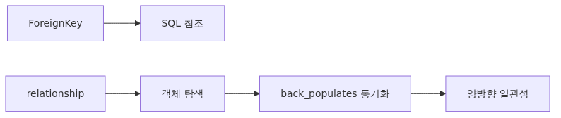
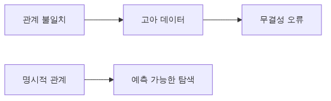
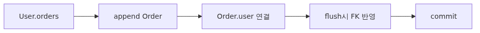
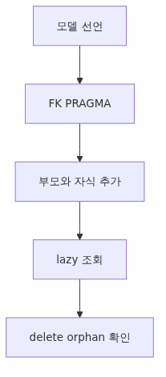

# ORM 관계 매핑: relationship과 back_populates로 양방향 탐색 안전하게 잇기

관계형 데이터베이스를 다룬다면 결국 "연결된 행을 함께 읽고 함께 수정하는 문제"를 피할 수 없습니다. SQL에서는 JOIN으로 풀지만, ORM에서는 객체 그래프를 어떻게 안전하게 표현하느냐가 더 중요한 질문이 됩니다.

이 글은 SQLAlchemy 101 시리즈의 여섯 번째 글입니다. 여기서는 `relationship()`과 `back_populates`를 이용해 일대다, 다대일, 다대다 관계를 어떻게 정의하는지 정리합니다.

중요한 점은 외래키와 관계 속성이 같은 역할이 아니라는 사실입니다. `ForeignKey`는 SQL 레벨의 참조를, `relationship()`은 Python 객체 레벨의 탐색을 맡습니다. 둘이 어떻게 맞물리는지 이해해야 이후 로딩 전략과 cascade 정책도 덜 헷갈립니다.



*ORM 관계 매핑: relationship과 back_populates로 양방향 탐색 안전하게 잇기*

## 이 글에서 다룰 문제

- `ForeignKey`와 `relationship()`은 왜 항상 한 쌍처럼 이해해야 할까요?
- `back_populates`와 `backref`는 어떤 기준으로 선택할까요?
- 컬렉션 조작, flush, SQL 실행 시점은 어떻게 연결될까요?
- 다대다에서는 association table과 association object 중 언제 갈릴까요?
- cascade 설정이 빠지면 어떤 고아 데이터 문제가 생길까요?

## 왜 중요한가



*핵심 개념*
관계 정의가 어긋나면 다음과 같은 문제가 자주 생깁니다.

- "한쪽에서 객체를 추가했는데 다른 쪽 컬렉션에는 보이지 않습니다." → `back_populates`가 빠졌거나 양쪽 정의가 일치하지 않습니다.
- "삭제한 부모 행이 자식 행을 끌고 가지 않아 고아 데이터가 남습니다." → cascade 정책이 명시되지 않았습니다.
- "ForeignKey만 정의하면 충분한 줄 알았는데, ORM 코드에서 `user.orders`를 못 씁니다." → 외래키는 SQL 레벨, `relationship`은 객체 레벨입니다. 둘은 같이 정의해야 합니다.
- "다대다를 dict 형태의 association table로 만들었는데, 추가 컬럼이 필요해지자 복잡해졌습니다." → 처음부터 `Association object` 패턴을 쓰는 편이 안전합니다.

관계는 도메인 모델의 골격입니다. 처음에 깔끔하게 잡아 두면 이후 SELECT 패턴 최적화(Ep7), 마이그레이션, 테스트 fixture까지 모두 단순해집니다.

## 멘탈 모델



*멘탈 모델*
> `ForeignKey`는 SQL 레벨의 참조이고, `relationship()`은 객체 레벨의 탐색 통로입니다. `back_populates`는 양방향 통로의 두 끝을 연결해 "한쪽에서 바뀐 컬렉션이 다른 쪽에서도 즉시 반영"되게 만드는 장치입니다.

```text
User (parent)                           Order (child)
─────────────────                       ─────────────────
id (PK)                                 id (PK)
                                        user_id (FK → users.id)
orders: list[Order]   ←──┐         ┌─→  user: User
                          └─────────┘
                       relationship(back_populates=...)
```

객체 레벨에서 `user.orders.append(order)`와 SQL 레벨에서 `order.user_id = user.id`는 같은 사실을 다른 시점에 표현합니다. ORM은 양쪽이 일관되도록 자동으로 동기화해 줍니다 — 단, 두 `relationship` 선언이 `back_populates`로 짝지어져 있을 때만 그렇습니다.

## 핵심 개념


*핵심 개념*
### 1) ForeignKey와 relationship은 한 쌍

먼저 SQL 레벨의 외래키를 정의해야 객체 레벨의 관계가 의미를 갖습니다.

```python
from sqlalchemy import ForeignKey, String
from sqlalchemy.orm import DeclarativeBase, Mapped, mapped_column, relationship

class Base(DeclarativeBase):
    pass

class User(Base):
    __tablename__ = "users"
    id: Mapped[int] = mapped_column(primary_key=True)
    email: Mapped[str] = mapped_column(String(255), unique=True)

    orders: Mapped[list["Order"]] = relationship(back_populates="user")

class Order(Base):
    __tablename__ = "orders"
    id: Mapped[int] = mapped_column(primary_key=True)
    user_id: Mapped[int] = mapped_column(ForeignKey("users.id"))
    amount: Mapped[int] = mapped_column()

    user: Mapped[User] = relationship(back_populates="orders")
```

여기서 두 가지가 동시에 일어납니다.

- `Order.user_id`에 `ForeignKey("users.id")`가 붙어 SQL 레벨의 참조가 만들어집니다 (`Base.metadata.create_all` 시 `FOREIGN KEY` 절 생성).
- `User.orders`와 `Order.user`가 `back_populates`로 짝지어져, 한쪽 변경이 다른 쪽에도 반영됩니다.

### 2) back_populates vs backref

`backref`는 한쪽에만 `relationship`을 선언해 두면 ORM이 알아서 반대쪽 속성을 만들어 주는 약식입니다.

```python
class User(Base):
    orders = relationship("Order", backref="user")   # 자동으로 Order.user 생성
```

편하지만 두 가지 단점이 있습니다.

- 반대편 속성이 정의가 흩어져 있어 코드 그래프 도구(mypy, IDE)가 추적하기 어렵습니다.
- 양쪽 모두에 옵션이 필요한 경우(`order_by`, `cascade`, `lazy=...` 등)에는 결국 `backref(...)`로 다시 쪼개야 합니다.

`back_populates`는 두 쪽 모두에 명시적으로 선언해야 하지만 의도가 명확하고, 타입 추론도 잘 동작합니다. 신규 코드는 `back_populates`를 권장합니다.

### 3) 컬렉션 조작과 SQL 발사 시점

```python
with Session(engine) as session:
    user = session.get(User, 1)
    new_order = Order(amount=100)
    user.orders.append(new_order)
    session.commit()
```

`user.orders.append(new_order)` 시점에는 SQL이 나가지 않습니다. ORM은 이 변경을 dirty로 표시하고 `commit()` 직전에 두 개의 INSERT/UPDATE를 적절한 순서로 발사합니다. 동시에 `back_populates` 덕분에 `new_order.user`도 자동으로 user를 가리키도록 설정됩니다.

### 4) 다대다는 association table 또는 association object로

태그처럼 양쪽이 다대다인 관계는 두 가지 방식이 있습니다.

먼저 단순한 association table입니다.

```python
from sqlalchemy import Column, Table

post_tags = Table(
    "post_tags", Base.metadata,
    Column("post_id", ForeignKey("posts.id"), primary_key=True),
    Column("tag_id", ForeignKey("tags.id"), primary_key=True),
)

class Post(Base):
    __tablename__ = "posts"
    id: Mapped[int] = mapped_column(primary_key=True)
    tags: Mapped[list["Tag"]] = relationship(secondary=post_tags, back_populates="posts")

class Tag(Base):
    __tablename__ = "tags"
    id: Mapped[int] = mapped_column(primary_key=True)
    name: Mapped[str] = mapped_column(String(50), unique=True)
    posts: Mapped[list[Post]] = relationship(secondary=post_tags, back_populates="tags")
```

`secondary=...`로 중간 테이블을 가리키면 ORM이 JOIN을 자동으로 만들어 줍니다.

추가 메타데이터(예: 태그가 달린 시각, 누가 달았는지 등)가 필요해지면 association object 패턴이 자연스럽습니다.

```python
class PostTag(Base):
    __tablename__ = "post_tags"
    post_id: Mapped[int] = mapped_column(ForeignKey("posts.id"), primary_key=True)
    tag_id: Mapped[int] = mapped_column(ForeignKey("tags.id"), primary_key=True)
    created_at: Mapped[str] = mapped_column()

    post: Mapped["Post"] = relationship(back_populates="post_tags")
    tag: Mapped["Tag"] = relationship(back_populates="post_tags")
```

이 경우 `Post.post_tags`로 PostTag 객체 목록을 직접 다루며, 추가 컬럼을 자유롭게 활용할 수 있습니다.

### 5) cascade 정책

```python
class User(Base):
    orders: Mapped[list["Order"]] = relationship(
        back_populates="user",
        cascade="all, delete-orphan",
    )
```

`cascade="all, delete-orphan"`은 두 가지를 의미합니다.

- `all`: User에 대한 add/delete/expire 등 모든 작업이 연결된 Order에도 전파됩니다.
- `delete-orphan`: User에서 떨어진(`user.orders.remove(o)`) Order는 자동으로 삭제됩니다.

가장 흔한 실수는 부모-자식 모델에서 cascade를 빼두는 것입니다. 부모를 삭제했는데 자식이 살아남아 외래키 무결성 오류로 SQL이 실패하는 경우가 잦습니다. SQLite에서는 별도로 `PRAGMA foreign_keys=ON`을 켜야 외래키 제약 자체가 동작한다는 점도 함께 기억해 두십시오 (Ep2).

## 이전 방식과 개선 방식

### 이전: ForeignKey만 두고 객체 탐색을 손으로 처리

```python
def get_user_orders(session, user_id):
    return session.scalars(
        select(Order).where(Order.user_id == user_id)
    ).all()
```

매번 새 SELECT를 작성해야 하고, 부모-자식 관계가 코드에 드러나지 않습니다.

### 개선 후: relationship으로 객체 그래프 표현

```python
def get_user_orders(session, user_id):
    user = session.get(User, user_id)
    return user.orders if user else []
```

`user.orders`는 처음 접근하는 순간 SELECT가 한 번 발사되고(lazy 로딩), 이후 같은 Session 안에서는 캐시된 컬렉션을 그대로 사용합니다. 다음 글(Ep7)에서 이 lazy 로딩이 N+1 문제로 이어지는 시점과, joined/selectin 로딩으로 어떻게 미리 끌어오는지를 다룹니다.

## 단계별 실습



*단계별 실습*
```python
from sqlalchemy import ForeignKey, String, create_engine, event
from sqlalchemy.orm import DeclarativeBase, Mapped, Session, mapped_column, relationship

engine = create_engine("sqlite:///rel_demo.db", echo=True, future=True)

@event.listens_for(engine, "connect")
def _fk_on(dbapi_conn, _):
    cursor = dbapi_conn.cursor()
    cursor.execute("PRAGMA foreign_keys=ON")
    cursor.close()

class Base(DeclarativeBase):
    pass

class User(Base):
    __tablename__ = "users"
    id: Mapped[int] = mapped_column(primary_key=True)
    email: Mapped[str] = mapped_column(String(255), unique=True)
    orders: Mapped[list["Order"]] = relationship(
        back_populates="user", cascade="all, delete-orphan"
    )

class Order(Base):
    __tablename__ = "orders"
    id: Mapped[int] = mapped_column(primary_key=True)
    user_id: Mapped[int] = mapped_column(ForeignKey("users.id"))
    amount: Mapped[int] = mapped_column()
    user: Mapped[User] = relationship(back_populates="orders")

def main() -> None:
    Base.metadata.drop_all(engine)
    Base.metadata.create_all(engine)

    with Session(engine) as session:
        alice = User(email="alice@example.com")
        alice.orders.append(Order(amount=100))
        alice.orders.append(Order(amount=200))
        session.add(alice)
        session.commit()           # User INSERT, Order INSERT 두 건 — 순서 자동 결정

    with Session(engine) as session:
        alice = session.scalar(
            select(User).where(User.email == "alice@example.com")
        )
        for o in alice.orders:     # 첫 접근에서 SELECT 한 번 (lazy)
            print(o.amount)

        alice.orders.remove(alice.orders[0])
        session.commit()           # delete-orphan 덕분에 첫 Order가 삭제됨

if __name__ == "__main__":
    main()
```

`echo=True`로 켠 채 실행하면 commit 시점에 INSERT/UPDATE/DELETE가 어떤 순서로 나가는지, lazy 로딩이 어느 줄에서 SELECT를 발사하는지를 직접 확인할 수 있습니다.

## 자주 하는 실수

### 1) 한쪽에만 relationship 선언

`User.orders`만 정의하고 `Order.user`를 빠뜨리면, `order.user`로 부모를 거꾸로 탐색할 수 없습니다. 반대도 마찬가지입니다. 양방향이 필요하면 두 쪽 모두에 `relationship` + `back_populates`를 선언해야 합니다.

### 2) back_populates 이름 불일치

```python
class User(Base):
    orders = relationship(back_populates="customer")   # 잘못된 이름

class Order(Base):
    user = relationship(back_populates="orders")
```

ORM은 매핑을 처음 사용하는 순간 검증하면서 에러를 띄웁니다. 양쪽의 `back_populates` 값이 정확히 상대편 속성 이름과 일치해야 합니다.

### 3) ForeignKey 누락

`relationship`만 선언하고 `ForeignKey`를 안 붙이면, ORM이 어느 컬럼을 매개로 JOIN할지 모릅니다. 다중 외래키 상황에서는 `relationship(..., foreign_keys=[Order.user_id])`로 명시해야 합니다.

### 4) cascade 미설정으로 고아 데이터

`User`를 삭제했는데 `Order`가 남아 있으면 외래키 제약을 켠 상태에서는 SQL 오류, 끄면 dangling 행이 남습니다. `cascade="all, delete-orphan"`을 권장 패턴으로 두십시오. 단, 자식이 다른 부모와도 공유되는 모델에서는 `delete-orphan`이 위험할 수 있으니 도메인을 먼저 살펴야 합니다.

### 5) 다대다에 추가 컬럼이 필요한데 association table을 고집

association table은 단순 다대다 매핑에만 적합합니다. "언제 태그가 달렸는가" 같은 컬럼이 필요해지면 association object 패턴으로 마이그레이션해야 합니다. 처음부터 association object로 시작하는 편이 변경 비용을 줄여 줍니다.

## 실무에서 자주 만나는 상황

- **양방향 동기화**: `back_populates`가 있는 한, 한쪽에서 컬렉션을 변경하면 다른 쪽도 즉시 반영됩니다. 이 자동 동기화를 신뢰해도 좋습니다.
- **복합 키 관계**: 외래키가 두 컬럼이라면 `ForeignKeyConstraint`를 `__table_args__`에 두고, `relationship` 측에서 `primaryjoin=...`을 명시하는 패턴이 많습니다.
- **자기 참조**: 댓글의 부모-자식처럼 같은 테이블을 참조하는 경우 `relationship("Comment", remote_side=[Comment.id])`로 부모 쪽 식별을 해 줘야 합니다.
- **동결된 컬렉션 가져오기**: 응답 직전에 `list(user.orders)`로 명시적 변환을 두면 detached 후에도 안전하게 직렬화할 수 있습니다.
- **테스트 fixture**: 부모만 만들어 자식을 함께 채우는 패턴이 익숙해지면 fixture 코드가 단순해집니다. ORM의 cascade는 fixture에서도 그대로 동작합니다.

## 체크리스트

- [ ] 양쪽 모두에 `relationship` + `back_populates`가 있는가?
- [ ] 자식 쪽 컬럼에 `ForeignKey`가 명시되어 있는가?
- [ ] 부모-자식 관계라면 `cascade="all, delete-orphan"`을 검토했는가?
- [ ] SQLite를 쓴다면 `PRAGMA foreign_keys=ON`이 켜져 있는가? (Ep2)
- [ ] 다대다 관계에 추가 컬럼이 생길 가능성이 있다면 association object를 고려했는가?
- [ ] 컬렉션을 응답 단계에서 활용한다면 미리 list로 변환했는가?

<!-- toc:begin -->
## 시리즈 목차

- [SQLAlchemy 2.x 시작하기 - Engine과 Connection의 본질](./01-sqlalchemy-2x-engine-connection.md)
- [SQLAlchemy Core - MetaData, Table, Column으로 schema를 Python 객체로 만들기](./02-core-metadata-table-types.md)
- [SQLAlchemy Core - select·insert·update·delete를 2.x style로 다루기](./03-core-select-insert-update-delete.md)
- [ORM 기초: DeclarativeBase와 mapped_column으로 모델 정의하기](./04-orm-declarative-mapped-column.md)
- [Session 깊이 보기: Unit of Work와 Identity Map의 동작 원리](./05-session-unit-of-work-identity-map.md)
- **ORM 관계 매핑: relationship과 back_populates로 양방향 탐색 안전하게 잇기 (현재 글)**
- 로딩 전략과 N+1 문제: lazy/joined/selectin을 언제 골라야 하는가 (예정)
- 이벤트, hybrid_property, 그리고 커스텀 타입 (예정)
- 비동기 SQLAlchemy: aiosqlite와 AsyncSession (예정)
- 프로덕션 패턴: 풀, 관측, 마이그레이션, 배포 (예정)

<!-- toc:end -->

## 참고 자료

- [SQLAlchemy 2.x Relationship Configuration](https://docs.sqlalchemy.org/en/20/orm/relationship_api.html)
- [`back_populates` vs `backref`](https://docs.sqlalchemy.org/en/20/orm/backref.html)
- [Many-to-many with association object](https://docs.sqlalchemy.org/en/20/orm/basic_relationships.html#association-object)
- [Cascade options](https://docs.sqlalchemy.org/en/20/orm/cascades.html)

## 정리와 다음 글

`relationship()`은 객체 레벨에서 관계 탐색을 담당하고, SQL 레벨의 `ForeignKey`와 짝을 이뤄 동작합니다. `back_populates`는 양방향 관계의 두 끝을 명시적으로 잇는 권장 패턴입니다. 일대다는 가장 흔한 형태이고, 다대다는 단순할 때 association table, 추가 컬럼이 필요할 때 association object로 표현합니다. cascade 정책은 부모-자식 관계의 안전망이고, SQLite에서는 외래키 PRAGMA가 함께 켜져야 합니다. 다음 글에서는 이 관계가 lazy 로딩으로 인해 N+1 문제를 만드는 시점을 살펴보고, joined/selectin 로딩으로 어떻게 미리 끌어오는지를 다룹니다.

Tags: Python, SQLAlchemy, ORM, Database
