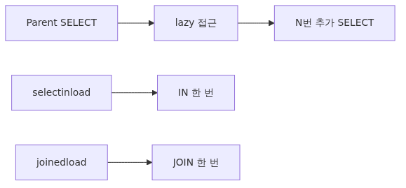
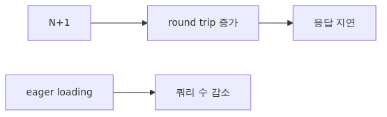
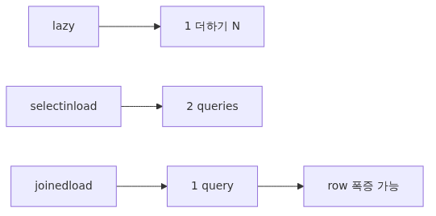
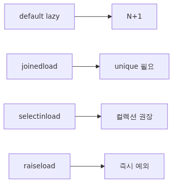
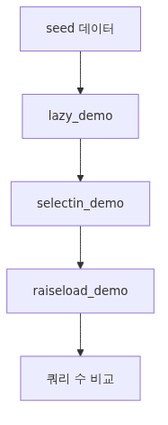

# 로딩 전략과 N+1 문제: lazy/joined/selectin을 언제 골라야 하는가

ORM이 가장 많이 욕을 먹는 지점은 늘 같습니다. "왜 SELECT가 100번 나가나요?" 답은 보통 N+1 쿼리 패턴입니다. Ep6에서 다룬 `relationship`은 기본적으로 lazy 로딩으로 동작하기 때문에, 부모 컬렉션 안의 N개 객체에 대해 자식 속성을 접근하면 자식을 가져오는 SELECT가 N번 추가로 발사됩니다. 이번 글에서는 N+1이 실제로 어떻게 만들어지는지 echo 로그로 직접 확인하고, `joinedload`, `selectinload`, `raiseload` 같은 도구로 어떻게 막거나 노출시키는지 정리합니다.


## 이 글에서 답할 질문

- N+1 쿼리 패턴은 정확히 어떤 코드가 만들어 냅니까?
- `lazy="select"`(기본값)와 `joinedload`, `selectinload`는 SQL 측면에서 어떻게 다릅니까?
- 컬렉션(일대다, 다대다) 로딩에는 왜 보통 `selectinload`가 더 안전합니까?
- `joinedload`가 만들어 내는 row 폭증(cartesian) 문제는 어떻게 인식합니까?
- 운영 환경에서 N+1을 자동으로 잡으려면 어떤 도구를 사용해야 합니까?
- `lazy="raise"`는 언제 켜야 하고 어떤 부작용이 있습니까?

## 왜 중요한가


ORM의 lazy 로딩은 코드 가독성을 높여 줍니다. `user.orders`라고 적기만 하면 알아서 SELECT가 발사됩니다. 그러나 이 편리함이 종종 운영 환경에서 100배 가까운 SELECT 폭증을 만듭니다.

- 100명의 사용자를 가져와 각 사용자의 마지막 주문 시각을 출력하는 핸들러: 1 + 100 = 101 SELECT.
- 게시글 목록 50건과 각 게시글의 태그를 보여 주는 응답: 1 + 50 = 51 SELECT.
- 운영 모니터링 도구가 "이 엔드포인트는 평균 80개 쿼리를 사용합니다"라고 경고를 보내는 시점이 N+1을 알아차리는 가장 흔한 순간입니다.

이 패턴은 디스크 IO나 네트워크 round-trip 비용이 누적되어, 단일 쿼리로 처리하면 5ms일 작업이 800ms로 늘어나는 식의 회귀를 만듭니다. 그리고 SQLite처럼 단일 파일 기반 엔진에서도 락 경합과 트랜잭션 크기에 영향을 주기 때문에 지역 개발 환경에서도 무시할 수 없는 문제입니다.

## Mental Model


> "관계 속성에 처음 접근하면 SELECT가 한 번 발사된다." 이 한 문장이 lazy 로딩의 전부입니다. N+1은 이 한 문장이 N번 반복될 때 일어납니다. `joinedload`는 부모 SELECT에 LEFT JOIN을 붙여 한 번에 가져오는 전략, `selectinload`는 부모를 먼저 가져온 뒤 자식들을 IN(...) 한 방으로 가져오는 전략입니다.

```
lazy (default):    SELECT users         (1)
                   SELECT orders WHERE user_id = ?   ← 사용자 1번
                   SELECT orders WHERE user_id = ?   ← 사용자 2번
                   ... (총 N번)

selectinload:      SELECT users         (1)
                   SELECT orders WHERE user_id IN (1, 2, ...)   (1)

joinedload:        SELECT users LEFT OUTER JOIN orders ...      (1)
```

쿼리 횟수만 보면 joinedload가 항상 좋아 보이지만, 컬렉션 측면(일대다)에서는 row가 부모×자식 조합으로 폭증할 수 있어 traffic이 오히려 늘어납니다. 그래서 컬렉션은 보통 `selectinload`를 권장합니다.

## 핵심 개념


### 1) 기본 lazy 로딩이 만드는 N+1

```python
with Session(engine) as session:
    users = session.scalars(select(User)).all()      # SELECT users
    for u in users:
        for o in u.orders:                           # SELECT orders WHERE user_id = ? × N
            print(u.email, o.amount)
```

`u.orders`에 처음 접근하는 순간마다 SELECT가 발사됩니다. 이것이 정확히 N+1 패턴입니다.

### 2) joinedload: LEFT JOIN으로 한 번에

```python
from sqlalchemy.orm import joinedload

stmt = select(User).options(joinedload(User.orders))
users = session.scalars(stmt).unique().all()
```

ORM은 다음과 같은 SQL을 만듭니다.

```sql
SELECT users.id, users.email, orders.id, orders.user_id, orders.amount
FROM users
LEFT OUTER JOIN orders ON users.id = orders.user_id
```

한 SELECT로 부모와 자식을 동시에 가져옵니다. 다만 일대다 관계에서는 부모 행이 자식 수만큼 중복되기 때문에, `unique()`를 호출해 ORM이 부모를 1개씩으로 합쳐 주도록 해야 합니다. 자식 컬렉션이 50건씩 달려 있다면 한 부모에 대해 50개 row가 만들어지므로, traffic 측면에서 손해일 수 있습니다.

### 3) selectinload: IN(...) 한 방으로

```python
from sqlalchemy.orm import selectinload

stmt = select(User).options(selectinload(User.orders))
users = session.scalars(stmt).all()
```

ORM은 두 개의 SELECT만 사용합니다.

```sql
SELECT users.id, users.email FROM users
SELECT orders.id, orders.user_id, orders.amount
FROM orders WHERE orders.user_id IN (1, 2, 3, ...)
```

부모 row 중복이 없고, 자식이 한 번의 IN 쿼리로 깔끔하게 묶입니다. 일대다 컬렉션에는 보통 이 전략이 가장 효율적입니다.

### 4) 어떤 전략을 언제 쓰는가

| 상황 | 권장 전략 | 이유 |
| --- | --- | --- |
| 다대일/일대일 (자식 → 부모) | `joinedload` | LEFT JOIN으로 한 row에 함께 묶임. 폭증 위험 없음. |
| 일대다 (부모 → 자식 컬렉션) | `selectinload` | IN 묶음 1회. row 폭증 회피. |
| 다대다 | `selectinload` | 위와 동일. |
| 큰 자식 컬렉션을 페이지네이션 | lazy + 별도 SELECT | 부모만 미리 가져오고, 자식은 명시적 SELECT로 LIMIT/OFFSET. |

`subqueryload`도 존재하지만, 모던 코드는 거의 항상 `selectinload`로 충분합니다.

### 5) raiseload로 N+1을 즉시 노출시키기

```python
from sqlalchemy.orm import raiseload

stmt = select(User).options(raiseload(User.orders))
users = session.scalars(stmt).all()
for u in users:
    print(u.orders)        # InvalidRequestError 발생
```

`raiseload`는 lazy 로딩을 금지합니다. 명시적으로 eager 로딩을 적지 않은 상태에서 자식 속성에 접근하면 즉시 예외가 납니다. 테스트 환경 또는 특정 핸들러에서 N+1을 사전에 잡고 싶을 때 유용합니다.

또는 모델 정의 단계에서 `relationship(..., lazy="raise")`로 설정해 두면 해당 관계에 한해 항상 eager 로딩을 강제할 수 있습니다.

## Before-After

### Before: lazy 로딩으로 N+1 발생

```python
with Session(engine) as session:
    users = session.scalars(select(User).limit(50)).all()
    return [
        {"email": u.email, "orders": [o.amount for o in u.orders]}
        for u in users
    ]
# echo 결과: SELECT users 1번 + SELECT orders WHERE user_id = ? 50번 = 51 SELECT
```

### After: selectinload 한 줄 추가

```python
with Session(engine) as session:
    stmt = select(User).options(selectinload(User.orders)).limit(50)
    users = session.scalars(stmt).all()
    return [
        {"email": u.email, "orders": [o.amount for o in u.orders]}
        for u in users
    ]
# echo 결과: SELECT users 1번 + SELECT orders WHERE user_id IN (...) 1번 = 2 SELECT
```

`options(selectinload(...))` 한 줄로 51 → 2 SELECT가 됩니다. 이 차이가 운영 환경에서 응답시간 5배~50배 개선으로 이어집니다.

## 단계별 실습


```python
from sqlalchemy import ForeignKey, String, create_engine, select
from sqlalchemy.orm import (
    DeclarativeBase, Mapped, Session,
    mapped_column, relationship, selectinload, joinedload, raiseload,
)

engine = create_engine("sqlite:///loader_demo.db", echo=True, future=True)

class Base(DeclarativeBase):
    pass

class User(Base):
    __tablename__ = "users"
    id: Mapped[int] = mapped_column(primary_key=True)
    email: Mapped[str] = mapped_column(String(255), unique=True)
    orders: Mapped[list["Order"]] = relationship(back_populates="user")

class Order(Base):
    __tablename__ = "orders"
    id: Mapped[int] = mapped_column(primary_key=True)
    user_id: Mapped[int] = mapped_column(ForeignKey("users.id"))
    amount: Mapped[int] = mapped_column()
    user: Mapped[User] = relationship(back_populates="orders")

def seed():
    Base.metadata.drop_all(engine)
    Base.metadata.create_all(engine)
    with Session(engine) as s:
        for i in range(5):
            u = User(email=f"u{i}@example.com")
            for j in range(3):
                u.orders.append(Order(amount=10 * (j + 1)))
            s.add(u)
        s.commit()

def lazy_demo():
    print("--- lazy (default) ---")
    with Session(engine) as s:
        users = s.scalars(select(User)).all()
        for u in users:
            for o in u.orders:
                pass            # SELECT N번 발사

def selectin_demo():
    print("--- selectinload ---")
    with Session(engine) as s:
        users = s.scalars(select(User).options(selectinload(User.orders))).all()
        for u in users:
            for o in u.orders:
                pass            # SELECT 2번만 사용

def raiseload_demo():
    print("--- raiseload ---")
    with Session(engine) as s:
        users = s.scalars(select(User).options(raiseload(User.orders))).all()
        try:
            users[0].orders         # InvalidRequestError
        except Exception as e:
            print("blocked:", type(e).__name__)

if __name__ == "__main__":
    seed()
    lazy_demo()
    selectin_demo()
    raiseload_demo()
```

`echo=True`로 켠 채 실행하면, lazy_demo는 약 6번의 SELECT, selectin_demo는 2번의 SELECT만 발사하는 모습을 확인할 수 있습니다. raiseload_demo는 자식 속성 접근 시점에 즉시 예외가 납니다.

## 자주 하는 실수

### 1) joinedload를 컬렉션에 무분별하게 사용

`joinedload(User.orders)`는 한 번의 SELECT로 끝나지만, 사용자 50명에 평균 100개의 주문이 있으면 5,000개의 row가 만들어져 네트워크로 흘러갑니다. 컬렉션은 거의 항상 `selectinload`가 안전합니다. `joinedload`는 다대일/일대일에서 권장합니다.

### 2) `unique()` 누락

joinedload 후에는 부모 row가 중복으로 나오므로 `session.scalars(stmt).unique().all()`로 부모를 합쳐야 합니다. 빠뜨리면 부모 객체가 자식 수만큼 반복되어 응답에 잘못된 데이터가 들어갑니다.

### 3) 응답 직전에 lazy 로딩

핸들러에서 미리 eager 로딩을 걸지 않고, 직렬화 단계에서 자식 속성에 접근하면 그 시점에 SELECT가 발사됩니다. 응답 단계의 SELECT는 트랜잭션 길이를 늘리고, 직렬화 라이브러리가 detached 객체에 접근하면 오류가 납니다.

### 4) options를 select 외부에 두기

```python
stmt = select(User)
users = session.scalars(stmt, options=selectinload(User.orders)).all()   # 잘못된 사용
```

`options(...)`는 항상 `select(...).options(...)` 형태로 select 객체에 부착해야 합니다. `scalars()`의 키워드 인자가 아닙니다.

### 5) raiseload 없이 N+1을 "느낌"으로만 점검

수동으로 echo를 켜서 잡는 N+1 점검은 회귀가 잦습니다. 테스트 환경에서 특정 핸들러에 `raiseload`를 켜 두거나, SQLAlchemy의 `event.listens_for(Engine, "before_cursor_execute")`로 query count assertion을 만들어 두면 회귀를 자동으로 잡을 수 있습니다.

## 실무에서 자주 만나는 상황

- **응답 모델별 eager 정책**: 동일 ORM 모델이 여러 응답에 쓰이면, 응답마다 필요한 자식이 다릅니다. 각 핸들러에서 필요한 `options`를 명시하는 편이 안전합니다. 모델 정의 단계의 `lazy="joined"`는 모든 호출에 영향을 줘서 부담이 큽니다.
- **페이지네이션 + selectinload**: `select(User).limit(20).options(selectinload(User.orders))`처럼 자르고 나서 자식을 한 방에 가져오면 응답 크기를 안정시킬 수 있습니다.
- **테스트에서 query count assertion**: `with capture_queries() as q: ...; assert len(q) == 2` 형태의 헬퍼는 ORM 회귀 방지에 매우 효과적입니다. 작은 SQLAlchemy 이벤트 한 줄로 구현됩니다.
- **로깅과 추적**: production에서는 `echo=True`가 비현실적이므로, slow query log 또는 OpenTelemetry SQL exporter로 N+1을 가시화합니다.
- **DTO/Pydantic 분리**: ORM 객체를 그대로 반환하지 않고 DTO로 변환하는 단계를 두면, 어떤 자식이 필요한지 명시적으로 드러나서 eager 정책을 짜기 쉽습니다.

## 체크리스트

- [ ] 핸들러마다 필요한 자식 컬렉션이 정확히 무엇인지 정의했는가?
- [ ] 컬렉션은 `selectinload`, 다대일/일대일은 `joinedload`로 결정했는가?
- [ ] joinedload 사용 시 `unique()`를 호출했는가?
- [ ] 테스트에 query count assertion 또는 `raiseload`가 들어 있는가?
- [ ] production에서 SQL 추적 수단(slow log/observability)이 있는가?
- [ ] 모델 정의 단계의 `lazy=...` 변경이 다른 핸들러에 부작용을 주지 않는지 점검했는가?

## 연습 문제

1. 위 실습 코드의 `lazy_demo`와 `selectin_demo`를 실제로 실행해 echo 로그 SELECT 수를 세어 보세요. 사용자 수를 5명에서 50명으로 늘리면 두 함수의 SELECT 수가 어떻게 달라집니까?
2. `User.orders`에 `joinedload`를 적용하고 `unique()`를 의도적으로 빠뜨려 보세요. 결과 리스트에 어떤 일이 일어납니까? 어떤 데이터가 어떻게 중복됩니까?
3. `raiseload`를 모든 관계에 일괄 적용하고 핸들러를 호출해 보세요. 어떤 코드가 실패합니까? 그 실패가 알려 주는 N+1 후보는 무엇입니까?

<!-- toc:begin -->
## 시리즈 목차

- [SQLAlchemy 2.x 시작하기 - Engine과 Connection의 본질](./01-sqlalchemy-2x-engine-connection.md)
- [SQLAlchemy Core - MetaData, Table, Column으로 schema를 Python 객체로 만들기](./02-core-metadata-table-types.md)
- [SQLAlchemy Core - select·insert·update·delete를 2.x style로 다루기](./03-core-select-insert-update-delete.md)
- [ORM 기초: DeclarativeBase와 mapped_column으로 모델 정의하기](./04-orm-declarative-mapped-column.md)
- [Session 깊이 보기: Unit of Work와 Identity Map의 동작 원리](./05-session-unit-of-work-identity-map.md)
- [ORM Relationships: relationship과 back_populates로 양방향 탐색 안전하게 잇기](./06-relationships-back-populates.md)
- **로딩 전략과 N+1 문제: lazy/joined/selectin을 언제 골라야 하는가 (현재 글)**
- 이벤트, hybrid_property, 그리고 커스텀 타입 (예정)
- 비동기 SQLAlchemy: aiosqlite와 AsyncSession (예정)
- production 패턴: 풀, 관측, 마이그레이션, 배포 (예정)

<!-- toc:end -->

## 참고 자료

- [SQLAlchemy 2.x Loading Relationships](https://docs.sqlalchemy.org/en/20/orm/queryguide/relationships.html)
- [`selectinload` deep dive](https://docs.sqlalchemy.org/en/20/orm/queryguide/relationships.html#sqlalchemy.orm.selectinload)
- [`joinedload` and result uniquing](https://docs.sqlalchemy.org/en/20/orm/queryguide/relationships.html#joined-eager-loading)
- [`raiseload` for forbidding lazy](https://docs.sqlalchemy.org/en/20/orm/queryguide/relationships.html#preventing-unwanted-lazy-loads-with-raiseload)

## 정리와 다음 글

기본 lazy 로딩은 코드를 읽기 쉽게 만들지만, 무신경하게 두면 N+1을 만듭니다. 일대다와 다대다는 `selectinload`로, 다대일과 일대일은 `joinedload`로 미리 끌어오는 것이 일반적인 권장 패턴입니다. `joinedload`는 부모 row 중복을 만들 수 있으므로 `unique()`를 잊지 말아야 합니다. `raiseload`는 N+1을 즉시 노출시키는 강력한 도구이며, query count assertion과 함께 회귀 방지에 매우 효과적입니다. 다음 글에서는 이벤트 시스템과 hybrid property, 사용자 정의 타입을 다루며, ORM이 단순 데이터 매핑을 넘어 도메인 표현 도구로 어떻게 확장되는지를 살펴봅니다.

Tags: Python, SQLAlchemy, ORM, Database
