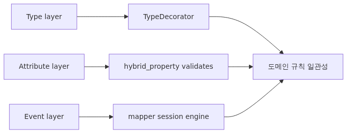
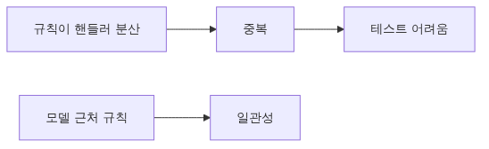
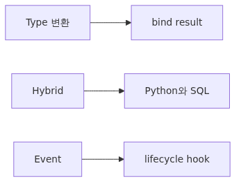
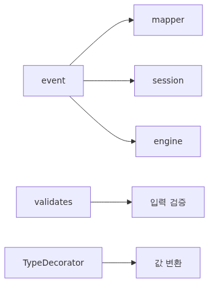
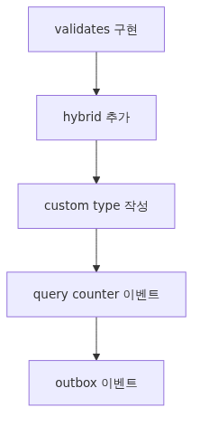

# 이벤트, hybrid_property, 그리고 커스텀 타입



*이벤트, hybrid_property, 그리고 커스텀 타입*
## 핵심 질문

events·hybrid_property·custom type을 어떻게 활용해야 모델이 표현력 있고 안전할까요?

이 글은 그 질문에 답하기 위해 events·hybrid·custom type의 핵심 결정과 운영 함정을 살펴봅니다.

## 이 글에서 다룰 문제



*핵심 개념*
ORM을 처음 쓸 때는 모델이 곧 테이블이고 끝입니다. 그러다 도메인이 자라면 이메일 정규화, 비밀번호 해싱, audit log, 파생 컬럼, 암호화된 필드 같은 요구가 모델 안으로 밀려 들어옵니다. 이걸 매번 핸들러에서 처리하면 같은 코드가 여러 곳에 흩어지고 테스트도 어렵습니다.

SQLAlchemy의 event 시스템과 `hybrid_property`, `TypeDecorator`는 이 책임을 모델 가까이 두기 위한 공식 확장점입니다. 잘 쓰면 도메인 규칙이 한 곳에 모이고, 못 쓰면 어디서 데이터를 변형하는지 추적하기 어려운 코드가 됩니다. 이 글에서 각 도구의 선을 분명히 긋습니다.

## Mental Model



*Mental model*
> SQLAlchemy 확장점은 세 층으로 나눠 생각합니다. **타입 층**은 컬럼 값을 DB로 들고 날 때 변환하고, **속성 층**은 Python 객체와 SQL 표현을 동시에 정의하며, **이벤트 층**은 객체·세션·엔진 라이프사이클의 특정 시점에 끼어듭니다.

같은 동작이라도 어느 층에 두느냐에 따라 영향 범위가 다릅니다. 예를 들어 이메일을 소문자로 저장하고 싶다면 세 가지 선택지가 있습니다.

- `TypeDecorator`로 `LowerString` 타입을 만들어 컬럼에 붙이면 모든 모델·모든 세션에서 자동 적용됩니다.
- `@validates("email")`로 모델에 데코레이터를 달면 그 모델에 한해 setter 시점에 검증 겸 정규화가 됩니다.
- `before_insert` 이벤트로 처리하면 INSERT 직전에만 동작하고 in-memory 객체 상태는 setter 시점까지 원본을 유지합니다.

선택 기준은 "이 규칙이 얼마나 일반적인가, 언제 적용돼야 하는가"입니다.

## 핵심 개념



*핵심 개념*
### Event 시스템

SQLAlchemy는 거의 모든 객체에 `event.listen` / `@event.listens_for`로 핸들러를 붙일 수 있게 열어 둡니다. 자주 쓰는 대상은 세 종류입니다.

| 대상 | 대표 이벤트 | 쓰임새 |
| --- | --- | --- |
| Mapper(모델) | `before_insert`, `before_update`, `after_insert` | audit 컬럼, 파생 필드 계산 |
| Session | `before_flush`, `after_commit`, `after_rollback` | 트랜잭션 단위 후처리, outbox |
| Engine | `before_cursor_execute`, `after_cursor_execute` | 쿼리 로깅, 카운팅, slow query |

### `@validates`

`sqlalchemy.orm.validates`는 setter에 끼어드는 가장 단순한 훅입니다. 반환값이 실제 저장값이 되므로 검증과 정규화를 동시에 합니다.

### `hybrid_property`

`sqlalchemy.ext.hybrid.hybrid_property`는 Python 인스턴스에서는 일반 property처럼 동작하고, 클래스 수준에서는 SQL 표현으로 변환되는 이중 속성을 만듭니다. 그래서 `User.full_name == "Ada Lovelace"` 같은 where 절이 가능합니다.

### `TypeDecorator`

`sqlalchemy.types.TypeDecorator`는 기존 타입을 감싸 `process_bind_param`(쓸 때)과 `process_result_value`(읽을 때)에서 값을 바꿀 수 있게 합니다. JSON 자동 직렬화, 암호화, 통화·시간대 변환 같은 곳에 씁니다.

## Before-After

이메일 정규화와 audit timestamp를 핸들러에서 처리하던 코드와, 모델 쪽으로 옮긴 코드를 비교합니다.

```python
# Before: handler 안에서 매번 처리
def create_user(session, email, name):
    email = email.strip().lower()
    user = User(email=email, name=name, created_at=datetime.utcnow(), updated_at=datetime.utcnow())
    session.add(user)
    session.commit()
    return user
```

```python
# After: 모델이 스스로 책임
from sqlalchemy import event
from sqlalchemy.orm import validates

class User(Base):
    __tablename__ = "users"
    id: Mapped[int] = mapped_column(primary_key=True)
    email: Mapped[str]
    name: Mapped[str]
    created_at: Mapped[datetime]
    updated_at: Mapped[datetime]

    @validates("email")
    def _normalize_email(self, key, value):
        return value.strip().lower()

@event.listens_for(User, "before_insert")
def _set_timestamps_insert(mapper, connection, target):
    now = datetime.utcnow()
    target.created_at = now
    target.updated_at = now

@event.listens_for(User, "before_update")
def _bump_updated(mapper, connection, target):
    target.updated_at = datetime.utcnow()
```

After 버전은 `create_user` 함수 없이도 어디서 만들든 같은 규칙이 적용됩니다. 테스트도 `User(email="  A@B  ").email == "a@b"`만 검증하면 됩니다.

## 단계별 실습



*단계별 실습*
### 1단계: 환경 준비

`pip install "sqlalchemy>=2.0"`로 설치하고, SQLite로 작업합니다. 이전 글에서 만든 `Base`, `engine`, `Session`을 그대로 씁니다.

### 2단계: `@validates`로 이메일·점수 검증

```python
class Member(Base):
    __tablename__ = "members"
    id: Mapped[int] = mapped_column(primary_key=True)
    email: Mapped[str]
    score: Mapped[int]

    @validates("email")
    def _v_email(self, key, value):
        if "@" not in value:
            raise ValueError("invalid email")
        return value.strip().lower()

    @validates("score")
    def _v_score(self, key, value):
        if not 0 <= value <= 100:
            raise ValueError("score out of range")
        return value
```

setter 시점에서 바로 예외가 발생하므로 잘못된 데이터가 세션에 들어가기 전에 막을 수 있습니다.

### 3단계: `hybrid_property`로 파생 속성 만들기

```python
from sqlalchemy.ext.hybrid import hybrid_property

class Person(Base):
    __tablename__ = "people"
    id: Mapped[int] = mapped_column(primary_key=True)
    first_name: Mapped[str]
    last_name: Mapped[str]

    @hybrid_property
    def full_name(self):
        return f"{self.first_name} {self.last_name}"

    @full_name.expression
    def full_name(cls):
        return cls.first_name + " " + cls.last_name
```

이제 `person.full_name`은 Python에서 동작하고, `select(Person).where(Person.full_name == "Ada Lovelace")`는 SQL `first_name || ' ' || last_name = ?`로 변환됩니다.

### 4단계: `TypeDecorator`로 LowerString·JSON 타입 만들기

```python
import json
from sqlalchemy.types import TypeDecorator, String, Text

class LowerString(TypeDecorator):
    impl = String
    cache_ok = True
    def process_bind_param(self, value, dialect):
        return value.lower() if value is not None else None
    def process_result_value(self, value, dialect):
        return value

class JSONText(TypeDecorator):
    impl = Text
    cache_ok = True
    def process_bind_param(self, value, dialect):
        return None if value is None else json.dumps(value, ensure_ascii=False)
    def process_result_value(self, value, dialect):
        return None if value is None else json.loads(value)

class Account(Base):
    __tablename__ = "accounts"
    id: Mapped[int] = mapped_column(primary_key=True)
    handle: Mapped[str] = mapped_column(LowerString(64))
    settings: Mapped[dict] = mapped_column(JSONText)
```

이제 핸들러에서 dict을 그대로 넣고 꺼낼 수 있고, handle은 항상 소문자로 저장됩니다.

### 5단계: 엔진 수준에서 쿼리 카운터 달기

```python
from sqlalchemy import event

query_counter = {"n": 0}

@event.listens_for(engine, "before_cursor_execute")
def _count(conn, cursor, statement, parameters, context, executemany):
    query_counter["n"] += 1
```

테스트에서 `query_counter["n"]`을 비교하면 N+1 회귀를 잡을 수 있습니다. 이 패턴은 7편 loading strategies와 짝을 이룹니다.

### 6단계: 세션 이벤트로 outbox 패턴

```python
@event.listens_for(Session, "before_flush")
def _emit_outbox(session, flush_context, instances):
    for obj in session.new:
        if isinstance(obj, Order):
            session.add(OutboxEvent(type="OrderCreated", payload={"id": obj.id}))
```

`before_flush`에서 같은 세션에 추가하면 같은 트랜잭션으로 커밋돼 atomic한 outbox가 됩니다.

## 자주 하는 실수

- **`@validates`에서 부수 효과를 일으키기.** setter는 객체를 만들 때마다 호출됩니다. DB 조회나 외부 호출을 넣으면 성능과 테스트가 동시에 무너집니다.
- **`hybrid_property`에서 SQL expression을 빠뜨리기.** Python 부분만 있으면 where 절에서 못 씁니다. 두 정의가 같은 의미가 되도록 주의해야 합니다.
- **`TypeDecorator.cache_ok = True`를 빠뜨리기.** SQLAlchemy 2.x에서는 캐시 가능 여부를 명시하지 않으면 경고가 발생합니다.
- **이벤트에서 또 다른 ORM flush를 트리거하기.** `before_flush` 안에서 `session.commit()`을 호출하면 바로 깨집니다. 같은 세션에 add만 합니다.
- **모든 비즈니스 규칙을 이벤트로 옮기기.** 이벤트는 마법처럼 동작해 추적이 어렵습니다. 명시적으로 호출되는 서비스 함수가 더 적절한 경우도 많습니다.

## 실무에서 쓰는 패턴

production에서는 보통 다음처럼 분배합니다.

- **TypeDecorator**: 통화, 시간대, 암호화, JSON 등 데이터 표현 변환에만.
- **`@validates`**: 도메인 invariant(이메일 형식, 점수 범위) 같은 빠르고 부수효과 없는 검증.
- **Mapper 이벤트**(`before_insert`, `before_update`): audit 컬럼, 파생 필드 계산.
- **Session 이벤트**(`before_flush`, `after_commit`): outbox, 캐시 무효화, 도메인 이벤트 발행.
- **Engine 이벤트**(`before_cursor_execute`): 관측. 절대 비즈니스 로직을 넣지 않습니다.

또한 이벤트는 import 시점에 등록되므로 모듈 로딩 순서가 중요합니다. 보통 모델 정의 파일과 같은 모듈에 `@event.listens_for`를 두거나, 앱 부트 단계에서 명시적으로 `register_events()`를 호출합니다.

## 체크리스트

- [ ] `@validates`는 부수효과 없이 검증·정규화에만 쓴다
- [ ] `hybrid_property`는 Python과 SQL 두 정의를 모두 둔다
- [ ] `TypeDecorator`는 `cache_ok = True`를 명시한다
- [ ] mapper 이벤트는 audit·파생 필드 계산 같은 가벼운 작업에만 쓴다
- [ ] session 이벤트는 outbox·캐시 무효화 같은 트랜잭션 단위 작업에 쓴다
- [ ] engine 이벤트는 로깅·카운팅 등 관측에만 쓴다
- [ ] 이벤트 등록 위치를 한 곳에 모아 import 누락을 막는다

## 정리, 다음 글

이벤트와 `hybrid_property`, `TypeDecorator`는 도메인 규칙을 모델 근처에 두기 위한 SQLAlchemy의 공식 확장점입니다. 어떤 층에 둘지, 부수효과를 어디까지 허용할지 미리 정해 두면 코드가 어디서 무엇을 변형하는지 추적할 수 있습니다.

다음 글에서는 동기 패턴을 그대로 비동기로 옮기는 방법을 다룹니다. `aiosqlite` 드라이버와 `AsyncSession`, 그리고 비동기에서 lazy loading이 왜 더 위험한지 같이 살펴봅니다.

<!-- toc:begin -->
## 시리즈 목차

- [SQLAlchemy 2.x 시작하기 - Engine과 Connection의 본질](./01-sqlalchemy-2x-engine-connection.md)
- [SQLAlchemy Core - MetaData, Table, Column으로 schema를 Python 객체로 만들기](./02-core-metadata-table-types.md)
- [SQLAlchemy Core - select·insert·update·delete를 2.x style로 다루기](./03-core-select-insert-update-delete.md)
- [ORM 기초: DeclarativeBase와 mapped_column으로 모델 정의하기](./04-orm-declarative-mapped-column.md)
- [Session 깊이 보기: Unit of Work와 Identity Map의 동작 원리](./05-session-unit-of-work-identity-map.md)
- [ORM Relationships: relationship과 back_populates로 양방향 탐색 안전하게 잇기](./06-relationships-back-populates.md)
- [로딩 전략과 N+1 문제: lazy/joined/selectin을 언제 골라야 하는가](./07-loading-strategies-n-plus-one.md)
- **이벤트, hybrid_property, 그리고 커스텀 타입 (현재 글)**
- 비동기 SQLAlchemy: aiosqlite와 AsyncSession (예정)
- production 패턴: 풀, 관측, 마이그레이션, 배포 (예정)

<!-- toc:end -->

## 참고 자료

- SQLAlchemy: Events — https://docs.sqlalchemy.org/en/20/core/event.html
- SQLAlchemy: ORM Events — https://docs.sqlalchemy.org/en/20/orm/events.html
- SQLAlchemy: Hybrid Attributes — https://docs.sqlalchemy.org/en/20/orm/extensions/hybrid.html
- SQLAlchemy: TypeDecorator — https://docs.sqlalchemy.org/en/20/core/custom_types.html

Tags: Python, SQLAlchemy, ORM, Database
