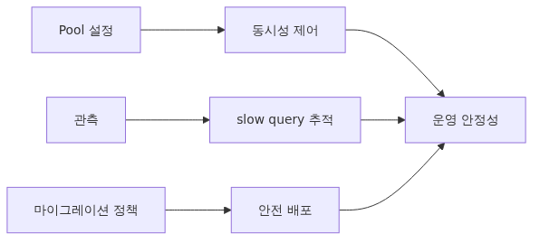
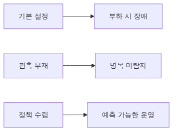
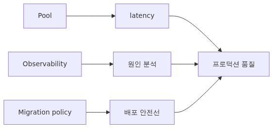
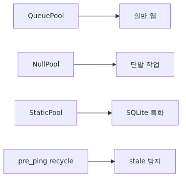
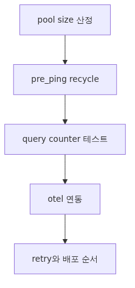

# 프로덕션 패턴: 풀, 관측, 마이그레이션, 배포

프로덕션 환경에서 SQLAlchemy 문제는 대개 쿼리 문법보다 운영 경계에서 터집니다. 연결 풀 크기가 맞지 않아 지연이 커지고, stale connection을 방치해 새벽에 5xx가 나고, 마이그레이션 순서를 잘못 잡아 배포 직후 장애가 생기는 식입니다.

이 글은 SQLAlchemy 101 시리즈의 마지막 글입니다. 여기서는 풀, 관측, 재시도, 마이그레이션, 배포 순서를 기준으로 운영 패턴을 정리합니다.

앞선 아홉 편이 SQLAlchemy를 정확하게 쓰는 방법을 다뤘다면, 이번 글은 그 코드를 오래 안전하게 운영하는 방법을 다룹니다. SQLite 예제를 쓰지만, 여기서 잡는 감각은 PostgreSQL과 MySQL 환경으로도 그대로 이어집니다.



*프로덕션 패턴: 풀, 관측, 마이그레이션, 배포*

## 이 글에서 다룰 문제

- connection pool은 어떤 기준으로 크기와 재사용 정책을 정해야 할까요?
- `pool_pre_ping`, `pool_recycle`은 어떤 장애를 줄여 줄까요?
- N+1 회귀나 느린 쿼리를 운영에서 어떻게 관측할 수 있을까요?
- transient 오류 재시도는 어디까지 애플리케이션이 맡아야 할까요?
- 마이그레이션과 배포 순서를 잘못 잡으면 어떤 장애가 생길까요?

## 왜 중요한가



*핵심 개념*
지금까지 다룬 내용은 모두 "코드가 정확히 동작하는가"였습니다. production은 한 단계 더 나갑니다. 같은 코드라도 풀 사이즈가 잘못되면 동시성에서 무너지고, 관측이 없으면 어디가 느린지 모르고, 마이그레이션 순서를 잘못 잡으면 배포 한 번이 장애가 됩니다.

이 글은 그 한 층 위의 결정들을 정리합니다. SQLite를 예로 쓰지만 대부분의 패턴은 PostgreSQL/MySQL에도 그대로 적용됩니다.

## 멘탈 모델



*멘탈 모델*
> 프로덕션 SQLAlchemy는 세 개의 손잡이로 조율합니다. 풀은 동시성과 지연 시간을, 관측은 병목 지점을, 마이그레이션 정책은 배포의 안전선을 결정합니다. 셋 중 하나라도 비면 다른 둘의 효과가 크게 줄어듭니다.

풀이 너무 작으면 요청이 큐에서 기다리고, 너무 크면 DB 측 connection 한계를 넘습니다. 관측이 없으면 풀이 잘못됐다는 사실 자체를 모르고, 마이그레이션 정책이 없으면 슬프게도 "배포 직후 5분"이 단골 장애 시간이 됩니다.

## 핵심 개념



*핵심 개념*
### Pool 옵션

| 옵션 | 의미 | 권장 시작값 |
| --- | --- | --- |
| `pool_size` | 평상시 유지하는 connection 수 | 5–20 (서비스 크기에 따라) |
| `max_overflow` | 급증 시 추가로 열 수 있는 수 | `pool_size`와 동일 |
| `pool_pre_ping` | 사용 전 SELECT 1로 죽은 connection 검사 | True |
| `pool_recycle` | N초 지난 connection은 재사용 전 닫음 | 1800 (DB idle timeout 보다 짧게) |
| `pool_timeout` | 풀에서 기다리는 최대 시간 | 10–30초 |

### Pool 종류

- **`QueuePool`**(기본): 일반적인 동기 web 서버.
- **`NullPool`**: 단발성 스크립트, lambda 같은 환경. 매번 새 connection.
- **`StaticPool`**: 단일 connection을 여러 곳에서 공유. SQLite + 다중 thread 테스트에서 자주 씀.

### SQLite의 특수성

SQLite는 단일 writer DB입니다. file lock으로 직렬화되며, 큰 풀은 의미가 없습니다. 보통 `StaticPool` + `check_same_thread=False`로 쓰거나, async에서는 `aiosqlite` 기본 풀을 그대로 사용합니다.

### 관측

`event.listens_for(engine, "before_cursor_execute" / "after_cursor_execute")`로 직접 시간을 잴 수도 있고, OpenTelemetry의 `SQLAlchemyInstrumentor`를 쓰면 트레이스가 자동으로 붙습니다.

## 이전 방식과 개선 방식

```python
# Before: 기본값으로 만들어 버린 엔진
engine = create_engine(DATABASE_URL)
# 풀, pre-ping, recycle, 관측 모두 기본 → 새벽에 stale connection으로 5xx
```

```python
# After: production 기본기
from sqlalchemy import create_engine, event
import time, logging

log = logging.getLogger("db.slow")

engine = create_engine(
    DATABASE_URL,
    pool_size=10,
    max_overflow=10,
    pool_pre_ping=True,
    pool_recycle=1800,
    pool_timeout=30,
    future=True,
)

SLOW_MS = 200

@event.listens_for(engine, "before_cursor_execute")
def _t0(conn, cursor, stmt, params, ctx, many):
    ctx._t0 = time.perf_counter()

@event.listens_for(engine, "after_cursor_execute")
def _t1(conn, cursor, stmt, params, ctx, many):
    ms = (time.perf_counter() - ctx._t0) * 1000
    if ms >= SLOW_MS:
        log.warning("slow %.1fms %s", ms, stmt[:200])
```

After는 (1) connection이 죽어도 다음 요청에서 자동 회복(`pool_pre_ping`), (2) idle 30분 넘으면 재사용 안 함(`pool_recycle`), (3) 200ms 이상 쿼리는 별도 로거에 남깁니다.

## 단계별 실습



*단계별 실습*
### 1단계: 풀 크기 정하기

대략 `(평균 동시 요청 수) × (요청당 평균 connection 보유 시간 / 총 처리 시간)`이 시작점입니다. 보통 web 서버 1프로세스당 5–20이면 충분하고, 모자라면 `pool_size`를 키우는 대신 worker 프로세스 수로 늘리는 것이 안전합니다.

### 2단계: pre-ping과 recycle

DB 쪽 idle timeout(예: PostgreSQL 8h, MySQL 8h, 로드밸런서 5분)보다 `pool_recycle`을 짧게 잡습니다. `pool_pre_ping=True`는 거의 항상 켭니다.

### 3단계: 쿼리 카운터로 N+1 회귀 막기

8편에서 만든 `before_cursor_execute` 카운터를 테스트에 묶습니다.

```python
def test_no_n_plus_one(session):
    counter["n"] = 0
    result = list_users_with_posts(session)  # selectinload 사용
    assert counter["n"] <= 2  # users SELECT + posts IN-SELECT
```

`selectinload`를 빼고 다시 돌리면 카운터가 늘어 회귀가 즉시 보입니다.

### 4단계: OpenTelemetry로 trace 연결

```python
from opentelemetry.instrumentation.sqlalchemy import SQLAlchemyInstrumentor

SQLAlchemyInstrumentor().instrument(engine=engine)
```

이제 모든 SQL이 현재 trace span의 자식으로 붙어, "이 요청에서 어떤 SQL이 얼마나 걸렸는가"를 그대로 봅니다.

### 5단계: transient 에러 retry

```python
import tenacity

@tenacity.retry(
    retry=tenacity.retry_if_exception_type(OperationalError),
    wait=tenacity.wait_exponential(multiplier=0.1, max=2),
    stop=tenacity.stop_after_attempt(3),
)
def write_with_retry(session, obj):
    session.add(obj)
    session.commit()
```

원격 DB의 일시적 단절, SQLite의 `SQLITE_BUSY`처럼 "다시 시도하면 된다"가 분명한 에러에만 적용합니다. business 에러는 절대 retry하지 않습니다.

### 6단계: 마이그레이션과 배포 순서

기본 원칙은 **마이그레이션이 먼저, 코드가 나중**입니다. 컬럼 추가/삭제로 나누면 다음과 같습니다.

- **컬럼 추가**: (1) nullable로 컬럼 추가 마이그레이션 → (2) 새 컬럼을 쓰는 코드 배포 → (3) (필요 시) NOT NULL로 마이그레이션 한 번 더.
- **컬럼 삭제**: (1) 코드에서 컬럼 사용 제거 후 배포 → (2) 다음 release에서 컬럼 drop 마이그레이션. 절대 같은 배포에서 하지 않습니다.

이 패턴은 alembic-101에서 본격적으로 다룹니다.

## 자주 하는 실수

- **`pool_size`만 키우기.** DB 측 max_connections를 같이 보지 않으면 어느 순간 DB가 거부합니다.
- **`pool_pre_ping`을 끄고 stale connection으로 새벽 5xx.** 켜지 않을 이유가 거의 없습니다.
- **모든 예외에 대해 retry.** integrity error, validation error는 다시 시도해도 똑같이 실패합니다. 명시적 화이트리스트로만.
- **마이그레이션과 코드 배포를 같은 step에 묶기.** rollback 경로가 사라집니다.
- **slow query 임계를 너무 낮게.** 200ms를 의미 있는 신호로 잡고, 점진적으로 50ms까지 좁히는 식으로.
- **SQLite production에 `QueuePool`을 그대로.** SQLite는 어차피 단일 writer라, 큰 풀은 false sense of concurrency를 줄 뿐입니다.

## 실무에서 쓰는 패턴

- **engine은 프로세스당 하나.** 모듈 import 시 만들고, 라이프사이클 종료 시 `dispose()`.
- **session은 요청·작업 단위.** dependency / context manager로 강제.
- **트랜잭션은 짧게.** 외부 HTTP 호출, 큰 계산은 트랜잭션 밖에서.
- **헬스체크는 `SELECT 1`을 짧은 timeout으로.** kubernetes liveness/readiness에 직접 연결.
- **schema 마이그레이션 전용 IAM/계정 분리.** 일반 워크로드 계정으로 DDL을 못 치게 막아 사고 방지.
- **slow query log + APM trace + alert** 세 축이 갖춰지면 대부분의 회귀를 사전에 잡습니다.

## 체크리스트

- [ ] `pool_size`, `max_overflow`, `pool_pre_ping`, `pool_recycle`, `pool_timeout`을 명시했다
- [ ] DB의 max_connections를 풀 합계로 넘지 않는다
- [ ] slow query 로깅이 있다(임계 200ms 같은 시작값)
- [ ] OpenTelemetry나 동등한 trace에 SQL이 연결된다
- [ ] retry는 `OperationalError`/`SQLITE_BUSY` 같은 transient에만, max 3회
- [ ] 마이그레이션과 코드 배포를 같은 step에 묶지 않는다
- [ ] engine은 프로세스당 하나, 종료 시 `dispose()`를 호출한다

## 정리, 다음 글

production 운영의 결정은 풀, 관측, 마이그레이션 세 축으로 좁혀집니다. 이 셋을 일찍 정해 두면 문제가 발생했을 때 추적 가능한 시스템이 되고, 늦게 정하면 매번 야간 배포로 메우게 됩니다.

이 시리즈는 여기서 마무리합니다. 다음 시리즈인 **alembic-101**에서는 이 글의 마이그레이션 정책을 구체적인 명령과 워크플로우로 풀어냅니다(`autogenerate`, branch와 merge, 데이터 마이그레이션, downgrade 전략).

<!-- toc:begin -->
## 시리즈 목차

- [SQLAlchemy 2.x 시작하기 - Engine과 Connection의 본질](./01-sqlalchemy-2x-engine-connection.md)
- [SQLAlchemy Core - MetaData, Table, Column으로 schema를 Python 객체로 만들기](./02-core-metadata-table-types.md)
- [SQLAlchemy Core - select·insert·update·delete를 2.x style로 다루기](./03-core-select-insert-update-delete.md)
- [ORM 기초: DeclarativeBase와 mapped_column으로 모델 정의하기](./04-orm-declarative-mapped-column.md)
- [Session 깊이 보기: Unit of Work와 Identity Map의 동작 원리](./05-session-unit-of-work-identity-map.md)
- [ORM 관계 매핑: relationship과 back_populates로 양방향 탐색 안전하게 잇기](./06-relationships-back-populates.md)
- [로딩 전략과 N+1 문제: lazy/joined/selectin을 언제 골라야 하는가](./07-loading-strategies-n-plus-one.md)
- [이벤트, hybrid_property, 그리고 커스텀 타입](./08-events-hybrid-types.md)
- [비동기 SQLAlchemy: aiosqlite와 AsyncSession](./09-async-aiosqlite.md)
- **프로덕션 패턴: 풀, 관측, 마이그레이션, 배포 (현재 글)**

<!-- toc:end -->

## 참고 자료

- SQLAlchemy: Connection Pooling — https://docs.sqlalchemy.org/en/20/core/pooling.html
- SQLAlchemy: Engine Configuration — https://docs.sqlalchemy.org/en/20/core/engines.html
- OpenTelemetry SQLAlchemy instrumentation — https://opentelemetry-python-contrib.readthedocs.io/en/latest/instrumentation/sqlalchemy/sqlalchemy.html
- Tenacity — https://tenacity.readthedocs.io/

Tags: Python, SQLAlchemy, ORM, Database
