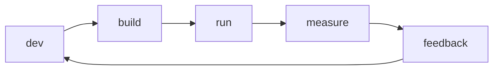

# What is SRE?

This is the first post in the SRE 101 series.

> SRE 101 series (1/10)

<!-- a-grade-intro:begin -->

**Core question**: *Whose* job is it to keep the *service* from *going down*?

> *SRE* is the discipline that treats *operations* as a *software problem*.

<!-- a-grade-intro:end -->

## What You Will Learn

- The *definition* of *SRE*
- How it differs from *DevOps*
- The *five core activities*
- Where SRE fits in the *org*
- How to *get started*

## Why It Matters

You can ship *features* quickly, but if the *service* keeps *going down* customers leave. *Reliability* is part of the *product*.

## Concept at a Glance



## Key Terms

- **reliability**: the *fraction* of time the system behaves as *expected*.
- **SLO**: a *service-level objective*.
- **error budget**: the *allowed amount of failure*.
- **toil**: *repetitive manual work*.
- **postmortem**: a *post-incident analysis* document.

## Before/After

**Before**: *ops* and *dev* teams sit *apart*.

**After**: *SRE* automates the operations work in *code*.

## Hands-on: Your First SLO

### Step 1 — Pick the indicator

```python
# Example: HTTP success ratio
indicator = "http_2xx / http_total"
```

### Step 2 — Set the target

```python
slo = {"indicator": indicator, "target": 0.999, "window": "30d"}
```

### Step 3 — Measure

```python
def availability(success, total):
    return success / total
```

### Step 4 — Error budget

```python
def error_budget(target, total):
    return (1 - target) * total
```

### Step 5 — Use it for decisions

```python
def can_release(spent, budget):
    return spent < budget
```

## What to Notice in This Code

- The *indicator* reflects *customer experience*.
- The *target* should be *realistic*.
- The *budget* lets you trade *speed* for *stability*.

## Five Common Mistakes

1. **Setting *100% availability* as the goal.**
2. **Mistaking a *technical metric* for a *customer metric*.**
3. **Treating *SLOs* as a *document*, not a tool.**
4. **Doing *operations* manually.**
5. **Running *SRE* in isolation from *dev*.**

## How This Shows Up in Production

An *SRE team* sits between *platform* and *product* teams and helps *negotiate* shared *SLOs*.

## How a Senior Engineer Thinks

- *Reliability* is a *product feature*.
- *100%* only inflates *cost*.
- *Toil* is a form of *technical debt*.
- A *postmortem* is a *learning* opportunity.
- *Operations* is *code*, too.

## Checklist

- [ ] One key *SLO* defined.
- [ ] *Error budget* computed.
- [ ] *Toil ratio* measured.
- [ ] Clear *owner*.

## Practice Problems

1. Define *SLO* in one line.
2. Define *toil* in one line.
3. Define *error budget* in one line.

## Wrap-up and Next Steps

Next, we look at the *definition* and *models* of *reliability*.

<!-- toc:begin -->
- **What is SRE? (current)**
- Reliability (upcoming)
- SLI, SLO, SLA (upcoming)
- Error Budget (upcoming)
- Monitoring (upcoming)
- Incident Response (upcoming)
- Postmortem (upcoming)
- Reducing Toil (upcoming)
- Capacity Planning (upcoming)
- Building Operable Systems (upcoming)
<!-- toc:end -->

## References

- [Google SRE Book](https://sre.google/sre-book/table-of-contents/)
- [Google SRE Workbook](https://sre.google/workbook/table-of-contents/)
- [What is SRE - Google Cloud](https://cloud.google.com/architecture/devops)
- [Site Reliability Engineering - Wikipedia](https://en.wikipedia.org/wiki/Site_reliability_engineering)

Tags: SRE, Reliability, DevOps, Operations, Engineering
