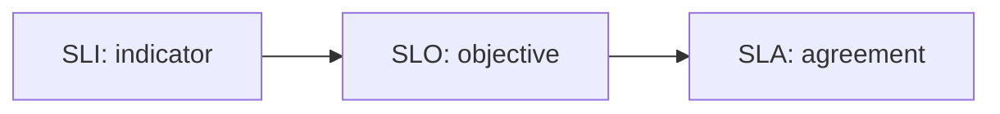

# SLI, SLO, SLA

> SRE 101 series (3/10)

<!-- a-grade-intro:begin -->

**Core question**: How do *measurement*, *objective*, and *agreement* differ?

> *SLI* is the *indicator*, *SLO* is the *internal goal*, *SLA* is the *external promise*.

<!-- a-grade-intro:end -->

## What You Will Learn

- The *definitions* of *SLI*, *SLO*, *SLA*
- *Internal goals* vs *external promises*
- What makes a *good SLO*
- The *legal* side of *SLAs*
- The *agreement* process

## Why It Matters

If you mix the *three terms*, every *decision* gets *wobbly*.

## Concept at a Glance



## Key Terms

- **SLI**: a *service-level indicator*.
- **SLO**: a *service-level objective*.
- **SLA**: a *service-level agreement*.
- **window**: the *measurement period*.
- **threshold**: the *allowed limit*.

## Before/After

**Before**: someone says "*99.9%* is the *target*".

**After**: a written spec — *which indicator*, *over what window*, *with what consequence*.

## Hands-on: Writing the Spec

### Step 1 — Define the SLI

```python
sli = {
    "name": "http_success_ratio",
    "formula": "http_2xx / http_total",
    "source": "ingress logs",
}
```

### Step 2 — Define the SLO

```python
slo = {
    "sli": sli["name"],
    "target": 0.999,
    "window_days": 30,
    "owner": "payments-team",
}
```

### Step 3 — Define the SLA

```python
sla = {
    "slo": slo,
    "remedy": "service credit 10%",
    "exclusions": ["scheduled maintenance"],
}
```

### Step 4 — Detect a violation

```python
def violated(success, total, target):
    return (success / total) < target
```

### Step 5 — Report

```python
def report(success, total, target):
    return {
        "value": success / total,
        "violated": (success / total) < target,
    }
```

## What to Notice in This Code

- The *SLI* names its *data source*.
- The *SLO* names its *owner*.
- The *SLA* records *exclusions* and *remedies*.

## Five Common Mistakes

1. **Treating *SLOs* like *SLAs* — over-promising.**
2. **An *SLI* with an *unclear data source*.**
3. **Forgetting the *measurement window*.**
4. **An *SLO* without an *owner*.**
5. **Calling something an *SLA* with *no remedy*.**

## How This Shows Up in Production

In *B2B contracts* the *SLA* becomes a legal *document*; *internally*, the *SLO* is the *yardstick*.

## How a Senior Engineer Thinks

- The *indicator* lives at the *customer's* level.
- The *objective* must be *realistic* to be *useful*.
- The *agreement* is reviewed with *legal*.
- If you cannot *measure*, it is not a *target*.
- An *SLO* without an *owner* does not exist.

## Checklist

- [ ] *SLI* spec.
- [ ] Named *SLO* owner.
- [ ] *SLA* remedy policy.
- [ ] *Exclusions* documented.

## Practice Problems

1. Define *SLI* in one line.
2. Define *SLO* in one line.
3. Define *SLA* in one line.

## Wrap-up and Next Steps

Next, we cover the *error budget*.

<!-- toc:begin -->
- [What is SRE?](./01-what-is-sre.md)
- [Reliability](./02-reliability.md)
- **SLI, SLO, SLA (current)**
- Error Budget (upcoming)
- Monitoring (upcoming)
- Incident Response (upcoming)
- Postmortem (upcoming)
- Reducing Toil (upcoming)
- Capacity Planning (upcoming)
- Building Operable Systems (upcoming)
<!-- toc:end -->

## References

- [Service Level Objectives - Google SRE Book](https://sre.google/sre-book/service-level-objectives/)
- [Implementing SLOs - Google SRE Workbook](https://sre.google/workbook/implementing-slos/)
- [SLI vs SLO vs SLA - Atlassian](https://www.atlassian.com/incident-management/kpis/sla-vs-slo-vs-sli)
- [SLA, SLO, SLI - DigitalOcean](https://www.digitalocean.com/community/tutorials/what-is-sla-slo-sli)

Tags: SRE, SLI, SLO, SLA, Reliability
