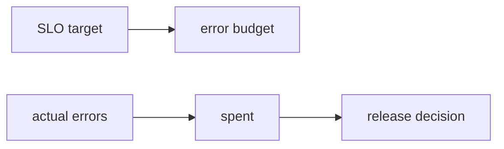

# Error Budget

This is post 4 in the SRE 101 series.

> SRE 101 series (4/10)

<!-- a-grade-intro:begin -->

**Core question**: How do you decide *how much failure* is *acceptable*?

> An *error budget* is the *allowed distance* between *goal* and *reality*.

<!-- a-grade-intro:end -->

## What You Will Learn

- The *definition* of an *error budget*
- How to *calculate* it
- *Burn-rate* alerting
- Its relationship to *release decisions*
- The cultural effect on a *team*

## Why It Matters

*Speed* and *stability* are not enemies — a *budget* mediates them.

## Concept at a Glance



## Key Terms

- **error budget**: the *allowed amount of failure*.
- **burn rate**: the *speed* of consumption.
- **freeze**: a *release halt*.
- **window**: the *measurement period*.
- **policy**: the *action* taken when budget is spent.

## Before/After

**Before**: an outage triggers *blame*.

**After**: as long as the *budget holds*, you *take risks*; when it is *spent*, you *freeze*.

## Hands-on: Operating the Budget

### Step 1 — Compute the budget

```python
def budget(target, total):
    return (1 - target) * total
```

### Step 2 — Spend ratio

```python
def spent(errors, allowed):
    return errors / allowed
```

### Step 3 — Burn rate

```python
def burn_rate(errors_in_h, allowed_per_h):
    return errors_in_h / allowed_per_h
```

### Step 4 — Policy branch

```python
def policy(spent_ratio):
    if spent_ratio > 1.0:
        return "freeze"
    if spent_ratio > 0.5:
        return "review"
    return "ship"
```

### Step 5 — Alert

```python
def alert(burn):
    return burn > 14.4  # 14.4x: fast burn
```

## What to Notice in This Code

- The *budget* is *quantifiable*.
- *Burn rate* is the *early-warning* signal.
- A *policy* turns the budget into *behavior*.

## Five Common Mistakes

1. **Keeping the *budget* only as a *document*.**
2. **Ignoring *burn rate*.**
3. **Having *no freeze* policy.**
4. **Running *SLO* and *budget* in *separate* tools.**
5. **Using the *budget* as a *punishment* tool.**

## How This Shows Up in Production

If the *budget* has room, you *experiment*. Once it is *spent*, you *focus on stability*.

## How a Senior Engineer Thinks

- The *budget* is the *language* of the conversation.
- *Burn rate* tells you about *now*.
- A *freeze* is a *reset*, not a *punishment*.
- The *policy* is *negotiated* with the team.
- The *budget* is part of the *product*.

## Checklist

- [ ] *Budget* computed.
- [ ] *Burn-rate* alert.
- [ ] *Freeze* policy.
- [ ] Named *owner*.

## Practice Problems

1. Define *error budget* in one line.
2. Define *burn rate* in one line.
3. Define *freeze* in one line.

## Wrap-up and Next Steps

Next, we cover the *fundamentals of monitoring*.

<!-- toc:begin -->
- [What is SRE?](./01-what-is-sre.md)
- [Reliability](./02-reliability.md)
- [SLI, SLO, SLA](./03-sli-slo-sla.md)
- **Error Budget (current)**
- Monitoring (upcoming)
- Incident Response (upcoming)
- Postmortem (upcoming)
- Reducing Toil (upcoming)
- Capacity Planning (upcoming)
- Building Operable Systems (upcoming)
<!-- toc:end -->

## References

- [Embracing Risk - Google SRE Book](https://sre.google/sre-book/embracing-risk/)
- [Alerting on SLOs - Google SRE Workbook](https://sre.google/workbook/alerting-on-slos/)
- [Error Budgets - Atlassian](https://www.atlassian.com/incident-management/kpis/error-budget)
- [Error Budget Policy - Google](https://sre.google/workbook/error-budget-policy/)

Tags: SRE, ErrorBudget, Reliability, Release, Risk
