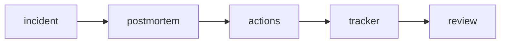

# Postmortem

This is post 7 in the SRE 101 series.

> SRE 101 series (7/10)

<!-- a-grade-intro:begin -->

**Core question**: After an outage ends, what should the *team leave behind*?

> A *postmortem* is a *learning system*, not a *document*.

<!-- a-grade-intro:end -->

## What You Will Learn

- The *definition* of a *postmortem*
- *Blameless culture*
- A writing *template*
- *Action item* tracking
- *Organizational learning*

## Why It Matters

*Repeated outages* are the result of *missing learning*.

## Concept at a Glance



## Key Terms

- **postmortem**: a *post-incident analysis* document.
- **blameless**: a *no-blame* principle.
- **timeline**: the *event flow*.
- **root cause**: the *underlying* cause.
- **action item**: a *follow-up action*.

## Before/After

**Before**: hunt down the *responsible person*.

**After**: analyze the *system weaknesses*.

## Hands-on: Writing a Postmortem

### Step 1 — Define the template

```python
template = {
    "title": "",
    "summary": "",
    "impact": "",
    "timeline": [],
    "root_cause": "",
    "actions": [],
    "lessons": [],
}
```

### Step 2 — Summarize impact

```python
def impact_line(users, minutes):
    return f"{users} users affected for {minutes} min"
```

### Step 3 — Timeline

```python
def event(t, msg):
    return {"time": t, "event": msg}
```

### Step 4 — Action items

```python
def action(desc, owner, due):
    return {"desc": desc, "owner": owner, "due": due}
```

### Step 5 — Track them

```python
def open_actions(items):
    return [a for a in items if not a.get("done")]
```

## What to Notice in This Code

- The *template* substitutes for *memory*.
- *Owner* and *due date* are the *tracking axes*.
- *Lessons* become *reusable* assets.

## Five Common Mistakes

1. **Personal *blame* leading to *silence*.**
2. ***No tracking* of *action items*.**
3. **Mistaking *symptoms* for *root cause*.**
4. **Failing to *share* the result.**
5. **Filling in the *template* without any real *learning*.**

## How This Shows Up in Production

*Jira* or *Linear* tickets track each action; a *weekly review* checks progress.

## How a Senior Engineer Thinks

- *Blameless* invites the *truth*.
- The *cause* lives in the *system*.
- A document *without actions* is *waste*.
- *Recurrence prevention* is *proven by changes*.
- *Learning* spreads through *openness*.

## Checklist

- [ ] *Template* agreed.
- [ ] *Blameless* principle.
- [ ] *Action tracking*.
- [ ] *Shared* channel.

## Practice Problems

1. Define *blameless* in one line.
2. Define *root cause* in one line.
3. Define *action item* in one line.

## Wrap-up and Next Steps

Next, we cover *reducing toil*.

<!-- toc:begin -->
- [What is SRE?](./01-what-is-sre.md)
- [Reliability](./02-reliability.md)
- [SLI, SLO, SLA](./03-sli-slo-sla.md)
- [Error Budget](./04-error-budget.md)
- [Monitoring](./05-monitoring.md)
- [Incident Response](./06-incident-response.md)
- **Postmortem (current)**
- Reducing Toil (upcoming)
- Capacity Planning (upcoming)
- Building Operable Systems (upcoming)
<!-- toc:end -->

## References

- [Postmortem Culture - Google SRE Book](https://sre.google/sre-book/postmortem-culture/)
- [Etsy Debriefing Guide](https://extfiles.etsy.com/DebriefingFacilitationGuide.pdf)
- [Blameless Postmortems - Atlassian](https://www.atlassian.com/incident-management/postmortem/blameless)
- [PagerDuty Postmortem Guide](https://postmortems.pagerduty.com/)

Tags: SRE, Postmortem, BlamelessCulture, Learning, Operations
