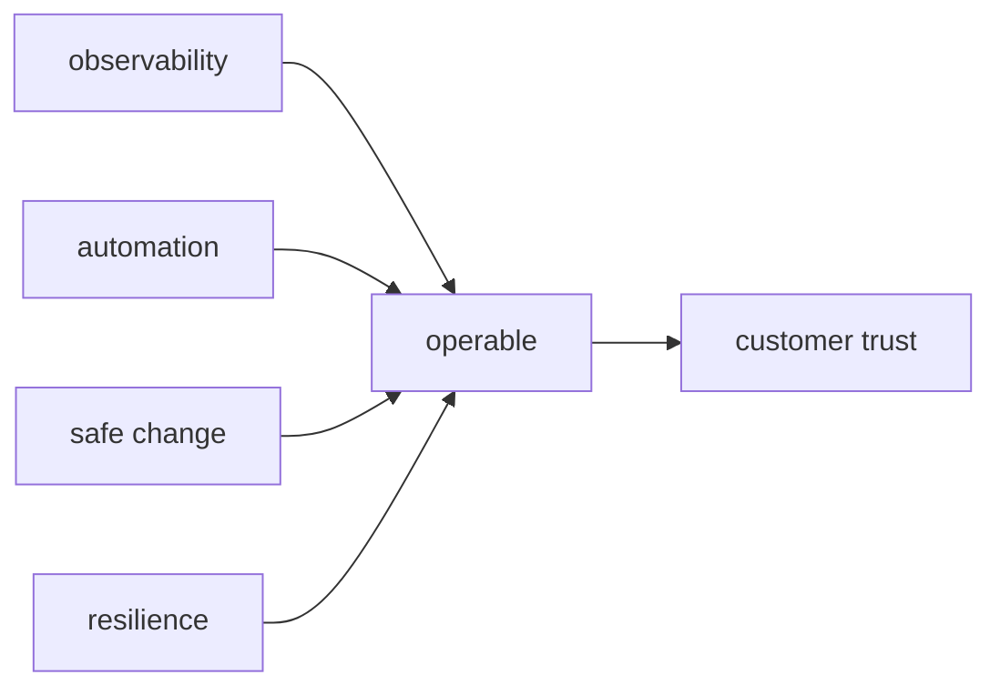

# Building Operable Systems

This is the final post in the SRE 101 series.

> SRE 101 series (10/10)

<!-- a-grade-intro:begin -->

**Core question**: How do you build a system that is *operable from day one*?

> *Operability* is *designed in* like a *feature*, not bolted on later.

<!-- a-grade-intro:end -->

## What You Will Learn

- The *definition* of *operability*
- *Observability*, *automation*, and *safe change*
- *Resilience* patterns
- The *integrated* operational picture
- A *series synthesis*

## Why It Matters

A *feature* without *operability* returns as *debt*.

## Concept at a Glance



## Key Terms

- **operability**: how *easy* it is to *operate* the system.
- **observability**: ability to *infer internal state* from *outside*.
- **safe change**: *canary* and *rollback*-friendly change.
- **resilience**: ability to *recover* from *partial failure*.
- **runbook-as-code**: a *procedure* expressed as *code*.

## Before/After

**Before**: build the *feature*; defer *operations*.

**After**: build the *feature* and its *operability* together.

## Hands-on: An Operability Audit

### Step 1 — Observability check

```python
def has_obs(metrics, logs, traces):
    return all([metrics, logs, traces])
```

### Step 2 — Safe deploy

```python
def safe_deploy(canary_pct, rollback_ready):
    return canary_pct <= 5 and rollback_ready
```

### Step 3 — Resilience patterns

```python
def has_resilience(retry, timeout, breaker):
    return all([retry, timeout, breaker])
```

### Step 4 — Automation ratio

```python
def auto_ratio(auto_min, total_min):
    return auto_min / total_min
```

### Step 5 — Operability score

```python
def score(obs, deploy, resil, auto):
    return sum([obs, deploy, resil, auto >= 0.7]) / 4
```

## What to Notice in This Code

- We check *four dimensions*.
- We *prove* it with *code*.
- A *score* sets the *priority*.

## Five Common Mistakes

1. **Treating *operability* as a *later* concern.**
2. **Missing *observability*.**
3. **Full rollouts without *canaries*.**
4. **No *resilience* patterns.**
5. **Insufficient *automation*.**

## How This Shows Up in Production

A *platform team* ships a *common operability* template; *product teams* focus on the *business*.

## How a Senior Engineer Thinks

- *Operability* is part of the *feature*.
- *Observability* is the *baseline* of debugging.
- Make *changes* *small* and *reversible*.
- Stop *partial failure* from becoming *total failure*.
- *Learning* is *amplified* in *operations*.

## Checklist

- [ ] Four-dimension *checklist*.
- [ ] *Canary/rollback* standard.
- [ ] *Common library*.
- [ ] *Operability KPI*.

## Practice Problems

1. Define *operability* in one line.
2. Define *safe change* in one line.
3. Define *resilience* in one line.

## Wrap-up and Next Steps

Congrats on finishing the series. Next, head into *Incident Response 101* and dive deeper into the *operations floor*.

<!-- toc:begin -->
- [What is SRE?](./01-what-is-sre.md)
- [Reliability](./02-reliability.md)
- [SLI, SLO, SLA](./03-sli-slo-sla.md)
- [Error Budget](./04-error-budget.md)
- [Monitoring](./05-monitoring.md)
- [Incident Response](./06-incident-response.md)
- [Postmortem](./07-postmortem.md)
- [Reducing Toil](./08-reducing-toil.md)
- [Capacity Planning](./09-capacity-planning.md)
- **Building Operable Systems (current)**
<!-- toc:end -->

## References

- [Building Secure and Reliable Systems - Google](https://sre.google/books/building-secure-reliable-systems/)
- [Release It! - Michael Nygard](https://pragprog.com/titles/mnee2/release-it-second-edition/)
- [Resilience Engineering - Wikipedia](https://en.wikipedia.org/wiki/Resilience_engineering)
- [Observability Engineering - O'Reilly](https://www.oreilly.com/library/view/observability-engineering/9781492076438/)

Tags: SRE, Operability, Architecture, Reliability, Engineering
