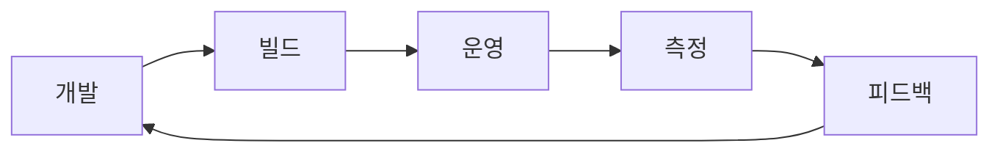

# SRE란 무엇인가?

## 이 글에서 다룰 문제

- 서비스가 자주 불안정해질 때 SRE는 어떤 방식으로 문제를 다루는지 살펴봅니다.
- SRE와 DevOps가 어떻게 다르고, 왜 함께 언급되는지 정리합니다.
- SLO, 에러 버짓, Toil 같은 단어가 SRE 안에서 어떤 역할을 맡는지 연결해서 봅니다.
- 운영을 사람의 희생이 아니라 소프트웨어 문제로 본다는 말이 실무에서 무엇을 뜻하는지 설명합니다.
- 입문자가 SRE를 시작할 때 무엇부터 정의하면 좋은지 짚어 봅니다.

> SRE 101 시리즈 (1/10)

처음 SRE를 접하면 대개 운영팀의 다른 이름 정도로 이해하기 쉽습니다. 장애를 처리하고 알림을 받고, 서버를 돌보는 역할처럼 보이기 때문입니다. 그런데 SRE를 조금만 더 들여다보면 초점이 사람의 근면함이 아니라 시스템의 신뢰성과 자동화에 있다는 점이 분명해집니다.

SRE는 운영 업무를 더 열심히 하는 방법이 아닙니다. 운영에서 반복해서 터지는 문제를 측정하고, 소프트웨어로 줄이고, 팀이 감당할 수 있는 위험 범위를 숫자로 합의하는 방식입니다. 그래서 SRE를 이해하려면 직무 이름보다 먼저 사고방식을 잡아 두는 편이 좋습니다.

## 왜 중요한가

기능을 빨리 출시해도 서비스가 자주 멈추면 사용자는 떠납니다. 반대로 안정성만 지나치게 붙들면 팀의 출시 속도가 떨어집니다. SRE는 이 둘을 감으로 조정하지 않고, 숫자와 자동화로 다루자는 접근입니다.

제품팀과 플랫폼팀이 함께 일하는 조직일수록 이 관점이 중요합니다. 신뢰성을 제품 외부의 운영 업무로 밀어내면 책임은 흐려지고, 장애는 반복됩니다. SRE는 신뢰성을 제품의 일부로 다시 끌어오는 역할을 합니다.

## 한눈에 보는 개념



> SRE의 핵심은 개발과 운영을 한 바퀴의 순환으로 보는 데 있습니다. 코드를 배포하고 끝내는 것이 아니라, 실제 운영 결과를 다시 다음 개발 판단에 반영합니다.

## 핵심 용어

- reliability: 시스템이 기대한 방식으로 동작하는 정도입니다.
- SLO: 팀이 내부적으로 합의한 서비스 수준 목표입니다.
- error budget: 목표와 실제 사이에서 허용하는 실패 여유분입니다.
- toil: 반복적이고 자동화할 수 있는 수작업입니다.
- postmortem: 장애가 끝난 뒤 학습 내용을 남기는 분석 문서입니다.

## Before / After

Before에서는 개발팀과 운영팀이 서로 다른 목표를 바라봅니다. 개발팀은 출시 속도를 우선하고, 운영팀은 변경을 줄이려 합니다. 문제가 나면 사람을 더 붙여서 버티려는 방향으로 흐르기 쉽습니다.

After에서는 운영 그 자체를 코드와 정책으로 다룹니다. 반복 작업은 자동화하고, 서비스 수준은 SLO로 정의하고, 위험 허용 범위는 에러 버짓으로 표현합니다. 그 결과 출시 속도와 안정성을 한 장의 숫자 위에서 대화할 수 있습니다.

## 단계별로 첫 SLO 만들어 보기

### 1단계 — 지표 선택

```python
# 예시: HTTP 성공 비율
indicator = "http_2xx / http_total"
```

첫 단계는 무엇을 측정할지 정하는 일입니다. 여기서는 HTTP 성공 비율을 택했습니다. 좋은 지표는 서버 내부 상태보다 사용자가 실제로 겪는 결과에 가깝습니다.

### 2단계 — 목표 설정

```python
slo = {"indicator": indicator, "target": 0.999, "window": "30d"}
```

목표는 숫자와 기간이 함께 있어야 합니다. 99.9%라는 숫자만 적어 두면 모호합니다. 30일 창에서 99.9%를 지킨다는 식으로 기간까지 함께 적어야 운영 판단에 바로 쓸 수 있습니다.

### 3단계 — 실제 값 계산

```python
def availability(success, total):
    return success / total
```

이 함수는 계산 자체보다 측정 태도를 보여 줍니다. 신뢰성은 느낌이 아니라 분수와 비율로 다루어야 한다는 뜻입니다.

### 4단계 — 에러 버짓 계산

```python
def error_budget(target, total):
    return (1 - target) * total
```

에러 버짓은 실패를 정당화하는 장치가 아니라, 감수 가능한 위험 범위를 미리 정해 두는 장치입니다. 목표가 99.9%라면 0.1%의 실패 여유가 생기고, 이 범위 안에서 팀은 더 빠르게 실험할 수 있습니다.

### 5단계 — 릴리스 판단

```python
def can_release(spent, budget):
    return spent < budget
```

마지막으로 측정 결과를 의사결정에 연결합니다. SRE가 문서 작업으로 끝나지 않으려면 이렇게 출시 여부, 실험 범위, 안정화 우선순위 같은 판단으로 이어져야 합니다.

## 이 코드에서 봐야 할 점

이 예제는 간단하지만 SRE의 기본 순서를 그대로 담고 있습니다. 먼저 지표를 고르고, 목표를 세우고, 실제 값을 재고, 허용 가능한 실패 범위를 계산한 뒤, 마지막으로 행동을 결정합니다. 이 흐름이 없으면 SRE는 멋있는 용어 모음으로 끝납니다.

또 하나 중요한 점은 지표가 고객 경험과 연결되어야 한다는 사실입니다. 내부 CPU 사용률 같은 값도 유용하지만, SLO의 출발점으로는 요청 성공률이나 지연 시간처럼 사용자가 직접 체감하는 지표가 더 적합합니다.

## 자주 하는 실수 5가지

1. 100% 가용성을 목표라고 적어 두고 비용과 복잡도는 계산하지 않는 경우입니다.
2. 고객 경험과 직접 연결되지 않는 기술 지표를 SLO로 삼는 경우입니다.
3. SLO를 문서에만 적고 릴리스 판단에는 쓰지 않는 경우입니다.
4. 반복 운영 업무를 사람의 성실함으로만 버티는 경우입니다.
5. 개발팀과 동떨어진 채 SRE를 별도 조직의 책임으로만 보는 경우입니다.

## 실무에서는 이렇게 본다

현업에서 SRE는 플랫폼팀과 제품팀 사이의 번역기 역할을 자주 맡습니다. 제품팀은 출시 속도를 원하고, 플랫폼팀은 안정성을 걱정합니다. 이때 SLO와 에러 버짓이 공통 언어가 됩니다.

시니어 엔지니어는 SRE를 운영 인력 보강으로 보지 않습니다. 신뢰성을 설계와 코드, 운영 정책에 녹이는 공학 활동으로 봅니다. 장애가 날 때마다 사람을 더 태우는 조직은 성장하기 어렵고, 자동화와 측정 체계를 쌓는 조직은 같은 인원으로 더 큰 서비스를 감당합니다.

## 체크리스트

- [ ] 핵심 사용자 경로 하나에 대한 SLO를 정의했다.
- [ ] 선택한 지표가 고객 경험과 연결되는지 설명할 수 있다.
- [ ] 목표 수치와 측정 기간을 함께 적었다.
- [ ] 에러 버짓을 릴리스 판단에 연결할 계획이 있다.

## 연습 문제

1. SRE를 한 문장으로 정의해 보세요.
2. Toil이 왜 기술 부채와 닮았는지 설명해 보세요.
3. 에러 버짓이 있으면 팀 대화가 어떻게 달라지는지 적어 보세요.

## 정리와 다음 글

이 글에서는 SRE를 운영을 소프트웨어 문제로 다루는 방식으로 정의했습니다. 핵심은 신뢰성을 제품의 일부로 보고, SLO와 에러 버짓으로 위험을 수치화하며, 반복 작업을 자동화로 줄이는 데 있습니다.

다음 글에서는 reliability를 더 구체적으로 다룹니다. 신뢰성을 막연한 안정감이 아니라 어떤 차원으로 측정하고 설명할 수 있는지 이어서 보겠습니다.

<!-- toc:begin -->
- **SRE란 무엇인가? (현재 글)**
- Reliability (예정)
- SLI, SLO, SLA (예정)
- Error Budget (예정)
- Monitoring (예정)
- Incident Response (예정)
- Postmortem (예정)
- Toil 줄이기 (예정)
- Capacity Planning (예정)
- 운영 가능한 시스템 만들기 (예정)
<!-- toc:end -->

## 참고 자료

- [Google SRE Book](https://sre.google/sre-book/table-of-contents/)
- [Google SRE Workbook](https://sre.google/workbook/table-of-contents/)
- [What is SRE - Google Cloud](https://cloud.google.com/architecture/devops)
- [Site Reliability Engineering - Wikipedia](https://en.wikipedia.org/wiki/Site_reliability_engineering)

Tags: SRE, Reliability, DevOps, Operations, Engineering
