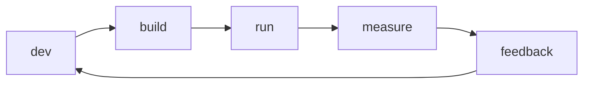

# SRE란 무엇인가?

> SRE 101 시리즈 (1/10)

<!-- a-grade-intro:begin -->

**핵심 질문**: *서비스* 가 *멈추지 않게* 하는 일은 *누구* 의 *책임* 일까요?

> *SRE* 는 *운영* 을 *소프트웨어 문제* 로 *다루는* *직무* 입니다.

<!-- a-grade-intro:end -->

## 이 글에서 배울 것

- *SRE* 의 *정의*
- *DevOps* 와의 *차이*
- *핵심 활동* 5가지
- *조직* 에서의 *위치*
- *시작* 하는 법

## 왜 중요한가

*기능* 을 *빨리* 만들어도 *서비스* 가 *자주* *내려가면* *고객* 이 떠납니다. *신뢰성* 은 *제품* 의 일부입니다.

## 개념 한눈에 보기



## 핵심 용어 정리

- **reliability**: *기대대로* 동작하는 *비율*.
- **SLO**: *서비스 수준 목표*.
- **error budget**: *허용된 실패량*.
- **toil**: *반복 수동 작업*.
- **postmortem**: *사후 분석 문서*.

## Before/After

**Before**: *운영팀* 과 *개발팀* 이 *분리*.

**After**: *SRE* 가 *코드* 로 *운영* 을 *대신* 한다.

## 실습: 첫 SLO 그려보기

### 1단계 — 지표 선정

```python
# 예: HTTP 성공률
indicator = "http_2xx / http_total"
```

### 2단계 — 목표 정하기

```python
slo = {"indicator": indicator, "target": 0.999, "window": "30d"}
```

### 3단계 — 측정

```python
def availability(success, total):
    return success / total
```

### 4단계 — 에러 버짓

```python
def error_budget(target, total):
    return (1 - target) * total
```

### 5단계 — 의사결정

```python
def can_release(spent, budget):
    return spent < budget
```

## 이 코드에서 주목할 점

- *지표* 는 *고객 경험* 을 반영.
- *목표* 는 *현실적* 으로.
- *버짓* 으로 *속도* 와 *안정성* 을 *조율*.

## 자주 하는 실수 5가지

1. ***100% 가용성* 을 *목표* 로.**
2. ***기술 지표* 를 *고객 지표* 로 착각.**
3. ***SLO* 를 *문서* 로만 두기.**
4. ***운영* 을 *수동* 으로 처리.**
5. ***개발팀* 과 *분리* 운영.**

## 실무에서는 이렇게 쓰입니다

*SRE 팀* 은 *플랫폼* 과 *제품팀* 사이에서 *공통 SLO* 를 *합의* 합니다.

## 시니어 엔지니어는 이렇게 생각합니다

- *신뢰성* 은 *제품* 의 *기능*.
- *100%* 는 *비용* 만 늘림.
- *toil* 은 *기술 부채*.
- *postmortem* 은 *학습* 의 *기회*.
- *운영* 도 *코드* 로.

## 체크리스트

- [ ] *핵심 SLO* 1개 정의.
- [ ] *에러 버짓* 계산.
- [ ] *toil 비율* 측정.
- [ ] *오너* 명시.

## 연습 문제

1. *SLO* 의 의미 한 줄로.
2. *toil* 의 의미 한 줄로.
3. *error budget* 의 의미 한 줄로.

## 정리 및 다음 단계

다음 글은 *Reliability* 의 *정의* 와 *모델* 입니다.

<!-- toc:begin -->
- **SRE란 무엇인가? (현재 글)**
- Reliability (예정)
- SLI, SLO, SLA (예정)
- Error Budget (예정)
- Monitoring (예정)
- Incident Response (예정)
- Postmortem (예정)
- Toil 줄이기 (예정)
- Capacity Planning (예정)
- 운영 가능한 시스템 만들기 (예정)
<!-- toc:end -->

## 참고 자료

- [Google SRE Book](https://sre.google/sre-book/table-of-contents/)
- [Google SRE Workbook](https://sre.google/workbook/table-of-contents/)
- [What is SRE - Google Cloud](https://cloud.google.com/architecture/devops)
- [Site Reliability Engineering - Wikipedia](https://en.wikipedia.org/wiki/Site_reliability_engineering)

Tags: SRE, Reliability, DevOps, Operations, Engineering
