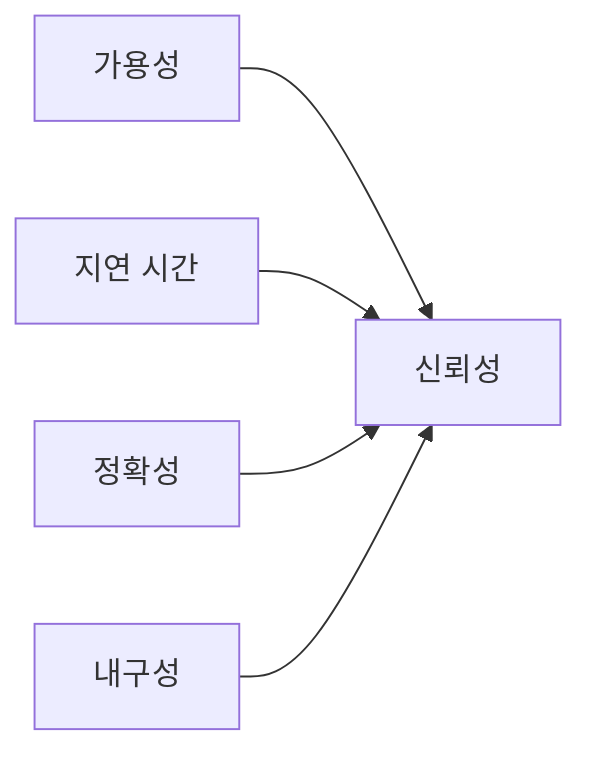

# Reliability

## 이 글에서 다룰 문제

- 신뢰성을 막연한 안정감이 아니라 측정 가능한 값으로 보는 방법을 정리합니다.
- 가용성과 지연 시간의 차이를 실제 운영 관점에서 설명합니다.
- 정확성과 내구성이 왜 데이터 시스템에서 특히 중요한지 살펴봅니다.
- 평균값만 보면 놓치기 쉬운 꼬리 지연과 분위수 개념을 연결합니다.
- 팀이 신뢰성을 설계할 때 어떤 숫자를 우선으로 봐야 하는지 짚어 봅니다.

> SRE 101 시리즈 (2/10)

서비스가 안정적인지 묻는 질문은 생각보다 자주 주관적으로 흘러갑니다. “요즘 괜찮다”, “크게 문제 없었다”, “사용자 불만이 적다” 같은 표현은 분위기를 설명할 수는 있어도 신뢰성을 정의하지는 못합니다. 신뢰성은 감정이 아니라 숫자로 설명할 수 있어야 합니다.

이 글에서는 신뢰성을 네 가지 차원으로 나눠 봅니다. 가용성, 지연 시간, 정확성, 내구성입니다. 네 차원은 서로 겹치지 않으면서도 함께 시스템의 품질을 설명합니다.

## 왜 중요한가

숫자가 없으면 대화가 흔들립니다. 제품팀은 충분히 안정적이라고 생각하고, 운영팀은 아직 위험하다고 느낄 수 있습니다. 같은 시스템을 보고도 결론이 다르게 나오는 이유는 대개 신뢰성을 어떤 차원으로 정의했는지 합의가 없기 때문입니다.

신뢰성을 숫자로 정의하면 우선순위도 분명해집니다. 결제 시스템은 정확성이 더 중요할 수 있고, 스트리밍 서비스는 지연 시간이 더 중요할 수 있습니다. 신뢰성은 항상 하나의 단일 점수가 아니라 서비스 성격에 맞춰 읽어야 하는 묶음입니다.

## 한눈에 보는 개념



> 신뢰성은 한 개의 숫자로 끝나지 않습니다. 사용자가 요청을 보낼 수 있었는지, 빨랐는지, 결과가 맞았는지, 데이터가 보존됐는지를 함께 봐야 합니다.

## 핵심 용어

- availability: 서비스가 사용 가능한 상태였던 비율입니다.
- latency: 요청에 대한 응답 시간입니다.
- correctness: 결과가 기대한 값과 맞는 정도입니다.
- durability: 저장한 데이터가 유지되는 정도입니다.
- MTTR: 장애가 난 뒤 복구까지 걸린 평균 시간입니다.

## Before / After

Before에서는 “잘 동작한다” 같은 표현으로 신뢰성을 대신합니다. 이런 표현은 회의에서는 편하지만, 설계나 개선 작업으로 이어지기 어렵습니다.

After에서는 99.9% 가용성, p95 200ms, 정확도 99.99% 같은 식으로 차원별 숫자를 둡니다. 그러면 어떤 영역이 약한지 분리해서 볼 수 있고, 서비스 특성에 맞는 투자도 가능합니다.

## 단계별로 네 가지 차원 측정하기

### 1단계 — Availability

```python
def availability(uptime_s, total_s):
    return uptime_s / total_s
```

가용성은 가장 익숙한 지표입니다. 다만 이것만으로 신뢰성 전부를 설명할 수는 없습니다. 서비스가 살아 있어도 지나치게 느리거나, 잘못된 결과를 내면 사용자는 여전히 문제를 겪습니다.

### 2단계 — Latency p95

```python
def p95(samples):
    s = sorted(samples)
    return s[int(0.95 * len(s)) - 1]
```

평균 지연 시간은 아름답게 보일 수 있지만, 사용자 체감과 멀어질 때가 많습니다. p95 같은 분위수는 느린 상위 구간을 보여 주므로 실제 경험에 더 가깝습니다.

### 3단계 — Correctness

```python
def correctness(correct, total):
    return correct / total
```

정확성은 종종 가용성 뒤로 밀리지만, 결제·정산·권한 같은 영역에서는 가장 먼저 봐야 할 항목입니다. 빠르게 틀리는 시스템은 느리게 맞는 시스템보다 더 위험할 수 있습니다.

### 4단계 — Durability

```python
def lost_ratio(lost, stored):
    return lost / stored
```

내구성은 저장된 데이터가 어느 정도 보존되는지 보여 줍니다. 백업이 있다고 해서 내구성이 자동으로 보장되지는 않습니다. 복구 시간과 손실 범위까지 함께 봐야 합니다.

### 5단계 — Combined SLOs

```python
slos = {
    "availability": 0.999,
    "p95_ms": 200,
    "correctness": 0.9999,
    "lost_ratio": 1e-9,
}
```

이제 각 차원을 하나의 묶음으로 관리할 수 있습니다. 서비스 성격에 따라 비중은 달라도, 네 차원을 함께 놓고 보면 신뢰성의 모양이 더 선명해집니다.

## 이 코드에서 봐야 할 점

이 예제는 신뢰성이 단일 척도가 아니라는 사실을 보여 줍니다. 가용성과 지연 시간은 요청 처리 경험을 드러내고, 정확성과 내구성은 결과의 품질과 데이터 보존을 설명합니다. 시스템마다 중요한 축이 다르므로, 차원을 구분해 읽는 습관이 필요합니다.

또한 평균값보다 분위수를 더 자주 보는 이유도 드러납니다. 대다수 요청이 빠르더라도 일부 요청이 심각하게 느리면 사용자는 그 느린 순간을 기억합니다. 그래서 p95, p99 같은 값이 실무에서 더 자주 등장합니다.

## 자주 하는 실수 5가지

1. 평균 latency만 보고 tail latency를 무시하는 경우입니다.
2. 가용성이 높으면 신뢰성도 충분하다고 단정하는 경우입니다.
3. 결과의 정확성을 운영 지표에서 제외하는 경우입니다.
4. durability를 단순히 백업 존재 여부로만 판단하는 경우입니다.
5. 서버 내부 수치를 곧바로 고객 경험이라고 받아들이는 경우입니다.

## 실무에서는 이렇게 본다

결제 서비스는 정확성과 내구성에 더 민감합니다. 반대로 검색이나 추천 서비스는 지연 시간과 가용성 변화가 사용자 만족도에 더 큰 영향을 줄 수 있습니다. 그래서 신뢰성은 서비스의 업무 성격과 함께 해석해야 합니다.

시니어 엔지니어는 신뢰성을 측정 기준의 집합으로 봅니다. 숫자를 명확히 정의해 두면 장애 대응, 성능 개선, 비용 논의가 한 방향으로 정렬됩니다. 신뢰성은 운영팀만의 언어가 아니라 제품 의사결정의 언어이기도 합니다.

## 체크리스트

- [ ] 가용성, 지연 시간, 정확성, 내구성 기준을 각각 정의했다.
- [ ] 평균값 외에 p95 또는 p99를 함께 보고 있다.
- [ ] 정확성과 내구성을 검증할 자동화 수단이 있다.
- [ ] 서비스 성격에 따라 어떤 차원을 더 중요하게 볼지 합의했다.

## 연습 문제

1. availability와 latency의 차이를 한 문단으로 설명해 보세요.
2. correctness가 낮은데 availability가 높은 시스템이 왜 위험한지 적어 보세요.
3. durability를 백업과 동일시하면 무엇을 놓치게 되는지 써 보세요.

## 정리와 다음 글

이 글에서는 신뢰성을 가용성, 지연 시간, 정확성, 내구성으로 나눠 보았습니다. 핵심은 신뢰성을 막연한 느낌이 아니라 서비스 특성에 맞는 숫자 조합으로 다루는 데 있습니다. 같은 시스템이라도 어떤 품질을 더 중시하는지에 따라 읽는 방식이 달라진다는 점도 함께 기억해 둘 만합니다.

다음 글에서는 SLI, SLO, SLA를 구분합니다. 무엇을 측정하고, 무엇을 목표로 삼고, 무엇을 외부 약속으로 표현하는지 이어서 정리하겠습니다.

<!-- toc:begin -->
- [SRE란 무엇인가?](./01-what-is-sre.md)
- **Reliability (현재 글)**
- SLI, SLO, SLA (예정)
- Error Budget (예정)
- Monitoring (예정)
- Incident Response (예정)
- Postmortem (예정)
- Toil 줄이기 (예정)
- Capacity Planning (예정)
- 운영 가능한 시스템 만들기 (예정)
<!-- toc:end -->

## 참고 자료

- [Reliability - Google SRE Book](https://sre.google/sre-book/embracing-risk/)
- [Tail at Scale](https://research.google/pubs/pub40801/)
- [The Four Golden Signals](https://sre.google/sre-book/monitoring-distributed-systems/)
- [Availability vs Durability - AWS](https://aws.amazon.com/s3/storage-classes/)

Tags: SRE, Reliability, Availability, Latency, Quality
