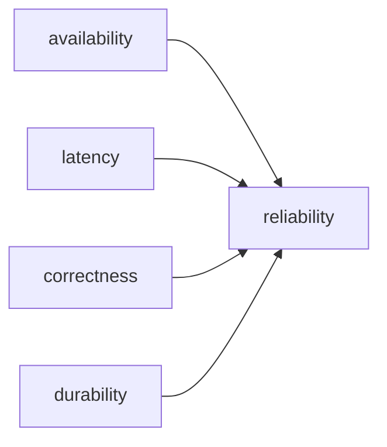

# Reliability

> SRE 101 시리즈 (2/10)


## 이 글에서 다룰 문제

*수치* 가 없으면 *대화* 도 *결정* 도 *주관적* 이 됩니다.

## 개념 한눈에 보기



## Before/After

**Before**: "*잘 동작* 한다" 라는 *주관* 표현.

**After**: "*99.9%* *p95 200ms*" 같은 *수치*.

## 실습: 4차원 측정

### 1단계 — Availability

```python
def availability(uptime_s, total_s):
    return uptime_s / total_s
```

### 2단계 — Latency p95

```python
def p95(samples):
    s = sorted(samples)
    return s[int(0.95 * len(s)) - 1]
```

### 3단계 — Correctness

```python
def correctness(correct, total):
    return correct / total
```

### 4단계 — Durability

```python
def lost_ratio(lost, stored):
    return lost / stored
```

### 5단계 — 통합 SLO

```python
slos = {
    "availability": 0.999,
    "p95_ms": 200,
    "correctness": 0.9999,
    "lost_ratio": 1e-9,
}
```

## 이 코드에서 주목할 점

- *차원* 마다 *지표* 가 다름.
- *p95* 같은 *분위수* 가 *평균* 보다 *유용*.
- *정확성/내구성* 은 *데이터 시스템* 에서 *중요*.

## 자주 하는 실수 5가지

1. ***평균 latency* 만 보기.**
2. ***Availability* 가 *전부* 라고 가정.**
3. ***정확성* 무시.**
4. ***내구성* 을 *백업* 으로만 본다.**
5. ***고객 체감* 과 *서버 지표* 혼동.**

## 실무에서는 이렇게 쓰입니다

*결제 서비스* 는 *정확성* 이 *최우선*, *스트리밍* 은 *지연* 이 *최우선* 입니다.

## 체크리스트

- [ ] *4차원 SLO* 정의.
- [ ] *p95/p99* 모니터링.
- [ ] *정확성* 검증 자동화.
- [ ] *내구성* 정책 명문화.

## 정리 및 다음 단계

다음 글은 *SLI*, *SLO*, *SLA* 의 차이입니다.

<!-- toc:begin -->
- [SRE란 무엇인가?](./01-what-is-sre.md)
- **Reliability (현재 글)**
- SLI, SLO, SLA (예정)
- Error Budget (예정)
- Monitoring (예정)
- Incident Response (예정)
- Postmortem (예정)
- Toil 줄이기 (예정)
- Capacity Planning (예정)
- 운영 가능한 시스템 만들기 (예정)
<!-- toc:end -->

## 참고 자료

- [Reliability - Google SRE Book](https://sre.google/sre-book/embracing-risk/)
- [Tail at Scale](https://research.google/pubs/pub40801/)
- [The Four Golden Signals](https://sre.google/sre-book/monitoring-distributed-systems/)
- [Availability vs Durability - AWS](https://aws.amazon.com/s3/storage-classes/)

Tags: SRE, Reliability, Availability, Latency, Quality
