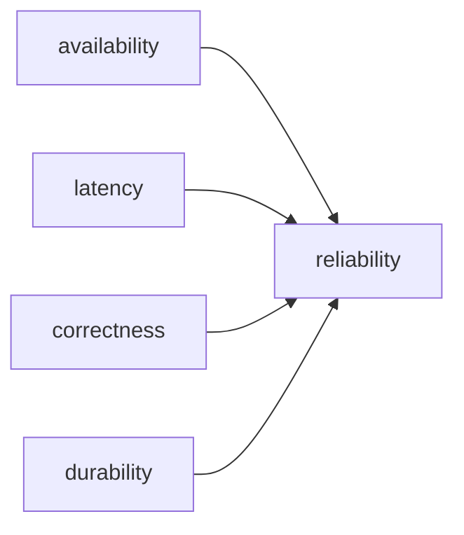

# Reliability

서비스가 안정적인지 물으면 많은 팀이 먼저 분위기를 말합니다. 요즘 큰 불만이 없었다, 장애가 자주 나지는 않았다, 체감상 괜찮다는 식입니다. 이런 말은 팀 분위기를 설명할 수는 있어도 신뢰성을 정의하지는 못합니다.

신뢰성은 감상이 아니라 숫자로 증명할 수 있어야 합니다. 그래야 제품팀과 운영팀이 같은 대상을 보고도 다른 언어를 쓰지 않게 됩니다.

이 글은 SRE 101 시리즈의 2번째 글입니다. 여기서는 reliability를 가용성, 지연 시간, 정확성, 내구성이라는 네 차원으로 나눠 보고, 왜 평균값 하나로는 신뢰성을 설명하기 어려운지 정리합니다.

---

## 이 글에서 다룰 문제

- reliability를 막연한 안정감이 아니라 측정 가능한 값으로 보려면 무엇이 필요할까요?
- 가용성과 지연 시간은 왜 비슷해 보이지만 다른 문제일까요?
- 정확성과 내구성은 어떤 시스템에서 특히 더 중요해질까요?
- 평균 latency보다 p95, p99를 더 자주 보는 이유는 무엇일까요?
- 신뢰성 지표는 어떻게 서비스 성격에 맞게 조합해야 할까요?

## 왜 이 주제가 중요한가

숫자가 없으면 같은 시스템을 보고도 대화가 흔들립니다. 제품팀은 충분히 안정적이라고 느끼는데, 운영팀은 아직 위험하다고 판단할 수 있습니다. 이런 충돌은 의견 차이처럼 보이지만, 실제로는 무엇을 신뢰성으로 볼지 합의가 없는 경우가 많습니다.

또한 서비스마다 중요한 차원이 다릅니다. 결제 시스템은 정확성과 내구성이 특히 중요하고, 검색 서비스는 지연 시간에 훨씬 민감할 수 있습니다. 신뢰성을 한 개의 점수처럼 다루면 이런 차이를 놓치기 쉽습니다.

## 한 문장으로 잡는 멘탈 모델

> 신뢰성은 한 가지 기분 좋은 느낌이 아니라, 사용자가 기대한 결과를 여러 차원의 숫자로 증명하는 일입니다.

## 한눈에 보는 구조



이 그림이 보여 주는 메시지는 단순합니다. 서비스가 살아 있었는지만으로는 충분하지 않습니다. 빨랐는지, 결과가 맞았는지, 저장한 데이터가 유지됐는지도 함께 봐야 신뢰성이라는 말을 제대로 쓸 수 있습니다.

## 핵심 용어 먼저 정리

| 용어 | 뜻 | 실무에서 보는 포인트 |
| --- | --- | --- |
| availability | 서비스가 사용 가능한 상태였던 비율 | 요청을 받을 수 있었는지 보여 줍니다 |
| latency | 요청을 처리하는 데 걸린 시간 | 느린 사용자 경험을 드러냅니다 |
| correctness | 결과가 기대한 값과 맞는 정도 | 빠르게 틀리는 시스템을 잡아냅니다 |
| durability | 저장한 데이터가 유지되는 정도 | 데이터 손실 위험을 드러냅니다 |
| MTTR | 장애 뒤 복구까지 걸린 평균 시간 | 회복 능력의 수준을 보여 줍니다 |

## 신뢰성은 왜 여러 차원으로 나눠야 할까

가용성 하나만 보면 서비스는 멀쩡해 보일 수 있습니다. 그런데 응답이 10초씩 걸리거나, 결과가 틀리거나, 저장한 데이터가 사라진다면 사용자는 이미 실패를 경험한 것입니다. 그래서 신뢰성은 하나의 숫자보다는, 서로 다른 실패 양상을 포착하는 지표 묶음에 가깝습니다.

현업에서는 이 구분이 특히 중요합니다. 예를 들어 결제 API가 99.99% 가용성을 유지해도 금액 계산이 틀리면 신뢰성은 낮습니다. 반대로 추천 시스템이 약간 틀린 결과를 내더라도 빠르게 응답하는 편이 더 중요한 경우도 있습니다. 어떤 차원을 가장 우선으로 둘지는 서비스의 업무 의미에 따라 달라집니다.

## 숫자가 없을 때 생기는 문제

신뢰성을 수치로 정의하지 않으면 회의가 금방 추상적으로 흐릅니다. “요즘 느리다”, “예전보다 덜 안정적이다”, “사용자 불만이 좀 늘었다” 같은 표현은 방향을 알려 주지만, 설계나 투자 우선순위로 연결되기는 어렵습니다.

반대로 차원별 숫자가 있으면 판단이 빨라집니다. 지연 시간이 문제인지, 오류 비율이 문제인지, 데이터 손실 위험이 문제인지 분리해서 볼 수 있기 때문입니다. 강한 팀일수록 신뢰성을 감정이 아니라 분해 가능한 품질 속성으로 다룹니다.

## 단계별로 네 가지 차원 측정하기

### 1단계 — 가용성 측정

```python
def availability(uptime_s, total_s):
    return uptime_s / total_s
```

가용성은 가장 익숙한 출발점입니다. 서비스가 살아 있었는지, 요청을 받을 수 있었는지를 보여 줍니다. 다만 이 값이 높다고 해서 사용자 경험이 자동으로 좋다고 보기는 어렵습니다.

### 2단계 — p95 지연 시간 측정

```python
def p95(samples):
    s = sorted(samples)
    return s[int(0.95 * len(s)) - 1]
```

평균값은 보기 좋게 나올 때가 많습니다. 하지만 사용자는 평균이 아니라 느린 순간을 기억합니다. 그래서 실무에서는 p95, p99 같은 분위수를 더 자주 봅니다. 꼬리 지연이 길어지면 체감 품질이 빠르게 나빠집니다.

### 3단계 — 정확성 측정

```python
def correctness(correct, total):
    return correct / total
```

정확성은 종종 운영 지표에서 뒤로 밀립니다. 그러나 결제, 권한, 정산, 주문 처리처럼 결과가 틀리면 바로 비즈니스 문제가 되는 시스템에서는 가장 먼저 점검해야 할 차원입니다.

### 4단계 — 내구성 측정

```python
def lost_ratio(lost, stored):
    return lost / stored
```

내구성은 저장된 데이터가 어느 정도 보존되는지를 보여 줍니다. 백업을 갖고 있다는 사실만으로 충분하지 않습니다. 실제로 얼마나 잃을 수 있는지, 잃었을 때 얼마나 복구할 수 있는지까지 함께 봐야 합니다.

### 5단계 — 차원을 하나의 목표 묶음으로 정리

```python
slos = {
    "availability": 0.999,
    "p95_ms": 200,
    "correctness": 0.9999,
    "lost_ratio": 1e-9,
}
```

이제 신뢰성은 한 문장이 아니라 운영 가능한 목표 묶음이 됩니다. 서비스 특성에 따라 어떤 차원을 더 엄격하게 잡을지는 달라지지만, 최소한 무엇을 중요하게 보는지는 선명해집니다.

## 이 코드에서 먼저 봐야 할 점

- 신뢰성은 단일 척도가 아니라 여러 차원의 조합입니다.
- p95, p99 같은 분위수는 평균보다 실제 사용자 경험에 더 가깝습니다.
- 정확성과 내구성은 데이터 중심 시스템에서 특히 중요합니다.
- 차원별 목표를 함께 놓아야 서비스 성격에 맞는 운영 판단이 가능합니다.

## 여기서 자주 헷갈립니다

가장 흔한 오해는 availability가 곧 reliability라고 생각하는 것입니다. 서비스가 살아 있어도 응답이 지나치게 느리거나 결과가 틀리면 사용자는 이미 실패를 경험합니다.

또 다른 오해는 평균 latency만 보고 안심하는 것입니다. 평균은 안정적으로 보여도 일부 요청이 심하게 느리면 사용자는 그 느린 구간에서 서비스를 평가합니다. 분위수를 별도로 보는 이유가 여기에 있습니다.

그리고 durability를 백업 유무와 같은 말처럼 다루는 경우도 많습니다. 실제 운영에서는 손실 허용 범위와 복구 가능성이 함께 있어야 내구성 이야기를 할 수 있습니다.

## 운영 체크리스트

- [ ] 가용성, 지연 시간, 정확성, 내구성을 분리해서 정의했다.
- [ ] 평균 외에 p95 또는 p99를 함께 보고 있다.
- [ ] 정확성이 중요한 경로에는 자동 검증 수단이 있다.
- [ ] 데이터 손실 허용 범위와 복구 기대치를 문서화했다.
- [ ] 서비스 성격에 따라 어떤 차원을 더 우선하는지 팀이 합의했다.

## 실무에서는 이렇게 생각합니다

시니어 엔지니어는 신뢰성을 하나의 예쁜 숫자로 포장하려 하지 않습니다. 어떤 시스템은 지연 시간에, 어떤 시스템은 정확성에, 어떤 시스템은 내구성에 더 민감하다는 사실을 전제로 설계합니다.

또한 신뢰성 논의는 운영팀만의 언어가 아닙니다. 제품팀이 어떤 경험을 사용자에게 약속하는지와 바로 연결됩니다. 그래서 좋은 신뢰성 지표는 인프라 상태를 넘어서 제품 품질의 일부가 됩니다.

## 정리

reliability는 막연한 안정감이 아니라, 서비스가 기대한 방식으로 동작했음을 여러 차원의 숫자로 보여 주는 일입니다. 가용성, 지연 시간, 정확성, 내구성을 구분해서 보기 시작하면, 무엇이 흔들리고 있는지 훨씬 더 정확하게 읽을 수 있습니다.

다음 글에서는 SLI, SLO, SLA를 구분합니다. 무엇을 측정하고, 무엇을 목표로 삼고, 무엇을 외부 약속으로 문서화해야 하는지 이어서 정리하겠습니다.

<!-- toc:begin -->
- [SRE란 무엇인가?](./01-what-is-sre.md)
- **Reliability (현재 글)**
- SLI, SLO, SLA (예정)
- Error Budget (예정)
- Monitoring (예정)
- Incident Response (예정)
- Postmortem (예정)
- Toil 줄이기 (예정)
- Capacity Planning (예정)
- 운영 가능한 시스템 만들기 (예정)
<!-- toc:end -->

## 참고 자료

- [Reliability - Google SRE Book](https://sre.google/sre-book/embracing-risk/)
- [Tail at Scale](https://research.google/pubs/pub40801/)
- [The Four Golden Signals](https://sre.google/sre-book/monitoring-distributed-systems/)
- [Availability vs Durability - AWS](https://aws.amazon.com/s3/storage-classes/)

Tags: SRE, Reliability, Availability, Latency, Quality
