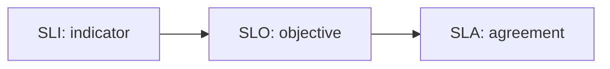

# SLI, SLO, SLA

> SRE 101 시리즈 (3/10)

<!-- a-grade-intro:begin -->

**핵심 질문**: *측정* 과 *목표* 와 *계약* 은 *어떻게* 다를까요?

> *SLI* 는 *지표*, *SLO* 는 *목표*, *SLA* 는 *외부 약속* 입니다.

<!-- a-grade-intro:end -->

## 이 글에서 배울 것

- *SLI*, *SLO*, *SLA* 의 *정의*
- *내부 목표* 와 *외부 약속*
- *좋은 SLO* 의 조건
- *SLA* 의 *법적* 측면
- *합의* 과정

## 왜 중요한가

*세 단어* 를 *섞어* 쓰면 *의사결정* 이 *흔들립니다*.

## 개념 한눈에 보기



## 핵심 용어 정리

- **SLI**: *서비스 수준 지표*.
- **SLO**: *서비스 수준 목표*.
- **SLA**: *서비스 수준 합의*.
- **window**: *측정 기간*.
- **threshold**: *허용 한계*.

## Before/After

**Before**: "*99.9%* 가 *목표* 다" 라고만 *말함*.

**After**: "*어떤 지표*, *기간*, *결과* 라고 *명세*."

## 실습: 정의서 만들기

### 1단계 — SLI 정의

```python
sli = {
    "name": "http_success_ratio",
    "formula": "http_2xx / http_total",
    "source": "ingress logs",
}
```

### 2단계 — SLO 정의

```python
slo = {
    "sli": sli["name"],
    "target": 0.999,
    "window_days": 30,
    "owner": "payments-team",
}
```

### 3단계 — SLA 정의

```python
sla = {
    "slo": slo,
    "remedy": "service credit 10%",
    "exclusions": ["scheduled maintenance"],
}
```

### 4단계 — 위반 판정

```python
def violated(success, total, target):
    return (success / total) < target
```

### 5단계 — 보고

```python
def report(success, total, target):
    return {
        "value": success / total,
        "violated": (success / total) < target,
    }
```

## 이 코드에서 주목할 점

- *SLI* 는 *데이터 출처* 를 *명시*.
- *SLO* 는 *오너* 를 *명시*.
- *SLA* 는 *제외* 와 *보상* 까지 *기록*.

## 자주 하는 실수 5가지

1. ***SLO* 를 *SLA* 처럼 *과도* 약속.**
2. ***SLI 출처* 불명확.**
3. ***window* 누락.**
4. ***오너* 없는 *SLO*.**
5. ***보상* 없이 *SLA* 라 부름.**

## 실무에서는 이렇게 쓰입니다

*B2B 계약* 에서는 *SLA* 가 *문서* 가 되고, *내부* 에서는 *SLO* 가 *기준* 이 됩니다.

## 시니어 엔지니어는 이렇게 생각합니다

- *지표* 는 *고객 시점*.
- *목표* 는 *현실적* 이어야 *유효*.
- *합의* 는 *법무* 와 *함께*.
- *측정 가능* 해야 *목표*.
- *오너* 가 *없는 SLO* 는 *없음*.

## 체크리스트

- [ ] *SLI 명세서*.
- [ ] *SLO 오너* 지정.
- [ ] *SLA 보상 정책*.
- [ ] *예외* 명시.

## 연습 문제

1. *SLI* 의 의미 한 줄로.
2. *SLO* 의 의미 한 줄로.
3. *SLA* 의 의미 한 줄로.

## 정리 및 다음 단계

다음 글은 *Error Budget* 입니다.

<!-- toc:begin -->
- [SRE란 무엇인가?](./01-what-is-sre.md)
- [Reliability](./02-reliability.md)
- **SLI, SLO, SLA (현재 글)**
- Error Budget (예정)
- Monitoring (예정)
- Incident Response (예정)
- Postmortem (예정)
- Toil 줄이기 (예정)
- Capacity Planning (예정)
- 운영 가능한 시스템 만들기 (예정)
<!-- toc:end -->

## 참고 자료

- [Service Level Objectives - Google SRE Book](https://sre.google/sre-book/service-level-objectives/)
- [Implementing SLOs - Google SRE Workbook](https://sre.google/workbook/implementing-slos/)
- [SLI vs SLO vs SLA - Atlassian](https://www.atlassian.com/incident-management/kpis/sla-vs-slo-vs-sli)
- [SLA, SLO, SLI - DigitalOcean](https://www.digitalocean.com/community/tutorials/what-is-sla-slo-sli)

Tags: SRE, SLI, SLO, SLA, Reliability
