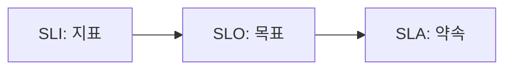

# SLI, SLO, SLA

## 이 글에서 다룰 문제

- SLI, SLO, SLA가 각각 무엇을 뜻하는지 실무 순서대로 구분합니다.
- 내부 목표와 외부 약속이 왜 다른 문서여야 하는지 설명합니다.
- 좋은 SLO에는 어떤 요소가 빠지면 안 되는지 살펴봅니다.
- 측정 창, 데이터 출처, 오너가 빠진 목표가 왜 위험한지 짚어 봅니다.
- SLA를 약속이라고 부르기 위해 어떤 보상과 예외 조항이 필요한지 정리합니다.

> SRE 101 시리즈 (3/10)

SRE를 처음 배울 때 가장 자주 헷갈리는 세 단어가 SLI, SLO, SLA입니다. 셋 다 비슷하게 들리고 모두 숫자와 연결되기 때문입니다. 하지만 셋을 섞어 쓰기 시작하면 팀 대화가 바로 흔들립니다.

어떤 지표를 재는지, 내부적으로 어디까지를 목표로 삼는지, 고객이나 계약 상대에게 무엇을 약속하는지는 서로 다른 문제입니다. 이 글은 그 셋을 같은 층위에 놓지 않고, 측정에서 목표로, 목표에서 약속으로 이어지는 흐름으로 설명합니다.

## 왜 중요한가

SLI, SLO, SLA를 구분하지 않으면 목표가 흐려집니다. 측정 공식이 없는 목표는 검증할 수 없고, 보상 조항이 없는 SLA는 약속이 아니라 희망사항에 가깝습니다.

반대로 셋을 분리해 두면 의사결정이 단단해집니다. 운영팀은 SLI를 바탕으로 현재 상태를 읽고, 제품팀은 SLO를 기준으로 속도와 안정성을 조절하며, 비즈니스 팀은 SLA로 외부 기대치를 관리합니다.

## 한눈에 보는 개념



> SLI는 무엇을 재는지 정의하고, SLO는 어디까지를 목표로 삼을지 정하며, SLA는 그 목표 중 일부를 외부와의 약속으로 문서화합니다.

## 핵심 용어

- SLI: 서비스 수준을 측정하는 지표입니다.
- SLO: 팀이 내부적으로 운영 기준으로 삼는 목표입니다.
- SLA: 외부 고객 또는 파트너와 맺는 서비스 수준 약속입니다.
- window: 지표를 평가하는 기간입니다.
- threshold: 허용 한계나 목표 수치입니다.

## Before / After

Before에서는 누군가 “99.9%가 목표입니다”라고 말하고 끝납니다. 무엇을 99.9%로 보는지, 어떤 기간 동안 재는지, 어기면 어떤 일이 생기는지가 비어 있습니다.

After에서는 한 장의 명세가 생깁니다. 어떤 SLI를 쓰는지, 측정 데이터는 어디서 오는지, 오너는 누구인지, 목표를 못 지켰을 때 내부적으로 어떻게 움직이고 외부적으로 어떤 책임을 지는지가 함께 기록됩니다.

## 단계별로 명세 작성하기

### 1단계 — SLI 정의

```python
sli = {
    "name": "http_success_ratio",
    "formula": "http_2xx / http_total",
    "source": "ingress logs",
}
```

SLI는 측정의 출발점입니다. 어떤 공식을 쓸지뿐 아니라 데이터가 어디에서 오는지도 함께 적어야 합니다. 출처가 불명확하면 지표 값이 바뀌어도 누구도 원인을 설명하기 어렵습니다.

### 2단계 — SLO 정의

```python
slo = {
    "sli": sli["name"],
    "target": 0.999,
    "window_days": 30,
    "owner": "payments-team",
}
```

SLO에는 목표 수치와 기간, 오너가 들어갑니다. 특히 오너가 없으면 운영 기준도 존재하지 않는 것과 비슷합니다. 누가 상태를 읽고 조정할지 명확해야 목표가 살아 움직입니다.

### 3단계 — SLA 정의

```python
sla = {
    "slo": slo,
    "remedy": "service credit 10%",
    "exclusions": ["scheduled maintenance"],
}
```

SLA는 외부 약속이므로 보상과 예외 조항이 필요합니다. 내부 목표를 곧바로 외부 약속으로 내보내면 지나치게 공격적인 약속이 되거나, 반대로 실제 의미 없는 문서가 될 수 있습니다.

### 4단계 — 위반 판정

```python
def violated(success, total, target):
    return (success / total) < target
```

목표는 위반 여부를 즉시 판정할 수 있어야 합니다. 숫자가 있어도 판정 규칙이 모호하면 운영 판단은 다시 감으로 돌아갑니다.

### 5단계 — 보고 형식 정리

```python
def report(success, total, target):
    return {
        "value": success / total,
        "violated": (success / total) < target,
    }
```

마지막 단계는 측정 결과를 사람이 읽을 수 있는 형태로 정리하는 일입니다. 운영 보고, 주간 리뷰, 고객 커뮤니케이션까지 이어지려면 값과 위반 여부가 한눈에 보이는 구조가 좋습니다.

## 이 코드에서 봐야 할 점

이 예제는 세 단어의 층위를 분명하게 나눕니다. SLI는 관찰 도구이고, SLO는 내부 운영 기준이며, SLA는 외부 약속입니다. 셋을 섞지 않으면 숫자가 늘어나도 오히려 더 단순하게 읽힙니다.

또한 목표에는 오너와 기간이 빠지면 안 됩니다. 99.9%라는 수치만으로는 아무것도 결정할 수 없습니다. 누가 보고, 어떤 창에서 평가하고, 위반되면 어떻게 움직일지를 함께 써야 목표가 실제 도구가 됩니다.

## 자주 하는 실수 5가지

1. 내부 SLO를 그대로 외부 SLA처럼 말해 과도한 약속을 만드는 경우입니다.
2. 데이터 출처가 불분명한 SLI를 정의하는 경우입니다.
3. 측정 기간을 적지 않아 목표 해석이 달라지는 경우입니다.
4. 오너 없는 SLO를 만들어 아무도 책임지지 않는 경우입니다.
5. 보상 조항 없이 SLA라고 부르는 경우입니다.

## 실무에서는 이렇게 본다

B2B 서비스에서는 SLA가 계약서 일부가 되기도 합니다. 이때 법무와 영업, 운영이 모두 같은 문서를 봅니다. 반면 SLO는 더 공격적이고 실무적인 내부 기준으로 쓰이는 경우가 많습니다.

시니어 엔지니어는 “측정할 수 없으면 목표가 아니다”라는 태도를 갖습니다. 숫자와 정의가 명확할수록 분쟁은 줄고, 논의는 빨라집니다. SLI, SLO, SLA는 개념 구분을 위한 약어가 아니라 팀의 책임 범위를 정리하는 프레임입니다.

## 체크리스트

- [ ] SLI 공식과 데이터 출처를 문서화했다.
- [ ] SLO에 목표 수치, 기간, 오너를 적었다.
- [ ] SLA에 보상과 예외 조항을 명시했다.
- [ ] 위반 여부를 자동으로 판정할 수 있다.

## 연습 문제

1. SLI, SLO, SLA를 각각 한 문장으로 정의해 보세요.
2. 내부 목표와 외부 약속을 분리해야 하는 이유를 적어 보세요.
3. 오너 없는 SLO가 왜 실무에서 무의미해지는지 설명해 보세요.

## 정리와 다음 글

이 글에서는 SLI를 지표, SLO를 내부 목표, SLA를 외부 약속으로 구분했습니다. 셋의 경계를 분명히 해야 측정과 운영, 계약이 서로 다른 역할을 하면서도 한 방향으로 정렬됩니다.

다음 글에서는 에러 버짓을 다룹니다. 목표를 세운 뒤, 어느 정도 실패를 허용하고 그 범위 안에서 어떻게 출시 속도를 조절할지 이어서 살펴보겠습니다.

<!-- toc:begin -->
- [SRE란 무엇인가?](./01-what-is-sre.md)
- [Reliability](./02-reliability.md)
- **SLI, SLO, SLA (현재 글)**
- Error Budget (예정)
- Monitoring (예정)
- Incident Response (예정)
- Postmortem (예정)
- Toil 줄이기 (예정)
- Capacity Planning (예정)
- 운영 가능한 시스템 만들기 (예정)
<!-- toc:end -->

## 참고 자료

- [Service Level Objectives - Google SRE Book](https://sre.google/sre-book/service-level-objectives/)
- [Implementing SLOs - Google SRE Workbook](https://sre.google/workbook/implementing-slos/)
- [SLI vs SLO vs SLA - Atlassian](https://www.atlassian.com/incident-management/kpis/sla-vs-slo-vs-sli)
- [SLA, SLO, SLI - DigitalOcean](https://www.digitalocean.com/community/tutorials/what-is-sla-slo-sli)

Tags: SRE, SLI, SLO, SLA, Reliability
