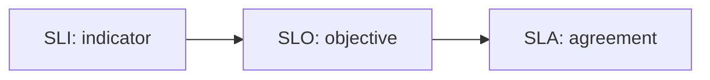

# SLI, SLO, SLA

신뢰성 이야기를 시작하면 거의 반드시 세 약어가 따라옵니다. SLI, SLO, SLA입니다. 셋 다 숫자와 관련 있고 이름도 비슷해서, 실무에서도 섞여 쓰이는 경우가 적지 않습니다.

문제는 이 셋을 섞어 쓰는 순간부터 목표와 약속의 경계가 무너진다는 점입니다. 무엇을 재는지, 어디까지를 내부 기준으로 삼는지, 외부에 무엇을 약속하는지를 분리하지 않으면 운영도 계약도 불안해집니다.

이 글은 SRE 101 시리즈의 3번째 글입니다. 여기서는 SLI, SLO, SLA를 측정, 목표, 약속의 순서로 구분하고, 각 문서에 무엇이 빠지면 안 되는지 정리합니다.

---

## 이 글에서 다룰 문제

- SLI, SLO, SLA는 각각 어떤 역할을 맡고 어디서 경계가 갈릴까요?
- 내부 목표와 외부 약속은 왜 같은 문서가 아니어야 할까요?
- 좋은 SLO에는 목표 수치 외에 어떤 정보가 반드시 들어가야 할까요?
- 데이터 출처와 측정 기간이 빠진 지표는 왜 위험할까요?
- SLA라고 부르려면 보상과 예외 조항이 왜 필요할까요?

## 왜 이 주제가 중요한가

셋을 구분하지 않으면 팀 대화가 금방 흐려집니다. 운영팀은 “99.9%를 지키고 있다”고 말하는데, 제품팀은 그 숫자가 무엇을 기준으로 한 것인지 모르고, 영업팀은 그 수치를 외부 약속처럼 전달해 버릴 수 있습니다. 이 상태가 오래가면 분쟁은 늘고 개선은 느려집니다.

반대로 SLI, SLO, SLA를 분리해 두면 역할이 선명해집니다. SLI는 관찰 도구이고, SLO는 내부 운영 기준이며, SLA는 외부 약속입니다. 이 순서를 잡아 두면 숫자가 많아져도 구조는 오히려 단순해집니다.

## 한 문장으로 잡는 멘탈 모델

> SLI는 무엇을 재는지, SLO는 어디까지를 목표로 삼는지, SLA는 그중 무엇을 외부에 약속하는지 정리한 층위입니다.

## 한눈에 보는 구조



이 흐름을 머릿속에 넣어 두면 문서 구조가 바로 정리됩니다. 먼저 측정 대상을 정하고, 그다음 내부 목표를 세우고, 마지막으로 외부 약속이 필요하면 별도 합의를 문서화합니다.

## 핵심 용어 먼저 정리

| 용어 | 뜻 | 빠지면 생기는 문제 |
| --- | --- | --- |
| SLI | 서비스 수준을 재는 지표 | 무엇을 측정하는지 불분명해집니다 |
| SLO | 내부 운영 목표 | 출시와 안정성 판단 기준이 없어집니다 |
| SLA | 외부 고객과의 서비스 수준 약속 | 약속 위반 시 책임 범위가 모호해집니다 |
| window | 지표를 평가하는 기간 | 같은 숫자도 다르게 해석됩니다 |
| threshold | 목표 수치 또는 허용 한계 | 위반 여부 판단이 흔들립니다 |

## 셋을 같은 층위에 놓으면 왜 위험할까

예를 들어 누군가 “우리 서비스는 99.9%를 보장합니다”라고 말했다고 해 보겠습니다. 여기에는 적어도 네 가지 빈칸이 있습니다. 무엇을 99.9%로 보는지, 어떤 기간 동안 재는지, 누가 이 목표를 책임지는지, 지키지 못했을 때 어떤 일이 생기는지입니다.

SLI, SLO, SLA는 이 빈칸을 메우는 역할을 나눕니다. SLI는 측정 공식을 명확히 하고, SLO는 목표와 오너를 정하고, SLA는 보상과 예외까지 포함한 약속을 남깁니다. 이 분리가 없으면 숫자는 있어도 운영은 여전히 모호합니다.

## 좋은 SLO에 반드시 들어가야 할 것

좋은 SLO는 단순히 숫자가 높은 목표가 아닙니다. 어떤 SLI를 기준으로 하는지, 어느 기간 동안 평가하는지, 누가 오너인지가 분명해야 합니다. 그래야 목표 위반이 실제 행동으로 이어집니다.

특히 오너가 없는 SLO는 실무에서 거의 존재하지 않는 것과 같습니다. 숫자는 적혀 있어도 아무도 책임 있게 읽지 않기 때문입니다. 강한 팀일수록 SLO를 문서가 아니라 운영 기준으로 취급합니다.

## 단계별로 명세 작성하기

### 1단계 — SLI 정의

```python
sli = {
    "name": "http_success_ratio",
    "formula": "http_2xx / http_total",
    "source": "ingress logs",
}
```

SLI는 측정의 출발점입니다. 이름과 공식만으로는 부족하고, 데이터 출처도 함께 적어야 합니다. 출처가 모호하면 지표 값이 달라졌을 때 누구도 원인을 설명하기 어렵습니다.

### 2단계 — SLO 정의

```python
slo = {
    "sli": sli["name"],
    "target": 0.999,
    "window_days": 30,
    "owner": "payments-team",
}
```

SLO에는 목표 수치, 측정 기간, 오너가 함께 들어가야 합니다. 목표가 있어도 오너가 없으면 운영 기준이 살아 움직이지 않습니다. 누가 보고, 누가 조정할지를 명시해야 합니다.

### 3단계 — SLA 정의

```python
sla = {
    "slo": slo,
    "remedy": "service credit 10%",
    "exclusions": ["scheduled maintenance"],
}
```

SLA는 외부 약속이므로 보상과 예외 조항이 필요합니다. 내부에서 공격적으로 잡은 SLO를 그대로 외부 계약으로 내보내면 지나치게 강한 약속이 되거나, 반대로 아무 의미 없는 문서가 될 수 있습니다.

### 4단계 — 위반 판정

```python
def violated(success, total, target):
    return (success / total) < target
```

좋은 목표는 위반 여부를 즉시 판정할 수 있어야 합니다. 숫자만 있고 판정 규칙이 모호하면 운영 판단은 다시 감으로 돌아갑니다.

### 5단계 — 보고 형식 정리

```python
def report(success, total, target):
    return {
        "value": success / total,
        "violated": (success / total) < target,
    }
```

운영에서는 측정 결과를 읽기 쉬운 형식으로 정리하는 일도 중요합니다. 값과 위반 여부가 함께 보여야 주간 리뷰, 장애 회고, 고객 커뮤니케이션까지 자연스럽게 이어집니다.

## 이 코드에서 먼저 봐야 할 점

- SLI는 지표 정의와 데이터 출처를 함께 가져야 합니다.
- SLO는 목표 수치만이 아니라 기간과 오너를 포함해야 합니다.
- SLA는 외부 약속이므로 보상과 예외 조항이 빠지면 안 됩니다.
- 위반 판정과 보고 형식까지 있어야 숫자가 실제 운영에 쓰입니다.

## 여기서 자주 헷갈립니다

가장 흔한 실수는 SLO를 SLA처럼 말하는 것입니다. 내부 목표는 더 공격적일 수 있지만, 외부 약속은 보상과 예외를 고려해 신중하게 정해야 합니다.

또 하나는 SLI를 공식만으로 정의하는 것입니다. 데이터 출처가 빠지면 숫자를 재현하기 어렵고, 팀 간 논쟁이 길어집니다. 측정 도구와 로그 위치까지 명시하는 습관이 필요합니다.

마지막으로 측정 기간을 적지 않는 경우도 많습니다. 99.9%라는 값은 하루 기준인지 한 달 기준인지에 따라 운영 의미가 완전히 달라집니다.

## 운영 체크리스트

- [ ] SLI의 이름, 공식, 데이터 출처를 문서화했다.
- [ ] SLO에 목표 수치, 측정 기간, 오너를 적었다.
- [ ] SLA에 보상과 예외 조항을 명시했다.
- [ ] 위반 여부를 자동 판정할 수 있다.
- [ ] 내부 목표와 외부 약속을 혼동하지 않는다.

## 실무에서는 이렇게 생각합니다

시니어 엔지니어는 “측정할 수 없으면 목표가 아니다”라는 태도를 갖습니다. 실제로 측정할 수 없는 SLO는 결국 회의 자료로만 남고, 운영 기준으로 기능하지 못합니다.

또한 B2B 환경에서는 SLA가 법무와 영업이 함께 보는 문서가 되기도 합니다. 이때 SLO와 SLA의 경계를 명확히 해 두지 않으면 운영 숫자가 계약 분쟁으로 번질 수 있습니다. 기술 문서와 비즈니스 문서가 만나는 지점이라서 더 신중해야 합니다.

## 정리

SLI, SLO, SLA는 비슷한 약어가 아니라 서로 다른 책임층입니다. SLI는 측정, SLO는 내부 목표, SLA는 외부 약속을 뜻합니다. 이 구분이 선명해야 신뢰성 숫자가 운영 판단과 고객 기대를 함께 지탱할 수 있습니다.

다음 글에서는 에러 버짓을 다룹니다. 목표를 세운 뒤 어느 정도 실패를 허용하고, 그 범위 안에서 어떻게 출시 속도를 조절할지 이어서 정리하겠습니다.

<!-- toc:begin -->
- [SRE란 무엇인가?](./01-what-is-sre.md)
- [Reliability](./02-reliability.md)
- **SLI, SLO, SLA (현재 글)**
- Error Budget (예정)
- Monitoring (예정)
- Incident Response (예정)
- Postmortem (예정)
- Toil 줄이기 (예정)
- Capacity Planning (예정)
- 운영 가능한 시스템 만들기 (예정)
<!-- toc:end -->

## 참고 자료

- [Service Level Objectives - Google SRE Book](https://sre.google/sre-book/service-level-objectives/)
- [Implementing SLOs - Google SRE Workbook](https://sre.google/workbook/implementing-slos/)
- [SLI vs SLO vs SLA - Atlassian](https://www.atlassian.com/incident-management/kpis/sla-vs-slo-vs-sli)
- [SLA, SLO, SLI - DigitalOcean](https://www.digitalocean.com/community/tutorials/what-is-sla-slo-sli)

Tags: SRE, SLI, SLO, SLA, Reliability
