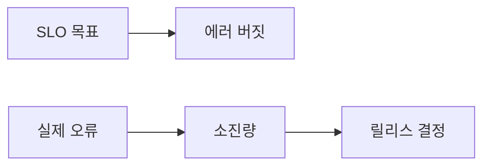

# Error Budget

## 이 글에서 다룰 문제

- 에러 버짓이 왜 출시 속도와 안정성 사이의 공통 언어가 되는지 설명합니다.
- SLO를 세운 뒤 허용 가능한 실패 범위를 어떻게 계산하는지 살펴봅니다.
- burn rate가 단순 경고가 아니라 조기 신호인 이유를 정리합니다.
- 버짓이 소진됐을 때 팀이 어떤 정책으로 움직여야 하는지 짚어 봅니다.
- 에러 버짓을 사람을 비난하는 도구로 쓰면 왜 실패하는지도 함께 봅니다.

> SRE 101 시리즈 (4/10)

신뢰성 목표를 세우면 곧바로 다음 질문이 따라옵니다. 그러면 실패는 전혀 허용하지 않는가 하는 질문입니다. 현실의 서비스는 언제나 일부 실패 가능성을 안고 있고, 팀은 그 범위 안에서 기능 출시와 실험을 이어 갑니다.

에러 버짓은 바로 그 허용 범위를 숫자로 표현한 개념입니다. 실패를 가볍게 여기자는 뜻이 아니라, 어느 정도 위험까지는 감수할지 미리 합의하자는 뜻입니다. 그래서 에러 버짓이 있으면 속도와 안정성을 감정이 아니라 정책으로 다룰 수 있습니다.

## 왜 중요한가

에러 버짓이 없으면 장애가 날 때마다 조직이 흔들립니다. 어떤 팀은 모든 변경을 중단하자고 하고, 어떤 팀은 어쩔 수 없는 비용이라고 넘깁니다. 그 결과 같은 사건을 두고도 대처가 매번 달라집니다.

반대로 버짓이 있으면 남은 허용 범위에 따라 판단할 수 있습니다. 아직 여유가 있으면 실험을 이어 갈 수 있고, 빠르게 소진되고 있으면 안정화 작업을 우선해야 합니다. 이 단순한 구조가 팀 문화를 꽤 크게 바꿉니다.

## 한눈에 보는 개념



> 에러 버짓은 신뢰성 목표의 반대편에 있는 여유 공간입니다. 그 공간이 얼마나 남았는지에 따라 팀의 위험 감수 수준이 달라집니다.

## 핵심 용어

- error budget: 목표가 허용하는 실패량입니다.
- burn rate: 버짓이 소모되는 속도입니다.
- freeze: 새 릴리스나 위험한 변경을 잠시 멈추는 정책입니다.
- window: 버짓을 평가하는 기간입니다.
- policy: 버짓 상태에 따라 취하는 행동 규칙입니다.

## Before / After

Before에서는 장애가 나면 비난과 방어가 먼저 나옵니다. 한 번의 사건만 보고 “당분간 배포 금지” 같은 결론으로 뛰는 경우도 많습니다.

After에서는 버짓 관점으로 상태를 읽습니다. 아직 허용 범위가 남아 있으면 실험을 계속하고, 버짓이 거의 소진됐거나 burn rate가 급격히 오르면 릴리스 속도를 줄이고 복구 작업에 집중합니다.

## 단계별로 버짓 운영하기

### 1단계 — 예산 계산

```python
def budget(target, total):
    return (1 - target) * total
```

에러 버짓은 SLO에서 바로 나옵니다. 목표가 99.9%라면 0.1%의 실패가 허용됩니다. 추상적인 원칙이 아니라 계산 가능한 숫자라는 점이 중요합니다.

### 2단계 — 소진 비율 계산

```python
def spent(errors, allowed):
    return errors / allowed
```

현재까지 허용량 중 얼마를 썼는지 계산합니다. 이 비율은 상태판 역할을 합니다. 단일 장애보다 누적 흐름을 보는 데 유용합니다.

### 3단계 — Burn rate 확인

```python
def burn_rate(errors_in_h, allowed_per_h):
    return errors_in_h / allowed_per_h
```

burn rate는 지금 얼마나 빠르게 버짓을 태우고 있는지 보여 줍니다. 누적 소진 비율이 아직 높지 않아도, 짧은 시간 안에 빠르게 나빠지고 있다면 조기 대응이 필요합니다.

### 4단계 — 정책 분기

```python
def policy(spent_ratio):
    if spent_ratio > 1.0:
        return "freeze"
    if spent_ratio > 0.5:
        return "review"
    return "ship"
```

에러 버짓은 숫자만으로는 충분하지 않습니다. 숫자를 행동으로 바꾸는 정책이 있어야 합니다. review와 freeze 같은 상태를 미리 정해 두면 장애 상황에서도 팀이 덜 흔들립니다.

### 5단계 — 빠른 소진 경고

```python
def alert(burn):
    return burn > 14.4  # 14.4x: fast burn
```

짧은 창에서의 burn rate 경고는 큰 장애를 초기에 잡는 데 도움이 됩니다. 이 값은 조직마다 다르지만, 중요한 점은 누적 수치만 보지 말고 속도도 함께 보라는 것입니다.

## 이 코드에서 봐야 할 점

에러 버짓은 신뢰성 목표의 부산물이 아니라 운영 정책의 중심축입니다. 계산식은 단순하지만, 그 값을 기준으로 릴리스와 안정화 우선순위를 정할 수 있다는 점이 핵심입니다.

또한 burn rate가 중요한 이유도 분명합니다. 월간 버짓이 아직 충분해 보여도 몇 시간 안에 급격히 소진되고 있으면 상황은 이미 심각할 수 있습니다. 그래서 누적 값과 속도를 함께 봐야 합니다.

## 자주 하는 실수 5가지

1. 에러 버짓을 문서에만 적고 실제 운영에는 반영하지 않는 경우입니다.
2. 누적 소진량만 보고 burn rate를 무시하는 경우입니다.
3. freeze 조건이 없어 매번 즉흥적으로 결정하는 경우입니다.
4. SLO와 에러 버짓을 서로 다른 도구에서 따로 관리하는 경우입니다.
5. 버짓을 사람을 혼내는 근거로 써서 학습 문화를 해치는 경우입니다.

## 실무에서는 이렇게 본다

버짓이 충분할 때는 카나리 확대나 신규 기능 실험 같은 변화를 더 적극적으로 시도할 수 있습니다. 반대로 소진이 빠를 때는 신기능보다 안정화, 장애 원인 제거, 모니터링 보강이 우선입니다.

시니어 엔지니어는 에러 버짓을 벌점표로 보지 않습니다. 팀이 어느 정도 위험까지 감당할 수 있는지 알려 주는 계기판으로 봅니다. 그래서 숫자뿐 아니라, 숫자에 연결된 행동 규칙과 팀 합의가 함께 중요합니다.

## 체크리스트

- [ ] SLO에서 에러 버짓을 계산할 수 있다.
- [ ] 누적 소진 비율과 burn rate를 함께 모니터링한다.
- [ ] review와 freeze 정책을 문서화했다.
- [ ] 버짓 상태가 릴리스 판단에 실제로 반영된다.

## 연습 문제

1. 에러 버짓을 한 문장으로 정의해 보세요.
2. 누적 소진량과 burn rate가 서로 다른 정보를 주는 이유를 설명해 보세요.
3. 버짓이 소진됐을 때 어떤 작업을 우선해야 할지 적어 보세요.

## 정리와 다음 글

이 글에서는 에러 버짓을 목표와 현실 사이의 허용 가능한 실패 범위로 설명했습니다. 중요한 점은 숫자만 만드는 데 있지 않고, 그 숫자를 릴리스 정책과 안정화 우선순위로 연결하는 데 있습니다.

다음 글에서는 monitoring을 다룹니다. 어떤 지표를 봐야 행동으로 이어지는지, 그리고 알림 피로 없이 시스템 상태를 읽는 방법을 이어서 살펴보겠습니다.

<!-- toc:begin -->
- [SRE란 무엇인가?](./01-what-is-sre.md)
- [Reliability](./02-reliability.md)
- [SLI, SLO, SLA](./03-sli-slo-sla.md)
- **Error Budget (현재 글)**
- Monitoring (예정)
- Incident Response (예정)
- Postmortem (예정)
- Toil 줄이기 (예정)
- Capacity Planning (예정)
- 운영 가능한 시스템 만들기 (예정)
<!-- toc:end -->

## 참고 자료

- [Embracing Risk - Google SRE Book](https://sre.google/sre-book/embracing-risk/)
- [Alerting on SLOs - Google SRE Workbook](https://sre.google/workbook/alerting-on-slos/)
- [Error Budgets - Atlassian](https://www.atlassian.com/incident-management/kpis/error-budget)
- [Error Budget Policy - Google](https://sre.google/workbook/error-budget-policy/)

Tags: SRE, ErrorBudget, Reliability, Release, Risk
