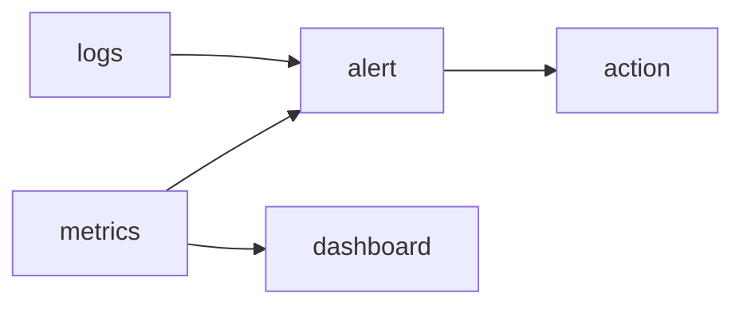

# Monitoring

> SRE 101 시리즈 (5/10)

<!-- a-grade-intro:begin -->

**핵심 질문**: *무엇* 을 *언제* *알아야* *행동* 할 수 있을까요?

> *Monitoring* 은 *행동* 으로 *이어지는* *측정* 입니다.

<!-- a-grade-intro:end -->

## 이 글에서 배울 것

- *4대 신호*
- *메트릭* 과 *로그*
- *알림* 설계
- *대시보드* 원칙
- *피로도* 관리

## 왜 중요한가

*알림 폭주* 는 *진짜 문제* 를 *덮습니다*.

## 개념 한눈에 보기



## 핵심 용어 정리

- **golden signals**: *latency, traffic, errors, saturation*.
- **alert**: *행동 필요* 신호.
- **threshold**: *임계값*.
- **dashboard**: *상태 화면*.
- **paging**: *호출 알림*.

## Before/After

**Before**: *모든 지표* 를 *모음*.

**After**: *행동* 으로 *이어지는* *지표* 만 *알림*.

## 실습: 4대 신호 측정

### 1단계 — Latency

```python
def latency_p95(samples):
    s = sorted(samples)
    return s[int(0.95 * len(s)) - 1]
```

### 2단계 — Traffic

```python
def rps(reqs, seconds):
    return reqs / seconds
```

### 3단계 — Errors

```python
def error_ratio(err, total):
    return err / total
```

### 4단계 — Saturation

```python
def saturation(used, capacity):
    return used / capacity
```

### 5단계 — 알림 규칙

```python
def should_page(err_ratio, p95_ms, sat):
    return err_ratio > 0.01 or p95_ms > 500 or sat > 0.9
```

## 이 코드에서 주목할 점

- *4대 신호* 는 *공통 언어*.
- *알림* 은 *행동* 가능 해야.
- *대시보드* 는 *서사* 가 있어야.

## 자주 하는 실수 5가지

1. ***모든 것* 에 알림.**
2. ***평균* 만 모니터링.**
3. ***Saturation* 무시.**
4. ***대시보드* 가 *그래프 무덤*.**
5. ***알림 피로* 방치.**

## 실무에서는 이렇게 쓰입니다

*Prometheus* 메트릭과 *Loki* 로그를 *Grafana* 에서 *함께* 봅니다.

## 시니어 엔지니어는 이렇게 생각합니다

- *알림* 은 *호출* 의 *예약*.
- *대시보드* 는 *질문* 에 *답*.
- *지표* 는 *고객 경험* 과 *연결*.
- *피로도* 는 *KPI*.
- *운영* 도 *디자인*.

## 체크리스트

- [ ] *4대 신호* 정의.
- [ ] *임계값* 합의.
- [ ] *대시보드* 정리.
- [ ] *알림 피로* 측정.

## 연습 문제

1. *4대 신호* 한 줄로.
2. *saturation* 의 의미 한 줄로.
3. *paging* 의 의미 한 줄로.

## 정리 및 다음 단계

다음 글은 *Incident Response* 입니다.

<!-- toc:begin -->
- [SRE란 무엇인가?](./01-what-is-sre.md)
- [Reliability](./02-reliability.md)
- [SLI, SLO, SLA](./03-sli-slo-sla.md)
- [Error Budget](./04-error-budget.md)
- **Monitoring (현재 글)**
- Incident Response (예정)
- Postmortem (예정)
- Toil 줄이기 (예정)
- Capacity Planning (예정)
- 운영 가능한 시스템 만들기 (예정)
<!-- toc:end -->

## 참고 자료

- [Monitoring Distributed Systems - Google SRE Book](https://sre.google/sre-book/monitoring-distributed-systems/)
- [Practical Alerting - Google SRE Book](https://sre.google/sre-book/practical-alerting/)
- [USE Method - Brendan Gregg](https://www.brendangregg.com/usemethod.html)
- [Prometheus Best Practices](https://prometheus.io/docs/practices/alerting/)

Tags: SRE, Monitoring, Metrics, Alerting, Observability
