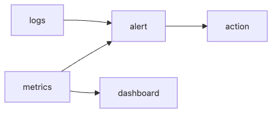

# Monitoring

운영 초기에 팀은 가능한 한 많은 수치를 모으는 데 안심을 느끼곤 합니다. CPU, 메모리, 요청 수, 큐 길이, 오류 로그를 다 저장해 두면 언젠가 쓸모가 있을 것 같기 때문입니다. 하지만 많이 모은다고 해서 모니터링이 좋아지는 것은 아닙니다.

좋은 모니터링은 데이터를 많이 쌓는 체계가 아니라, 지금 움직여야 하는지 바로 판단하는 체계입니다. 알림이 울렸는데도 누구도 무엇을 해야 할지 모르면 그 신호는 이미 역할을 잃은 상태입니다.

이 글은 SRE 101 시리즈의 5번째 글입니다. 여기서는 monitoring을 행동으로 이어지는 측정으로 정의하고, 네 가지 핵심 운영 신호, 알림 설계 원칙, 대시보드 구성 방식, 알림 피로를 줄이는 관점을 정리합니다.

---

## 이 글에서 다룰 문제

- monitoring은 단순 수집과 어떻게 다를까요?
- latency, traffic, errors, saturation은 왜 함께 봐야 할까요?
- 메트릭과 로그는 각각 어떤 질문에 답할까요?
- 좋은 알림 규칙은 어떤 조건을 가져야 할까요?
- 대시보드는 왜 그래프를 많이 붙인다고 좋아지지 않을까요?

## 왜 이 주제가 중요한가

알림이 너무 많으면 중요한 신호가 묻힙니다. 반대로 알림이 너무 약하면 사용자가 먼저 장애를 발견합니다. 모니터링의 품질은 데이터 양보다 행동 연결성이 좌우합니다.

또한 팀이 자주 보는 지표는 곧 팀이 중요하다고 여기는 품질 기준이 됩니다. 어떤 메트릭에 알림을 걸고, 어떤 그래프를 첫 화면에 두는지는 운영 문화 자체를 형성합니다.

## 한 문장으로 잡는 멘탈 모델

> 모니터링은 많이 보는 기술이 아니라, 필요한 순간에 바로 행동하게 만드는 측정 설계입니다.

## 한눈에 보는 구조



*메트릭과 로그가 알림과 대시보드를 거쳐 실제 대응으로 이어지는 모니터링 흐름입니다.*
메트릭과 로그는 그냥 저장되는 데이터가 아니라, 알림과 대시보드를 거쳐 대응으로 이어져야 합니다. 이 연결이 없으면 관측은 하고 있어도 운영 판단은 여전히 느립니다.

## 핵심 용어 먼저 정리

| 용어 | 뜻 | 실무에서 보는 포인트 |
| --- | --- | --- |
| golden signals | latency, traffic, errors, saturation 네 신호 | 시스템 상태를 빠르게 읽는 공통 언어가 됩니다 |
| alert | 즉시 행동이 필요한 신호 | 설명용이 아니라 행동용이어야 합니다 |
| threshold | 경고를 발생시키는 기준값 | 팀 합의가 없으면 남발되기 쉽습니다 |
| dashboard | 상태를 한눈에 읽는 화면 | 질문에 답하는 순서가 있어야 합니다 |
| paging | 사람을 깨우는 수준의 호출 | 정말 즉시 대응이 필요한 경우에만 써야 합니다 |

## 모니터링을 이해하는 가장 좋은 방법

모니터링은 모든 것을 수집하는 일이 아닙니다. **행동으로 이어지는 측정만 남기는 일**에 더 가깝습니다. 그래서 좋은 모니터링 체계는 메트릭을 무한히 늘리기보다, 어떤 수치가 실제로 대응을 바꾸는지를 먼저 따집니다.

현업에서 강한 팀은 대시보드와 알림을 구분해서 봅니다. 대시보드는 상황을 이해하는 데 쓰고, 알림은 지금 바로 움직일지 여부를 판단하는 데 씁니다. 이 경계가 무너지면 그래프는 많은데 행동은 느린 상태가 됩니다.

## 네 가지 신호를 함께 봐야 하는 이유

latency는 느린가를, traffic은 평소와 같은 수요가 들어오고 있는가를, errors는 실패가 늘고 있는가를, saturation은 곧 자원이 한계에 닿는가를 보여 줍니다. 네 신호는 서로 다른 질문에 답합니다.

예를 들어 오류 비율이 낮아도 saturation이 95%에 가까우면 큰 장애 직전일 수 있습니다. 반대로 트래픽이 평소보다 급감했다면, 오류가 보이지 않아도 라우팅이나 수집 계층 문제가 있을 수 있습니다. 네 축을 함께 봐야 상황을 입체적으로 읽을 수 있습니다.

## 단계별로 핵심 네 신호 측정하기

### 1단계 — 지연 시간

```python
def latency_p95(samples):
    s = sorted(samples)
    return s[int(0.95 * len(s)) - 1]
```

사용자는 평균이 아니라 느린 요청을 기억합니다. 그래서 latency는 평균보다 p95, p99 같은 분위수로 보는 편이 실제 체감과 더 잘 맞습니다.

### 2단계 — 트래픽

```python
def rps(reqs, seconds):
    return reqs / seconds
```

트래픽은 시스템에 들어오는 수요를 보여 줍니다. 갑자기 늘어나는 것도 문제지만, 갑자기 줄어드는 것도 문제일 수 있습니다. 예상했던 요청이 보이지 않는 상태는 사용자 진입 경로나 상위 시스템 이상을 뜻할 수 있습니다.

### 3단계 — 오류 비율

```python
def error_ratio(err, total):
    return err / total
```

오류 개수보다 오류 비율이 더 유용한 경우가 많습니다. 전체 요청이 늘어난 상황과 아닌 상황을 구분할 수 있기 때문입니다. 사용자가 실제로 얼마나 넓게 영향을 받는지도 더 잘 드러납니다.

### 4단계 — 포화도

```python
def saturation(used, capacity):
    return used / capacity
```

포화도는 아직 장애가 나지 않았더라도, 곧 자원 한계가 문제를 만들지 읽게 해 줍니다. CPU, 메모리, 큐 길이, 연결 수처럼 한계에 가까워질수록 대기 시간이 길어지는 자원이 대표적입니다.

### 5단계 — 페이지 알림 규칙

```python
def should_page(err_ratio, p95_ms, sat):
    return err_ratio > 0.01 or p95_ms > 500 or sat > 0.9
```

페이지 알림은 사람이 즉시 개입해야 할 때만 울려야 합니다. 밤에 사람을 깨울 만큼 중요한 조건인지 먼저 묻는 습관이 있으면 알림 설계가 훨씬 단단해집니다.

### 6단계 — 지연 시간 급증 시 첫 확인 순서 정하기

골든 시그널은 많이 보는 지표 묶음이 아니라, 대응 순서를 줄여 주는 질문 묶음이기도 합니다. latency 알림이 울렸을 때 무엇부터 확인할지 정리되어 있지 않으면, 좋은 메트릭이 있어도 대응은 여전히 느립니다.

| 증상 | 첫 확인 대상 | 왜 여기부터 보는가 |
| --- | --- | --- |
| p95 latency 상승, traffic은 평소와 비슷 | saturation과 외부 의존성 지연 | 수요 변화 없이 느려지면 자원 압박이나 downstream 지연이 먼저 의심됩니다. |
| traffic 급감 | ingress, CDN, 상위 라우팅 상태 | 앱은 멀쩡해도 요청이 도달하지 못하면 트래픽이 먼저 줄어듭니다. |
| errors와 saturation 동시 상승 | 큐 길이, timeout, 연결 풀 | 용량 한계에 닿기 직전의 전형적인 신호입니다. |
| errors 상승, latency 변화는 작음 | 최근 배포, 인증·권한 경로 | 빠르게 실패하는 문제는 로직이나 설정 이상일 가능성이 큽니다. |

### 7단계 — 구조화 이벤트를 알림 판단과 연결하기

```python
def classify_event(status_code, latency_ms, cache_hit):
    page = status_code >= 500 or latency_ms > 800
    investigate = latency_ms > 300 and not cache_hit
    return {"page": page, "investigate": investigate}
```

이 예시는 단순하지만 중요한 감각을 보여 줍니다. 같은 지연 시간 급증이라도 캐시 미스가 늘어난 상황인지, 5xx가 함께 올라가는 상황인지에 따라 대응 우선순위가 달라집니다. 메트릭을 맥락과 함께 읽을수록 알림의 품질도 좋아집니다.

## 이 코드에서 먼저 봐야 할 점

- 네 가지 신호는 운영에서 공통 언어 역할을 합니다.
- 알림은 행동 가능한 조건에만 걸어야 합니다.
- 대시보드는 그래프 묶음이 아니라 질문에 답하는 화면이어야 합니다.
- 메트릭은 고객 경험과 연결될수록 운영 판단이 빨라집니다.

## 여기서 자주 헷갈립니다

가장 흔한 실수는 모든 지표에 알림을 붙이는 것입니다. 알림 수가 많다고 통제가 잘되는 것이 아닙니다. 오히려 중요한 호출을 묻어 버릴 가능성이 큽니다.

또 다른 실수는 평균값만 보는 것입니다. 평균이 안정적으로 보여도 p95, p99가 나쁘면 사용자는 이미 문제를 겪고 있습니다. 특히 latency는 꼬리 구간을 별도로 봐야 합니다.

대시보드를 크게 만드는 것이 좋은 설계라고 믿는 경우도 많습니다. 하지만 질문 순서가 없는 대시보드는 그래프 묘지에 가깝습니다. 먼저 무엇을 확인해야 할지 드러나야 합니다.

## 운영 체크리스트

- [ ] latency, traffic, errors, saturation을 모두 본다.
- [ ] 페이지 알림은 즉시 행동이 필요한 경우에만 울린다.
- [ ] 평균 외에 분위수 지표를 함께 본다.
- [ ] 대시보드는 질문 순서에 맞춰 구성되어 있다.
- [ ] 알림 피로를 정기적으로 측정하고 정리한다.

## 실무에서는 이렇게 생각합니다

시니어 엔지니어는 알림을 예약된 전화처럼 취급합니다. 이 신호가 울렸을 때 정말 사람이 바로 움직여야 하는가를 먼저 묻습니다. 이 기준이 분명할수록 알림은 적어도 더 강해집니다.

또한 메트릭과 로그는 경쟁 관계가 아닙니다. 메트릭으로 이상 시점을 찾고, 로그로 원인 후보를 좁히는 식으로 함께 써야 합니다. 여기에 트레이스까지 더해지면 요청 경로를 더 정밀하게 읽을 수 있습니다.

## 정리

monitoring은 데이터를 많이 쌓는 일이 아니라, 시스템 상태를 보고 바로 행동할 수 있게 만드는 일입니다. 네 가지 핵심 신호를 공통 언어로 삼고, 알림과 대시보드를 서로 다른 역할로 설계하면 운영 판단 속도와 품질이 함께 좋아집니다.

다음 글에서는 incident response를 다룹니다. 실제 장애가 터졌을 때 누가 어떤 순서로 움직여야 하는지, 그리고 모니터링 신호가 대응으로 어떻게 이어지는지 정리하겠습니다.

<!-- toc:begin -->
- [SRE란 무엇인가?](./01-what-is-sre.md)
- [Reliability](./02-reliability.md)
- [SLI, SLO, SLA](./03-sli-slo-sla.md)
- [Error Budget](./04-error-budget.md)
- **Monitoring (현재 글)**
- Incident Response (예정)
- Postmortem (예정)
- Toil 줄이기 (예정)
- Capacity Planning (예정)
- 운영 가능한 시스템 만들기 (예정)
<!-- toc:end -->

## 참고 자료

- [Monitoring Distributed Systems - Google SRE Book](https://sre.google/sre-book/monitoring-distributed-systems/)
- [Practical Alerting - Google SRE Book](https://sre.google/sre-book/practical-alerting/)
- [USE Method - Brendan Gregg](https://www.brendangregg.com/usemethod.html)
- [Prometheus Best Practices](https://prometheus.io/docs/practices/alerting/)

Tags: SRE, Monitoring, Metrics, Alerting, Observability
