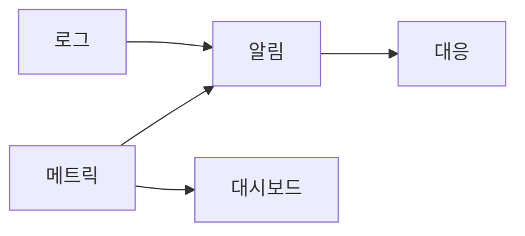

# Monitoring

## 이 글에서 다룰 문제

- monitoring이 단순 수집이 아니라 행동을 위한 측정이라는 점을 설명합니다.
- 네 가지 핵심 운영 신호를 어떻게 읽어야 하는지 정리합니다.
- 메트릭과 로그가 각자 어떤 역할을 맡는지 비교합니다.
- 알림이 많을수록 좋은 것이 아닌 이유와 알림 피로 문제를 짚어 봅니다.
- 대시보드가 그래프 창고가 되지 않으려면 무엇이 필요한지 살펴봅니다.

> SRE 101 시리즈 (5/10)

운영 초기에 팀은 종종 가능한 모든 수치를 모으는 데 집중합니다. CPU, 메모리, 요청 수, 큐 길이, 로그, 이벤트를 다 저장해 두면 안심이 되기 때문입니다. 하지만 수집이 곧 monitoring은 아닙니다.

monitoring은 행동으로 이어지는 측정입니다. 문제가 생겼을 때 누가 무엇을 보고 어떤 대응을 할지 연결되어 있어야 합니다. 알림이 수십 개씩 울리는데도 아무도 움직이지 않는다면, 그 시스템은 관측하고 있어도 제대로 모니터링하고 있지는 않은 셈입니다.

## 왜 중요한가

알림이 너무 많으면 중요한 신호가 묻힙니다. 반대로 너무 적으면 사용자가 먼저 장애를 발견합니다. monitoring의 핵심은 더 많이 보는 데 있지 않고, 더 빨리 판단할 수 있게 만드는 데 있습니다. 결국 중요한 것은 데이터의 양이 아니라, 지금 움직여야 하는지 바로 알 수 있는 구조입니다.

또한 좋은 monitoring은 장애 대응뿐 아니라 설계 개선에도 영향을 줍니다. 자주 보는 지표가 곧 팀이 중요하다고 여기는 품질 기준이 되기 때문입니다.

## 한눈에 보는 개념



> monitoring은 수집으로 끝나지 않습니다. 메트릭과 로그가 알림과 대시보드로 연결되고, 그 결과가 실제 대응으로 이어질 때 비로소 의미가 생깁니다.

## 핵심 용어

- golden signals: 지연 시간, 트래픽, 오류, 포화도 네 가지 핵심 운영 신호입니다.
- alert: 즉시 행동이 필요한 상태를 알리는 신호입니다.
- threshold: 경고를 발생시키는 기준값입니다.
- dashboard: 시스템 상태를 한눈에 읽는 화면입니다.
- paging: 온콜 담당자를 깨우는 수준의 호출입니다.

## Before / After

Before에서는 가능한 지표를 다 모으고, 임계값을 낮게 잡아 경고를 남발합니다. 팀은 곧 알림을 무시하게 되고, 진짜 문제도 늦게 발견합니다.

After에서는 사용자의 체감과 연결되는 지표를 우선합니다. 알림은 행동 가능할 때만 울리고, 대시보드는 질문에 답하는 순서로 구성됩니다.

## 단계별로 핵심 네 신호 측정하기

### 1단계 — Latency

```python
def latency_p95(samples):
    s = sorted(samples)
    return s[int(0.95 * len(s)) - 1]
```

지연 시간은 사용자가 가장 직접적으로 느끼는 품질입니다. 평균보다 p95, p99 같은 분위수로 보는 편이 실제 체감에 더 가깝습니다.

### 2단계 — Traffic

```python
def rps(reqs, seconds):
    return reqs / seconds
```

트래픽은 시스템에 얼마나 많은 수요가 들어오는지 보여 줍니다. 평소보다 갑자기 줄거나 늘어도 모두 이상 신호일 수 있습니다.

### 3단계 — Errors

```python
def error_ratio(err, total):
    return err / total
```

에러 비율은 현재 장애가 사용자에게 얼마나 넓게 퍼지고 있는지 보여 줍니다. 절대 개수보다 전체 요청 대비 비율이 더 유용한 경우가 많습니다.

### 4단계 — Saturation

```python
def saturation(used, capacity):
    return used / capacity
```

포화도는 아직 장애가 나지 않았더라도 곧 문제로 이어질 압박을 읽게 해 줍니다. CPU, 메모리, 큐 길이, 연결 수 같은 값이 여기에 들어갑니다.

### 5단계 — 알림 규칙

```python
def should_page(err_ratio, p95_ms, sat):
    return err_ratio > 0.01 or p95_ms > 500 or sat > 0.9
```

마지막 단계는 신호를 행동으로 바꾸는 일입니다. 페이지를 울릴 조건은 신중해야 합니다. 곧바로 사람이 깨어나야 할 수준의 문제인지 먼저 묻는 편이 좋습니다.

## 이 코드에서 봐야 할 점

네 가지 핵심 신호는 서로 다른 질문에 답합니다. 지연 시간은 느린가, 트래픽은 평소와 같은가, 오류는 실패가 늘었는가, 포화도는 곧 한계에 닿는가를 보여 줍니다. 네 축을 함께 보면 현재 상태를 더 입체적으로 읽을 수 있습니다.

또한 알림은 데이터의 요약본이 아니라 행동 트리거여야 합니다. 대시보드는 상황을 이해하는 데 쓰고, 알림은 지금 바로 움직일지 말지를 결정하는 데 써야 합니다.

## 자주 하는 실수 5가지

1. 모든 지표에 알림을 붙여 알림 피로를 키우는 경우입니다.
2. 평균값만 보고 꼬리 지연을 놓치는 경우입니다.
3. 포화도를 뒤늦게 확인해 사전 대응 기회를 잃는 경우입니다.
4. 질문 없이 그래프만 쌓아 대시보드가 복잡해지는 경우입니다.
5. 알림이 실제로 도움이 되는지 주기적으로 검토하지 않는 경우입니다.

## 실무에서는 이렇게 본다

현업에서는 메트릭과 로그를 따로 보지 않고 함께 엮습니다. 메트릭으로 이상 시점을 찾고, 로그로 원인 후보를 좁히는 방식입니다. 하나는 계기판이고, 다른 하나는 사건 기록에 가깝습니다. 여기에 추적 데이터까지 붙으면 요청 하나가 지나간 경로도 더 선명하게 보입니다.

시니어 엔지니어는 알림을 예약된 전화라고 생각합니다. 밤에 사람을 깨울 만큼 중요한가를 기준으로 판단합니다. 이런 관점이 있으면 알림 규칙이 훨씬 보수적이고 명확해집니다.

## 체크리스트

- [ ] 지연 시간, 트래픽, 오류, 포화도를 모두 본다.
- [ ] 페이지 알림 기준이 행동 가능 상태와 연결된다.
- [ ] 대시보드가 질문 순서에 맞춰 구성되어 있다.
- [ ] 알림 피로를 주기적으로 측정하고 정리한다.

## 연습 문제

1. 핵심 운영 신호 네 가지를 한 줄로 적어 보세요.
2. 포화도가 조기 경고가 되는 이유를 설명해 보세요.
3. 좋은 페이지 알림의 조건을 세 가지로 정리해 보세요.

## 정리와 다음 글

이 글에서는 monitoring을 행동으로 이어지는 측정으로 설명했습니다. 핵심은 많이 모으는 데 있지 않고, 사용자 경험과 운영 판단에 직접 연결되는 신호를 정리하는 데 있습니다.

다음 글에서는 incident response를 다룹니다. 실제 장애가 터졌을 때 팀이 어떤 순서와 역할로 움직여야 하는지 이어서 보겠습니다. 좋은 모니터링이 결국 좋은 대응의 출발점이라는 점도 함께 연결해서 보게 됩니다.

<!-- toc:begin -->
- [SRE란 무엇인가?](./01-what-is-sre.md)
- [Reliability](./02-reliability.md)
- [SLI, SLO, SLA](./03-sli-slo-sla.md)
- [Error Budget](./04-error-budget.md)
- **Monitoring (현재 글)**
- Incident Response (예정)
- Postmortem (예정)
- Toil 줄이기 (예정)
- Capacity Planning (예정)
- 운영 가능한 시스템 만들기 (예정)
<!-- toc:end -->

## 참고 자료

- [Monitoring Distributed Systems - Google SRE Book](https://sre.google/sre-book/monitoring-distributed-systems/)
- [Practical Alerting - Google SRE Book](https://sre.google/sre-book/practical-alerting/)
- [USE Method - Brendan Gregg](https://www.brendangregg.com/usemethod.html)
- [Prometheus Best Practices](https://prometheus.io/docs/practices/alerting/)

Tags: SRE, Monitoring, Metrics, Alerting, Observability
