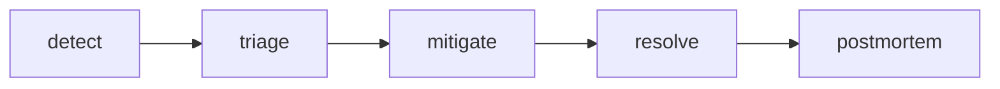

# Incident Response

장애가 시작되는 순간 기술 문제만 커지는 것은 아닙니다. 사람도 동시에 흔들립니다. 누가 먼저 판단할지, 누가 복구를 맡을지, 누가 고객과 내부 조직에 상태를 알릴지 정해져 있지 않으면 같은 수준의 장애도 훨씬 크게 번집니다.

강한 팀은 장애가 없을 때 절차를 준비합니다. 장애가 난 다음에 역할을 정하는 조직보다, 미리 역할과 채널과 종료 기준을 정해 둔 조직이 훨씬 빠르게 회복합니다.

이 글은 SRE 101 시리즈의 6번째 글입니다. 여기서는 incident response를 정해진 순서와 역할을 가진 팀 활동으로 설명하고, 심각도 분류, Incident Commander, 커뮤니케이션 규칙, 종료 기준을 함께 정리합니다.

---

## 이 글에서 다룰 문제

- 장애 대응은 왜 개인 역량보다 팀 구조에 더 크게 좌우될까요?
- 심각도는 왜 느낌이 아니라 영향 기준으로 정의해야 할까요?
- Incident Commander는 무엇을 직접 하고 무엇을 하지 말아야 할까요?
- 복구 작업과 고객 커뮤니케이션은 왜 동시에 움직여야 할까요?
- 종료 선언과 인수인계 기준이 없으면 어떤 문제가 생길까요?

## 왜 이 주제가 중요한가

혼란은 장애 영향을 키웁니다. 기술적으로는 빨리 복구할 수 있는 문제였는데도, 역할 충돌과 커뮤니케이션 지연 때문에 대응 시간이 늘어나는 경우가 많습니다. 장애 대응 체계는 기술 수준만큼이나 운영 성숙도를 보여 주는 지표입니다.

또한 좋은 대응 절차는 복구 속도만 높이는 것이 아닙니다. 고객 신뢰를 덜 잃게 하고, 기록을 남기며, 다음 포스트모템으로 자연스럽게 이어지게 만듭니다. 장애 대응은 단발성 행동이 아니라 학습 체계의 입구이기도 합니다.

## 한 문장으로 잡는 멘탈 모델

> 장애 대응은 모두가 동시에 뛰어드는 일이 아니라, 역할이 분리된 팀이 정해진 순서로 움직이는 작업입니다.

## 한눈에 보는 구조



탐지, 분류, 완화, 해결, 포스트모템이라는 흐름을 기준으로 보면 장애 대응이 훨씬 읽기 쉬워집니다. 복구만 끝내면 되는 일이 아니라, 기록과 후속 학습까지 이어지는 전 과정으로 봐야 합니다.

## 핵심 용어 먼저 정리

| 용어 | 뜻 | 실무에서 하는 역할 |
| --- | --- | --- |
| incident | 실제 영향을 가진 비정상 상태 | 대응이 필요한 사건을 구분합니다 |
| severity | 장애 영향의 크기 | 대응 강도와 참여 범위를 정합니다 |
| IC | Incident Commander | 우선순위와 의사결정을 조율합니다 |
| ops lead | 복구 작업을 이끄는 역할 | 기술 조치를 정리하고 실행합니다 |
| comms lead | 내부와 외부 공지를 맡는 역할 | 고객과 조직의 신뢰 축을 지킵니다 |

## 장애 대응은 왜 역할 분리가 먼저일까

장애가 나면 가장 잘 아는 사람이 가장 많이 말하게 되기 쉽습니다. 하지만 기술적으로 가장 많은 지식을 가진 사람이 반드시 조율까지 잘하는 것은 아닙니다. 그래서 대응 체계에서는 역할 분리가 중요합니다.

Incident Commander는 직접 모든 문제를 해결하는 사람이 아닙니다. 현재 상황에서 무엇이 가장 중요한지 정하고, 누구에게 어떤 작업을 맡길지 결정하는 사람입니다. 반대로 ops lead와 개별 전문가들은 복구 작업에 집중해야 합니다. 이 구분이 있어야 의사결정과 실행이 서로 방해하지 않습니다.

## 심각도는 왜 숫자와 영향으로 정의해야 할까

심각도를 주관적으로 정하면 조직마다 같은 장애를 다르게 해석합니다. 어떤 사람은 사용자 1,000명 영향도 큰 사고로 보고, 어떤 사람은 1시간 이상 지속되지 않으면 낮게 볼 수 있습니다. 이 차이를 줄이려면 기준을 문서화해야 합니다.

심각도는 보통 영향 사용자 수, 지속 시간, 핵심 기능 마비 여부 같은 축으로 정의합니다. 중요한 점은 누가 봐도 비슷한 판정을 내릴 수 있어야 한다는 것입니다. 그래야 온콜 호출 범위와 공지 수준도 일관되게 맞출 수 있습니다.

## 단계별로 대응 절차 정의하기

### 1단계 — 심각도 기준 만들기

```python
def severity(impact_users, duration_min):
    if impact_users > 10000 or duration_min > 60:
        return "SEV1"
    if impact_users > 1000:
        return "SEV2"
    return "SEV3"
```

심각도는 감정보다 영향 기준으로 정해야 합니다. 사용자 수와 지속 시간이 대표적인 기준입니다. 여기에 핵심 결제 기능 마비 같은 조건이 더해질 수도 있습니다.

### 2단계 — IC 지정

```python
def assign_ic(on_call):
    return on_call[0]
```

IC는 대응 중 단일한 조율 축을 만드는 역할입니다. 모두의 의견을 듣되, 다음 결정을 미루지 않는 사람이 필요합니다. 합의만 기다리면 장애는 길어집니다.

### 3단계 — 채널 생성

```python
def channel(name):
    return f"#inc-{name}"
```

전용 채널은 기록을 남기고, 대응 대화를 한곳에 모읍니다. 나중에 타임라인을 재구성할 때도 큰 도움이 됩니다. 장애 대응이 구두로만 흩어지면 복구는 끝나도 학습은 남기기 어렵습니다.

### 4단계 — 상태 업데이트 규칙

```python
def update(channel, msg, every_min=15):
    return {"channel": channel, "msg": msg, "every": every_min}
```

장애 중에는 원인을 아직 몰라도 정기 업데이트가 필요합니다. 현재 영향, 우회책, 다음 공지 시각만 반복해서 알려도 신뢰를 지키는 데 도움이 됩니다. 침묵은 상황을 더 나쁘게 만듭니다.

### 5단계 — 종료 조건 확인

```python
def can_close(mitigated, customer_impact_zero):
    return mitigated and customer_impact_zero
```

복구가 끝났다는 말과 장애를 닫아도 된다는 말은 다를 수 있습니다. 임시 우회만 된 상태인지, 실제 고객 영향이 사라졌는지, 후속 인수인계가 필요한지까지 확인해야 합니다.

## 이 코드에서 먼저 봐야 할 점

- 심각도는 영향 기준으로 정의됩니다.
- IC는 단일한 의사결정 축을 만듭니다.
- 전용 채널은 기록과 협업을 동시에 지원합니다.
- 종료 기준이 있어야 장애가 애매하게 열린 채로 남지 않습니다.

## 여기서 자주 헷갈립니다

첫 번째 실수는 IC가 직접 모든 기술 문제를 해결해야 한다고 생각하는 것입니다. IC의 역할은 조율과 우선순위 결정입니다. 전문가들이 복구 작업에 집중할 수 있게 만드는 사람이기도 합니다.

두 번째 실수는 고객 공지를 기술 복구 뒤로 미루는 것입니다. 원인을 아직 몰라도 현재 영향과 다음 업데이트 시각을 알리는 편이 훨씬 낫습니다.

세 번째 실수는 종료 선언을 너무 빨리 하는 것입니다. 대시보드 수치가 잠깐 안정됐다고 끝난 것이 아닙니다. 사용자 영향이 실제로 사라졌는지까지 봐야 합니다.

## 운영 체크리스트

- [ ] 심각도 기준이 숫자와 영향으로 정의되어 있다.
- [ ] IC, 복구 담당, 커뮤니케이션 담당 역할을 구분했다.
- [ ] 전용 채널과 정기 업데이트 규칙이 있다.
- [ ] 종료 조건과 인수인계 기준이 문서화되어 있다.
- [ ] 장애 기록이 포스트모템으로 이어질 준비가 되어 있다.

## 실무에서는 이렇게 생각합니다

시니어 엔지니어는 장애 대응을 기술 실력만으로 풀리는 문제로 보지 않습니다. 잘 준비된 절차가 없으면 뛰어난 엔지니어도 혼란 속에서 힘을 제대로 쓰기 어렵기 때문입니다.

또한 PagerDuty, Slack, Statuspage 같은 도구는 절차를 강화할 수는 있어도 대신해 주지는 못합니다. 먼저 필요한 것은 역할과 기준입니다. 자동화는 구조가 있을 때 가장 잘 작동합니다.

## 정리

incident response는 정해진 순서와 역할을 갖춘 팀 활동입니다. 심각도를 영향 기준으로 정하고, IC를 중심으로 복구와 커뮤니케이션을 병렬로 움직이며, 종료 기준까지 명확히 할 때 장애 대응은 더 짧고 덜 혼란스러워집니다.

다음 글에서는 postmortem을 다룹니다. 장애가 끝난 뒤 무엇을 남겨야 같은 문제가 반복되지 않는지, 기록과 액션 추적 관점에서 이어서 정리하겠습니다.

<!-- toc:begin -->
- [SRE란 무엇인가?](./01-what-is-sre.md)
- [Reliability](./02-reliability.md)
- [SLI, SLO, SLA](./03-sli-slo-sla.md)
- [Error Budget](./04-error-budget.md)
- [Monitoring](./05-monitoring.md)
- **Incident Response (현재 글)**
- Postmortem (예정)
- Toil 줄이기 (예정)
- Capacity Planning (예정)
- 운영 가능한 시스템 만들기 (예정)
<!-- toc:end -->

## 참고 자료

- [Managing Incidents - Google SRE Book](https://sre.google/sre-book/managing-incidents/)
- [Incident Response - PagerDuty](https://response.pagerduty.com/)
- [Incident Command System](https://en.wikipedia.org/wiki/Incident_Command_System)
- [Atlassian Incident Handbook](https://www.atlassian.com/incident-management/handbook)

Tags: SRE, Incident, Response, OnCall, Operations
