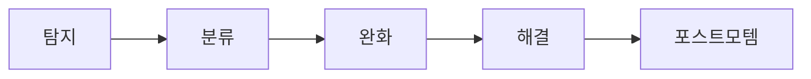

# Incident Response

## 이 글에서 다룰 문제

- 장애가 발생했을 때 팀이 어떤 순서로 움직여야 하는지 정리합니다.
- 심각도를 감정이 아니라 영향 기준으로 나누는 방법을 설명합니다.
- Incident Commander를 포함한 역할 분리가 왜 중요한지 살펴봅니다.
- 기술 대응과 고객 커뮤니케이션을 동시에 다뤄야 하는 이유를 짚어 봅니다.
- 종료 선언과 인수인계 기준이 모호하면 어떤 문제가 생기는지 설명합니다.

> SRE 101 시리즈 (6/10)

장애는 기술 문제이지만, 대응 과정은 팀 문제이기도 합니다. 원인을 아는 사람이 많아도 동시에 말하기 시작하면 오히려 판단이 늦어질 수 있습니다. 장애 대응이 어려운 이유는 시스템이 복잡해서이기도 하지만, 사람들의 움직임도 쉽게 혼란스러워지기 때문입니다.

장애 대응 절차는 이 혼란을 줄이기 위한 장치입니다. 누가 의사결정을 맡고, 누가 원인 분석을 하고, 누가 고객과 내부 조직에 상황을 알릴지를 미리 정해 두면 같은 수준의 장애라도 훨씬 차분하게 다룰 수 있습니다.

## 왜 중요한가

혼란은 장애의 영향을 키웁니다. 기술적으로는 복구 가능한 문제였는데도 역할 충돌과 소통 실패 때문에 대응 시간이 길어지는 일이 자주 있습니다.

좋은 장애 대응은 복구 속도만 높이는 것이 아닙니다. 기록을 남기고, 후속 학습으로 이어지게 만들며, 고객 신뢰를 불필요하게 잃지 않도록 돕습니다. 결국 대응 체계도 신뢰성의 일부입니다.

## 한눈에 보는 개념



> 장애 대응은 한 번의 영웅적 복구가 아니라 정해진 순서를 따르는 팀 활동입니다. 탐지와 분류, 완화와 해결, 학습까지 한 흐름으로 봐야 합니다.

## 핵심 용어

- incident: 사용자나 시스템에 실제 영향을 주는 비정상 상태입니다.
- severity: 장애 영향의 크기를 나타내는 등급입니다.
- IC: Incident Commander로, 대응 중 최종 의사결정을 조율하는 역할입니다.
- ops lead: 복구 작업과 기술 조치를 이끄는 역할입니다.
- comms lead: 고객과 내부 조직에 상태를 알리는 역할입니다.

## Before / After

Before에서는 장애가 시작되자마자 모두가 동시에 대응합니다. 누가 결정을 내리는지 불명확하고, 채널도 뒤섞입니다.

After에서는 심각도를 먼저 정하고, IC를 세우고, 대응 채널을 만들고, 일정한 주기로 상황을 공유합니다. 이렇게 하면 전문가들은 복구에 집중하고, 의사결정과 소통은 별도 축으로 안정됩니다.

## 단계별로 대응 절차 정의하기

### 1단계 — 심각도 기준 만들기

```python
def severity(impact_users, duration_min):
    if impact_users > 10000 or duration_min > 60:
        return "SEV1"
    if impact_users > 1000:
        return "SEV2"
    return "SEV3"
```

심각도는 느낌이 아니라 영향으로 정해야 합니다. 사용자 수, 지속 시간, 핵심 기능 마비 여부 같은 기준이 숫자로 있어야 대응 강도가 흔들리지 않습니다.

### 2단계 — IC 지정

```python
def assign_ic(on_call):
    return on_call[0]
```

IC는 모든 기술 문제를 직접 해결하는 사람이 아닙니다. 우선순위를 정하고, 사람들을 배치하고, 다음 결정을 명확히 하는 역할입니다. 이 구분이 있어야 전문가들이 각자 맡은 복구 작업에 집중할 수 있습니다.

### 3단계 — 채널 생성

```python
def channel(name):
    return f"#inc-{name}"
```

전용 채널은 기록을 보존합니다. 나중에 타임라인을 재구성할 때도 도움이 되고, 현재 어떤 논의가 오가고 있는지 팀이 한곳에서 볼 수 있게 해 줍니다.

### 4단계 — 상태 업데이트 규칙

```python
def update(channel, msg, every_min=15):
    return {"channel": channel, "msg": msg, "every": every_min}
```

정기 업데이트는 고객과 내부 팀 모두에게 중요합니다. 원인을 아직 몰라도 현재 영향, 우회책, 다음 공지 시각을 반복해서 알려 주는 편이 신뢰를 지키는 데 도움이 됩니다.

### 5단계 — 종료 조건 확인

```python
def can_close(mitigated, customer_impact_zero):
    return mitigated and customer_impact_zero
```

종료 선언은 복구 작업만 끝났다고 바로 내리면 안 됩니다. 실제 고객 영향이 사라졌는지, 임시 우회가 아니라 안정된 상태인지까지 확인해야 합니다.

## 이 코드에서 봐야 할 점

이 예제는 장애 대응이 기술 분석 절차이면서 동시에 역할 설계라는 점을 보여 줍니다. 심각도는 영향 기준으로 정의되고, IC는 단일한 조율 축을 만들며, 채널과 업데이트 규칙은 기록과 신뢰를 남깁니다.

또한 종료 조건을 따로 두는 이유도 중요합니다. 장애는 증상이 잠시 가라앉았다고 끝난 것이 아닙니다. 사용자가 다시 정상 상태를 체감할 때까지가 대응 범위입니다.

## 자주 하는 실수 5가지

1. IC 없이 합의로만 결정해 판단이 늦어지는 경우입니다.
2. 영향 기준 없이 심각도를 주관적으로 정하는 경우입니다.
3. 고객 커뮤니케이션을 기술 복구 뒤로 미루는 경우입니다.
4. 종료 기준이 모호해 같은 장애를 여러 번 다시 여는 경우입니다.
5. 별도 기록 없이 구두 대응으로 끝내는 경우입니다.

## 실무에서는 이렇게 본다

현업에서는 PagerDuty, Slack, Statuspage 같은 도구를 엮어 역할 할당과 공지를 자동화하기도 합니다. 하지만 도구보다 먼저 필요한 것은 역할과 절차입니다. 자동화는 구조가 있을 때 가장 잘 작동합니다.

시니어 엔지니어는 장애 대응을 평소 훈련의 결과로 봅니다. 장애가 터진 뒤 처음 역할을 정하는 조직보다, 미리 심각도와 채널 규칙을 연습한 조직이 훨씬 빠르게 안정됩니다.

## 체크리스트

- [ ] 심각도 기준이 숫자와 영향으로 정의되어 있다.
- [ ] IC, ops lead, comms lead 역할을 구분했다.
- [ ] 전용 채널과 정기 업데이트 규칙이 있다.
- [ ] 종료 선언과 인수인계 기준이 문서화되어 있다.

## 연습 문제

1. IC 역할을 한 문장으로 정의해 보세요.
2. 심각도를 영향 기준으로 정해야 하는 이유를 적어 보세요.
3. 고객 공지를 늦추면 어떤 문제가 생기는지 설명해 보세요.

## 정리와 다음 글

이 글에서는 장애 대응을 정해진 순서와 역할을 가진 팀 활동으로 설명했습니다. 좋은 대응은 기술 실력만으로 만들어지지 않고, 심각도 기준과 소통 규칙, 종료 기준까지 함께 갖춰질 때 완성됩니다. 평소 훈련이 잘된 팀일수록 실제 장애에서도 더 짧고 단단하게 움직입니다.

다음 글에서는 postmortem을 다룹니다. 장애가 끝난 뒤 무엇을 남겨야 같은 문제가 반복되지 않는지 이어서 살펴보겠습니다.

<!-- toc:begin -->
- [SRE란 무엇인가?](./01-what-is-sre.md)
- [Reliability](./02-reliability.md)
- [SLI, SLO, SLA](./03-sli-slo-sla.md)
- [Error Budget](./04-error-budget.md)
- [Monitoring](./05-monitoring.md)
- **Incident Response (현재 글)**
- Postmortem (예정)
- Toil 줄이기 (예정)
- Capacity Planning (예정)
- 운영 가능한 시스템 만들기 (예정)
<!-- toc:end -->

## 참고 자료

- [Managing Incidents - Google SRE Book](https://sre.google/sre-book/managing-incidents/)
- [Incident Response - PagerDuty](https://response.pagerduty.com/)
- [Incident Command System](https://en.wikipedia.org/wiki/Incident_Command_System)
- [Atlassian Incident Handbook](https://www.atlassian.com/incident-management/handbook)

Tags: SRE, Incident, Response, OnCall, Operations
