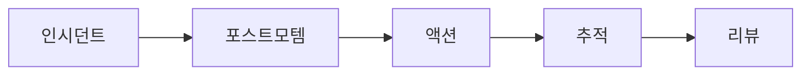

# Postmortem

## 이 글에서 다룰 문제

- postmortem이 단순 보고서가 아니라 학습 장치인 이유를 설명합니다.
- 비난 없는 문화가 왜 진실한 회고를 가능하게 하는지 살펴봅니다.
- 좋은 postmortem 문서에 어떤 항목이 들어가야 하는지 정리합니다.
- 액션 아이템을 추적하지 않으면 문서가 왜 쉽게 무용해지는지 짚어 봅니다.
- 장애 경험을 개인 기억이 아니라 조직 자산으로 남기는 방법을 설명합니다.

> SRE 101 시리즈 (7/10)

장애가 끝나면 많은 팀이 안도감과 피로감 속에서 다음 일로 넘어갑니다. 이미 복구했으니 끝났다고 느끼기 쉽기 때문입니다. 하지만 같은 유형의 장애가 반복된다면, 실제로 끝난 것은 복구뿐이고 학습은 아직 시작되지 않은 셈입니다.

사후 분석 문서는 이 학습 단계를 위한 도구입니다. 누가 실수했는지 찾는 문서가 아니라, 시스템과 절차의 약점이 무엇이었는지 남기는 문서입니다. 그래서 좋은 postmortem은 과거를 정리하는 데서 멈추지 않고, 미래의 변경으로 이어져야 합니다.

## 왜 중요한가

반복 장애는 흔히 학습의 실패에서 나옵니다. 기록이 없거나, 기록은 있어도 액션이 추적되지 않거나, 개인 비난으로 분위기가 굳어 버리면 팀은 같은 함정으로 다시 들어갑니다.

반대로 잘 만든 사후 분석은 조직 기억을 만듭니다. 특정 담당자가 회사를 떠나도, 장애에서 배운 내용과 후속 조치가 문서와 작업 항목으로 남으면 팀은 같은 경험을 다시 처음부터 겪지 않아도 됩니다.

## 한눈에 보는 개념



> 사후 분석의 목적은 문서를 채우는 데 있지 않습니다. 장애 경험을 액션으로 바꾸고, 그 액션이 실제로 완료되는지 추적하는 데 있습니다.

## 핵심 용어

- postmortem: 장애 이후 원인과 대응 과정을 정리하는 분석 문서입니다.
- blameless: 개인 비난보다 시스템 개선에 초점을 두는 원칙입니다.
- timeline: 사건이 어떤 순서로 진행됐는지 보여 주는 기록입니다.
- root cause: 증상 아래에 있는 구조적 원인입니다.
- action item: 재발 방지를 위해 이어지는 후속 작업입니다.

## Before / After

Before에서는 누가 잘못했는지부터 묻습니다. 그러면 사람들은 방어적으로 말하고, 중요한 정보는 빠지기 쉽습니다.

After에서는 시스템 약점과 의사결정 맥락을 중심으로 정리합니다. 무엇이 보였고 무엇이 보이지 않았는지, 왜 그 시점에 그런 판단을 했는지 기록하면 같은 상황에서 더 나은 선택을 만들 수 있습니다.

## 단계별로 사후 분석 문서 작성하기

### 1단계 — 템플릿 정의

```python
template = {
    "title": "",
    "summary": "",
    "impact": "",
    "timeline": [],
    "root_cause": "",
    "actions": [],
    "lessons": [],
}
```

템플릿은 기억에 의존하지 않게 해 줍니다. 어떤 장애든 최소한 같은 항목으로 정리하면 비교와 재사용이 쉬워집니다.

### 2단계 — 영향 요약

```python
def impact_line(users, minutes):
    return f"{users} users affected for {minutes} min"
```

영향은 장애의 무게를 드러내는 출발점입니다. 사용자 수, 지속 시간, 기능 범위를 간결하게 적어 두면 이후 액션 우선순위도 분명해집니다.

### 3단계 — 타임라인 정리

```python
def event(t, msg):
    return {"time": t, "event": msg}
```

타임라인은 기억의 혼선을 줄여 줍니다. 누가 언제 무엇을 봤고 어떤 조치를 했는지 순서대로 적으면 원인과 대응의 연결이 더 잘 보입니다.

### 4단계 — 액션 아이템 작성

```python
def action(desc, owner, due):
    return {"desc": desc, "owner": owner, "due": due}
```

좋은 액션 아이템은 오너와 기한이 있습니다. 막연한 개선 다짐은 시간이 지나면 흐려지지만, 담당자와 일정이 있는 작업은 추적이 가능합니다.

### 5단계 — 열린 작업 추적

```python
def open_actions(items):
    return [a for a in items if not a.get("done")]
```

사후 분석 문서의 품질은 문서 작성 시점보다 후속 작업 완료율에서 드러납니다. 열린 액션을 계속 보지 않으면 문서는 금방 기록 보관함으로 밀려납니다.

## 이 코드에서 봐야 할 점

이 예제는 postmortem이 구조화된 학습 시스템이라는 점을 보여 줍니다. 템플릿은 기록의 일관성을 만들고, 타임라인은 사실 관계를 정리하며, 액션 아이템은 배운 내용을 실제 변경으로 연결합니다.

특히 blameless 원칙이 중요한 이유는 숨겨진 맥락을 끌어내기 위해서입니다. 누군가를 비난하는 분위기에서는 결정 당시의 정보 부족, 도구 한계, 절차 빈틈 같은 중요한 원인이 잘 드러나지 않습니다.

## 자주 하는 실수 5가지

1. 개인 비난으로 대화를 시작해 정보 공유를 막는 경우입니다.
2. 액션 아이템을 적고도 추적하지 않는 경우입니다.
3. 증상을 root cause로 오해하는 경우입니다.
4. 결과 문서를 팀 밖으로 공유하지 않는 경우입니다.
5. 템플릿을 채우는 데만 집중하고 실제 학습을 남기지 않는 경우입니다.

## 실무에서는 이렇게 본다

현업에서는 Jira나 Linear 같은 도구로 액션을 티켓화하고, 주간 리뷰에서 진행 상황을 확인합니다. 문서와 작업 추적이 분리되지 않을수록 사후 분석의 수명이 길어집니다.

시니어 엔지니어는 postmortem을 조직의 학습 엔진으로 봅니다. 장애가 사라지는 것이 목적이 아니라, 같은 실수를 반복하지 않는 구조를 만드는 것이 목적입니다. 그래서 문서보다 액션 완료가 더 중요합니다.

## 체크리스트

- [ ] 공통 postmortem 템플릿이 있다.
- [ ] blameless 원칙을 팀이 공유한다.
- [ ] 액션 아이템에 오너와 기한이 있다.
- [ ] 후속 작업 진행 상황을 주기적으로 리뷰한다.

## 연습 문제

1. blameless 문화가 필요한 이유를 설명해 보세요.
2. 좋은 액션 아이템의 조건을 세 가지로 적어 보세요.
3. 타임라인이 root cause 분석에 어떻게 도움이 되는지 써 보세요.

## 정리와 다음 글

이 글에서는 postmortem을 장애 뒤에 남기는 학습 시스템으로 설명했습니다. 핵심은 비난보다 구조를 보고, 문서 작성보다 후속 액션 완료까지 이어 가는 데 있습니다. 같은 유형의 장애가 다시 왔을 때 팀이 더 나은 출발선을 갖게 만드는 것이 진짜 목표입니다.

다음 글에서는 reducing toil을 다룹니다. 반복 운영 업무를 어떻게 측정하고, 어떤 기준으로 자동화 우선순위를 정할지 이어서 보겠습니다.

<!-- toc:begin -->
- [SRE란 무엇인가?](./01-what-is-sre.md)
- [Reliability](./02-reliability.md)
- [SLI, SLO, SLA](./03-sli-slo-sla.md)
- [Error Budget](./04-error-budget.md)
- [Monitoring](./05-monitoring.md)
- [Incident Response](./06-incident-response.md)
- **Postmortem (현재 글)**
- Toil 줄이기 (예정)
- Capacity Planning (예정)
- 운영 가능한 시스템 만들기 (예정)
<!-- toc:end -->

## 참고 자료

- [Postmortem Culture - Google SRE Book](https://sre.google/sre-book/postmortem-culture/)
- [Etsy Debriefing Guide](https://extfiles.etsy.com/DebriefingFacilitationGuide.pdf)
- [Blameless Postmortems - Atlassian](https://www.atlassian.com/incident-management/postmortem/blameless)
- [PagerDuty Postmortem Guide](https://postmortems.pagerduty.com/)

Tags: SRE, Postmortem, BlamelessCulture, Learning, Operations
