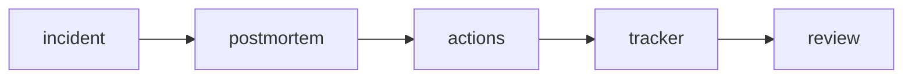

# Postmortem

장애가 끝나면 팀은 대개 안도감부터 느낍니다. 복구는 끝났고, 당장 불이 꺼졌기 때문입니다. 그런데 같은 유형의 장애가 반복된다면 실제로 끝난 것은 복구뿐이고, 학습은 아직 시작되지 않은 셈입니다.

포스트모템은 그 학습을 조직 자산으로 바꾸는 장치입니다. 누가 실수했는지 적는 문서가 아니라, 시스템과 절차의 약점이 무엇이었고 무엇을 바꿔야 하는지 남기는 문서여야 합니다.

이 글은 SRE 101 시리즈의 7번째 글입니다. 여기서는 postmortem을 학습 시스템으로 보고, blameless 원칙, 문서 템플릿, 액션 아이템 추적, 조직 차원의 공유 방식까지 정리합니다.

---

## 이 글에서 다룰 문제

- 포스트모템은 왜 보고서보다 학습 장치에 가깝다고 할까요?
- blameless 원칙이 없으면 왜 중요한 정보가 빠질까요?
- 좋은 포스트모템 문서에는 어떤 항목이 반드시 들어가야 할까요?
- 액션 아이템을 추적하지 않으면 문서는 왜 금방 무력해질까요?
- 장애 경험을 개인 기억이 아니라 조직 기억으로 남기려면 무엇이 필요할까요?

## 왜 이 주제가 중요한가

반복 장애는 종종 학습의 실패에서 나옵니다. 기록이 없거나, 기록은 있어도 후속 작업이 추적되지 않거나, 개인 비난 때문에 중요한 맥락이 드러나지 않으면 팀은 같은 함정에 다시 빠집니다.

반대로 좋은 포스트모템은 특정 담당자가 떠나도 남습니다. 당시 무엇이 보였고 무엇이 보이지 않았는지, 어떤 판단이 왜 내려졌는지, 무엇을 바꿔야 하는지가 문서와 액션으로 남기 때문입니다. 포스트모템은 조직 기억을 만드는 작업입니다.

## 한 문장으로 잡는 멘탈 모델

> 포스트모템은 장애를 설명하는 문서가 아니라, 같은 장애를 덜 겪게 만드는 학습 시스템입니다.

## 한눈에 보는 구조



장애가 문서로 끝나면 의미가 약합니다. 문서가 액션으로 연결되고, 그 액션이 추적과 리뷰로 이어질 때 비로소 재발 방지 효과가 생깁니다.

## 핵심 용어 먼저 정리

| 용어 | 뜻 | 실무에서 하는 역할 |
| --- | --- | --- |
| postmortem | 장애 이후 분석 문서 | 사실과 학습을 구조화합니다 |
| blameless | 개인 비난보다 시스템 개선에 초점을 두는 원칙 | 숨겨진 맥락을 더 많이 드러내게 합니다 |
| timeline | 사건 진행 순서 기록 | 사실 관계를 정리합니다 |
| root cause | 증상 아래의 구조적 원인 | 재발 방지 방향을 찾게 합니다 |
| action item | 후속 개선 작업 | 학습을 실제 변경으로 연결합니다 |

## 왜 비난 없는 문화가 먼저일까

개인 비난이 강한 팀에서는 사람들은 자신을 방어하는 방식으로 말하게 됩니다. 그러면 장애 당시 정보 부족, 경고 신호 부재, 절차 빈틈, 도구 한계 같은 진짜 원인이 잘 드러나지 않습니다.

blameless는 책임이 없다는 뜻이 아닙니다. 무엇이 시스템적으로 잘못 설계되었는지, 어떤 정보가 부족했는지, 어떤 안전장치가 없었는지를 먼저 보자는 원칙입니다. 진실한 설명이 나와야 다음 변경도 의미가 생깁니다.

## 템플릿이 필요한 이유

포스트모템을 매번 자유 형식으로 쓰면 비교와 재사용이 어렵습니다. 어떤 문서는 타임라인이 자세하고, 어떤 문서는 영향 범위가 빠지고, 어떤 문서는 액션 항목이 모호해질 수 있습니다. 공통 템플릿은 기억에 기대던 부분을 구조로 바꿉니다.

강한 팀은 문장력을 겨루지 않습니다. 누구나 같은 뼈대로 사실, 영향, 원인, 후속 조치를 남기도록 구조를 다듬는 데 더 신경 씁니다.

## 단계별로 사후 분석 문서 작성하기

### 1단계 — 템플릿 정의

```python
template = {
    "title": "",
    "summary": "",
    "impact": "",
    "timeline": [],
    "root_cause": "",
    "actions": [],
    "lessons": [],
}
```

공통 템플릿이 있으면 어떤 사건이든 최소한 같은 프레임으로 비교할 수 있습니다. 기록의 일관성이 생기면 조직 학습 속도도 빨라집니다.

### 2단계 — 영향 요약

```python
def impact_line(users, minutes):
    return f"{users} users affected for {minutes} min"
```

영향 요약은 장애의 무게를 보여 주는 출발점입니다. 사용자 수, 지속 시간, 영향 기능을 짧게 적어 두면 후속 작업 우선순위도 분명해집니다.

### 3단계 — 타임라인 기록

```python
def event(t, msg):
    return {"time": t, "event": msg}
```

타임라인은 기억의 혼선을 줄입니다. 누가 언제 무엇을 보고 어떤 조치를 했는지 순서대로 적으면, 증상과 대응 사이의 관계가 훨씬 잘 드러납니다.

### 4단계 — 액션 아이템 작성

```python
def action(desc, owner, due):
    return {"desc": desc, "owner": owner, "due": due}
```

좋은 액션 아이템은 오너와 기한이 있습니다. 막연한 다짐은 쉽게 사라지지만, 담당자와 일정이 있는 작업은 추적이 가능합니다.

### 5단계 — 열린 작업 추적

```python
def open_actions(items):
    return [a for a in items if not a.get("done")]
```

포스트모템 품질은 문서가 아니라 후속 작업 완료율에서 드러납니다. 열린 액션을 계속 보지 않으면 포스트모템은 기록 보관함으로 밀려납니다.

## 이 코드에서 먼저 봐야 할 점

- 템플릿은 기록 품질의 편차를 줄여 줍니다.
- 영향, 타임라인, 원인, 액션이 함께 있어야 학습이 완성됩니다.
- 오너와 기한은 액션 추적의 기본 축입니다.
- 포스트모템은 쓰는 순간보다 이후 관리에서 진짜 가치가 드러납니다.

## 여기서 자주 헷갈립니다

첫 번째 실수는 증상을 root cause로 착각하는 것입니다. 데이터베이스 과부하는 결과일 수 있고, 원인은 쿼리 폭주를 막지 못한 보호 장치 부재일 수 있습니다. 원인 층위를 더 깊게 봐야 합니다.

두 번째 실수는 문서를 쓰는 것으로 일을 끝냈다고 생각하는 것입니다. 액션 아이템이 추적되지 않으면 학습은 조직에 남지 않습니다.

세 번째 실수는 결과를 공유하지 않는 것입니다. 같은 유형의 문제가 다른 팀에서도 반복될 수 있기 때문에, 포스트모템은 가능한 범위에서 널리 열려 있을수록 좋습니다.

## 운영 체크리스트

- [ ] 공통 포스트모템 템플릿이 있다.
- [ ] blameless 원칙을 팀이 공유한다.
- [ ] 액션 아이템에 오너와 기한이 있다.
- [ ] 열린 후속 작업을 정기적으로 리뷰한다.
- [ ] 포스트모템 결과를 관련 팀과 공유한다.

## 실무에서는 이렇게 생각합니다

시니어 엔지니어는 포스트모템을 문서 작업으로 보지 않습니다. 시스템을 바꾸기 위한 입력 장치로 봅니다. 같은 장애가 다시 오지 않도록 만드는 가장 현실적인 수단이기 때문입니다.

또한 Jira나 Linear 같은 추적 도구와 포스트모템이 분리되지 않게 운영합니다. 문서 속 액션이 실제 작업 티켓으로 이어져야 학습이 조직의 일정과 우선순위 안으로 들어옵니다.

## 정리

postmortem은 장애 뒤에 남기는 학습 시스템입니다. 비난보다 구조를 보고, 문서 작성보다 후속 액션 완료를 중시할 때 같은 유형의 장애를 덜 겪는 조직으로 바뀔 수 있습니다.

다음 글에서는 Toil 줄이기를 다룹니다. 반복 수작업을 어떻게 측정하고, 어떤 기준으로 자동화 우선순위를 정해야 하는지 이어서 정리하겠습니다.

<!-- toc:begin -->
- [SRE란 무엇인가?](./01-what-is-sre.md)
- [Reliability](./02-reliability.md)
- [SLI, SLO, SLA](./03-sli-slo-sla.md)
- [Error Budget](./04-error-budget.md)
- [Monitoring](./05-monitoring.md)
- [Incident Response](./06-incident-response.md)
- **Postmortem (현재 글)**
- Toil 줄이기 (예정)
- Capacity Planning (예정)
- 운영 가능한 시스템 만들기 (예정)
<!-- toc:end -->

## 참고 자료

- [Postmortem Culture - Google SRE Book](https://sre.google/sre-book/postmortem-culture/)
- [Etsy Debriefing Guide](https://extfiles.etsy.com/DebriefingFacilitationGuide.pdf)
- [Blameless Postmortems - Atlassian](https://www.atlassian.com/incident-management/postmortem/blameless)
- [PagerDuty Postmortem Guide](https://postmortems.pagerduty.com/)

Tags: SRE, Postmortem, BlamelessCulture, Learning, Operations