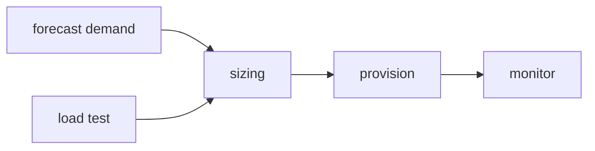

# Capacity Planning

많은 팀이 증설을 이야기할 때 지난달 그래프부터 펼칩니다. 물론 과거 데이터는 중요합니다. 하지만 용량 계획은 과거를 복사하는 일이 아니라, 앞으로 들어올 수요를 예측하고 그 수요를 감당할 공급을 미리 맞추는 일입니다.

트래픽이 갑자기 치솟은 뒤에 대응하는 것은 보통 너무 늦습니다. 용량 계획은 성능 최적화의 부속 작업이 아니라, 장애 예방과 비용 통제를 동시에 다루는 운영 설계입니다.

이 글은 SRE 101 시리즈의 9번째 글입니다. 여기서는 capacity planning을 수요 예측, 헤드룸 설정, 부하 테스트, 확장 단위 계산, 비용 판단의 흐름으로 설명하고, 리드 타임과 반복 보정의 중요성까지 정리합니다.

---

## 이 글에서 다룰 문제

- 용량 계획은 왜 과거 복제가 아니라 미래 수요 예측일까요?
- 헤드룸은 왜 낭비가 아니라 보험에 가까울까요?
- 부하 테스트는 예측 모델을 어떻게 보정할까요?
- 필요한 노드 수와 비용은 왜 같은 표에서 봐야 할까요?
- 리드 타임을 무시하면 어떤 실패가 생길까요?

## 왜 이 주제가 중요한가

예측이 없으면 증설은 늘 늦습니다. 트래픽이 급증한 뒤에 인스턴스를 더 붙이거나 장비를 확보하려 하면, 이미 사용자 경험은 나빠진 뒤일 가능성이 큽니다. 특히 이벤트성 피크가 있는 서비스일수록 사전 계획이 더 중요합니다.

반대로 여유 용량을 무작정 쌓아 두면 비용이 커집니다. 용량 계획의 핵심은 안전성과 비용을 함께 읽는 데 있습니다. 어느 정도 변동을 감수할지, 그 변동에 대비해 얼마를 더 쓸지 설명할 수 있어야 합니다.

## 한 문장으로 잡는 멘탈 모델

> 용량 계획은 수요 예측과 실제 처리 한계를 숫자로 맞춰, 장애 없이 성장할 수 있는 여유를 설계하는 일입니다.

## 한눈에 보는 구조



이 흐름은 용량 계획이 한 번의 계산으로 끝나지 않는다는 점을 보여 줍니다. 예측하고, 검증하고, 증설하고, 실제 사용량을 다시 보면서 계속 보정해야 합니다.

## 핵심 용어 먼저 정리

| 용어 | 뜻 | 운영에서 하는 역할 |
| --- | --- | --- |
| demand forecast | 미래 수요 예측값 | 얼마만큼 준비해야 하는지 정합니다 |
| headroom | 남겨 둔 여유 용량 | 스파이크와 변동성을 흡수합니다 |
| load test | 부하 실험 | 현재 한계를 검증합니다 |
| scaling unit | 확장 최소 단위 | 실제 증설 계산 기준이 됩니다 |
| lead time | 자원 확보까지 걸리는 시간 | 언제 결정을 내려야 하는지 정합니다 |

## 용량 계획은 왜 성능 테스트만으로 부족할까

부하 테스트는 지금 시스템이 어디까지 버티는지 보여 줍니다. 하지만 다음 분기 트래픽이 얼마나 늘지, 마케팅 이벤트가 얼마나 큰지, 신규 기능이 어떤 패턴을 만들지는 알려 주지 못합니다. 그래서 예측이 필요합니다.

반대로 예측만 있고 실제 한계 검증이 없으면 문서상 계산이 현실과 어긋날 수 있습니다. 강한 팀은 예측과 검증을 같이 봅니다. 수요는 모델로 보고, 공급은 부하 테스트로 확인하는 식입니다.

## 헤드룸은 왜 비용과 함께 봐야 할까

헤드룸은 남는 용량처럼 보여서 비용 낭비로 보이기 쉽습니다. 하지만 운영 관점에서는 변동성 보험에 가깝습니다. 스파이크, 장애 우회 트래픽, 예측 오차를 흡수할 공간이 없으면 작은 변화도 바로 장애로 이어집니다.

좋은 계획은 헤드룸의 필요성을 막연히 주장하지 않습니다. 어느 정도 변동을 감당하려고 얼마를 더 쓰는지 설명합니다. 비용과 용량을 따로 떼어 놓지 않는 이유가 여기에 있습니다.

## 단계별로 용량 모델링하기

### 1단계 — 추세 예측

```python
def linear_forecast(history, weeks_ahead):
    base = history[-1]
    growth = (history[-1] - history[0]) / max(len(history) - 1, 1)
    return base + growth * weeks_ahead
```

가장 단순한 예측은 최근 추세를 연장하는 것입니다. 완벽하지는 않아도, 과거 최고치만 반복하는 방식보다 미래 수요를 더 명시적으로 다룹니다.

### 2단계 — 헤드룸 계산

```python
def headroom(target_util, current_util):
    return max(0, target_util - current_util)
```

헤드룸은 평소 사용률과 목표 사용률 사이의 여유를 보여 줍니다. 너무 빡빡하면 급증에 취약하고, 너무 넓으면 비용이 커집니다. 어느 지점을 적정선으로 둘지 팀 기준이 필요합니다.

### 3단계 — 부하 테스트 결과 읽기

```python
def max_rps(samples):
    return max(samples)
```

예측한 수요가 실제로 현재 구성에서 가능한지 확인해야 합니다. 부하 테스트는 이론값이 아니라 현실 한계를 보여 줍니다. 특히 병목이 어디서 시작되는지도 함께 드러낼 수 있습니다.

### 4단계 — 노드 수 계산

```python
def nodes(predicted_rps, rps_per_node):
    return -(-predicted_rps // rps_per_node)
```

예측 수요와 단일 노드 처리량을 결합하면 필요한 확장 단위를 계산할 수 있습니다. 올림 계산을 쓰는 이유는 경계값에서 용량이 모자라는 상황을 피하기 위해서입니다.

### 5단계 — 비용 계산

```python
def cost(nodes, monthly_per_node):
    return nodes * monthly_per_node
```

용량 계획은 비용 계획이기도 합니다. 확장 단위가 늘어나면 곧 월간 비용이 바뀌므로, 성능 수치와 예산 수치를 한 표에서 같이 봐야 합니다.

## 이 코드에서 먼저 봐야 할 점

- 예측과 검증을 함께 봐야 계획이 현실에 가까워집니다.
- 헤드룸은 변동성을 흡수하는 장치입니다.
- 확장 단위와 비용은 같은 판단 안에서 읽어야 합니다.
- 리드 타임이 길수록 더 일찍 결정해야 합니다.

## 여기서 자주 헷갈립니다

첫 번째 실수는 과거 최고치에 조금만 더 얹으면 된다고 생각하는 것입니다. 성장 추세와 이벤트성 수요를 놓치기 쉽습니다.

두 번째 실수는 부하 테스트 없이 문서상 처리량만 믿는 것입니다. 실제 병목은 계산보다 빨리 드러날 수 있습니다.

세 번째 실수는 비용과 용량을 따로 보는 것입니다. 헤드룸이 얼마나 필요한지와 그 비용을 같은 자리에서 봐야 제대로 판단할 수 있습니다.

## 운영 체크리스트

- [ ] 미래 수요를 예측하는 모델이 있다.
- [ ] 헤드룸 정책과 목표 사용률을 정의했다.
- [ ] 정기적인 부하 테스트 일정이 있다.
- [ ] 확장 단위와 비용을 함께 검토한다.
- [ ] 리드 타임을 고려해 증설 의사결정 시점을 앞당긴다.

## 실무에서는 이렇게 생각합니다

시니어 엔지니어는 용량 계획을 일회성 보고서로 보지 않습니다. 계획과 실제 사용량의 차이를 계속 보정하는 반복 작업으로 봅니다. 예측이 틀리는 것은 자연스럽지만, 틀린 이유를 다음 계획에 반영하는 것이 더 중요합니다.

또한 블랙 프라이데이, 대규모 프로모션, 학기 시작처럼 피크가 예측 가능한 서비스는 몇 달 전부터 준비합니다. 급증은 종종 놀라운 사건이 아니라, 준비하지 않은 사건입니다.

## 정리

capacity planning은 미래 수요와 공급을 숫자로 맞추는 작업입니다. 예측, 부하 테스트, 헤드룸, 비용, 리드 타임을 한 흐름으로 묶어 볼 때 서비스는 더 안정적으로 성장할 수 있습니다.

다음 글은 시리즈 마지막 편인 운영 가능한 시스템 만들기입니다. 지금까지 다룬 신뢰성, 모니터링, 자동화, 대응 원칙을 하나의 설계 관점으로 묶어 보겠습니다.

<!-- toc:begin -->
- [SRE란 무엇인가?](./01-what-is-sre.md)
- [Reliability](./02-reliability.md)
- [SLI, SLO, SLA](./03-sli-slo-sla.md)
- [Error Budget](./04-error-budget.md)
- [Monitoring](./05-monitoring.md)
- [Incident Response](./06-incident-response.md)
- [Postmortem](./07-postmortem.md)
- [Toil 줄이기](./08-reducing-toil.md)
- **Capacity Planning (현재 글)**
- 운영 가능한 시스템 만들기 (예정)
<!-- toc:end -->

## 참고 자료

- [Software Engineering in SRE - Google SRE Book](https://sre.google/sre-book/software-engineering-in-sre/)
- [Capacity Planning - High Scalability](http://highscalability.com/blog/category/capacity-planning)
- [The Art of Capacity Planning - O'Reilly](https://www.oreilly.com/library/view/the-art-of/9780596518578/)
- [Load Testing - Grafana k6](https://grafana.com/docs/k6/latest/)

Tags: SRE, CapacityPlanning, Forecasting, Performance, Operations
