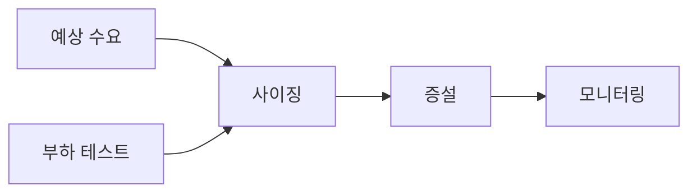

# Capacity Planning

## 이 글에서 다룰 문제

- 용량 계획이 과거 복제가 아니라 미래 수요 예측이라는 점을 설명합니다.
- 헤드룸을 왜 남겨야 하는지와 그 비용 의미를 함께 정리합니다.
- 부하 테스트가 예측을 어떻게 보정하는지 살펴봅니다.
- 노드 수와 비용을 함께 계산해야 하는 이유를 짚어 봅니다.
- 리드 타임을 무시하면 어떤 식으로 운영 전략이 흔들리는지 설명합니다.

> SRE 101 시리즈 (9/10)

많은 팀이 증설을 결정할 때 지난달 그래프를 먼저 봅니다. 물론 과거 데이터는 중요합니다. 하지만 용량 계획은 과거를 복사하는 작업이 아니라, 앞으로 들어올 수요를 예측하고 그 수요를 감당할 여유를 미리 준비하는 작업입니다.

특히 마케팅 이벤트, 계절성, 고객 증가, 신규 기능 출시 같은 요인이 있는 서비스는 더 그렇습니다. 평소에는 안정적이던 시스템도 예측 없는 급증 앞에서는 쉽게 흔들립니다. 그래서 용량 계획은 성능 튜닝만큼이나 중요한 운영 설계 활동입니다.

## 왜 중요한가

예측이 없으면 증설은 늘 늦습니다. 트래픽이 급증한 뒤에야 장비를 늘리거나 인스턴스를 더 붙이려 하면, 이미 사용자 경험은 나빠진 뒤일 가능성이 큽니다.

반대로 과도한 여유를 무작정 쌓아 두면 비용이 커집니다. 용량 계획의 핵심은 안전과 비용을 함께 읽는 데 있습니다. 충분한 헤드룸을 남기되, 그 여유가 어떤 수요를 위한 것인지 설명할 수 있어야 합니다.

## 한눈에 보는 개념



> 용량 계획은 예측, 검증, 증설, 관찰이 이어지는 반복 작업입니다. 한 번 계산하고 끝나는 일이 아니라 서비스 성장에 맞춰 계속 조정해야 합니다.

## 핵심 용어

- demand forecast: 미래 수요를 예측한 값입니다.
- headroom: 예상치보다 더 감당할 수 있도록 남겨 둔 여유 용량입니다.
- load test: 시스템 한계를 확인하기 위한 부하 실험입니다.
- scaling unit: 용량을 늘릴 때 추가되는 최소 단위입니다.
- lead time: 자원 확보나 증설에 걸리는 준비 시간입니다.

## Before / After

Before에서는 지난 분기 최고치에 약간만 더 얹어 증설합니다. 이유는 단순하지만, 다음 이벤트나 성장 추세를 반영하지 못합니다.

After에서는 과거 추세, 예상 이벤트, 부하 테스트 결과를 함께 봅니다. 그리고 필요한 노드 수와 비용을 같이 계산해 의사결정을 내립니다.

## 단계별로 용량 모델링하기

### 1단계 — 추세 예측

```python
def linear_forecast(history, weeks_ahead):
    base = history[-1]
    growth = (history[-1] - history[0]) / max(len(history) - 1, 1)
    return base + growth * weeks_ahead
```

가장 단순한 예측은 추세선을 그리는 일입니다. 완벽하지는 않지만, 과거 최고치만 복사하는 것보다 미래 수요를 더 명시적으로 다룰 수 있습니다.

### 2단계 — 헤드룸 계산

```python
def headroom(target_util, current_util):
    return max(0, target_util - current_util)
```

헤드룸은 낭비가 아니라 변동성을 흡수하는 완충재입니다. 평소 사용률이 낮아 보여도, 급격한 스파이크나 장애 우회 트래픽을 감당하려면 여유가 필요합니다.

### 3단계 — 부하 테스트 결과 읽기

```python
def max_rps(samples):
    return max(samples)
```

예측 모델만으로는 실제 한계를 알기 어렵습니다. 부하 테스트는 현재 구성에서 어느 정도 처리량이 가능한지 보여 주고, 예측값이 현실적인지 검증해 줍니다.

### 4단계 — 노드 수 계산

```python
def nodes(predicted_rps, rps_per_node):
    return -(-predicted_rps // rps_per_node)
```

수요 예측과 단일 노드 처리량을 결합하면 필요한 확장 단위를 계산할 수 있습니다. 이때 반올림 방식도 중요합니다. 경계값에서 부족한 용량이 생기지 않도록 올림 계산을 택하는 편이 안전합니다.

### 5단계 — 비용 계산

```python
def cost(nodes, monthly_per_node):
    return nodes * monthly_per_node
```

용량 계획은 비용 계획이기도 합니다. 필요한 노드 수가 곧 월간 비용으로 이어지므로, 성능과 예산을 같은 표에서 봐야 합니다.

## 이 코드에서 봐야 할 점

용량 계획은 예측과 검증의 결합입니다. 추세 예측만 믿어도 위험하고, 부하 테스트만 보고 미래 수요를 무시해도 위험합니다. 둘을 함께 놓아야 계획이 현실에 가까워집니다.

또한 headroom과 비용은 서로 떨어진 주제가 아닙니다. 여유 용량은 보험과 비슷합니다. 얼마만큼의 변동을 감당하기 위해 비용을 추가로 쓰는지 설명할 수 있을 때 좋은 계획이 됩니다.

## 자주 하는 실수 5가지

1. 예측 없이 과거 수치만 복제하는 경우입니다.
2. 헤드룸을 거의 남기지 않아 급증 상황에 취약해지는 경우입니다.
3. 부하 테스트 없이 문서상 처리량만 믿는 경우입니다.
4. 리드 타임을 무시해 증설 시점을 놓치는 경우입니다.
5. 비용을 용량 계획과 분리해서 따로 보는 경우입니다.

## 실무에서는 이렇게 본다

블랙 프라이데이, 대규모 프로모션, 학기 시작처럼 명확한 피크 이벤트가 있는 서비스는 몇 달 전부터 용량을 준비합니다. 그 과정에서 예측이 틀릴 수 있다는 사실도 인정하고, 보수적인 헤드룸을 둡니다.

시니어 엔지니어는 용량 계획을 일회성 보고서로 보지 않습니다. 서비스가 커질수록 예측 모델을 계속 보정하고, 실제 사용량과 계획의 차이를 학습해 다음 계획에 반영합니다.

## 체크리스트

- [ ] 미래 수요를 예측하는 모델이 있다.
- [ ] 헤드룸 정책과 목표 사용률을 정의했다.
- [ ] 정기적인 부하 테스트 일정이 있다.
- [ ] 용량과 비용을 같은 문맥에서 검토한다.

## 연습 문제

1. headroom을 한 문장으로 정의해 보세요.
2. 부하 테스트가 예측 모델을 어떻게 보완하는지 설명해 보세요.
3. 리드 타임을 무시하면 어떤 실패가 생길 수 있는지 적어 보세요.

## 정리와 다음 글

이 글에서는 용량 계획을 미래 수요와 공급을 숫자로 맞추는 작업으로 설명했습니다. 핵심은 예측과 부하 테스트, 헤드룸과 비용을 한 흐름으로 묶어 보는 데 있습니다. 계획과 실제 사용량의 차이를 다음 주기에서 다시 보정하는 태도도 함께 중요합니다.

다음 글은 시리즈 마지막 편인 building operable systems입니다. 지금까지 살펴본 신뢰성, 모니터링, 자동화, 대응 원칙을 하나의 설계 관점으로 묶어 보겠습니다.

<!-- toc:begin -->
- [SRE란 무엇인가?](./01-what-is-sre.md)
- [Reliability](./02-reliability.md)
- [SLI, SLO, SLA](./03-sli-slo-sla.md)
- [Error Budget](./04-error-budget.md)
- [Monitoring](./05-monitoring.md)
- [Incident Response](./06-incident-response.md)
- [Postmortem](./07-postmortem.md)
- [Toil 줄이기](./08-reducing-toil.md)
- **Capacity Planning (현재 글)**
- 운영 가능한 시스템 만들기 (예정)
<!-- toc:end -->

## 참고 자료

- [Software Engineering in SRE - Google SRE Book](https://sre.google/sre-book/software-engineering-in-sre/)
- [Capacity Planning - High Scalability](http://highscalability.com/blog/category/capacity-planning)
- [The Art of Capacity Planning - O'Reilly](https://www.oreilly.com/library/view/the-art-of/9780596518578/)
- [Load Testing - Grafana k6](https://grafana.com/docs/k6/latest/)

Tags: SRE, CapacityPlanning, Forecasting, Performance, Operations
