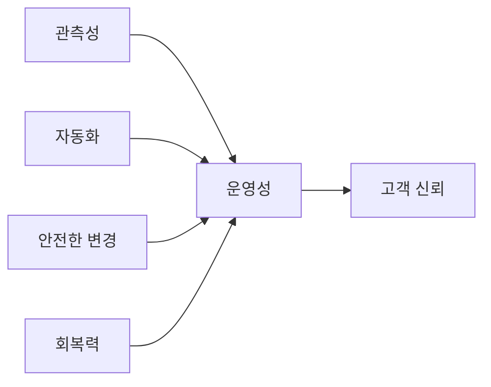

# 운영 가능한 시스템 만들기

## 이 글에서 다룰 문제

- operability를 기능 개발 뒤에 붙이는 옵션이 아니라 설계 요소로 보는 이유를 설명합니다.
- 관측성, 자동화, 안전한 변경, 회복력이 어떻게 한 시스템 안에서 연결되는지 정리합니다.
- 운영 가능한 시스템을 점검할 때 어떤 질문부터 던져야 하는지 살펴봅니다.
- 부분 실패를 전체 장애로 번지지 않게 막는 설계 원칙을 짚어 봅니다.
- SRE 101 시리즈 전체 내용을 하나의 운영 설계 관점으로 묶어 봅니다.

> SRE 101 시리즈 (10/10)

많은 시스템이 기능 요구사항은 자세히 문서화하지만, 운영 요구사항은 나중 일로 미룹니다. 서비스가 커지고 사용자가 늘어난 뒤에야 로그를 더 남기고, 알림을 붙이고, 롤백 절차를 고민합니다. 그런데 운영성은 뒤늦게 덧붙일수록 비용이 더 큽니다.

operability는 시스템을 운영하기 쉬운 상태를 뜻합니다. 문제가 생겼을 때 빨리 찾을 수 있고, 변경을 안전하게 배포할 수 있고, 일부 실패가 전체 붕괴로 이어지지 않으며, 반복 작업을 자동화할 수 있어야 합니다. 결국 operability는 사용자 기능 못지않게 설계 초기에 들어가야 하는 품질입니다.

## 왜 중요한가

운영성이 없는 기능은 시간이 지나면 부채로 돌아옵니다. 처음에는 잘 동작해도, 장애가 났을 때 원인을 찾기 어렵고 변경을 되돌리기 어렵다면 팀은 점점 더 느려집니다.

반대로 operability가 내장된 시스템은 문제를 빨리 읽고, 작은 변경을 안전하게 반복하며, 장애 이후 학습도 빠르게 축적합니다. 서비스가 커질수록 이 차이는 더 크게 벌어집니다.

## 한눈에 보는 개념



> 운영 가능한 시스템은 한 가지 도구로 만들어지지 않습니다. 관측성, 자동화, 안전한 변경, 회복력이 함께 맞물릴 때 비로소 운영성이 생깁니다.

## 핵심 용어

- operability: 시스템을 운영하고 문제를 다루기 쉬운 정도입니다.
- observability: 외부 신호를 통해 내부 상태를 추론할 수 있는 능력입니다.
- safe change: 카나리와 롤백처럼 되돌리기 쉬운 변경 방식입니다.
- resilience: 부분 실패가 나도 복구하고 버틸 수 있는 능력입니다.
- runbook-as-code: 운영 절차를 문서가 아니라 코드로 표현한 형태입니다.

## Before / After

Before에서는 기능을 먼저 만들고 운영은 나중에 보완합니다. 로그가 부족하고, 롤백 절차가 애매하고, 장애 대응도 사람 경험에 크게 의존합니다.

After에서는 기능과 운영성을 함께 설계합니다. 배포 전에 관측성을 넣고, 안전한 변경 경로를 만들고, 반복 운영 절차를 자동화하며, 부분 실패를 견디는 구조를 갖춥니다.

## 단계별로 운영성 점검하기

### 1단계 — 관측성 확인

```python
def has_obs(metrics, logs, traces):
    return all([metrics, logs, traces])
```

메트릭, 로그, 트레이스가 모두 있어야 내부 상태를 더 정확히 추론할 수 있습니다. 하나라도 빠지면 디버깅은 특정 도구에 과도하게 의존하게 됩니다.

### 2단계 — 안전한 배포 확인

```python
def safe_deploy(canary_pct, rollback_ready):
    return canary_pct <= 5 and rollback_ready
```

운영 가능한 시스템은 변경도 작고 되돌리기 쉬워야 합니다. 카나리 비율과 롤백 준비 상태를 함께 보는 이유가 여기에 있습니다.

### 3단계 — 회복 패턴 확인

```python
def has_resilience(retry, timeout, breaker):
    return all([retry, timeout, breaker])
```

재시도, 타임아웃, 서킷 브레이커 같은 패턴은 부분 실패가 전체 장애로 번지는 것을 막아 줍니다. 이런 장치가 없으면 작은 장애도 연쇄적으로 커지기 쉽습니다.

### 4단계 — 자동화 비율 확인

```python
def auto_ratio(auto_min, total_min):
    return auto_min / total_min
```

운영성을 점검할 때 자동화 비율도 중요합니다. 같은 절차를 사람이 계속 수행한다면 시스템은 아직 충분히 운영 가능하다고 보기 어렵습니다.

### 5단계 — 운영성 점수 계산

```python
def score(obs, deploy, resil, auto):
    return sum([obs, deploy, resil, auto >= 0.7]) / 4
```

운영성은 추상적이지만, 이렇게 차원별 점검 항목으로 나누면 개선 우선순위를 정하기 쉬워집니다. 완벽한 점수보다 현재 어디가 약한지 드러내는 데 의미가 있습니다.

## 이 코드에서 봐야 할 점

이 예제는 operability를 네 가지 축으로 나눠 점검합니다. 관측성은 문제를 보게 해 주고, 안전한 변경은 위험을 작게 만들며, 회복력은 실패 확산을 막고, 자동화는 팀 시간을 지켜 줍니다.

또한 운영성은 문서 설명만으로 증명되지 않는다는 점도 중요합니다. 실제 메트릭과 로그가 있는지, 롤백이 준비됐는지, 패턴이 구현됐는지, 자동화 비율이 어느 정도인지를 확인해야 합니다.

## 자주 하는 실수 5가지

1. operability를 기능 개발 뒤로 미루는 경우입니다.
2. observability가 부족해 장애를 읽지 못하는 경우입니다.
3. 카나리 없이 전면 배포만 반복하는 경우입니다.
4. 회복 패턴이 없어 부분 실패가 전체 장애로 번지는 경우입니다.
5. 반복 운영 절차를 자동화하지 않아 사람이 병목이 되는 경우입니다.

## 실무에서는 이렇게 본다

플랫폼팀이 공통 로깅, 배포, 롤백, 알림 템플릿을 제공하면 제품팀은 비즈니스 기능에 더 집중할 수 있습니다. operability를 공통 기반으로 끌어올리는 전략입니다.

시니어 엔지니어는 운영성을 기능의 부가 옵션이 아니라 제품 품질로 봅니다. 시스템이 커질수록 운영성 없는 기능은 결국 더 큰 비용으로 되돌아오고, 운영성 있는 기능은 서비스 성장의 기반이 됩니다.

## 체크리스트

- [ ] 메트릭, 로그, 트레이스를 모두 확보했다.
- [ ] 카나리와 롤백 절차가 준비되어 있다.
- [ ] 재시도, 타임아웃, 서킷 브레이커 같은 회복 패턴을 점검했다.
- [ ] 반복 운영 절차의 자동화 수준을 측정한다.

## 연습 문제

1. operability를 한 문장으로 정의해 보세요.
2. 안전한 변경이 운영성의 일부인 이유를 설명해 보세요.
3. 부분 실패가 전체 장애로 번지지 않게 하려면 어떤 패턴이 필요한지 적어 보세요.

## 정리와 다음 글

이 글에서는 운영 가능한 시스템을 관측성, 자동화, 안전한 변경, 회복력이 함께 들어간 구조로 설명했습니다. SRE는 특정 역할 이름이 아니라 이런 운영성을 설계와 운영 전반에 심는 방식이라고 볼 수 있습니다.

이로써 SRE 101 시리즈를 마칩니다. 다음에는 더 깊은 incident response나 서비스별 운영 주제로 들어가며, 여기서 다룬 기본 원칙을 더 구체적인 사례에 적용하게 됩니다.

<!-- toc:begin -->
- [SRE란 무엇인가?](./01-what-is-sre.md)
- [Reliability](./02-reliability.md)
- [SLI, SLO, SLA](./03-sli-slo-sla.md)
- [Error Budget](./04-error-budget.md)
- [Monitoring](./05-monitoring.md)
- [Incident Response](./06-incident-response.md)
- [Postmortem](./07-postmortem.md)
- [Toil 줄이기](./08-reducing-toil.md)
- [Capacity Planning](./09-capacity-planning.md)
- **운영 가능한 시스템 만들기 (현재 글)**
<!-- toc:end -->

## 참고 자료

- [Building Secure and Reliable Systems - Google](https://sre.google/books/building-secure-reliable-systems/)
- [Release It! - Michael Nygard](https://pragprog.com/titles/mnee2/release-it-second-edition/)
- [Resilience Engineering - Wikipedia](https://en.wikipedia.org/wiki/Resilience_engineering)
- [Observability Engineering - O'Reilly](https://www.oreilly.com/library/view/observability-engineering/9781492076438/)

Tags: SRE, Operability, Architecture, Reliability, Engineering
