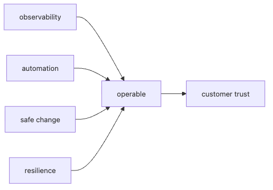

# 운영 가능한 시스템 만들기

많은 시스템은 기능 요구사항은 자세히 적지만, 운영 요구사항은 나중 문제로 남겨 둡니다. 서비스가 커지고 장애가 생긴 뒤에야 로그를 더 남기고, 롤백 절차를 만들고, 자동화를 붙이기 시작합니다. 그런데 운영성은 뒤늦게 덧붙일수록 비용이 더 큽니다.

운영하기 쉬운 시스템은 우연히 만들어지지 않습니다. 문제가 생겼을 때 빨리 볼 수 있어야 하고, 변경을 안전하게 되돌릴 수 있어야 하며, 부분 실패가 전체 붕괴로 번지지 않아야 하고, 반복 운영 절차는 가능한 한 코드로 옮겨져 있어야 합니다.

이 글은 SRE 101 시리즈의 마지막 글입니다. 여기서는 operability를 기능과 함께 설계해야 하는 품질로 보고, 관측성, 자동화, 안전한 변경, 회복력을 한 시스템 안에서 어떻게 묶어 볼지 정리합니다.

---

## 이 글에서 다룰 문제

- operability는 왜 기능 뒤에 붙이는 옵션이 아니라 설계 요소일까요?
- 관측성, 자동화, 안전한 변경, 회복력은 왜 함께 봐야 할까요?
- 운영 가능한 시스템을 점검할 때 어떤 질문부터 던져야 할까요?
- 부분 실패가 전체 장애로 번지는 것을 막으려면 무엇이 필요할까요?
- SRE 101에서 다룬 개념들은 어떻게 하나의 운영 설계로 묶일까요?

## 왜 이 주제가 중요한가

운영성이 없는 기능은 시간이 지나면 부채로 돌아옵니다. 기능은 잘 만들어졌는데 로그가 부족하고, 배포는 되는데 롤백이 어렵고, 장애는 복구되는데 같은 절차를 매번 사람이 반복해야 한다면 팀은 점점 느려집니다.

반대로 운영성이 내장된 시스템은 장애를 더 빨리 읽고, 변경을 더 작고 안전하게 내보내며, 부분 실패를 전체 실패로 키우지 않고, 반복 업무를 자동화로 흡수합니다. 서비스가 커질수록 이 차이는 더 크게 벌어집니다.

## 한 문장으로 잡는 멘탈 모델

> 운영성은 출시 후에 덧붙이는 장식이 아니라, 처음부터 기능과 함께 설계해야 하는 품질 속성입니다.

## 한눈에 보는 구조



*관측성, 자동화, 안전한 변경, 회복력이 함께 있어야 운영 가능한 시스템이 완성됩니다.*
운영 가능한 시스템은 한 가지 도구로 만들어지지 않습니다. 관측성, 자동화, 안전한 변경, 회복력이 함께 맞물려야 운영성이 생기고, 그 운영성이 결국 고객 신뢰로 이어집니다.

## 핵심 용어 먼저 정리

| 용어 | 뜻 | 실무에서 보는 포인트 |
| --- | --- | --- |
| operability | 시스템을 운영하고 문제를 다루기 쉬운 정도 | 기능 품질의 일부입니다 |
| observability | 외부 신호로 내부 상태를 추론하는 능력 | 디버깅의 출발점이 됩니다 |
| safe change | 작고 되돌리기 쉬운 변경 방식 | 배포 위험을 줄입니다 |
| resilience | 부분 실패에서 버티고 회복하는 능력 | 장애 확산을 막습니다 |
| runbook-as-code | 운영 절차를 코드로 표현한 방식 | 사람 의존적 절차를 줄입니다 |

## 운영성은 왜 기능과 함께 설계해야 할까

기능 개발이 끝난 뒤 운영 요소를 붙이려 하면 늘 타협이 생깁니다. 로그는 빠져 있고, 메트릭 이름은 제각각이고, 롤백은 수동이며, 장애 대응 절차는 특정 담당자 경험에 기대게 됩니다. 이 상태에서는 기능이 늘수록 운영 복잡도도 함께 커집니다.

반대로 처음부터 운영성을 요구사항으로 보면 설계 질문이 달라집니다. 이 기능은 어떤 메트릭을 남겨야 하는가, 실패하면 어떻게 우회할 것인가, 카나리 배포가 가능한가, 롤백은 몇 분 안에 가능한가, 반복 운영 절차를 코드로 표현할 수 있는가 같은 질문이 설계 초기에 들어옵니다.

## 네 가지 축을 함께 봐야 하는 이유

관측성이 없으면 문제를 읽을 수 없습니다. 안전한 변경이 없으면 작은 실수도 크게 퍼집니다. 회복력이 없으면 부분 실패가 연쇄 장애로 번집니다. 자동화가 없으면 팀 시간이 반복 수작업에 묶입니다. 한 축만 좋아서는 운영성이 생기지 않습니다.

그래서 operability audit를 할 때도 여러 축을 한 번에 보는 편이 좋습니다. 현재 시스템이 어디에서 가장 약한지 드러나기 때문입니다. 보통은 한 축의 부족함이 다른 축의 부담으로 이어집니다.

## 단계별로 운영성 점검하기

### 1단계 — 관측성 확인

```python
def has_obs(metrics, logs, traces):
    return all([metrics, logs, traces])
```

메트릭, 로그, 트레이스는 각자 다른 질문에 답합니다. 세 가지가 함께 있어야 내부 상태를 더 정확하게 추론할 수 있고, 디버깅 속도도 빨라집니다.

### 2단계 — 안전한 배포 확인

```python
def safe_deploy(canary_pct, rollback_ready):
    return canary_pct <= 5 and rollback_ready
```

운영 가능한 시스템은 변경도 작고 되돌리기 쉬워야 합니다. 카나리와 롤백 준비 여부를 함께 보는 이유가 여기에 있습니다. 배포가 항상 전면 적용이라면 작은 실수도 큰 장애로 번질 수 있습니다.

### 3단계 — 회복 패턴 확인

```python
def has_resilience(retry, timeout, breaker):
    return all([retry, timeout, breaker])
```

재시도, 타임아웃, 서킷 브레이커 같은 패턴은 부분 실패를 가두는 장치입니다. 이런 장치가 없으면 작은 외부 의존성 문제도 전체 요청 흐름을 무너뜨릴 수 있습니다.

### 4단계 — 자동화 비율 확인

```python
def auto_ratio(auto_min, total_min):
    return auto_min / total_min
```

반복 절차를 사람이 계속 수행한다면 운영성은 아직 약합니다. 자동화 비율은 팀 시간이 구조 개선으로 향하고 있는지, 아니면 반복 수작업에 갇혀 있는지 보여 줍니다.

### 5단계 — 운영성 점수 계산

```python
def score(obs, deploy, resil, auto):
    return sum([obs, deploy, resil, auto >= 0.7]) / 4
```

운영성은 추상적이지만, 이런 식으로 차원별 점검 항목으로 나누면 우선순위를 정하기 쉬워집니다. 완벽한 점수를 만들기보다 약한 축을 빨리 드러내는 데 의미가 있습니다.

## 이 코드에서 먼저 봐야 할 점

- 운영성은 네 가지 축의 결합으로 봐야 합니다.
- 운영성은 문서 주장보다 실제 구현 여부로 확인해야 합니다.
- 안전한 변경과 회복력은 장애 확산을 줄이는 핵심 장치입니다.
- 자동화는 팀 시간을 지키는 운영성 요소입니다.

## 여기서 자주 헷갈립니다

첫 번째 실수는 operability를 나중 문제로 미루는 것입니다. 이 선택은 나중에 더 큰 비용으로 돌아옵니다.

두 번째 실수는 observability가 부족한데도 장애 대응 절차만 강화하려는 것입니다. 보이지 않는 시스템은 잘 대응할 수도 없습니다.

세 번째 실수는 카나리와 롤백 없이 전면 배포를 반복하는 것입니다. 안전한 변경 경로가 없으면 팀은 점점 변경을 두려워하게 됩니다.

## 운영 체크리스트

- [ ] 메트릭, 로그, 트레이스를 모두 확보했다.
- [ ] 카나리와 롤백 절차가 준비되어 있다.
- [ ] 재시도, 타임아웃, 서킷 브레이커 같은 회복 패턴을 점검했다.
- [ ] 반복 운영 절차의 자동화 수준을 측정한다.
- [ ] 운영성 약점을 차원별로 점검하고 우선순위를 정한다.

## 실무에서는 이렇게 생각합니다

시니어 엔지니어는 운영성을 기능의 부가 옵션으로 보지 않습니다. 시스템이 커질수록 운영성이 없는 기능은 더 큰 비용과 더 느린 변경 속도로 되돌아오기 때문입니다.

또한 플랫폼팀이 공통 로깅, 배포, 롤백, 알림 템플릿을 제공하면 제품팀은 비즈니스 기능에 더 집중할 수 있습니다. 운영성을 개별 팀의 감각에 맡기지 않고, 공통 기반으로 끌어올리는 방식입니다.

## 정리

운영 가능한 시스템은 관측성, 자동화, 안전한 변경, 회복력이 함께 설계된 시스템입니다. SRE에서 다룬 SLO, 에러 버짓, 모니터링, 인시던트 대응, 포스트모템, Toil 감소, 용량 계획은 모두 이 운영성을 만들기 위한 서로 다른 관문이었습니다.

이로써 SRE 101 시리즈를 마칩니다. 다음에는 더 깊은 장애 대응이나 서비스별 운영 주제로 들어가며, 여기서 다룬 기본 원칙을 더 구체적인 사례에 적용하게 됩니다.

<!-- toc:begin -->
- [SRE란 무엇인가?](./01-what-is-sre.md)
- [Reliability](./02-reliability.md)
- [SLI, SLO, SLA](./03-sli-slo-sla.md)
- [Error Budget](./04-error-budget.md)
- [Monitoring](./05-monitoring.md)
- [Incident Response](./06-incident-response.md)
- [Postmortem](./07-postmortem.md)
- [Toil 줄이기](./08-reducing-toil.md)
- [Capacity Planning](./09-capacity-planning.md)
- **운영 가능한 시스템 만들기 (현재 글)**
<!-- toc:end -->

## 참고 자료

- [Building Secure and Reliable Systems - Google](https://sre.google/books/building-secure-reliable-systems/)
- [Release It! - Michael Nygard](https://pragprog.com/titles/mnee2/release-it-second-edition/)
- [Resilience Engineering - Wikipedia](https://en.wikipedia.org/wiki/Resilience_engineering)
- [Observability Engineering - O'Reilly](https://www.oreilly.com/library/view/observability-engineering/9781492076438/)

Tags: SRE, Operability, Architecture, Reliability, Engineering
