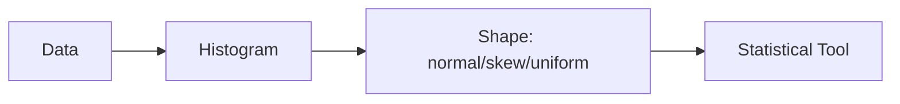

# Distributions

This is post 3 in the Statistics 101 series.

> Statistics 101 series (3/10)

<!-- a-grade-intro:begin -->

**Core question**: Why does the *shape* of data matter? Why do datasets with the *same mean* sometimes *behave so differently*?

> *A distribution is the personality of the data.*

<!-- a-grade-intro:end -->

## What You Will Learn

- Four *common distributions*
- The *risk of assuming normality*
- The meaning of *skewness* and *kurtosis*
- A 5-step distribution diagnosis exercise
- Five common mistakes

## Why It Matters

*Most* summary statistics and tests stand on *distribution assumptions*. If the *shape is assumed wrong*, the *conclusion as a whole* shakes.

> *Pick the tool by the shape.*

## Concept at a Glance



## Key Terms

- **Normal**: a *symmetric bell* shape; common in nature and measurement noise.
- **Uniform**: every value has the *same frequency*.
- **Exponential**: time between events, waiting times.
- **Power-law**: *long-tail*. Revenue, page views.
- **Skewness**: degree of *asymmetry*.
- **Kurtosis**: thickness of the *tails*.

## Before / After

**Before**: *“Average response time is 200 ms.”* — assumed bell-shaped, SLA built on the mean.

**After**: *“p50=120 ms, p95=900 ms, long-tail — the SLA must be defined on p95 to be safe.”*

## Hands-on: 5-step Distribution Diagnosis

### Step 1 — Histogram

```python
import matplotlib.pyplot as plt
plt.hist(latency, bins=50); plt.show()
```

### Step 2 — Summary statistics

```python
import numpy as np
print(np.mean(latency), np.median(latency), np.std(latency))
```

### Step 3 — Quantiles

```python
for q in [50, 90, 95, 99]:
    print(f"p{q}:", np.percentile(latency, q))
```

### Step 4 — Skewness and kurtosis

```python
from scipy.stats import skew, kurtosis
print("skew:", skew(latency), "kurt:", kurtosis(latency))
```

### Step 5 — Decide

```text
skew=+2.3, kurt=+8 → long-tail. SLA = p95 = 900ms.
```

## What to Notice in This Code

- The *histogram* is the *start of every diagnosis*.
- *Quantiles* catch the *long-tail*.
- *Skewness and kurtosis* express the shape *as numbers*.

## Five Common Mistakes

1. **Applying tests after *assuming normality*.**
2. **Letting *outliers* blend into the *distribution*.**
3. **Looking at long-tail without a *log scale*.**
4. **Replacing *p99* with the *mean*.**
5. **Reading statistics *without visualization*.**

## How This Shows Up in Production

Response-time SLAs, revenue, click-through, defect frequency — *most operational metrics* are *long-tail*. Tools like *Datadog, Grafana, Sentry* default to showing *p50 / p95 / p99*.

## How a Senior Engineer Thinks

- *Plot the distribution* first.
- Do not casually *assume normality*.
- For long-tails, read the *quantiles*.
- Use *log scale* aggressively.
- Make *shape* part of the *team's vocabulary*.

## Checklist

- [ ] I draw a *histogram*.
- [ ] I read *p50 / p95 / p99*.
- [ ] I know *skewness and kurtosis*.
- [ ] I use a *p95 SLA* on long-tail data.

## Practice Problems

1. Plot a histogram of *response times* for a service you know.
2. Explain in one sentence the *shape difference* between *normal* and *exponential*.
3. Write down why *p99* is more useful than the *mean* on a long-tail.

## Wrap-up and Next Steps

A distribution is the *personality of the data*. The next episode opens up *uncertainty* through *sample and population*.

<!-- toc:begin -->
- [What Is Statistics?](./01-what-is-statistics.md)
- [Mean, Median, and Variance](./02-mean-median-variance.md)
- **Distributions (current)**
- Sample and Population (upcoming)
- Estimation (upcoming)
- Confidence Interval (upcoming)
- Hypothesis Testing (upcoming)
- Correlation and Regression (upcoming)
- Understanding p-value (upcoming)
- Statistical Thinking (upcoming)
<!-- toc:end -->

## References

- [SciPy — Statistical Distributions](https://docs.scipy.org/doc/scipy/reference/stats.html)
- [Khan Academy — Distributions](https://www.khanacademy.org/math/statistics-probability/random-variables-stats-library)
- [Wikipedia — Power Law](https://en.wikipedia.org/wiki/Power_law)
- [Brendan Gregg — Latency Distributions](https://www.brendangregg.com/blog/2014-06-23/latency-heat-maps.html)

Tags: Statistics, Distribution, Normal, Skew, Beginner
