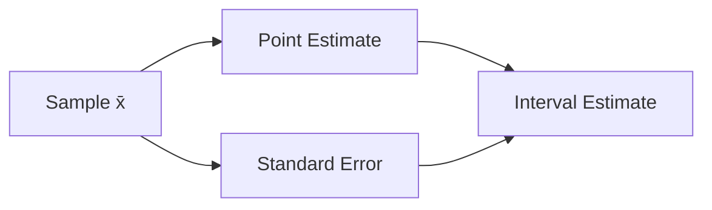

# Estimation

This is post 5 in the Statistics 101 series.

> Statistics 101 series (5/10)

<!-- a-grade-intro:begin -->

**Core question**: How *accurate* is it to estimate the *population mean* with the *sample mean*? How should we report the *error*?

> *An estimate is a pair: value and error.*

<!-- a-grade-intro:end -->

## What You Will Learn

- *Point estimation* vs *interval estimation*
- The meaning of *standard error (SE)*
- *Unbiased* and *consistent* estimators
- A 5-step estimation exercise
- Five common mistakes

## Why It Matters

Reporting a mean is not the end. *How close it is* must be reported *together* so decision makers can read the *risk*.

> *An estimate always carries error with it.*

## Concept at a Glance



## Key Terms

- **Point Estimate**: a *single value* estimate of a parameter (x̄).
- **Interval Estimate**: a *range* expected to contain the parameter.
- **Standard Error (SE)**: the *standard deviation of an estimator* — usually s/√n.
- **Unbiased Estimator**: its *expected value* equals the *parameter*.
- **Consistent Estimator**: as the sample grows, it *converges to the parameter*.

## Before / After

**Before**: *“The sample mean is 100.”* — No clue how reliable it is.

**After**: *“x̄ = 100, SE = 2.5 (n=64). The 95% CI for the population mean is [95.1, 104.9].”*

## Hands-on: 5-step Estimation

### Step 1 — Prepare a sample

```python
import numpy as np
sample = np.random.normal(loc=100, scale=20, size=64)
```

### Step 2 — Point estimate

```python
mean = sample.mean()
print("x̄:", mean)
```

### Step 3 — Standard error

```python
se = sample.std(ddof=1) / np.sqrt(len(sample))
print("SE:", se)
```

### Step 4 — 95% interval

```python
lower, upper = mean - 1.96 * se, mean + 1.96 * se
print(f"95% CI: [{lower:.1f}, {upper:.1f}]")
```

### Step 5 — Report

```text
x̄ = 99.8 (n=64), SE = 2.4
95% CI: [95.1, 104.5]
```

## What to Notice in This Code

- *SE = s / √n* — it shrinks as the *sample grows*.
- A *95% CI* is *±1.96 × SE*.
- An estimate is always reported *with its SE*.

## Five Common Mistakes

1. **Confusing *standard deviation* with *SE*.**
2. **Believing more *N* drives error to *zero*.**
3. **Reporting the *point estimate* alone.**
4. **Assuming *normality* on a *small sample*.** Use the *t-distribution*.
5. **Building an *unbiased estimator* on a *biased sample*.**

## How This Shows Up in Production

Conversion rate in A/B tests, monthly revenue averages, p95 latency — every *dashboard number* is an *estimate*. They are usually shown with *error bars* and *confidence intervals*.

## How a Senior Engineer Thinks

- *Always* attach *SE* next to an estimate.
- Set *N* with *statistical power analysis*.
- Use the *t-distribution* on *small samples*.
- *Inspect bias* first.
- *Never hide* error in a report.

## Checklist

- [ ] I know *point* vs *interval* estimation.
- [ ] I can compute *SE*.
- [ ] I can build a *95% CI*.
- [ ] I understand the effect of *N*.

## Practice Problems

1. Compare the *SE* at *N=10* and *N=1000*.
2. Explain the meaning of *unbiased estimator* in one sentence.
3. Write the *estimation procedure* you would use to judge whether *μ = 100*.

## Wrap-up and Next Steps

Estimation is the act of *writing uncertainty as a number*. The next episode looks at the *true meaning* of a *95% CI*.

<!-- toc:begin -->
- [What Is Statistics?](./01-what-is-statistics.md)
- [Mean, Median, and Variance](./02-mean-median-variance.md)
- [Distributions](./03-distributions.md)
- [Sample and Population](./04-sample-and-population.md)
- **Estimation (current)**
- Confidence Interval (upcoming)
- Hypothesis Testing (upcoming)
- Correlation and Regression (upcoming)
- Understanding p-value (upcoming)
- Statistical Thinking (upcoming)
<!-- toc:end -->

## References

- [scipy.stats — Statistical Functions](https://docs.scipy.org/doc/scipy/reference/stats.html)
- [Khan Academy — Estimation](https://www.khanacademy.org/math/statistics-probability/confidence-intervals-one-sample)
- [Wikipedia — Standard Error](https://en.wikipedia.org/wiki/Standard_error)
- [NIST — Estimation Methods](https://www.itl.nist.gov/div898/handbook/eda/section3/eda35.htm)

Tags: Statistics, Estimation, Inference, PointEstimate, Beginner
