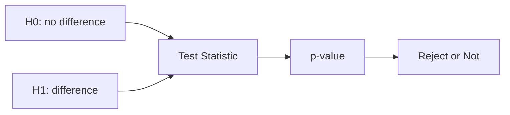

# Hypothesis Testing

This is post 7 in the Statistics 101 series.

> Statistics 101 series (7/10)

<!-- a-grade-intro:begin -->

**Core question**: How do we *prove with data* that *“there is a difference”*? How likely is it that the difference *appeared by chance*?

> *Hypothesis testing turns chance into a number.*

<!-- a-grade-intro:end -->

## What You Will Learn

- The meaning of *H0* and *H1*
- *t-test*, *chi-square*, *proportion* tests
- *Type I / II errors* and *power*
- A 5-step hypothesis testing exercise
- Five common mistakes

## Why It Matters

*A/B testing, campaign effects, model comparisons* — *half* of all *decisions* run on hypothesis testing. Asking *correctly* avoids both *overclaiming* and *underclaiming*.

> *Asking the right question matters more than the answer.*

## Concept at a Glance



## Key Terms

- **H0 (Null Hypothesis)**: *no difference*.
- **H1 (Alternative)**: *there is a difference*.
- **Significance Level (α)**: tolerated *Type I error* probability (usually 0.05).
- **Power (1-β)**: probability of *catching a real effect*.
- **Type I Error**: *rejecting* H0 when it is *true*.
- **Type II Error**: *failing to reject* H0 when it is *false*.

## Before / After

**Before**: *“Group B's mean is higher. The treatment works!”* — Could be chance.

**After**: *“B mean +0.4pp (t=3.2, p=0.001) — significant at α=0.05, the treatment shows an effect.”*

## Hands-on: 5-step Hypothesis Test

### Step 1 — State the hypotheses

```text
H0: μ_A = μ_B
H1: μ_A ≠ μ_B
α = 0.05
```

### Step 2 — Sample

```python
import numpy as np
a = np.random.normal(3.2, 1, 1000)
b = np.random.normal(3.6, 1, 1000)
```

### Step 3 — Test statistic

```python
from scipy.stats import ttest_ind
stat, p = ttest_ind(a, b, equal_var=False)
print("t:", stat, "p:", p)
```

### Step 4 — Decide

```python
print("Reject H0" if p < 0.05 else "Fail to reject H0")
```

### Step 5 — Effect size

```python
diff = b.mean() - a.mean()
pooled = np.sqrt((a.var(ddof=1) + b.var(ddof=1)) / 2)
print("Cohen's d:", diff / pooled)
```

## What to Notice in This Code

- *Never decide from the p-value alone*.
- Read *Cohen's d* alongside it for *effect size*.
- *equal_var=False* selects *Welch's t-test*.

## Five Common Mistakes

1. **Concluding *“there is an effect”* from *p < 0.05* alone.**
2. **Running multiple tests *without correcting for multiplicity*.**
3. **Choosing sample size *without a power analysis*.**
4. **Picking *one-sided / two-sided* without context.**
5. **Changing H0 / H1 *after looking at results* (HARKing).**

## How This Shows Up in Production

A/B test result pages, *model performance comparisons*, *clinical trials* — the standard procedure for any *comparison decision*. *Bonferroni* and *FDR* corrections are common companions.

## How a Senior Engineer Thinks

- Writes the *hypothesis* down *before* seeing the data.
- Reads *p-value* and *effect size* together.
- Computes *power* up front.
- *Corrects* for multiple comparisons.
- Distinguishes *“fail to reject”* from *“H0 is true”*.

## Checklist

- [ ] I write *H0 / H1* clearly.
- [ ] I decide *α* and *power*.
- [ ] I report *effect size*.
- [ ] I know *multiple comparisons* corrections.

## Practice Problems

1. Simulate the *p-value* difference between *N=30* and *N=3000*.
2. Explain *Type I* vs *Type II* error with an example.
3. Write how you would *correct p < 0.05* across *three campaigns* tested at once.

## Wrap-up and Next Steps

Hypothesis testing is the *standard language of decisions*. The next episode looks at the *relationship between variables* — *correlation and regression*.

<!-- toc:begin -->
- [What Is Statistics?](./01-what-is-statistics.md)
- [Mean, Median, and Variance](./02-mean-median-variance.md)
- [Distributions](./03-distributions.md)
- [Sample and Population](./04-sample-and-population.md)
- [Estimation](./05-estimation.md)
- [Confidence Interval](./06-confidence-interval.md)
- **Hypothesis Testing (current)**
- Correlation and Regression (upcoming)
- Understanding p-value (upcoming)
- Statistical Thinking (upcoming)
<!-- toc:end -->

## References

- [scipy.stats — Hypothesis Tests](https://docs.scipy.org/doc/scipy/reference/stats.html)
- [Khan Academy — Hypothesis Testing](https://www.khanacademy.org/math/statistics-probability/significance-tests-one-sample)
- [Wikipedia — Multiple Comparisons Problem](https://en.wikipedia.org/wiki/Multiple_comparisons_problem)
- [Statistics Done Wrong (Reinhart)](https://www.statisticsdonewrong.com/)

Tags: Statistics, HypothesisTesting, Inference, ABTest, Beginner
