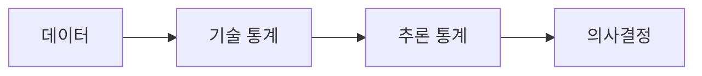

# 통계란 무엇인가?

> Statistics 101 시리즈 (1/10)

## 이 글에서 다룰 문제

- 통계는 정확히 무엇을 다루는 학문일까요?
- 기술 통계와 추론 통계는 어떻게 다른 역할을 맡을까요?
- 데이터는 어떻게 요약에서 끝나지 않고 결정으로 이어질까요?
- A/B 테스트나 대시보드 같은 실무 장면에서 통계는 왜 빠지지 않을까요?

통계를 처음 배우면 평균, 분산, p-value 같은 용어가 먼저 눈에 들어옵니다. 그런데 현업에서 통계가 필요한 순간은 공식 암기보다 훨씬 단순합니다. “정말 차이가 있나?”, “이 수치를 믿어도 되나?”, “이 결과를 바탕으로 무엇을 결정할까?” 같은 질문이 먼저 나옵니다.

통계는 가설과 증거 사이를 숫자로 연결하는 언어입니다. 데이터가 많아질수록 더 중요해집니다. 숫자가 많다고 판단이 쉬워지는 것이 아니라, 무엇을 요약하고 어디까지 믿을지를 더 분명히 정해야 하기 때문입니다.

> 좋은 통계 사고는 숫자 자체보다 결정을 더 선명하게 만듭니다.

## 왜 중요한가

데이터가 쌓이면 누구나 먼저 패턴을 보고 싶어 합니다. 이번 달 매출이 올랐는지, 새 기능이 전환율을 높였는지, 특정 집단이 더 오래 머무는지 궁금해집니다. 문제는 눈에 띄는 변화가 항상 의미 있는 변화는 아니라는 점입니다. 우연히 흔들린 것인지, 반복해도 유지될 차이인지 구분해야 합니다.

통계는 이런 순간에 데이터를 짧게 요약하고, 표본에서 모집단을 조심스럽게 추론하며, 불확실성을 수치로 드러내고, 마지막에는 결정 문장으로 닫게 도와줍니다. 그래서 통계는 숫자를 예쁘게 정리하는 기술이 아니라 불확실한 환경에서 덜 틀리게 판단하는 기술에 가깝습니다.

## 한눈에 보는 개념



## 핵심 용어

- **기술 통계**: 평균, 분산처럼 데이터를 요약해 현재 모습을 보여 주는 통계입니다.
- **추론 통계**: 표본을 바탕으로 모집단을 추정하는 통계입니다.
- **모집단과 표본**: 전체와 일부의 관계입니다. 실제 분석은 거의 항상 표본에서 시작합니다.
- **추정**: 모집단의 참값을 직접 모를 때 표본으로 가장 그럴듯한 값을 구하는 일입니다.
- **불확실성**: 추정에는 항상 오차가 따라붙는다는 사실입니다.

## Before/After

**Before**: “이번 달 매출이 늘었어요!” — 얼마나 늘었고, 통계적으로 의미가 있을까요?

**After**: “이번 달 매출은 평균 6.2% 증가했습니다 (95% CI ±1.5%, n=30일). 지난달 대비 통계적으로 유의합니다.”

## 실습: 5단계 통계 사고

통계는 보통 데이터에서 시작한다고 생각하지만, 실제로는 질문에서 시작합니다. 아래 흐름은 작은 분석 하나를 끝까지 가져가는 가장 기본적인 순서입니다.

### 1단계 — 질문 정의

```text
Q: "Did this month's marketing campaign improve click-through rate?"
```

### 2단계 — 데이터 모으기

```python
import pandas as pd
df = pd.read_csv("clicks.csv")
print(df.shape, df.columns.tolist())
```

### 3단계 — 요약 (기술)

```python
print(df.groupby("group")["ctr"].agg(["mean", "std", "count"]))
```

### 4단계 — 추론

```python
from scipy.stats import ttest_ind
a, b = df.loc[df.group == "control", "ctr"], df.loc[df.group == "test", "ctr"]
print(ttest_ind(a, b, equal_var=False))
```

### 5단계 — 결정

```text
Decision: p < 0.01 & lift +0.4pp → roll out the campaign to all users
```

## 이 코드에서 주목할 점

- 분석은 요약 → 추론 → 결정이라는 세 층으로 진행됩니다.
- 그룹 비교는 보통 t-test처럼 익숙한 검정부터 시작합니다.
- 분석의 끝은 숫자 나열이 아니라 결정 문장입니다.

이 흐름이 중요한 이유는 통계를 보고서 장식으로 쓰지 않게 해 주기 때문입니다. 평균과 표준편차를 구했다면 다음에는 차이가 우연인지 판단해야 하고, 유의한 차이를 확인했다면 마지막에는 실제 행동을 정해야 합니다. 질문과 결정이 빠진 통계는 숫자는 남아도 방향은 남기지 못합니다.

## 자주 하는 실수 5가지

1. 평균만 보고 분산과 분포를 함께 보지 않습니다.
2. 표본을 모집단처럼 다루면서 불확실성을 잊습니다.
3. p-value와 효과 크기를 같은 뜻으로 받아들입니다.
4. 시각화 없이 숫자만 읽다가 분포의 왜곡을 놓칩니다.
5. 결정 없이 보고서를 끝내서 분석의 목적을 흐립니다.

## 실무에서는 이렇게 생각합니다

A/B 테스트, 매출 예측, 이상치 탐지, 품질 관리처럼 데이터로 판단하는 거의 모든 장면에 통계가 들어갑니다. 대시보드의 숫자 하나도 결국 추정값입니다. 그래서 좋은 팀일수록 숫자 하나만 던지지 않고, 그 숫자가 어떤 표본에서 왔는지와 어느 정도 흔들릴 수 있는지 함께 설명합니다.

시니어 엔지니어 관점에서 보면 통계는 도구 목록이 아니라 의사결정 루프입니다. 평균을 보기 전에 분포를 먼저 확인하고, 추정값에는 항상 오차 범위를 붙이며, 질문에서 데이터로, 다시 결정으로 이어지는 루프를 짧게 가져갑니다. 숫자와 시각화를 함께 읽는 습관도 여기서 나옵니다.

## 체크리스트

- [ ] 질문을 한 줄로 적을 수 있습니다.
- [ ] 기술 통계로 데이터를 요약할 수 있습니다.
- [ ] 추론을 통해 불확실성을 읽을 수 있습니다.
- [ ] 분석을 결정 문장으로 마무리합니다.

## 연습 문제

1. 일상 데이터 하나를 골라 평균과 분산을 직접 계산해 보세요. 예를 들어 최근 30일 공부 시간도 좋습니다.
2. 모집단과 표본의 차이를 한 문장으로 설명해 보세요.
3. 최근에 본 보고서 하나를 떠올리고, 질문 → 데이터 → 결정 구조로 다시 적어 보세요.

## 정리와 다음 글

통계는 불확실성을 결정으로 옮기는 도구입니다. 기술 통계가 현재 모습을 요약한다면, 추론 통계는 그 요약을 바탕으로 더 넓은 세계를 조심스럽게 말하게 해 줍니다. 다음 글에서는 그 출발점이 되는 요약 통계, 즉 평균·중앙값·분산을 자세히 살펴보겠습니다.

<!-- toc:begin -->
- **통계란 무엇인가? (현재 글)**
- 평균, 중앙값, 분산 (예정)
- 분포 (예정)
- 표본과 모집단 (예정)
- 추정 (예정)
- 신뢰구간 (예정)
- 가설검정 (예정)
- 상관과 회귀 (예정)
- p-value 이해하기 (예정)
- 통계적 사고방식 (예정)
<!-- toc:end -->

## 참고 자료

- [Khan Academy — Statistics and Probability](https://www.khanacademy.org/math/statistics-probability)
- [OpenIntro Statistics](https://www.openintro.org/book/os/)
- [scipy.stats — Statistical Functions](https://docs.scipy.org/doc/scipy/reference/stats.html)
- [Seeing Theory — Visual Introduction](https://seeing-theory.brown.edu/)

Tags: Statistics, Fundamentals, DataAnalysis, Beginner, Concept
