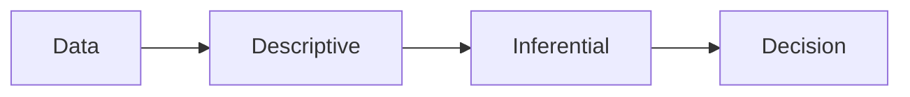

# 통계란 무엇인가?

데이터가 많아지면 숫자도 함께 늘어납니다. 그런데 숫자가 많아진다고 판단이 저절로 좋아지지는 않습니다. 월간 매출이 올랐다는 말, 전환율이 달라졌다는 말, 설문 만족도가 높다는 말은 모두 숫자를 들고 있지만, 그 숫자가 얼마나 믿을 만한지까지 함께 말해 주지는 않습니다.

통계는 바로 그 빈칸을 메우는 도구입니다. 숫자를 예쁘게 정리하는 기술에 그치지 않고, 표본에서 관찰한 사실을 바탕으로 어떤 결정을 내려도 되는지까지 이어 주는 사고 체계입니다.

이 글은 Statistics 101 시리즈의 첫 번째 글입니다. 여기서는 통계를 기술 통계와 추론 통계라는 두 축으로 나누어 보고, 데이터에서 판단까지 이어지는 기본 흐름을 잡아 보겠습니다.

## 이 글에서 다룰 문제

- 통계는 정확히 무엇을 다루는 학문일까요?
- 기술 통계와 추론 통계는 어떻게 역할이 다를까요?
- 통계는 숫자 계산이 아니라 의사결정과 어떻게 연결될까요?
- 통계를 읽을 때 어떤 질문 순서가 필요할까요?

> 통계는 불확실한 상황에서 숫자를 근거로 판단하게 만드는 공통 언어입니다.

## 왜 중요한가

현업에서는 데이터가 보고서의 끝이 아니라 시작입니다. 숫자가 올라갔다고 바로 성공이라고 말할 수 없고, 차이가 있다고 보여도 우연일 수 있습니다. 반대로 작은 차이처럼 보여도 반복해서 확인하면 충분히 의미 있는 변화일 수 있습니다.

이 지점에서 통계가 필요합니다. 통계는 관찰한 숫자를 요약하고, 그 숫자에 붙는 불확실성을 표시하고, 마지막에 판단 문장으로 닫게 만듭니다. 질문 없이 통계를 쓰면 계산만 남고, 통계 없이 의사결정을 하면 느낌만 남습니다.

## 멘탈 모델

통계를 처음 배울 때는 공식을 하나씩 외우기보다 흐름을 먼저 보는 편이 좋습니다. 데이터는 먼저 요약되고, 요약된 데이터는 모집단에 대한 추론으로 이어지고, 그 추론은 의사결정 문장으로 마무리됩니다. 통계를 잘 읽는 사람은 이 세 단계를 섞지 않습니다.



위 그림을 하나의 문장으로 바꾸면 이렇습니다. 먼저 데이터의 현재 모습을 설명하고, 그다음 표본 바깥의 세계를 추론하고, 마지막에 무엇을 할지 결정합니다. 시리즈 전체도 이 순서로 전개됩니다.

## 핵심 용어

- **기술 통계**: 평균, 분산, 분위수처럼 데이터를 요약해 현재 상태를 설명하는 통계입니다.
- **추론 통계**: 표본을 바탕으로 모집단의 성질을 추정하거나 검정하는 통계입니다.
- **모집단과 표본**: 전체와 일부의 관계입니다. 통계는 대개 일부를 보고 전체를 말합니다.
- 추정: 모집단의 참값을 표본으로 가늠하는 과정입니다.
- 불확실성: 추정에는 항상 오차가 따라붙는다는 사실입니다.

## 같은 보고서도 통계 문장이 바뀌면 해석이 달라진다

통계 없이 숫자만 말하면 보고서가 쉽게 과장됩니다.

이전 해석: “이번 달 매출이 올랐습니다.”

이 문장에는 상승 폭도 없고, 변동성도 없고, 지난달과 비교했을 때 의미 있는 차이인지도 없습니다.

이후 해석: “이번 달 일매출은 지난달보다 평균 6.2% 높았고, 95% 신뢰구간은 ±1.5%입니다. 표본 기간 30일 기준으로 지난달 대비 유의한 상승으로 읽을 수 있습니다.”

두 문장의 차이는 멋진 표현이 아니라 근거 구조입니다. 통계는 숫자에 맥락을 붙이고, 그 맥락으로 결정을 말하게 합니다.

## 실습: 5단계 통계 사고

### 1단계 — 질문을 먼저 적는다

```text
Q: "이번 달 마케팅 캠페인이 클릭률을 올렸는가?"
```

질문이 먼저 없으면 나중에 어떤 검정을 써야 하는지도 흐려집니다.

### 2단계 — 데이터를 확인한다

```python
import pandas as pd
df = pd.read_csv("clicks.csv")
print(df.shape, df.columns.tolist())
```

행 수, 열 이름, 그룹 구성이 기대와 맞는지 보는 단계입니다. 통계 작업은 여기서 자주 갈립니다.

### 3단계 — 기술 통계로 먼저 요약한다

```python
print(df.groupby("group")["ctr"].agg(["mean", "std", "count"]))
```

평균, 표준편차, 표본 크기를 먼저 확인하면 데이터의 규모와 흔들림을 빠르게 읽을 수 있습니다.

### 4단계 — 추론 통계로 차이를 검정한다

```python
from scipy.stats import ttest_ind
a, b = df.loc[df.group == "control", "ctr"], df.loc[df.group == "test", "ctr"]
print(ttest_ind(a, b, equal_var=False))
```

요약된 차이가 우연으로 설명될 수준인지 점검하는 단계입니다.

### 5단계 — 결정 문장으로 닫는다

```text
Decision: p < 0.01 & lift +0.4pp → roll out the campaign to all users
```

분석이 끝났다면 마지막은 숫자가 아니라 행동 문장이어야 합니다.

## 이 코드에서 먼저 볼 점

- 통계 흐름은 **요약 → 추론 → 결정** 순서로 움직입니다.
- 그룹 비교는 대개 기술 통계 확인 뒤에 검정으로 이어집니다.
- 분석 결과를 닫는 문장은 숫자 나열이 아니라 의사결정 문장입니다.

## 자주 헷갈리는 지점 5가지

1. **평균만 보고 판단하는 경우**: 분산과 분포를 같이 보지 않으면 숫자 모양을 놓칩니다.
2. **표본을 모집단처럼 다루는 경우**: 표본에서 얻은 결과에는 항상 오차가 있습니다.
3. **p-value와 효과 크기를 섞는 경우**: 유의성과 크기는 다른 질문에 답합니다.
4. **시각화 없이 숫자만 읽는 경우**: 왜도나 긴 꼬리는 표에서 바로 드러나지 않을 수 있습니다.
5. **결론 없이 숫자만 보고서를 끝내는 경우**: 통계 분석의 목적은 행동 결정입니다.

## 실무에서는 이렇게 읽습니다

A/B 테스트, 수요 예측, 이상 탐지, 품질 관리처럼 데이터로 판단하는 작업은 모두 통계 위에 서 있습니다. 대시보드의 숫자 하나도 사실은 추정값이며, 그 숫자에 어느 정도 오차가 붙는지 함께 설명할 때 팀의 신뢰가 생깁니다.

시니어 엔지니어는 통계를 계산기처럼 다루지 않습니다. 먼저 분포를 보고, 추정값 옆에 불확실성을 붙이고, 질문에서 결정까지 이어지는 경로를 짧게 유지합니다. 좋은 통계 보고서는 많은 공식을 보여 주는 문서가 아니라, 판단이 어디서 나왔는지 설명하는 문서입니다.

## 체크리스트

- [ ] 분석 질문을 한 줄로 적을 수 있습니다.
- [ ] 기술 통계로 데이터를 요약할 수 있습니다.
- [ ] 추론 통계가 불확실성을 어떻게 다루는지 설명할 수 있습니다.
- [ ] 마지막을 결정 문장으로 정리할 수 있습니다.

## 연습 문제

1. 일상 데이터 하나를 골라 평균과 분산을 계산해 보세요.
2. 모집단과 표본의 차이를 한 문장으로 설명해 보세요.
3. 최근에 본 데이터 보고서 하나를 떠올리고, 그 보고서에 결정 문장이 있었는지 적어 보세요.

## 정리와 다음 글

통계는 숫자를 더 많이 만드는 기술이 아니라, 불확실한 상황에서 판단을 더 분명하게 만드는 기술입니다. 먼저 데이터를 설명하고, 그다음 표본 바깥을 추론하고, 마지막에 결정을 내린다는 흐름을 잡아 두면 이후의 평균, 분산, 분포, 검정도 제자리를 찾기 쉽습니다.

다음 글에서는 가장 기본적인 요약 도구인 평균, 중앙값, 분산을 다룹니다. 같은 데이터라도 어떤 숫자를 대표값으로 고르느냐에 따라 해석이 얼마나 달라지는지 살펴보겠습니다.

<!-- toc:begin -->
- **통계란 무엇인가? (현재 글)**
- 평균, 중앙값, 분산 (예정)
- 분포 (예정)
- 표본과 모집단 (예정)
- 추정 (예정)
- 신뢰구간 (예정)
- 가설검정 (예정)
- 상관과 회귀 (예정)
- p-value 이해하기 (예정)
- 통계적 사고방식 (예정)
<!-- toc:end -->

## 참고 자료

- [Khan Academy — Statistics and Probability](https://www.khanacademy.org/math/statistics-probability)
- [OpenIntro Statistics](https://www.openintro.org/book/os/)
- [scipy.stats — Statistical Functions](https://docs.scipy.org/doc/scipy/reference/stats.html)
- [Seeing Theory — Visual Introduction](https://seeing-theory.brown.edu/)

Tags: Statistics, Fundamentals, DataAnalysis, Beginner, Concept
