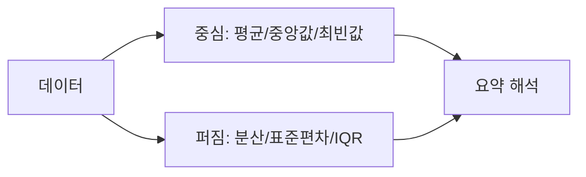

# 평균, 중앙값, 분산

> Statistics 101 시리즈 (2/10)

## 이 글에서 다룰 문제

- 데이터를 한두 개 숫자로 요약할 때 평균과 중앙값 중 무엇을 써야 할까요?
- 분산과 표준편차는 평균이 말해 주지 못하는 무엇을 보여 줄까요?
- 왜 long-tail 분포에서는 평균이 위험한 요약이 될 수 있을까요?
- 어떤 질문 앞에서 어떤 요약 통계를 골라야 할까요?

데이터는 수천 행일 수 있어도 보고서에는 보통 한두 숫자만 남습니다. 그래서 어떤 요약 통계를 고르느냐가 곧 어떤 현실을 보여 줄지 결정합니다. 같은 데이터라도 평균을 내면 멀쩡해 보이고, 중앙값을 보면 완전히 다른 이야기가 나오는 경우가 많습니다.

특히 결제액, 응답 시간, 광고 단가처럼 한쪽 꼬리가 긴 데이터에서는 평균 하나만 보고 판단하면 실무 감각과 어긋난 결론이 나옵니다. 이 글에서는 평균, 중앙값, 분산을 각각 어떤 상황에서 읽어야 하는지, 그리고 왜 한 줄 요약이 생각보다 조심스러운 작업인지 살펴보겠습니다.

> 잘못 고른 요약 통계 하나가 잘못된 결정을 만들 수 있습니다.

## 왜 중요한가

사람은 결국 짧은 숫자로 결정을 내립니다. “평균 결제액이 얼마인가?”, “평균 응답 시간이 줄었는가?”, “변동성이 큰가?” 같은 질문이 매일 나옵니다. 문제는 데이터의 모양을 무시한 요약이 오히려 판단을 흐릴 수 있다는 점입니다.

평균은 익숙하고 계산도 쉽지만, 극단값에 민감합니다. 중앙값은 가운데를 보여 주므로 흔들림에 강합니다. 분산과 표준편차는 값이 얼마나 넓게 퍼져 있는지를 보여 줍니다. 중심과 퍼짐을 함께 봐야 데이터의 성격을 제대로 읽을 수 있습니다.

## 한눈에 보는 개념



## 핵심 용어

- **평균(Mean)**: 합계를 개수로 나눈 값입니다. 극단값에 민감합니다.
- **중앙값(Median)**: 정렬했을 때 가운데 놓인 값입니다. 극단값에 강합니다.
- **최빈값(Mode)**: 가장 자주 나타나는 값입니다.
- **분산(Variance)**: 평균에서 얼마나 떨어져 있는지를 제곱 거리로 평균낸 값입니다.
- **표준편차(Standard Deviation)**: 분산의 제곱근입니다. 원래 데이터와 같은 단위를 가집니다.
- **IQR(사분위 범위)**: Q3 − Q1입니다. 가운데 50% 구간의 폭을 뜻합니다.

## Before/After

**Before**: “우리 사용자 평균 결제액은 50,000원이에요.” — 그런데 한 명이 5,000,000원을 결제했다면 어떨까요?

**After**: “중앙값은 12,000원이고 평균은 50,000원입니다. 왜곡이 크므로 결제액은 long-tail 분포로 읽어야 합니다.”

## 실습: 5단계 요약 통계

아래 예시는 극단값 하나가 평균을 얼마나 크게 흔들 수 있는지 보여 줍니다. 코드 자체보다, 어떤 숫자를 함께 읽어야 하는지가 핵심입니다.

### 1단계 — 데이터 준비

```python
import numpy as np
x = np.array([10, 12, 11, 13, 12, 14, 11, 12, 5_000_000])
```

### 2단계 — 평균과 중앙값

```python
print("mean:", np.mean(x))
print("median:", np.median(x))
```

### 3단계 — 분산과 표준편차

```python
print("var:", np.var(x))
print("std:", np.std(x))
```

### 4단계 — IQR

```python
q1, q3 = np.percentile(x, [25, 75])
print("IQR:", q3 - q1)
```

### 5단계 — 요약 문장

```text
Median 12, IQR 1.5 — most users sit near 12.
Mean 555,557 (skewed by one outlier).
Decision: report the median, not the mean.
```

## 이 코드에서 주목할 점

- 극단값이 있으면 평균과 중앙값이 크게 벌어질 수 있습니다.
- 분산은 제곱 단위라서 해석이 낯설 수 있고, 표준편차는 원래 단위로 읽기 쉽습니다.
- IQR은 극단값에 덜 흔들리는 산포 지표입니다.

요약 통계는 하나만 고르면 안심되는 숫자가 아니라, 질문에 맞는 조합을 고르는 작업입니다. 중심을 볼 때는 평균과 중앙값을 함께 비교하고, 퍼짐을 볼 때는 분산이나 표준편차를 붙여야 합니다. 왜곡이 큰 분포라면 IQR이나 p95처럼 강건한 지표를 더 믿는 편이 낫습니다.

## 자주 하는 실수 5가지

1. 평균만 보고 분포의 모양을 놓칩니다.
2. 표준편차와 분산을 같은 뜻으로 받아들입니다.
3. 왜곡된 분포에서도 평균을 그대로 보고합니다.
4. 표본이 아주 작은데 분산 값을 과신합니다.
5. 단위를 빼고 숫자만 적어 해석을 어렵게 만듭니다.

## 실무에서는 이렇게 생각합니다

매출, 응답 시간, 광고 단가처럼 꼬리가 긴 데이터는 평균보다 중앙값, p95, p99가 더 자주 보고됩니다. 실제 대시보드도 숫자 하나로 끝나지 않습니다. 평균, 중앙값, 표준편차, 상위 백분위수처럼 서로 다른 지표를 함께 놓고 읽습니다.

시니어 엔지니어는 먼저 분포를 그려 보고, 그다음 평균과 중앙값이 얼마나 벌어지는지 확인합니다. 극단값이 어디서 왔는지도 따져 봅니다. 그리고 보고서에는 항상 단위를 씁니다. 결국 좋은 요약 통계는 계산이 쉬운 숫자가 아니라 질문과 분포에 맞는 숫자입니다.

## 체크리스트

- [ ] 평균과 중앙값의 차이를 설명할 수 있습니다.
- [ ] 분산, 표준편차, IQR의 역할을 구분할 수 있습니다.
- [ ] 왜곡된 분포에서 중앙값을 우선 검토합니다.
- [ ] 보고서에 단위를 빠뜨리지 않습니다.

## 연습 문제

1. 최근 30일 공부 시간을 가지고 평균과 중앙값을 각각 계산해 보세요.
2. long-tail 분포에서 평균이 위험한 이유를 한 문장으로 적어 보세요.
3. IQR과 표준편차가 어떻게 다른지 비교해 보세요.

## 정리와 다음 글

요약 통계는 데이터를 짧게 줄이는 도구이면서, 동시에 데이터의 모양을 압축해서 전달하는 도구입니다. 평균은 익숙하지만 언제나 안전하지는 않습니다. 다음 글에서는 요약값 뒤에 숨어 있는 더 큰 그림, 즉 분포 자체를 살펴보겠습니다.

<!-- toc:begin -->
- [통계란 무엇인가?](./01-what-is-statistics.md)
- **평균, 중앙값, 분산 (현재 글)**
- 분포 (예정)
- 표본과 모집단 (예정)
- 추정 (예정)
- 신뢰구간 (예정)
- 가설검정 (예정)
- 상관과 회귀 (예정)
- p-value 이해하기 (예정)
- 통계적 사고방식 (예정)
<!-- toc:end -->

## 참고 자료

- [NIST/SEMATECH e-Handbook of Statistical Methods](https://www.itl.nist.gov/div898/handbook/)
- [pandas — describe()](https://pandas.pydata.org/docs/reference/api/pandas.DataFrame.describe.html)
- [Wikipedia — Robust Statistics](https://en.wikipedia.org/wiki/Robust_statistics)
- [Khan Academy — Summary Statistics](https://www.khanacademy.org/math/statistics-probability/summarizing-quantitative-data)

Tags: Statistics, DescriptiveStats, Mean, Variance, Beginner
