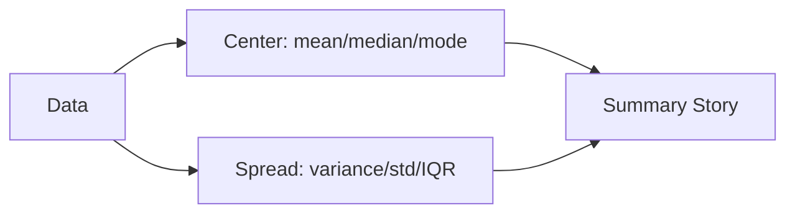

# 평균, 중앙값, 분산

> Statistics 101 시리즈 (2/10)

<!-- a-grade-intro:begin -->

**핵심 질문**: 데이터를 *한두 숫자* 로 요약할 때, *언제 평균* 을 쓰고 *언제 중앙값* 을 써야 할까요? *분산* 은 무엇을 알려 줄까요?

> *요약 통계는 *질문* 에 따라 *모양* 이 바뀐다.*

<!-- a-grade-intro:end -->

## 이 글에서 배울 것

- *중심 경향* 측정 — *평균/중앙값/최빈값*
- *산포* 측정 — *분산/표준편차/IQR*
- *왜곡된 분포* 에서 평균이 *왜 위험* 한지
- 5단계 요약 통계 실습
- 흔한 함정 5가지

## 왜 중요한가

데이터는 *수백, 수천 개* 의 행이지만 사람은 *한두 숫자* 로 결정합니다. *어떤 숫자* 를 고르느냐가 *결정의 질* 을 결정합니다.

> *잘못된 평균 한 줄이 *잘못된 결정* 을 만든다.*

## 개념 한눈에 보기



## 핵심 용어 정리

- **Mean (평균)**: 합 / 개수. *극단값* 에 *민감*.
- **Median (중앙값)**: *정렬 후 가운데*. *극단값에 강함*.
- **Mode (최빈값)**: *가장 자주 나오는 값*.
- **Variance (분산)**: *평균과의 거리* 제곱의 평균.
- **Standard Deviation (표준편차)**: *분산의 제곱근*. *데이터 단위* 와 같음.
- **IQR (사분위 범위)**: *Q3 − Q1*. *중간 50%* 의 폭.

## Before/After

**Before**: *“우리 사용자 평균 결제액은 50,000원이에요”* — 하지만 1명이 5,000,000원 결제했다면?

**After**: *“중앙값 12,000원, 평균 50,000원 (왜곡 큼) — 결제액은 long-tail 분포”*

## 실습: 5단계 요약 통계

### 1단계 — 데이터 준비

```python
import numpy as np
x = np.array([10, 12, 11, 13, 12, 14, 11, 12, 5_000_000])
```

### 2단계 — 평균과 중앙값

```python
print("mean:", np.mean(x))
print("median:", np.median(x))
```

### 3단계 — 분산과 표준편차

```python
print("var:", np.var(x))
print("std:", np.std(x))
```

### 4단계 — IQR

```python
q1, q3 = np.percentile(x, [25, 75])
print("IQR:", q3 - q1)
```

### 5단계 — 요약 문장

```text
중앙값 12, IQR 1.5 — 대부분 사용자는 약 12원 근처.
평균 555,557 (1명 극단값으로 왜곡).
Decision: 평균 대신 중앙값을 보고서에 사용.
```

## 이 코드에서 주목할 점

- *극단값* 이 있으면 *평균 ≠ 중앙값*.
- *분산* 은 *제곱 단위*, *표준편차* 는 *원래 단위*.
- *IQR* 은 *극단값* 에 강한 *산포* 측정.

## 자주 하는 실수 5가지

1. ***평균만* 보고 결정.** *분포 모양* 을 놓친다.
2. ***표준편차* 와 *분산* 을 *혼동*.** 단위가 다르다.
3. ***왜곡된 분포* 에 *평균* 을 *그대로* 사용.**
4. ***N=10* 의 *분산* 을 신뢰.** *표본이 작다*.
5. ***단위 없는 숫자* 보고. *원, %, 초* 를 함께.

## 실무에서는 이렇게 쓰입니다

매출, 응답시간, 광고 단가 등은 *long-tail* 분포가 흔하므로 *중앙값/p95/p99* 가 *평균* 보다 자주 보고됩니다. *대시보드* 는 *3-4가지 통계* 를 함께 보여 줍니다.

## 시니어 엔지니어는 이렇게 생각합니다

- *분포* 부터 *그린다*.
- *중앙값/p95* 를 *평균* 과 *함께* 본다.
- *극단값* 의 *원인* 을 *조사* 한다.
- *단위* 를 *항상* 적는다.
- *요약 통계* 는 *질문에 맞게* 고른다.

## 체크리스트

- [ ] *평균/중앙값* 의 차이를 안다.
- [ ] *분산/표준편차/IQR* 을 안다.
- [ ] *왜곡 분포* 에서 *중앙값* 을 쓴다.
- [ ] *단위* 를 보고서에 적는다.

## 연습 문제

1. *내 지난 30일 일일 학습 시간* 의 평균과 중앙값을 구해 보세요.
2. *long-tail 분포* 에서 *평균이 위험한 이유* 를 한 문장으로 설명하세요.
3. *IQR* 과 *표준편차* 가 *어떻게 다른지* 비교하세요.

## 정리 및 다음 단계

요약 통계는 *데이터의 모양* 을 *짧게* 전달하는 도구입니다. 다음 글에서는 *모양 자체* 인 *분포* 를 살펴봅니다.

<!-- toc:begin -->
- [통계란 무엇인가?](./01-what-is-statistics.md)
- **평균, 중앙값, 분산 (현재 글)**
- 분포 (예정)
- 표본과 모집단 (예정)
- 추정 (예정)
- 신뢰구간 (예정)
- 가설검정 (예정)
- 상관과 회귀 (예정)
- p-value 이해하기 (예정)
- 통계적 사고방식 (예정)
<!-- toc:end -->

## 참고 자료

- [NIST/SEMATECH e-Handbook of Statistical Methods](https://www.itl.nist.gov/div898/handbook/)
- [pandas — describe()](https://pandas.pydata.org/docs/reference/api/pandas.DataFrame.describe.html)
- [Wikipedia — Robust Statistics](https://en.wikipedia.org/wiki/Robust_statistics)
- [Khan Academy — Summary Statistics](https://www.khanacademy.org/math/statistics-probability/summarizing-quantitative-data)

Tags: Statistics, DescriptiveStats, Mean, Variance, Beginner
