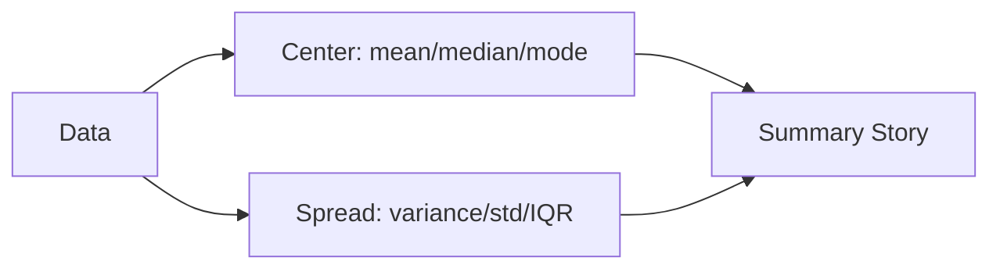

# 평균, 중앙값, 분산

숫자가 많은 데이터를 한두 개 숫자로 줄이는 순간 해석의 방향이 정해집니다. 평균 하나만 적을지, 중앙값까지 함께 적을지, 퍼짐을 분산이나 표준편차로 설명할지에 따라 보고서의 문장이 달라집니다.

특히 데이터가 한쪽으로 길게 늘어지거나 극단값이 섞여 있으면 평균은 꽤 쉽게 흔들립니다. 그래서 요약 통계는 계산 공식보다 “어떤 질문에 어떤 숫자가 맞는가”를 먼저 판단해야 합니다.

이 글은 Statistics 101 시리즈의 2번째 글입니다. 여기서는 평균, 중앙값, 분산이 각각 무엇을 말하는지 비교하고, 왜 분포 모양에 따라 대표값 선택이 달라져야 하는지 정리하겠습니다.

## 이 글에서 다룰 문제

- 데이터를 대표하는 숫자로 평균과 중앙값 중 무엇을 써야 할까요?
- 분산과 표준편차는 평균이 말해 주지 못하는 무엇을 보완할까요?
- 극단값이 하나 섞였을 때 요약 통계는 어떻게 달라질까요?
- IQR은 어떤 상황에서 특히 유용할까요?

> 좋은 요약 통계는 데이터를 예쁘게 압축하는 숫자가 아니라, 질문에 맞는 대표값입니다.

## 왜 중요한가

사람은 수천 행의 원시 데이터를 직접 보고 판단하지 않습니다. 대시보드, 리포트, 실험 결과 페이지는 늘 몇 개의 숫자로 축약됩니다. 문제는 그 숫자가 데이터의 모양을 얼마나 잘 반영하느냐입니다.

예를 들어 사용자 결제 금액처럼 긴 꼬리를 가진 데이터에서 평균만 적으면, 대부분 사용자의 전형적인 행동과 멀어진 숫자가 대표값 자리를 차지할 수 있습니다. 반대로 공정한 분포에서 중앙값만 쓰면 평균이 주는 안정적인 정보를 버리게 됩니다. 요약 통계는 계산보다 선택이 더 중요합니다.

## 멘탈 모델

데이터를 요약할 때는 중심과 퍼짐을 함께 봐야 합니다. 중심은 데이터가 어디에 몰려 있는지를, 퍼짐은 그 주변에서 얼마나 흔들리는지를 말합니다. 둘 중 하나만 보면 숫자의 성격을 절반만 읽게 됩니다.



평균과 중앙값은 중심을 설명하지만, 데이터 모양에 따라 신뢰할 만한 정도가 다릅니다. 분산, 표준편차, IQR은 퍼짐을 설명하며, 어느 지표를 붙이느냐에 따라 보고서가 말하는 위험 수준도 달라집니다.

## 핵심 용어

- 평균: 합계를 개수로 나눈 값입니다. 극단값에 민감합니다.
- 중앙값: 정렬했을 때 가운데 놓인 값입니다. 극단값에 강합니다.
- 최빈값: 가장 자주 등장하는 값입니다.
- 분산: 평균에서 얼마나 떨어져 있는지를 제곱 거리로 평균 낸 값입니다.
- 표준편차: 분산의 제곱근입니다. 데이터와 같은 단위를 가집니다.
- **IQR**: 3사분위수에서 1사분위수를 뺀 값으로, 가운데 50% 구간의 폭입니다.

## 같은 데이터도 대표값을 잘못 고르면 문장이 틀어진다

이전 해석: “우리 서비스의 평균 결제 금액은 50달러입니다.”

문제는 소수의 고액 결제가 평균을 끌어올렸을 수 있다는 점입니다. 이 경우 대부분 사용자는 50달러와 전혀 다른 행동을 하고 있을 수 있습니다.

이후 해석: “중앙값은 12달러이고 평균은 50달러입니다. 소수의 고액 결제가 포함된 긴 꼬리 분포이므로 대표값은 중앙값으로 읽는 편이 안전합니다.”

같은 데이터라도 어떤 숫자를 내세우느냐에 따라 제품 가격 정책, 타깃 사용자 정의, KPI 해석이 모두 달라질 수 있습니다.

## 실습: 5단계 요약 통계

### 1단계 — 데이터를 준비한다

```python
import numpy as np
x = np.array([10, 12, 11, 13, 12, 14, 11, 12, 5_000_000])
```

작은 값이 모여 있고 극단값이 하나 섞인 데이터입니다.

### 2단계 — 평균과 중앙값을 같이 본다

```python
print("mean:", np.mean(x))
print("median:", np.median(x))
```

평균이 얼마나 끌려가는지 바로 드러납니다.

### 3단계 — 분산과 표준편차를 본다

```python
print("var:", np.var(x))
print("std:", np.std(x))
```

퍼짐이 매우 커졌다는 사실을 수치로 확인할 수 있습니다.

### 4단계 — IQR을 계산한다

```python
q1, q3 = np.percentile(x, [25, 75])
print("IQR:", q3 - q1)
```

가운데 50% 구간은 극단값 하나 때문에 크게 흔들리지 않습니다.

### 5단계 — 요약 문장을 쓴다

```text
Median 12, IQR 1.5 — most users sit near 12.
Mean 555,557 (skewed by one outlier).
Decision: report the median, not the mean.
```

요약 통계는 숫자만 찍고 끝내지 말고, 어떤 값을 대표값으로 채택할지까지 적어야 합니다.

## 이 코드에서 먼저 볼 점

- 극단값이 있으면 평균과 중앙값이 크게 벌어질 수 있습니다.
- 분산은 제곱 단위이고, 표준편차는 원래 단위입니다.
- IQR은 극단값에 덜 흔들리는 퍼짐 지표입니다.

## 자주 헷갈리는 지점 5가지

1. **평균만 보고 결정을 내리는 경우**: 분포 모양을 놓치기 쉽습니다.
2. **분산과 표준편차를 같은 뜻으로 쓰는 경우**: 단위가 다릅니다.
3. **긴 꼬리 분포에서 평균을 대표값으로 내세우는 경우**: 실제 사용자 중심과 멀어질 수 있습니다.
4. **표본이 매우 작은데 분산을 과신하는 경우**: 불확실성이 큽니다.
5. **단위를 빼고 숫자만 적는 경우**: 달러인지, 초인지, 퍼센트인지가 빠지면 해석이 불가능합니다.

## 실무에서는 이렇게 읽습니다

매출, 응답 시간, 광고비, 주문 금액은 긴 꼬리를 가지는 경우가 많습니다. 그래서 실무 대시보드에서는 평균 하나보다 중앙값, p95, p99 같은 지표가 더 자주 쓰입니다. 평균은 전체 규모를 보여 주지만, 사용자 체감이나 운영 위험은 분위수 계열이 더 잘 드러내는 경우가 많기 때문입니다.

시니어 엔지니어는 먼저 분포를 그려 보고, 평균 옆에 중앙값과 분위수를 붙입니다. 그리고 왜 극단값이 생겼는지 원인을 따로 봅니다. 좋은 요약 통계는 멋진 숫자 하나가 아니라, 질문에 맞는 짧은 조합입니다.

## 체크리스트

- [ ] 평균과 중앙값의 차이를 설명할 수 있습니다.
- [ ] 분산, 표준편차, IQR의 역할을 구분할 수 있습니다.
- [ ] 긴 꼬리 분포에서는 중앙값을 우선 검토합니다.
- [ ] 보고서에 단위를 함께 적습니다.

## 연습 문제

1. 지난 30일 공부 시간을 기준으로 평균과 중앙값을 각각 계산해 보세요.
2. 긴 꼬리 분포에서 평균이 위험한 이유를 한 문장으로 적어 보세요.
3. IQR과 표준편차가 어떤 상황에서 다른 판단을 줄 수 있는지 설명해 보세요.

## 정리와 다음 글

평균, 중앙값, 분산은 모두 데이터를 요약하지만, 같은 역할을 하지 않습니다. 중심을 말할지, 퍼짐을 말할지, 극단값에 강한 지표가 필요한지에 따라 선택이 달라져야 합니다. 요약 통계는 계산한 숫자보다 왜 그 숫자를 골랐는지가 더 중요합니다.

다음 글에서는 대표값보다 한 단계 더 바깥으로 나가서 데이터의 전체 모양을 다루는 분포를 살펴보겠습니다. 평균이 같아도 왜 전혀 다른 행동을 보일 수 있는지 그 이유가 분포에 있습니다.

<!-- toc:begin -->
- [통계란 무엇인가?](./01-what-is-statistics.md)
- **평균, 중앙값, 분산 (현재 글)**
- 분포 (예정)
- 표본과 모집단 (예정)
- 추정 (예정)
- 신뢰구간 (예정)
- 가설검정 (예정)
- 상관과 회귀 (예정)
- p-value 이해하기 (예정)
- 통계적 사고방식 (예정)
<!-- toc:end -->

## 참고 자료

- [NIST/SEMATECH e-Handbook of Statistical Methods](https://www.itl.nist.gov/div898/handbook/)
- [pandas — describe()](https://pandas.pydata.org/docs/reference/api/pandas.DataFrame.describe.html)
- [Wikipedia — Robust Statistics](https://en.wikipedia.org/wiki/Robust_statistics)
- [Khan Academy — Summary Statistics](https://www.khanacademy.org/math/statistics-probability/summarizing-quantitative-data)

Tags: Statistics, DescriptiveStats, Mean, Variance, Beginner
