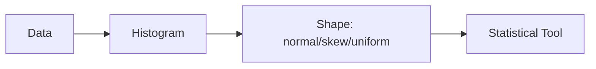

# 분포

> Statistics 101 시리즈 (3/10)


## 이 글에서 다룰 문제

요약 통계와 검정은 대부분 분포 가정 위에서 작동합니다. 데이터 모양을 잘못 가정하면 결론 전체가 흔들립니다.

> *모양을 보고 도구를 고른다.*

## 전체 흐름


## Before/After

**Before**: *“평균 응답시간 200ms”* — 종 모양이라 가정하고 SLA를 정함.

**After**: *“p50=120ms, p95=900ms, long-tail — SLA는 p95 기준으로 정해야 안전.”*

## 5단계 분포 진단

### 1단계 — 히스토그램

```python
import matplotlib.pyplot as plt
plt.hist(latency, bins=50); plt.show()
```

### 2단계 — 요약 통계

```python
import numpy as np
print(np.mean(latency), np.median(latency), np.std(latency))
```

### 3단계 — 분위수

```python
for q in [50, 90, 95, 99]:
    print(f"p{q}:", np.percentile(latency, q))
```

### 4단계 — 왜도/첨도

```python
from scipy.stats import skew, kurtosis
print("skew:", skew(latency), "kurt:", kurtosis(latency))
```

### 5단계 — 결정

```text
skew=+2.3, kurt=+8 → long-tail. SLA는 p95=900ms.
```

## 이 코드에서 주목할 점

- *히스토그램* 이 *모든 진단의 시작*.
- 분위수는 long-tail을 잡아내는 데 유용합니다.
- 왜도와 첨도는 분포 모양을 수치로 표현합니다.

## 자주 하는 실수 5가지

1. 정규성을 확인하지 않은 채 그대로 검정을 적용합니다.
2. 이상치를 분포 일부로 섞어 보고 그대로 해석합니다.
3. 로그 스케일 없이 long-tail 분포를 읽습니다.
4. p99를 평균으로 대체해 버립니다.
5. 시각화 없이 통계값만 보고 판단합니다.

## 실무에서는 이렇게 쓰입니다

응답시간 SLA, 매출 분포, 클릭 분포, 결함 빈도처럼 많은 운영 지표는 long-tail 성격을 보입니다. Datadog, Grafana, Sentry 같은 도구가 p50, p95, p99를 기본으로 보여 주는 이유도 여기에 있습니다.

## 체크리스트

- [ ] 히스토그램으로 데이터를 그립니다.
- [ ] p50, p95, p99를 함께 봅니다.
- [ ] 왜도와 첨도의 의미를 압니다.
- [ ] long-tail이면 p95 기준 SLA를 검토합니다.

## 정리 및 다음 단계

분포는 데이터의 성격을 가장 압축해서 보여 주는 정보입니다. 다음 글에서는 표본과 모집단을 통해 불확실성이 어디서 시작되는지 살펴보겠습니다.

<!-- toc:begin -->
- [통계란 무엇인가?](./01-what-is-statistics.md)
- [평균, 중앙값, 분산](./02-mean-median-variance.md)
- **분포 (현재 글)**
- 표본과 모집단 (예정)
- 추정 (예정)
- 신뢰구간 (예정)
- 가설검정 (예정)
- 상관과 회귀 (예정)
- p-value 이해하기 (예정)
- 통계적 사고방식 (예정)
<!-- toc:end -->

## 참고 자료

- [SciPy — Statistical Distributions](https://docs.scipy.org/doc/scipy/reference/stats.html)
- [Khan Academy — Distributions](https://www.khanacademy.org/math/statistics-probability/random-variables-stats-library)
- [Wikipedia — Power Law](https://en.wikipedia.org/wiki/Power_law)
- [Brendan Gregg — Latency Distributions](https://www.brendangregg.com/blog/2014-06-23/latency-heat-maps.html)

Tags: Statistics, Distribution, Normal, Skew, Beginner
