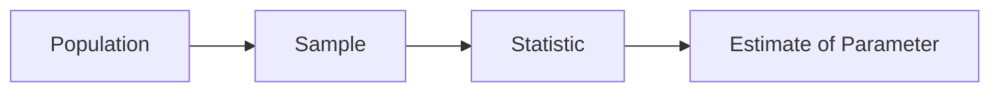

# 표본과 모집단

> Statistics 101 시리즈 (4/10)


## 이 글에서 다룰 문제

모든 통계 결론은 표본에서 시작합니다. 표본이 나쁘면 분석이 아무리 정교해도 결론은 틀어집니다.

> *Garbage sample → Garbage decision.*

## 전체 흐름


## Before/After

**Before**: *“웹사이트 방문자 평균 만족도 4.5/5”* — 응답한 사람만 분석.

**After**: *“응답자 200명 / 방문자 10,000명 — 응답률 2%, 만족 사용자 위주 응답 가능성 → 결과 신중히 해석.”*

## 5단계 표본 설계

### 1단계 — 모집단 정의

```text
Population: "지난 30일간 우리 웹사이트 활성 사용자"
```

### 2단계 — 표본 프레임

```python
import pandas as pd
users = pd.read_csv("active_users.csv")  # 모집단 리스트
print(len(users))
```

### 3단계 — 무작위 추출

```python
sample = users.sample(n=500, random_state=42)
```

### 4단계 — 응답 수집

```python
responses = collect_survey(sample.user_id)
print("response rate:", len(responses) / len(sample))
```

### 5단계 — 편향 확인

```python
print("plan dist (sample):", sample.plan.value_counts(normalize=True))
print("plan dist (pop):",    users.plan.value_counts(normalize=True))
```

## 이 코드에서 주목할 점

- 모집단 정의가 표본 설계의 출발점입니다.
- `random_state`로 재현성을 보장합니다.
- 응답률과 세그먼트 분포를 함께 봐야 편향을 점검할 수 있습니다.

## 자주 하는 실수 5가지

1. 편의 표본을 대표 표본처럼 다룹니다.
2. 응답자만 분석하고 비응답자의 차이를 무시합니다.
3. 표본 크기 N=30이라는 숫자만 보고 무작정 안심합니다.
4. 모집단 정의를 생략한 채 바로 분석에 들어갑니다.
5. 무작위가 아니라 시간 순으로 자른 표본을 사용합니다.

## 실무에서는 이렇게 쓰입니다

A/B 테스트, 설문조사, 품질검사, 출시 전 베타 테스트에서는 표본 설계가 결과의 질을 좌우합니다. 층화 추출(stratified sampling)과 클러스터 추출 같은 기법이 자주 쓰이는 이유도 대표성을 높이기 위해서입니다.

## 체크리스트

- [ ] 모집단을 한 줄로 적습니다.
- [ ] 무작위 추출 절차를 명시합니다.
- [ ] 응답률을 함께 보고합니다.
- [ ] 세그먼트 분포를 비교합니다.

## 정리 및 다음 단계

표본 설계는 통계의 근본입니다. 다음 글에서는 표본으로 모집단을 추정하는 방법을 본격적으로 살펴보겠습니다.

<!-- toc:begin -->
- [통계란 무엇인가?](./01-what-is-statistics.md)
- [평균, 중앙값, 분산](./02-mean-median-variance.md)
- [분포](./03-distributions.md)
- **표본과 모집단 (현재 글)**
- 추정 (예정)
- 신뢰구간 (예정)
- 가설검정 (예정)
- 상관과 회귀 (예정)
- p-value 이해하기 (예정)
- 통계적 사고방식 (예정)
<!-- toc:end -->

## 참고 자료

- [Pew Research — Sampling Methodology](https://www.pewresearch.org/our-methods/u-s-surveys/)
- [scikit-learn — Stratified Sampling](https://scikit-learn.org/stable/modules/cross_validation.html)
- [OpenIntro — Sampling Principles](https://www.openintro.org/book/os/)
- [Wikipedia — Selection Bias](https://en.wikipedia.org/wiki/Selection_bias)

Tags: Statistics, Sampling, Population, Bias, Beginner
