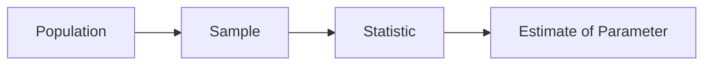

# 표본과 모집단

통계는 대개 전체를 다 보지 못한 채 시작합니다. 모든 고객에게 설문을 돌릴 수 없고, 모든 생산품을 파괴 검사할 수도 없고, 모든 방문자를 같은 조건으로 실험하기도 어렵습니다. 그래서 일부를 보고 전체를 말하게 됩니다.

문제는 일부가 전체를 얼마나 닮았느냐입니다. 표본이 모집단을 잘 대표하지 못하면 그 뒤에 아무리 정교한 분석을 올려도 출발점이 흔들립니다.

이 글은 Statistics 101 시리즈의 4번째 글입니다. 여기서는 모집단, 표본, 모수, 통계량의 관계를 정리하고, 무작위 추출과 표본 편향이 왜 통계의 기초 체력인지 설명하겠습니다.

## 이 글에서 다룰 문제

- 모집단과 표본은 어떻게 구분할까요?
- 표본이 모집단을 닮게 만드는 핵심 조건은 무엇일까요?
- 무작위 추출은 왜 그렇게 자주 등장할까요?
- 응답률과 세그먼트 분포는 왜 함께 봐야 할까요?

> 표본 설계가 흔들리면 분석 정확도보다 먼저 결론의 방향이 틀어집니다.

## 왜 중요한가

좋은 통계는 좋은 표본에서 출발합니다. 사용자 만족도 조사를 했는데 응답한 사람만 분석했다면, 적극적인 만족층만 과대표집되었을 수 있습니다. 베타 테스트를 했는데 헤비 유저만 참여했다면, 실제 출시 후의 평균 사용자는 다른 경험을 할 가능성이 큽니다.

통계 실무에서 “표본이 어떤 방식으로 뽑혔는가”는 부록이 아니라 본문입니다. 표본이 편향되면 평균도 편향되고, 회귀도 편향되고, 신뢰구간과 가설검정도 편향된 출발점 위에 서게 됩니다.

## 멘탈 모델

표본은 모집단의 축소판이어야 합니다. 통계량은 표본에서 계산되고, 그 통계량으로 모집단의 모수를 추정합니다. 이 연결이 성립하려면 표본이 최소한 체계적으로 한쪽으로 기울지 않아야 합니다.



표본이 모집단을 대표하는지 볼 때는 표본 수만 보지 않습니다. 누가 빠졌는지, 어떤 세그먼트가 과도하게 많거나 적은지, 응답하지 않은 집단이 어떤 성격인지까지 함께 봐야 합니다.

## 핵심 용어

- 모집단: 알고 싶은 대상 전체입니다.
- 표본: 모집단에서 뽑아 관찰한 일부입니다.
- 모수: 모집단의 참값입니다. 예를 들어 모평균 μ가 있습니다.
- 통계량: 표본에서 계산한 값입니다. 예를 들어 표본평균 x̄가 있습니다.
- **표본 편향**: 표본이 모집단을 제대로 대표하지 못하는 상태입니다.

## 같은 설문도 표본을 어떻게 뽑느냐에 따라 해석이 달라진다

이전 해석: “웹사이트 만족도 평균은 4.5점입니다.”

응답자만 분석했다면 이 숫자는 실제 전체 사용자 만족도보다 높게 잡혔을 수 있습니다.

이후 해석: “응답자는 200명이고 전체 방문자는 1만 명입니다. 응답률은 2%이며 만족한 사용자가 더 적극적으로 응답했을 가능성이 있어 보수적으로 해석해야 합니다.”

표본 설명이 붙는 순간 숫자는 더 조심스러워지지만, 오히려 더 믿을 만해집니다.

## 실습: 5단계 표본 설계

### 1단계 — 모집단을 문장으로 적는다

```text
Population: "active users on our website over the last 30 days"
```

모집단 정의가 흐리면 표본도 흐려집니다.

### 2단계 — 표본 추출 틀을 준비한다

```python
import pandas as pd
users = pd.read_csv("active_users.csv")  # 모집단 목록
print(len(users))
```

누구를 뽑을 수 있는지, 목록 자체가 모집단을 얼마나 잘 덮는지 봐야 합니다.

### 3단계 — 무작위로 표본을 뽑는다

```python
sample = users.sample(n=500, random_state=42)
```

재현 가능한 무작위 추출은 편향을 줄이는 가장 기본적인 장치입니다.

### 4단계 — 응답을 수집한다

```python
responses = collect_survey(sample.user_id)
print("response rate:", len(responses) / len(sample))
```

응답률은 단순한 진행률이 아니라 편향 신호입니다.

### 5단계 — 편향 가능성을 점검한다

```python
print("plan dist (sample):", sample.plan.value_counts(normalize=True))
print("plan dist (pop):",    users.plan.value_counts(normalize=True))
```

세그먼트 분포 차이가 크면 표본이 대표성을 잃고 있다는 뜻일 수 있습니다.

## 이 코드에서 먼저 볼 점

- 모집단 정의는 표본 설계의 첫 단계입니다.
- `random_state`는 재현성을 보장합니다.
- 응답률과 세그먼트 분포는 편향을 드러내는 핵심 지표입니다.

## 자주 헷갈리는 지점 5가지

1. **편의 표본을 대표 표본처럼 다루는 경우**: 쉽게 모은 데이터는 대개 한쪽으로 치웁니다.
2. **응답자만 분석하고 비응답자를 잊는 경우**: 두 집단은 다를 수 있습니다.
3. **N=30이면 충분하다고 기계적으로 믿는 경우**: 표본 수보다 설계가 먼저입니다.
4. **모집단 정의 없이 표본을 뽑는 경우**: 무엇을 대표하는지 모호해집니다.
5. **시간순 일부 구간만 잘라 쓰는 경우**: 무작위성이 없어 특정 패턴이 과대반영될 수 있습니다.

## 실무에서는 이렇게 읽습니다

A/B 테스트, 만족도 조사, 품질 검사, 베타 테스트처럼 표본을 바탕으로 전체를 말해야 하는 작업은 많습니다. 이때 표본 설계가 분석 품질을 사실상 결정합니다. 층화추출이나 군집추출 같은 방법도 모두 같은 목표를 가집니다. 표본이 모집단의 구조를 덜 잃게 만드는 것입니다.

시니어 엔지니어는 모집단을 한 문장으로 먼저 적고, 무작위 시드를 고정하고, 응답률과 세그먼트 분포를 보고서에 함께 적습니다. 편향을 숨기지 않고 드러내는 태도가 오히려 판단의 품질을 높입니다.

## 체크리스트

- [ ] 모집단을 한 줄로 정의할 수 있습니다.
- [ ] 무작위 추출을 적용할 수 있습니다.
- [ ] 응답률을 함께 보고합니다.
- [ ] 표본과 모집단의 세그먼트 분포를 비교합니다.

## 연습 문제

1. 동아리나 팀 구성원을 예로 들어 모집단, 표본, 통계량을 정의해 보세요.
2. 편의 표본과 무작위 표본의 차이를 한 문장으로 설명해 보세요.
3. 응답률 30%인 설문 결과를 어떻게 조심해서 읽어야 할지 적어 보세요.

## 정리와 다음 글

표본과 모집단의 관계를 이해하면 통계가 왜 항상 불확실성과 함께 다녀야 하는지도 함께 보입니다. 표본은 전체의 일부이기 때문에 대표성, 편향, 응답률 같은 조건을 확인하지 않으면 숫자의 정밀함이 오히려 착시를 만들 수 있습니다.

다음 글에서는 추정을 다룹니다. 표본에서 계산한 통계량으로 모집단의 모수를 어떻게 가늠하는지, 그리고 그 추정값에 어떤 오차가 붙는지 살펴보겠습니다.

<!-- toc:begin -->
- [통계란 무엇인가?](./01-what-is-statistics.md)
- [평균, 중앙값, 분산](./02-mean-median-variance.md)
- [분포](./03-distributions.md)
- **표본과 모집단 (현재 글)**
- 추정 (예정)
- 신뢰구간 (예정)
- 가설검정 (예정)
- 상관과 회귀 (예정)
- p-value 이해하기 (예정)
- 통계적 사고방식 (예정)
<!-- toc:end -->

## 참고 자료

- [Pew Research — Sampling Methodology](https://www.pewresearch.org/our-methods/u-s-surveys/)
- [scikit-learn — Stratified Sampling](https://scikit-learn.org/stable/modules/cross_validation.html)
- [OpenIntro — Sampling Principles](https://www.openintro.org/book/os/)
- [Wikipedia — Selection Bias](https://en.wikipedia.org/wiki/Selection_bias)

Tags: Statistics, Sampling, Population, Bias, Beginner
